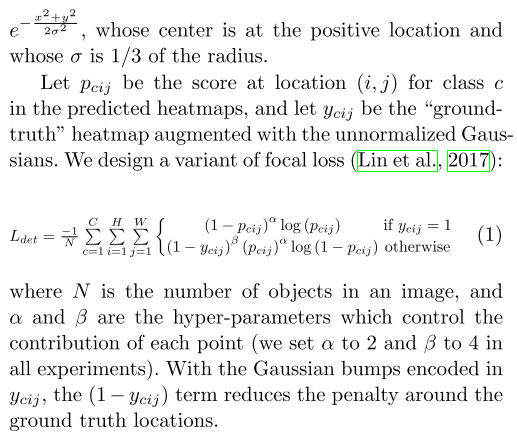

# Reducing Penalty to Negative Locations

During training, instead of equally penalizing negative locations, we reduce the penalty given to negative locations within a radius of the positive location. Because a pair of false corner detections can still produce a box that sufficiently overlaps the ground-truth box if they are close to their respective ground truth locations. 


As shown in **Fig. 5**, boxes (green dotted rectangles) whose corners are within the radius of the positive locations (orange circles) still have large overlaps with the ground-truth annotations (red solid rectangles).

## For each detection

```python
# top-left and bottom-right
xtl, ytl = detection[0], detection[1]
xbr, ybr = detection[2], detection[3]
	
# downscale
# width_ratio: 0.25048923679060664
# height_ratio: 0.25048923679060664
fxtl = xtl * width_ratio
fytl = ytl * height_ratio
fxbr = xbr * width_ratio
fybr = ybr * height_ratio
	
# round up
xtl = int(fxtl)
ytl = int(fytl)
xbr = int(fxbr)
ybr = int(fybr)

width  = detection[2] - detection[0]
height = detection[3] - detection[1]
width  = math.ceil(width * width_ratio)
height = math.ceil(height * height_ratio)

# gaussian_rad: -1
if gaussian_rad == -1:
    # (height, width): (116, 62)
    # gaussian_iou: 0.3
    radius = gaussian_radius(
        det_size=(height, width), 
        min_overlap=gaussian_iou
    )
    # radius = 17
    radius = max(0, int(radius))
else:
    radius = gaussian_rad

# tl_heatmaps.shape: (49, 80, 128, 128)
draw_gaussian(
    heatmap=tl_heatmaps[b_ind, category], 
    center=[xtl, ytl], 
    k=radius
)
draw_gaussian(
    heatmap=br_heatmaps[b_ind, category], 
    center=[xbr, ybr], 
    k=radius
)
```

### Determine the radius

We determine the radius by the size of an object by ensuring that a pair of points within the radius would generate a bounding box with at least t (`t=0.3` in all experiments) IoU with the ground-truth annotation. 

```python
def gaussian_radius(det_size, min_overlap):
    # det_size: (116, 62)
    # min_overlap: 0.3
    
    height, width = det_size
    a1  = 1
    b1  = (height + width)
    c1  = width * height * (1 - min_overlap) / (1 + min_overlap)
    sq1 = np.sqrt(b1 ** 2 - 4 * a1 * c1)
    r1  = (b1 - sq1) / (2 * a1)

    a2  = 4
    b2  = 2 * (height + width)
    c2  = (1 - min_overlap) * width * height
    sq2 = np.sqrt(b2 ** 2 - 4 * a2 * c2)
    r2  = (b2 - sq2) / (2 * a2)

    a3  = 4 * min_overlap
    b3  = -2 * min_overlap * (height + width)
    c3  = (min_overlap - 1) * width * height
    sq3 = np.sqrt(b3 ** 2 - 4 * a3 * c3)
    r3  = (b3 + sq3) / (2 * a3)
    # r1, r2, r3: 25.373082619188473, 17.636455930015487, 34.08487980097274
    return min(r1, r2, r3)
```

### The amount of penalty

Given the radius, the amount of penalty reduction is given by an unnormalized 2D Gaussian,



```python
def gaussian2D(shape, sigma=1):
    m, n = [(ss - 1.) / 2. for ss in shape]
    y, x = np.ogrid[-m:m+1,-n:n+1]

    h = np.exp(-(x * x + y * y) / (2 * sigma * sigma))
    h[h < np.finfo(h.dtype).eps * h.max()] = 0
    return h
    
def draw_gaussian(heatmap, center, radius, k=1, delte=6):
    diameter = 2 * radius + 1
    gaussian = gaussian2D((diameter, diameter), sigma=diameter / delte)

    x, y = center
    height, width = heatmap.shape[0:2]
    
    left, right = min(x, radius), min(width - x, radius + 1)
    top, bottom = min(y, radius), min(height - y, radius + 1)

    masked_heatmap  = heatmap[y - top:y + bottom, x - left:x + right]
    masked_gaussian = gaussian[radius - top:radius + bottom, radius - left:radius + right]
    np.maximum(masked_heatmap, masked_gaussian * k, out=masked_heatmap)
```