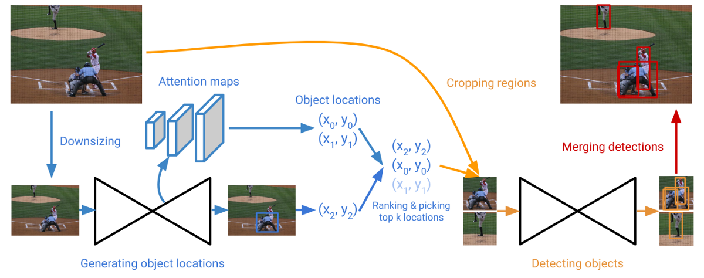

# CornerNet Saccade



**CornerNet-Saccade** speeds up inference by reducing the number of pixels to process. It uses an attention mechanism similar to saccades in human vision. It starts with a downsized full image and generates an attention map, which is then zoomed in on and processed further by the model. CornerNet-Saccade speeds up the original CornerNet by 6.0x with a 1% increase in AP.

```python
class model(saccade_net):
    def _pred_mod(self, dim):
        return nn.Sequential(
            convolution(k=3, inp_dim=256, out_dim=256, stride=1, with_bn=False),
            nn.Conv2d(in_channels=256, out_channels=dim, kernel_size=(1, 1)),
        )

    def _merge_mod(self):
        return nn.Sequential(
            nn.Conv2d(
                in_channels=256, out_channels=256, kernel_size=(1, 1), bias=False
            ),
            nn.BatchNorm2d(256),
        )

    def __init__(self):
        stacks = 3
        pre = nn.Sequential(
            convolution(k=7, inp_dim=3, out_dim=128, stride=2, with_bn=True),
            residual(inp_dim=128, out_dim=256, k=3, stride=2),
        )
        
        # CornerNet diff
        hg_mods = nn.ModuleList(
            [
                saccade_module(
                    n=3,
                    dims=[256, 384, 384, 512],
                    modules=[1, 1, 1, 1],
                    make_pool_layer=make_pool_layer,
                    make_hg_layer=make_hg_layer,
                )
                for _ in range(stacks)
            ]
        )

        cnvs = nn.ModuleList([convolution(3, 256, 256) for _ in range(stacks)])
        inters = nn.ModuleList([residual(256, 256) for _ in range(stacks - 1)])
        cnvs_ = nn.ModuleList([self._merge_mod() for _ in range(stacks - 1)])
        inters_ = nn.ModuleList([self._merge_mod() for _ in range(stacks - 1)])
		
        # CornerNet diff
        # hourglass with saccade
        hgs = saccade(pre, hg_mods, cnvs, inters, cnvs_, inters_)
        
        # CornerNet diff
        # attention modules
        att_mods = nn.ModuleList(
            [
                nn.ModuleList(
                    [
                        nn.Sequential(
                            convolution(
                                k=3, inp_dim=384, out_dim=256, stride=1, with_bn=False
                            ),
                            nn.Conv2d(
                                in_channels=256, out_channels=1, kernel_size=(1, 1)
                            ),
                        ),
                        nn.Sequential(
                            convolution(
                                k=3, inp_dim=384, out_dim=256, stride=1, with_bn=False
                            ),
                            nn.Conv2d(
                                in_channels=256, out_channels=1, kernel_size=(1, 1)
                            ),
                        ),
                        nn.Sequential(
                            convolution(
                                k=3, inp_dim=256, out_dim=256, stride=1, with_bn=False
                            ),
                            nn.Conv2d(
                                in_channels=256, out_channels=1, kernel_size=(1, 1)
                            ),
                        ),
                    ]
                )
                for _ in range(stacks)
            ]
        )
        for att_mod in att_mods:
            for att in att_mod:
                torch.nn.init.constant_(att[-1].bias, -2.19)
		
        # corner pooling
        tl_modules = nn.ModuleList(
            [corner_pool(256, TopPool, LeftPool) for _ in range(stacks)]
        )
        br_modules = nn.ModuleList(
            [corner_pool(256, BottomPool, RightPool) for _ in range(stacks)]
        )
		
        # heatmaps
        tl_heats = nn.ModuleList([self._pred_mod(80) for _ in range(stacks)])
        br_heats = nn.ModuleList([self._pred_mod(80) for _ in range(stacks)])
        for tl_heat, br_heat in zip(tl_heats, br_heats):
            torch.nn.init.constant_(tl_heat[-1].bias, -2.19)
            torch.nn.init.constant_(br_heat[-1].bias, -2.19)
		
        # embeddings
        tl_tags = nn.ModuleList([self._pred_mod(1) for _ in range(stacks)])
        br_tags = nn.ModuleList([self._pred_mod(1) for _ in range(stacks)])
		
        # offsets
        tl_offs = nn.ModuleList([self._pred_mod(2) for _ in range(stacks)])
        br_offs = nn.ModuleList([self._pred_mod(2) for _ in range(stacks)])
		
        # CornerNet diff
        # saccade_net
        super(model, self).__init__(
            hgs,
            tl_modules,
            br_modules,
            tl_heats,
            br_heats,
            tl_tags,
            br_tags,
            tl_offs,
            br_offs,
            att_mods,
        )
		
        # CornerNet diff
        # loss
        self.loss = CornerNet_Saccade_Loss(pull_weight=1e-1, push_weight=1e-1)
```

## Attention maps

We predict the attention maps by using feature maps at different scales from the backbone hourglass network. The feature maps from the upsampling layers in the hourglass are used to predict the attention maps. The feature maps at finer scales are used for smaller objects and the ones at coarser scales are for larger objects. We predict the attention maps by applying a `3 × 3` Conv-ReLU module followed by a `1 × 1` Conv-Sigmoid module to each feature map.

### train

```python
# ups.shape: [
#     torch.Size([4, 384, 16, 16]),
#     torch.Size([4, 384, 32, 32]),
#     torch.Size([4, 256, 64, 64])
# ] * stacks

atts = [
    [att_mod_(u) for att_mod_, u in zip(att_mods, up)]
    for att_mods, up in zip(self.att_modules, ups)
]

# atts.shape: [
#     torch.Size([4, 1, 16, 16]),
#     torch.Size([4, 1, 32, 32]),
#     torch.Size([4, 1, 64, 64])
# ] * stacks
```

### test

```python
atts = [att_mod_(up) for att_mod_, up in zip(self.att_modules[-1], ups[-1])]
atts = [torch.sigmoid(att) for att in atts]

# atts.shape: [
#     torch.Size([4, 1, 16, 16]),
#     torch.Size([4, 1, 32, 32]),
#     torch.Size([4, 1, 64, 64])
# ]  
```

## saccade_net

```python
class saccade_net(nn.Module):
    def __init__(
        self,
        hg,
        tl_modules,
        br_modules,
        tl_heats,
        br_heats,
        tl_tags,
        br_tags,
        tl_offs,
        br_offs,
        att_modules,
        up_start=0,
    ):
        super(saccade_net, self).__init__()

        self._decode = _decode
        
        # hourglass backbone
        self.hg = hg
		
        # corner pooling
        self.tl_modules = tl_modules
        self.br_modules = br_modules
		
        # heatmaps
        self.tl_heats = tl_heats
        self.br_heats = br_heats

        # embeddings
        self.tl_tags = tl_tags
        self.br_tags = br_tags
		
        # offsets
        self.tl_offs = tl_offs
        self.br_offs = br_offs
        
        # attentions
        self.att_modules = att_modules
        self.up_start = up_start

    def _train(self, *xs):
        image = xs[0]
        # image.shape: torch.Size([4, 3, 255, 255])

        cnvs, ups = self.hg(image)
        # cnvs.shape: [torch.Size([4, 256, 64, 64])] * stacks
        # ups.shape: [
        #     torch.Size([4, 384, 16, 16]),
        #     torch.Size([4, 384, 32, 32]),
        #     torch.Size([4, 256, 64, 64])
        # ] * stacks
        ups = [up[self.up_start :] for up in ups]

        tl_modules = [tl_mod_(cnv) for tl_mod_, cnv in zip(self.tl_modules, cnvs)]
        br_modules = [br_mod_(cnv) for br_mod_, cnv in zip(self.br_modules, cnvs)]
        # tl_modules.shape, br_modules.shape: [torch.Size([4, 256, 64, 64])] * stacks

        tl_heats = [
            tl_heat_(tl_mod) for tl_heat_, tl_mod in zip(self.tl_heats, tl_modules)
        ]
        br_heats = [
            br_heat_(br_mod) for br_heat_, br_mod in zip(self.br_heats, br_modules)
        ]
        # tl_heats.shape, br_heats.shape: [torch.Size([4, 80, 64, 64])] * stacks

        tl_tags = [tl_tag_(tl_mod) for tl_tag_, tl_mod in zip(self.tl_tags, tl_modules)]
        br_tags = [br_tag_(br_mod) for br_tag_, br_mod in zip(self.br_tags, br_modules)]
        # tl_tags.shape, br_tags.shape: [torch.Size([4, 1, 64, 64])] * stacks

        tl_offs = [tl_off_(tl_mod) for tl_off_, tl_mod in zip(self.tl_offs, tl_modules)]
        br_offs = [br_off_(br_mod) for br_off_, br_mod in zip(self.br_offs, br_modules)]
        # tl_offs.shape, br_offs.shape: [torch.Size([4, 2, 64, 64])] * stacks

        atts = [
            [att_mod_(u) for att_mod_, u in zip(att_mods, up)]
            for att_mods, up in zip(self.att_modules, ups)
        ]
        # atts.shape: [
        #     torch.Size([4, 1, 16, 16]),
        #     torch.Size([4, 1, 32, 32]),
        #     torch.Size([4, 1, 64, 64])
        # ] * stacks
        return [tl_heats, br_heats, tl_tags, br_tags, tl_offs, br_offs, atts]

    def _test(self, *xs, no_att=False, **kwargs):
        image = xs[0]
        # image.shape: torch.Size([2, 3, 255, 255])

        cnvs, ups = self.hg(image)
        # cnvs.shape: [torch.Size([2, 256, 64, 64])] * stacks
        # ups.shape: [
        #     torch.Size([2, 384, 16, 16]),
        #     torch.Size([2, 384, 32, 32]),
        #     torch.Size([2, 256, 64, 64])
        # ] * stacks
        ups = [up[self.up_start :] for up in ups]

        if not no_att:
            atts = [att_mod_(up) for att_mod_, up in zip(self.att_modules[-1], ups[-1])]
            atts = [torch.sigmoid(att) for att in atts]
            # atts.shape: [
            #	torch.Size([2, 1, 16, 16]), 
            #	torch.Size([2, 1, 32, 32]), 
            #	torch.Size([2, 1, 64, 64])
            # ]

        tl_mod = self.tl_modules[-1](cnvs[-1])
        br_mod = self.br_modules[-1](cnvs[-1])
        # tl_mod.shape, br_mod.shape: torch.Size([2, 256, 64, 64])

        tl_heat, br_heat = self.tl_heats[-1](tl_mod), self.br_heats[-1](br_mod)
        # tl_heat.shape, br_heat.shape: torch.Size([2, 80, 64, 64])

        tl_tag, br_tag = self.tl_tags[-1](tl_mod), self.br_tags[-1](br_mod)
        # tl_tag.shape, br_tag.shape: torch.Size([2, 1, 64, 64])

        tl_off, br_off = self.tl_offs[-1](tl_mod), self.br_offs[-1](br_mod)
        # tl_off.shape, br_off.shape: torch.Size([2, 2, 64, 64])

        outs = [tl_heat, br_heat, tl_tag, br_tag, tl_off, br_off]
        if not no_att:
            return self._decode(*outs, **kwargs), atts
            # self._decode(*outs, **kwargs).shape: torch.Size([2, 12, 8])
        else:
            return self._decode(*outs, **kwargs)

    def forward(self, *xs, test=False, **kwargs):
        if not test:
            return self._train(*xs, **kwargs)
        return self._test(*xs, **kwargs)
```

## Hourglass with saccade backbone

### initialization

```python
# hgs = saccade(pre, hg_mods, cnvs, inters, cnvs_, inters_)
class saccade(nn.Module):
    def __init__(self, pre, hg_modules, cnvs, inters, cnvs_, inters_):
        super(saccade, self).__init__()

        self.pre = nn.Sequential(
            convolution(k=7, inp_dim=3, out_dim=128, stride=2, with_bn=True),
            residual(inp_dim=128, out_dim=256, k=3, stride=2),
        )
        
        # CornerNet diff
        stacks = 3
        self.hgs = nn.ModuleList(
            [
                saccade_module(
                    n=3,
                    dims=[256, 384, 384, 512],
                    modules=[1, 1, 1, 1],
                    make_pool_layer=make_pool_layer,
                    make_hg_layer=make_hg_layer,
                )
                for _ in range(stacks)
            ]
        )
        
        self.cnvs = nn.ModuleList([convolution(3, 256, 256) for _ in range(stacks)])
        self.inters = nn.ModuleList([residual(256, 256) for _ in range(stacks - 1)])
        self.inters_ = nn.ModuleList([self._merge_mod() for _ in range(stacks - 1)])
        self.cnvs_ = nn.ModuleList([self._merge_mod() for _ in range(stacks - 1)])
```

### forward

`self._merge_mod()`: We apply a `1 × 1` Conv-BN module to both the input and output of the first hourglass module. We then merge them by element-wise addition followed by a ReLU and a residual block with 256 channels, which is then used as the input to the second hourglass module. 

```python
class saccade(nn.Module):
    def forward(self, x):
        # x.shape: torch.Size([4, 3, 255, 255])
        inter = self.pre(x)
        # inter.shape: torch.Size([4, 256, 64, 64])

        cnvs = []
        # attentions
        atts = []

        for ind, (hg_, cnv_) in enumerate(zip(self.hgs, self.cnvs)):
            hg, ups = hg_(inter)
            # hg.shape: torch.Size([4, 256, 64, 64])
            # ups.shape: [
            #	torch.Size([4, 384, 16, 16]), 
            #	torch.Size([4, 384, 32, 32]), 
            #	torch.Size([4, 256, 64, 64])
            # ]
            cnv = cnv_(hg)
            # cnv: torch.Size([4, 256, 64, 64])
            cnvs.append(cnv)
            atts.append(ups)

            if ind < len(self.hgs) - 1:
                # self.inters_[ind](inter).shape: torch.Size([4, 256, 64, 64])
                # self.cnvs_[ind](cnv).shape: torch.Size([4, 256, 64, 64])
                inter = self.inters_[ind](inter) + self.cnvs_[ind](cnv)
                inter = nn.functional.relu_(inter)
                inter = self.inters[ind](inter)
                # inter.shape: torch.Size([4, 256, 64, 64])

        # cnvs.shape: [torch.Size([4, 256, 64, 64])] * stacks
        # atts.shape: [
        #	[
        #		torch.Size([4, 384, 16, 16]), 
        #		torch.Size([4, 384, 32, 32]), 
        #		torch.Size([4, 256, 64, 64])
        #	]
        # ] * stacks
        return cnvs, atts
```

## saccade_module

```python
class saccade_module(nn.Module):
    def __init__(
        self,
        n=3,
        dims=[256, 384, 384, 512],
        modules=[1, 1, 1, 1],
        make_up_layer=_make_layer,
        make_pool_layer=make_pool_layer,
        make_hg_layer=make_hg_layer,
        make_low_layer=_make_layer,
        make_hg_layer_revr=_make_layer_revr,
        make_unpool_layer=_make_unpool_layer,
        make_merge_layer=_make_merge_layer,
    ):
        super(hg_module, self).__init__()
        
		# curr_mod, next_mod = 1, 1
        curr_mod = modules[0]
        next_mod = modules[1]
        
		# curr_dim, next_dim = 256, 384
        curr_dim = dims[0]
        next_dim = dims[1]

        self.n = 3
        self.up1 = make_up_layer(curr_dim=256, curr_dim=256, curr_mod=1)
        self.max1 = make_pool_layer(curr_dim=256)
        self.low1 = make_hg_layer(curr_dim=256, next_dim=384, curr_mod=1)
        self.low2 = (
            hg_module(
                n=2,
                dims=[384, 384, 512],
                modules=[1, 1, 1],
                make_up_layer=make_up_layer,
                make_pool_layer=make_pool_layer,
                make_hg_layer=make_hg_layer,
                make_low_layer=make_low_layer,
                make_hg_layer_revr=make_hg_layer_revr,
                make_unpool_layer=make_unpool_layer,
                make_merge_layer=make_merge_layer,
            )
            if n > 1
            else make_low_layer(next_dim=384, next_dim=384, next_mod=1)
        )
        self.low3 = make_hg_layer_revr(next_dim=384, curr_dim=256, curr_mod=1)
        self.up2 = make_unpool_layer(curr_dim=256)
        self.merg = make_merge_layer(curr_dim=256)

    def forward(self, x):
        # x.shape: torch.Size([4, 256, 64, 64])
        up1 = self.up1(x)
        # up1.shape: torch.Size([4, 256, 64, 64])
        max1 = self.max1(x)
        # max1.shape: torch.Size([4, 256, 64, 64])
        low1 = self.low1(max1)
        # low1.shape: torch.Size([4, 384, 32, 32])

        # CornerNet diff
        if self.n > 1:
            low2, mergs = self.low2(low1)
        else:
            low2, mergs = self.low2(low1), []
        # low2.shape: torch.Size([4, 384, 32, 32])
		# mergs.shape = [torch.Size([4, 384, 16, 16]), torch.Size([4, 384, 32, 32])]

        low3 = self.low3(low2)
        # low3.shape: torch.Size([4, 256, 32, 32])
        up2 = self.up2(low3)
    	# up2.shape: torch.Size([4, 256, 64, 64])
        merg = self.merg(up1, up2)
        # merg.shape: torch.Size([4, 256, 64, 64])

        # extra output
        mergs.append(merg)
        # mergs.shape = [
        # 	torch.Size([4, 384, 16, 16]), 
        # 	torch.Size([4, 384, 32, 32]), 
        # 	torch.Size([4, 256, 64, 64])
        # ]
        return merg, mergs
```

### shape changes through forward pass

An hourglass module first downsamples the input features by a series of convolution and max-pooling layers. It then upsamples the features back to the original resolution by a series of upsampling and convolution layers. Since details are lost in the max-pooling layers, skip layers are added to bring back the details to the upsampled features.

#### n = 3

```python
# x.shape: torch.Size([4, 256, 64, 64])
# max1.shape: torch.Size([4, 256, 64, 64])
# low1.shape: torch.Size([4, 384, 32, 32])
# low2.shape: torch.Size([4, 384, 32, 32])
# mergs.shape = [torch.Size([4, 384, 16, 16]), torch.Size([4, 384, 32, 32])]
# low3.shape: torch.Size([4, 256, 32, 32])
# up2.shape: torch.Size([4, 256, 64, 64])

# x.shape: torch.Size([4, 256, 64, 64])
# up1.shape: torch.Size([4, 256, 64, 64])

# merg.shape: torch.Size([4, 256, 64, 64])
# mergs.shape = [torch.Size([4, 384, 16, 16]), torch.Size([4, 384, 32, 32]), torch.Size([4, 256, 64, 64])]
```

#### n = 2

```python
# x = saccade_module(n=3).low1

# x.shape: torch.Size([4, 384, 32, 32])
# max1.shape: torch.Size([4, 384, 32, 32]) 
# low1.shape: torch.Size([4, 384, 16, 16])
# low2.shape: torch.Size([4, 384, 16, 16])
# mergs.shape = [torch.Size([4, 384, 16, 16])]
# low3.shape: torch.Size([4, 384, 16, 16])
# up2.shape: torch.Size([4, 384, 32, 32])

# x.shape: torch.Size([4, 384, 32, 32])
# up1.shape: torch.Size([4, 384, 32, 32]) 

# merg.shape: torch.Size([4, 384, 32, 32])
# mergs.shape = [torch.Size([4, 384, 16, 16]), torch.Size([4, 384, 32, 32])]
```

#### n = 1

```python
# x = saccade_module(n=2).low1

# x.shape: torch.Size([4, 384, 16, 16])
# max1.shape: torch.Size([4, 384, 16, 16]) 
# low1.shape: torch.Size([4, 512, 8, 8])
# low2.shape: torch.Size([4, 512, 8, 8])
# mergs.shape = []
# low3.shape: torch.Size([4, 384, 8, 8])
# up2.shape: torch.Size([4, 384, 16, 16])

# x.shape: torch.Size([4, 384, 16, 16])
# up1.shape: torch.Size([4, 384, 16, 16]) 

# merg.shape: torch.Size([4, 384, 16, 16])
# mergs.shape = [torch.Size([4, 384, 16, 16])]
```