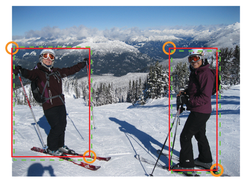
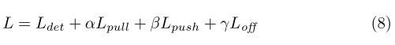

# Loss

Following (Newell et al., 2016), we also add intermediate supervision in training. However, we do not add back the intermediate predictions to the network as we find that this hurts the performance of the network. 

## Initialization

```python
# CornerNet, CornerNet Squeeze
self.loss = CornerNet_Loss(pull_weight=1e-1, push_weight=1e-1)

# CenterNet
self.loss = AELoss(pull_weight=1e-1, push_weight=1e-1, focal_loss=_neg_loss)

# CornerNet Saccade
self.loss = CornerNet_Saccade_Loss(pull_weight=1e-1, push_weight=1e-1)

class Loss(nn.Module):
    def __init__(
        self, pull_weight=1, push_weight=1, off_weight=1, focal_loss=_focal_loss
    ):
        super().__init__()

        self.pull_weight = pull_weight
        self.push_weight = push_weight
        self.off_weight = off_weight
        self.focal_loss = focal_loss
        self.ae_loss = _ae_loss
        self.off_loss = _off_loss
        
     def forward(self, outs, targets):
        pass
```

## outs, targets

### CornerNet, CornerNet Squeeze

```python
# outs: [
#	tl_heats, br_heats, 
#	tl_tags, br_tags, 
#	tl_offs, br_offs
# ]

# targets: [
#	tl_heatmaps, br_heatmaps, 
#	tag_masks, 
#	tl_regrs, br_regrs, 
#	tl_tags, br_tags
# ]
```

### CenterNet

```python
# outs: [
#	tl_heats, br_heats, ct_heats,
#	tl_tags, br_tags, 
#	tl_offs, br_offs, ct_offs,
# ]

# targets: [
#	tl_heatmaps, br_heatmaps, ct_heatmaps,
#	tag_masks, 
#	tl_regrs, br_regrs, ct_regrs,
#	tl_tags, br_tags
# ]
```

### CornerNet Saccade

```python
# outs: [
#     tl_heats, br_heats, 
#     tl_tags, br_tags, 
#     tl_offs, br_offs, 
#     atts
# ]
# targets: [
#     gt_tl_heat, gt_br_heat, 
#     gt_mask, 
#     gt_tl_off, gt_br_off, 
#     gt_tl_ind, gt_br_ind, 
#     gt_tl_valid, gt_br_valid, 
#     gt_atts
# ]
```

## focal loss

**Reducing Penalty to Negative Locations*




### _focal_loss, _focal_loss_mask

```python
# alpha = 2, beta = 4
def _focal_loss(preds, gt):
def _focal_loss_mask(preds, gt, mask):

    pos_inds = gt.eq(1)
    neg_inds = gt.lt(1)
    
	# Reducing Penalty to Negative Locations
    neg_weights = torch.pow(1 - gt[neg_inds], 4)
	
    # extra in _focal_loss_mask
    pos_mask = mask[pos_inds]
    neg_mask = mask[neg_inds]
    
    loss = 0
    for pred in preds:
        pos_pred = pred[pos_inds]
        neg_pred = pred[neg_inds]
		
        # _focal_loss
        pos_loss = torch.log(pos_pred) * torch.pow(1 - pos_pred, 2) 
        neg_loss = torch.log(1 - neg_pred) * torch.pow(neg_pred, 2) * neg_weights
        
        # _focal_loss_mask
        pos_loss = torch.log(pos_pred) * torch.pow(1 - pos_pred, 2) * pos_mask
        neg_loss = (
            torch.log(1 - neg_pred) * torch.pow(neg_pred, 2) * neg_weights * neg_mask
        )

        num_pos = pos_inds.float().sum()
        pos_loss = pos_loss.sum()
        neg_loss = neg_loss.sum()

        if pos_pred.nelement() == 0:
            loss = loss - neg_loss
        else:
            loss = loss - (pos_loss + neg_loss) / num_pos
    return loss
```

### CornerNet, CornerNet Squeeze

```python
# self.focal_loss = _focal_loss
focal_loss = 0
tl_heats = [_sigmoid(t) for t in tl_heats]
# tl_heats: [torch.Size([4, 80, 128, 128]), torch.Size([4, 80, 128, 128])]
br_heats = [_sigmoid(b) for b in br_heats]
# br_heats: [torch.Size([4, 80, 128, 128]), torch.Size([4, 80, 128, 128])]

focal_loss += self.focal_loss(tl_heats, gt_tl_heat)
focal_loss += self.focal_loss(br_heats, gt_br_heat)
```

### CenterNet

```python
focal_loss = 0

tl_heats = [_sigmoid(t) for t in tl_heats]
focal_loss += self.focal_loss(tl_heats, gt_tl_heat)

br_heats = [_sigmoid(b) for b in br_heats]
focal_loss += self.focal_loss(br_heats, gt_br_heat)

# additional focal loss for center keypoints
ct_heats = [_sigmoid(c) for c in ct_heats]
focal_loss += self.focal_loss(ct_heats, gt_ct_heat)
```

### CornerNet Saccade

```python
# self.focal_loss = _focal_loss_mask
focal_loss = 0
tl_heats = [_sigmoid(t) for t in tl_heats]
br_heats = [_sigmoid(b) for b in br_heats]
# tl_heats.shape, br_heats.shape: [torch.Size([4, 80, 64, 64])] * stacks

focal_loss += self.focal_loss(tl_heats, gt_tl_heat, gt_tl_valid)
focal_loss += self.focal_loss(br_heats, gt_br_heat, gt_br_valid)

# atts.shape: [
#     torch.Size([4, 1, 16, 16]), 
#     torch.Size([4, 1, 32, 32]), 
#     torch.Size([4, 1, 64, 64])
# ] * stacks
atts = [[_sigmoid(a) for a in att] for att in atts]
atts = [[att[ind] for att in atts] for ind in range(len(gt_atts))]
# atts.shape: [
#     [torch.Size([4, 1, 16, 16])] * stacks, 
#     [torch.Size([4, 1, 32, 32])] * stacks, 
#     [torch.Size([4, 1, 64, 64])] * stacks
# ]

att_loss = 0
for att, gt_att in zip(atts, gt_atts):
    # att.shape: [
    #	torch.Size([4, 1, 16, 16]), 
    #	torch.Size([4, 1, 16, 16]), 
    #	torch.Size([4, 1, 16, 16])
    # ]
    # gt_att.shape: torch.Size([4, 1, 16, 16])
    att_loss += _focal_loss(att, gt_att) / max(len(att), 1)
```

## associative embedding loss


```python
def _ae_loss(tag0, tag1, mask):
    # mask.shape: torch.Size([4, 128])
    num = mask.sum(dim=1, keepdim=True).float()
    # num: [[3.0], [3.0], [1.0], [16.0]]

    # tag0: e_tk
    # tag0.shape: torch.Size([4, 128, 1])
    tag0 = tag0.squeeze(-1)
    # tag0.shape: torch.Size([4, 128])
	
    # tag1: e_bk
    # tag1.shape: torch.Size([4, 128, 1])
    tag1 = tag1.squeeze(-1)
    # tag1.shape: torch.Size([4, 128])

    # tag_mean: (e_tk + e_bk) / 2 = e_k
    tag_mean = (tag0 + tag1) / 2
    # tag_mean.shape: torch.Size([4, 128])

    # (e_tk - e_k)^2 / N
    tag0 = torch.pow(tag0 - tag_mean, 2) / (num + 1e-4)
    tag0 = tag0[mask].sum()

    # (e_bk - e_k)^2 / N
    tag1 = torch.pow(tag1 - tag_mean, 2) / (num + 1e-4)
    tag1 = tag1[mask].sum()

    # pull = (e_tk - e_k)^2 / N + (e_bk - e_k)^2 / N
    pull = tag0 + tag1

    # mask.shape: torch.Size([4, 128])
    # mask.unsqueeze(1).shape: torch.Size([4, 1, 128])
    # mask.unsqueeze(2).shape: torch.Size([4, 128, 1])
    mask = mask.unsqueeze(1) + mask.unsqueeze(2)
    # mask.shape: torch.Size([4, 128, 128])
    
    # only calculate for the existing keypoints
    mask = mask.eq(2)

    num = num.unsqueeze(2)
    # N * (N - 1)
    num2 = (num - 1) * num

    # tag_mean.shape: torch.Size([4, 128])
    # tag_mean.unsqueeze(1).shape: torch.Size([4, 1, 128])
    # tag_mean.unsqueeze(2).shape: torch.Size([4, 128, 1])
    dist = tag_mean.unsqueeze(1) - tag_mean.unsqueeze(2)
    # dist.shape: torch.Size([4, 128, 128])

    # max(0, delta - abs(e_k - e_j)), delta = 1
    dist = 1 - torch.abs(dist)
    dist = nn.functional.relu(dist, inplace=True)
    
    # - max(0, 1 - abs(e_k - e_k))
    dist = dist - 1 / (num + 1e-4)
    
    # / N * (N - 1)
    dist = dist / (num2 + 1e-4)
    
    # mask.shape: torch.Size([4, 128, 128]) 
    dist = dist[mask]
    # dist.shape: torch.Size([275]) 
    push = dist.sum()
    return pull, push
```

### details

```python
pull_loss = 0
push_loss = 0

# tl_tags: [torch.Size([4, 1, 128, 128]), torch.Size([4, 1, 128, 128])]
# gt_tl_ind.shape: torch.Size([4, 128])
tl_tags = [_tranpose_and_gather_feat(tl_tag, gt_tl_ind) for tl_tag in tl_tags]
br_tags = [_tranpose_and_gather_feat(br_tag, gt_br_ind) for br_tag in br_tags]
# tl_tags: [torch.Size([4, 128, 1]), torch.Size([4, 128, 1])]

for tl_tag, br_tag in zip(tl_tags, br_tags):
    pull, push = self.ae_loss(tl_tag, br_tag, gt_mask)
    pull_loss += pull
    push_loss += push
    
pull_loss = self.pull_weight * pull_loss
push_loss = self.push_weight * push_loss
```

- `gt_tl_ind ([batch_size, max_tag_len])`: [1, 128] 

  ```
  [[5449, 4945, 5131, 7175, 8712, 9692, 9737, 9856, 4904, 6217, 0, 0, 0, 0, 0, 0, 0, 0, 0, 0, 0, 0, 0, 0, 0, 0, 0, 0, 0, 0, 0, 0, 0, 0, 0, 0, 0, 0, 0, 0, 0, 0, 0, 0, 0, 0, 0, 0, 0, 0, 0, 0, 0, 0, 0, 0, 0, 0, 0, 0, 0, 0, 0, 0, 0, 0, 0, 0, 0, 0, 0, 0, 0, 0, 0, 0, 0, 0, 0, 0, 0, 0, 0, 0, 0, 0, 0, 0, 0, 0, 0, 0, 0, 0, 0, 0, 0, 0, 0, 0, 0, 0, 0, 0, 0, 0, 0, 0, 0, 0, 0, 0, 0, 0, 0, 0, 0, 0, 0, 0, 0, 0, 0, 0, 0, 0, 0, 0]]
  ```

- `gt_br_ind ([batch_size, max_tag_len])`: [1, 128]

  ```
  [[8279, 7010, 6688, 8737, 9376, 10338, 10271, 10521, 11205, 8140, 0, 0, 0, 0, 0, 0, 0, 0, 0, 0, 0, 0, 0, 0, 0, 0, 0, 0, 0, 0, 0, 0, 0, 0, 0, 0, 0, 0, 0, 0, 0, 0, 0, 0, 0, 0, 0, 0, 0, 0, 0, 0, 0, 0, 0, 0, 0, 0, 0, 0, 0, 0, 0, 0, 0, 0, 0, 0, 0, 0, 0, 0, 0, 0, 0, 0, 0, 0, 0, 0, 0, 0, 0, 0, 0, 0, 0, 0, 0, 0, 0, 0, 0, 0, 0, 0, 0, 0, 0, 0, 0, 0, 0, 0, 0, 0, 0, 0, 0, 0, 0, 0, 0, 0, 0, 0, 0, 0, 0, 0, 0, 0, 0, 0, 0, 0, 0, 0]]
  ```

- `gt_mask ([batch_size, max_tag_len])`: [1, 128]

  ```
  [[1, 1, 1, 1, 1, 1, 1, 1, 1, 1, 0, 0, 0, 0, 0, 0, 0, 0, 0, 0, 0, 0, 0, 0, 0, 0, 0, 0, 0, 0, 0, 0, 0, 0, 0, 0, 0, 0, 0, 0, 0, 0, 0, 0, 0, 0, 0, 0, 0, 0, 0, 0, 0, 0, 0, 0, 0, 0, 0, 0, 0, 0, 0, 0, 0, 0, 0, 0, 0, 0, 0, 0, 0, 0, 0, 0, 0, 0, 0, 0, 0, 0, 0, 0, 0, 0, 0, 0, 0, 0, 0, 0, 0, 0, 0, 0, 0, 0, 0, 0, 0, 0, 0, 0, 0, 0, 0, 0, 0, 0, 0, 0, 0, 0, 0, 0, 0, 0, 0, 0, 0, 0, 0, 0, 0, 0, 0, 0]]
  ```

## offset loss

```python
def _off_loss(off, gt_off, mask):
    num = mask.float().sum()
    mask = mask.unsqueeze(2).expand_as(gt_off)

    off = off[mask]
    gt_off = gt_off[mask]

    off_loss = nn.functional.smooth_l1_loss(off, gt_off, reduction="sum")
    off_loss = off_loss / (num + 1e-4)
    return off_loss
```

```python
off_loss = 0
# tl_offs: [torch.Size([4, 2, 128, 128]), torch.Size([4, 2, 128, 128])]
# gt_tl_ind.shape: torch.Size([4, 128])
tl_offs = [_tranpose_and_gather_feat(tl_off, gt_tl_ind) for tl_off in tl_offs]
br_offs = [_tranpose_and_gather_feat(br_off, gt_br_ind) for br_off in br_offs]
# tl_offs: [torch.Size([4, 128, 2]), torch.Size([4, 128, 2])]

for tl_off, br_off in zip(tl_offs, br_offs):
    off_loss += self.off_loss(tl_off, gt_tl_off, gt_mask)
    off_loss += self.off_loss(br_off, gt_br_off, gt_mask)
off_loss = self.off_weight * off_loss

# CenterNet
regr_loss = 0
for tl_regr, br_regr, ct_regr in zip(tl_regrs, br_regrs, ct_regrs):
    regr_loss += self.regr_loss(tl_regr, gt_tl_regr, gt_mask)
    regr_loss += self.regr_loss(br_regr, gt_br_regr, gt_mask)
    regr_loss += self.regr_loss(ct_regr, gt_ct_regr, gt_mask)
regr_loss = self.regr_weight * regr_loss
```

## sum loss

We use Adam to optimize the full training loss:



where α, β, and γ are the weights for the pull, push and offset loss respectively. We set both α and β to 0.1 and γ to 1. We find that 1 or larger values of α and β lead to poor performance.

```python
# CornerNet, CornerNet Squeeze
# self.loss = CornerNet_Loss(pull_weight=1e-1, push_weight=1e-1, off_weight=1)
loss = (focal_loss + pull_loss + push_loss + off_loss) / max(len(tl_heats), 1)

# CenterNet
loss = (focal_loss + pull_loss + push_loss + regr_loss) / len(tl_heats)

# CornerNet Saccade
# extra loss: att_loss
loss = (focal_loss + att_loss + pull_loss + push_loss + off_loss) / max(
    len(tl_heats), 1
)
```
