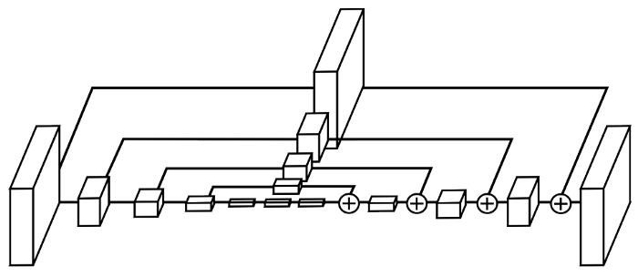
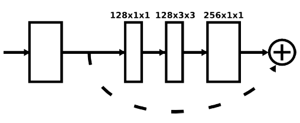

# Compare: CornerNet, CornerNet Squeeze, CornerNet Saccade, CenterNet

## heatmaps initialization

As we apply focal loss, we follow (Lin et al., 2017) to set the biases in the convolution layers that predict the corner heatmaps.

### CornerNets

```python
for tl_heat, br_heat in zip(tl_heats, br_heats):
	torch.nn.init.constant_(tl_heat[-1].bias, -2.19)
    torch.nn.init.constant_(br_heat[-1].bias, -2.19)
```

### CenterNet

```python
for tl_heat, br_heat, ct_heat in zip(self.tl_heats, self.br_heats, self.ct_heats):
    tl_heat[-1].bias.data.fill_(-2.19)
    br_heat[-1].bias.data.fill_(-2.19)
    ct_heat[-1].bias.data.fill_(-2.19)
```

## prediction module


**Fig. 7** The prediction module starts with a modified residual block, in which we replace the first convolution module with our corner pooling module. The modified residual block is then followed by a convolution module. We have multiple branches for predicting the heatmaps, embeddings and offsets.

### CornerNet, CornerNet Saccade, CenterNet

```python
def _pred_mod(self, dim=80):
    return nn.Sequential(
        convolution(
            k=3, 
            inp_dim=256, 
            out_dim=256, 
            stride=1, 
            with_bn=False
        ),
        nn.Conv2d(
            in_channels=256, 
            out_channels=dim, 
            kernel_size=(1, 1)
        )
    )

# CenterNet
def make_kp_layer(cnv_dim, curr_dim, out_dim):
    return nn.Sequential(
        convolution(3, cnv_dim, curr_dim, with_bn=False),
        nn.Conv2d(curr_dim, out_dim, (1, 1))
    )
```

### CornerNet Squeeze

We replace the 3×3 filters with 1×1 filters in the prediction modules of CornerNet.

```python
def _pred_mod(self, dim=80):
    return nn.Sequential(
        convolution(
            k=1, 
            inp_dim=256, 
            out_dim=256, 
            stride=1, 
            with_bn=False
        ),
        nn.Conv2d(
            in_channels=256, 
            out_channels=dim, 
            kernel_size=(1, 1)
        )
    )
```

## merge module

We apply a 1×1 Conv-BN module to both the input and output of the first hourglass module. We then merge them by element-wise addition followed by a ReLU and a residual block with 256 channels, which is then used as the input to the second hourglass module. 

```python
cnvs = nn.ModuleList([
    convolution(k=3, inp_dim=256, out_dim=256) 
    for _ in range(stacks)
])
inters = nn.ModuleList([
    residual(inp_dim=256, out_dim=256, k=3, stride=1) 
    for _ in range(stacks - 1)
])
cnvs_ = nn.ModuleList([
    self._merge_mod() for _ in range(stacks - 1)
])
inters_ = nn.ModuleList([
    self._merge_mod() for _ in range(stacks - 1)
])

def _merge_mod(self):
    return nn.Sequential(
        nn.Conv2d(
        	in_channels=256, out_channels=256, 
        	kernel_size=(1, 1), bias=False
        ),
        nn.BatchNorm2d(256)
    )

# cnvs_, inters_
nn.ModuleList([self._merge_mod() for _ in range(stacks - 1)])

# CenterNet
# self.cnvs_, self.inters_
nn.ModuleList([
    nn.Sequential(
        nn.Conv2d(curr_dim, curr_dim, (1, 1), bias=False),
        nn.BatchNorm2d(curr_dim)
    ) for _ in range(nstack - 1)
])
```

## Before the hourglass modules: pre

Before the hourglass modules, we reduce the image resolution by 4 times using:

- a 7×7 convolution module with stride 2 and 128 channels
- followed by a residual block with stride 2 and 256 channels.

### CornerNet, CornerNet Saccade, CenterNet

```python
pre = nn.Sequential(
    convolution(k=7, inp_dim=3, out_dim=128, stride=2, with_bn=True),
    residual(inp_dim=128, out_dim=256, k=3, stride=2),
)

# forward
# x.shape: torch.Size([4, 3, 511, 511])
inter = self.pre(x)
# inter.shape: torch.Size([4, 256, 128, 128])
```

### CornerNet Squeeze

We reduce the maximum feature map resolution of the hourglass modules by **adding one more downsampling layer before the hourglass modules** and remove one downsampling layer in each hourglass module. Therefore, CornerNet-Squeeze correspondingly downsizes the image three times before the hourglass module, whereas CornerNet downsizes the image twice.

```python
pre = nn.Sequential(
    convolution(k=7, inp_dim=3, out_dim=128, stride=2, with_bn=True),
    residual(inp_dim=128, out_dim=256, k=3, stride=2),
    residual(inp_dim=256, out_dim=256, k=3, stride=2),
)

# forward
# x.shape: torch.Size([13, 3, 511, 511])
inter = self.pre(x)
# inter.shape: torch.Size([13, 256, 64, 64])
```

## hg_mods

The hourglass module captures both global and local features in a single unified structure. When multiple hourglass modules are stacked in the network, the hourglass modules can reprocess the features to capture a higher level of information. These properties make the hourglass network an ideal choice for object detection as well.




**Fig. 3.** An illustration of a single “hourglass” module. Each box in the figure corresponds to a residual module as seen in Figure 4. The number of features is consistent across the whole hourglass.



**Fig. 4.** Left: Residual Module that we use throughout our network.

### CornerNet, CenterNet

```python
hg_mods = nn.ModuleList([
    hg_module(
        n=5, 
        dims=[256, 256, 384, 384, 384, 512], 
        modules=[2, 2, 2, 2, 2, 4],
        make_pool_layer=make_pool_layer,
        make_hg_layer=make_layer,
    ) for _ in range(2)
])


# CenterNet-104
self.kps  = nn.ModuleList([
    kp_module(
        n=5, 
        dims=[256, 256, 384, 384, 384, 512], 
        modules=[2, 2, 2, 2, 2, 4], 
        layer=kp_layer,
        make_pool_layer=make_pool_layer,
        make_hg_layer=make_hg_layer,
    ) for _ in range(2)
])
```

### CornerNet Saccade

We design a new hourglass backbone network, named Hourglass-54, that works better in CornerNet-Saccade. The new hourglass network consists of 3 hourglass modules and has a depth of 54 layers.

```python
hg_mods = nn.ModuleList([
    saccade_module(
        n=3, 
        dims=[256, 384, 384, 512], 
        modules=[1, 1, 1, 1],
        make_pool_layer=make_pool_layer,
        make_hg_layer=make_hg_layer
    ) for _ in range(3)
])
```

### CornerNet Squeeze

**CornerNet-Squeeze** speeds up inference by reducing the amount of processing per pixel. It incorporates ideas from SqueezeNet and MobileNets and introduces a new, compact hourglass backbone that makes extensive use of 1×1 convolution, bottleneck layer, and depth-wise separable convolution. CornerNet-Squeeze is faster and more accurate than YOLOv3, the state-of-the-art real-time detector.

We reduce the maximum feature map resolution of the hourglass modules by adding one more downsampling layer before the hourglass modules and **remove one downsampling layer in each hourglass module**. 

```python
hg_mods = nn.ModuleList(
    [
        hg_module(
            n=4,
            dims=[256, 256, 384, 384, 512],
            modules=[2, 2, 2, 2, 4],
            make_pool_layer=make_pool_layer,
            make_unpool_layer=make_unpool_layer,
            make_up_layer=make_layer,
            make_low_layer=make_layer,
            make_hg_layer_revr=make_layer_revr,
            make_hg_layer=make_hg_layer,
        )
        for _ in range(2)
    ]
)
```

## Compare make layers

- make_up_layer, make_pool_layer, make_hg_layer
- make_low_layer
- make_hg_layer_revr, make_unpool_layer
- make_merge_layer

### `self.up1 = make_up_layer(curr_dim, curr_dim, curr_mod)`

Every skip connection also consists of 2 residual modules. There are 4 residual modules with 512 channels in the middle of an hourglass module.

```python
# CornerNet, CornerNet Saccade, CenterNet
# x.shape: torch.Size([4, 256, 128, 128])
up1 = self.up1(x)
# up1.shape: torch.Size([4, 256, 128, 128])

make_up_layer = _make_layer
def _make_layer(inp_dim=256, out_dim=256, modules=2):
    layers = [residual(inp_dim=256, out_dim=256, k=3, stride=1)]
    layers += [residual(out_dim=256, out_dim=256, k=3, stride=1) for _ in range(1, 2)]
    return nn.Sequential(*layers)

# CornerNet Squeeze
# x.shape: torch.Size([13, 256, 64, 64])
up1 = self.up1(x)
# up1.shape: torch.Size([13, 256, 64, 64])

# replace residual with fire_module
make_up_layer = make_layer
def make_layer(inp_dim=256, out_dim=256, modules=2):
    layers = [fire_module(inp_dim=256, out_dim=256, sr=2, stride=1)]
    layers += [fire_module(out_dim=256, out_dim=256, sr=2, stride=1) for _ in range(1, 2)]
    return nn.Sequential(*layers)
```

### `self.max1 = make_pool_layer(curr_dim)`

```python
# CornerNet, CornerNet Saccade, CenterNet
# x.shape: torch.Size([4, 256, 128, 128])
max1 = self.max1(x)
# max1.shape: torch.Size([4, 256, 128, 128])
make_pool_layer = make_pool_layer

# CornerNet Squeeze
# x.shape: torch.Size([13, 256, 64, 64])
max1 = self.max1(x)
# max1.shape: torch.Size([13, 256, 64, 64])
make_pool_layer = make_pool_layer

def make_pool_layer(dim=256):
    return nn.Sequential()
```

### `self.low1 = make_hg_layer(curr_dim, next_dim, curr_mod)`

Downsampling and prepare input for recursive module: `curr_dim -> next_dim`. Instead of using max pooling, we simply use stride 2 to reduce feature resolution.

```python
# CornerNet, CornerNet Saccade, CenterNet
# max1.shape: torch.Size([4, 256, 128, 128])
low1 = self.low1(max1)
# low1.shape: torch.Size([4, 256, 64, 64])

make_hg_layer = make_hg_layer
def make_hg_layer(inp_dim=256, out_dim=256, modules=2):
    layers  = [residual(inp_dim=256, out_dim=256, k=3, stride=2)]
    layers += [residual(out_dim=256, out_dim=256, k=3, stride=1) for _ in range(1, 2)]
    return nn.Sequential(*layers)

# CornerNet Squeeze
# max1.shape: torch.Size([13, 256, 64, 64])
low1 = self.low1(max1)
# low1.shape: torch.Size([13, 256, 32, 32])

# replace residual with fire_module
make_hg_layer = make_hg_layer
def make_hg_layer(inp_dim=256, out_dim=256, modules=2):
    layers = [fire_module(inp_dim=256, out_dim=256, stride=2, sr=2)]
    layers += [fire_module(out_dim=256, out_dim=256, stride=1, sr=2) for _ in range(1, 2)]
    return nn.Sequential(*layers)
```

### `self.low2 = hg_module(self.n - 1)`

```python
# CornerNet, CenterNet
# low1.shape: torch.Size([4, 256, 64, 64])
low2 = self.low2(low1)
# low2.shape: torch.Size([4, 256, 64, 64])

# CornerNet Saccade
low2, mergs = self.low2(low1)
# low2.shape: torch.Size([4, 384, 32, 32])
# mergs.shape = [torch.Size([4, 384, 16, 16]), torch.Size([4, 384, 32, 32])]

# CornerNet Squeeze
# low1.shape: torch.Size([13, 256, 32, 32])
low2 = self.low2(low1)
# low2.shape: torch.Size([13, 256, 32, 32])
```

### `self.low3 = make_hg_layer_revr(next_dim, curr_dim, curr_mod)`

Convert dim back to current dim: `next_dim -> curr_dim`

```python
# CornerNet, CornerNet Saccade, CenterNet
# low2.shape: torch.Size([4, 256, 64, 64])
low3 = self.low3(low2)
# low3.shape: torch.Size([4, 256, 64, 64])

make_hg_layer_revr = _make_layer_revr
def _make_layer_revr(inp_dim=256, out_dim=256, modules=2):
    layers  = [residual(inp_dim=256, inp_dim=256, k=3, stride=1) for _ in range(modules - 1)]
    layers += [residual(inp_dim=256, out_dim=256, k=3, stride=1)]
    return nn.Sequential(*layers)

# CornerNet Squeeze
# low2.shape: torch.Size([13, 256, 32, 32])
low3 = self.low3(low2)
# low3.shape: torch.Size([13, 256, 32, 32])

# replace residual with fire_module
make_hg_layer_revr = make_layer_revr
def make_layer_revr(inp_dim=256, out_dim=256, modules=2):
    layers = [fire_module(inp_dim=256, inp_dim=256, stride=1, sr=2) for _ in range(2 - 1)]
    layers += [fire_module(inp_dim=256, out_dim=256, stride=1, sr=2)]
    return nn.Sequential(*layers)
```

### `self.up2 = make_unpool_layer(curr_dim)`

Upsampling to match the resolution of the current layer. When we upsample the features, we apply 2 residual modules (`self.low3`) followed by a nearest neighbor upsampling (`self.up2`).

**CornerNet Squeeze:** we replace the nearest neighbor upsampling in the hourglass network with transpose convolution with a 4×4 kernel.

```python
# CornerNet, CornerNet Saccade, CenterNet
# low3.shape: torch.Size([4, 256, 64, 64])
up2 = self.up2(low3)
# up2.shape: torch.Size([4, 256, 128, 128]) 

make_unpool_layer = _make_unpool_layer
def _make_unpool_layer(dim=256):
    return upsample(scale_factor=2)

class upsample(nn.Module):
    def __init__(self, scale_factor):
        super(upsample, self).__init__()
        self.scale_factor = scale_factor

    def forward(self, x):
        return nn.functional.interpolate(x, scale_factor=self.scale_factor)

# CornerNet Squeeze
# low3.shape: torch.Size([13, 256, 32, 32])
up2 = self.up2(low3)
# up2.shape: torch.Size([13, 256, 64, 64])

make_unpool_layer = make_unpool_layer
def make_unpool_layer(dim):
    return nn.ConvTranspose2d(
        dim=256, dim=256, kernel_size=4, stride=2, padding=1
    )
```

### `self.merg = make_merge_layer(curr_dim)`

Residual connection.

```python
# CornerNet, CornerNet Saccade, CenterNet
# up1.shape: torch.Size([4, 256, 128, 128])
# up2.shape: torch.Size([13, 256, 64, 64])
merg = self.merg(up1, up2)
# merg.shape: torch.Size([4, 256, 128, 128]) 
make_merge_layer = _make_merge_layer

# CornerNet Squeeze
# up1.shape: torch.Size([13, 256, 64, 64])
# up2.shape: torch.Size([13, 256, 64, 64])
merg = self.merg(up1, up2)
# merg.shape: torch.Size([13, 256, 64, 64]) 

make_merge_layer = _make_merge_layer
def _make_merge_layer(dim=256):
    return merge()
```