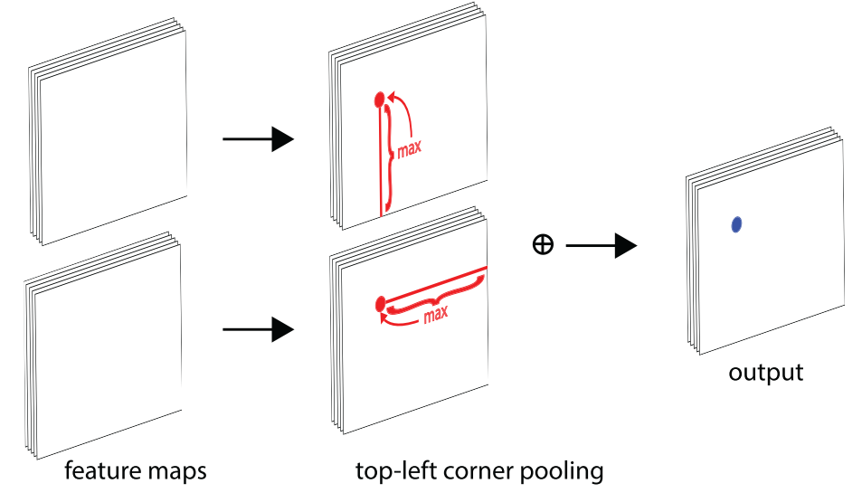
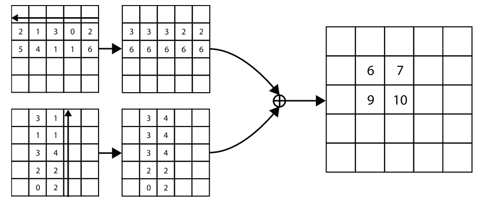

# Corner Pooling





**Fig. 6** The top-left corner pooling layer can be implemented very efficiently. We scan from right to left for the horizontal max-pooling and from bottom to top for the vertical max-pooling. We then add two max-pooled feature maps.


**Fig. 7** The prediction module starts with a modified residual block, in which we replace the first convolution module with our corner pooling module. The modified residual block is then followed by a convolution module. We have multiple branches for predicting the heatmaps, embeddings and offsets.

- The first part of the module is a modified version of the residual block. In this modified residual block, we first process the features from the backbone network by two 3×3 Conv-BN-ReLU modules with 128 channels and then apply a corner pooling layer. 
- Following the design of a residual block, we then feed the pooled features into a 3×3 Conv-BN layer with 256 channels and add back the projection shortcut. 
- The modified residual block is followed by a 3×3 Conv-BN-ReLU module with 256 channels, and 3 Conv-ReLU-Conv layers to produce the heatmaps, embeddings, and offsets.

```python
class corner_pool(nn.Module):
    def __init__(self, dim, pool1, pool2):
        super(corner_pool, self).__init__()
        self._init_layers(dim, pool1, pool2)

    def _init_layers(self, dim, pool1, pool2):
        self.p1_conv1 = convolution(k=3, inp_dim=dim, out_dim=128)
        self.p2_conv1 = convolution(k=3, inp_dim=dim, out_dim=128)

        self.p_conv1 = nn.Conv2d(
            in_channels=128, 
            out_channels=dim, 
            kernel_size=(3, 3), 
            padding=(1, 1), 
            bias=False
        )
        self.p_bn1 = nn.BatchNorm2d(dim)

        self.conv1 = nn.Conv2d(
            in_channels=dim, 
            out_channels=dim, 
            kernel_size=(1, 1), 
            bias=False
        )
        self.bn1 = nn.BatchNorm2d(dim)
        self.relu1 = nn.ReLU(inplace=True)

        self.conv2 = convolution(k=3, inp_dim=dim, out_dim=dim)

        self.pool1 = pool1()
        self.pool2 = pool2()

    def forward(self, x):
        # x.shape: torch.Size([1, 256, 128, 128])

        # pool 1
        p1_conv1 = self.p1_conv1(x)
        # p1_conv1.shape: torch.Size([1, 128, 128, 128])
        pool1 = self.pool1(p1_conv1)
        # pool1.shape: torch.Size([1, 128, 128, 128])

        # pool 2
        p2_conv1 = self.p2_conv1(x)
        # p2_conv1.shape: torch.Size([1, 128, 128, 128])
        pool2 = self.pool2(p2_conv1)
        # pool2.shape: torch.Size([1, 128, 128, 128])

        # (pool1 + pool2).shape: torch.Size([1, 128, 128, 128]) 
        p_conv1 = self.p_conv1(pool1 + pool2)
        # p_conv1.shape: torch.Size([1, 256, 128, 128])
        p_bn1 = self.p_bn1(p_conv1)
        # p_bn1.shape: torch.Size([1, 256, 128, 128])

        # residual branch
        conv1 = self.conv1(x)
        # conv1.shape: torch.Size([1, 256, 128, 128])
        bn1 = self.bn1(conv1)
        # bn1.shape: torch.Size([1, 256, 128, 128])
        relu1 = self.relu1(p_bn1 + bn1)
        # relu1.shape: torch.Size([1, 256, 128, 128])

        conv2 = self.conv2(relu1)
        # conv2.shape: torch.Size([1, 256, 128, 128])

        return conv2
```

## Initialization

```python
tl_modules = nn.ModuleList([
    corner_pool(dim=256, pool1=TopPool, pool2=LeftPool) 
    for _ in range(stacks)
])
br_modules = nn.ModuleList([
    corner_pool(dim=256, pool1=BottomPool, pool2=RightPool) 
    for _ in range(stacks)
])
```

## Training Forward

```python
# convs.shape: 
# CornerNet: [torch.Size([4, 256, 128, 128])] * stacks
# CornerNet Squeeze: [torch.Size([13, 256, 64, 64])] * stacks
# CornerNet Saccade: [torch.Size([4, 256, 64, 64])] * stacks

tl_modules = [tl_mod_(cnv) for tl_mod_, cnv in zip(self.tl_modules, cnvs)]
br_modules = [br_mod_(cnv) for br_mod_, cnv in zip(self.br_modules, cnvs)]

# tl_modules.shape: 
# CornerNet: [torch.Size([4, 256, 128, 128])] * stacks
# CornerNet Squeeze: [torch.Size([13, 256, 64, 64])] * stacks
# CornerNet Saccade: [torch.Size([4, 256, 64, 64])] * stacks
```

## Testing Forward

```python
# cnvs.shape:
# CornerNet: [torch.Size([2, 256, 128, 192])] * stacks
# CornerNet Squeeze: [torch.Size([13, 256, 64, 96])] * stacks
# CornerNet Saccade: [torch.Size([2, 256, 64, 64])] * stacks

tl_mod = self.tl_modules[-1](cnvs[-1])
br_mod = self.br_modules[-1](cnvs[-1])

# tl_mod.shape: 
# CornerNet: torch.Size([2, 256, 128, 192])
# CornerNet Squeeze: torch.Size([1, 256, 64, 96])
# CornerNet Saccade: torch.Size([2, 256, 64, 64])
```

# Center Pooling, Cascade Corner Pooling


**Figure 4:** (a) Center pooling takes the maximum values in both horizontal and vertical directions. (b) Corner pooling only takes the maximum values in boundary directions. (c) Cascade corner pooling takes the maximum values in both boundary directions and internal directions of objects.


**Figure 5:** The structures of the center pooling module (a) and the cascade top corner pooling module (b). We achieve center pooling and the cascade corner pooling by combining the corner pooling at different directions.

## Cascade Corner Pooling

```python
class pool(nn.Module):
    # tl_pool: pool1=TopPool, pool2=LeftPool
    def __init__(self, dim, pool1, pool2):
        super(pool, self).__init__()
        self.p1_conv1 = convolution(3, dim, 128)
        self.p2_conv1 = convolution(3, dim, 128)

        self.p_conv1 = nn.Conv2d(128, dim, (3, 3), padding=(1, 1), bias=False)
        self.p_bn1 = nn.BatchNorm2d(dim)

        self.conv1 = nn.Conv2d(dim, dim, (1, 1), bias=False)
        self.bn1 = nn.BatchNorm2d(dim)
        self.relu1 = nn.ReLU(inplace=True)

        self.conv2 = convolution(3, dim, dim)

        self.pool1 = pool1()
        self.pool2 = pool2()
		
        # extra layers compared with normal corner pooling
        self.look_conv1 = convolution(3, dim, 128)
        self.look_conv2 = convolution(3, dim, 128)
        self.P1_look_conv = nn.Conv2d(128, 128, (3, 3), padding=(1, 1), bias=False)
        self.P2_look_conv = nn.Conv2d(128, 128, (3, 3), padding=(1, 1), bias=False)

    def forward(self, x):
        # Example: Top Left Pooling
        
        # pool1: Cascade Top Corner Pooling Module
        p1_conv1 = self.p1_conv1(x)
        # LeftPool
        look_conv1 = self.look_conv1(x)
        look_right = self.pool2(look_conv1)
        P1_look_conv = self.P1_look_conv(p1_conv1 + look_right)
        # TopPool
        pool1 = self.pool1(P1_look_conv)

        # pool2: Cascade Left Corner Pooling Module
        p2_conv1 = self.p2_conv1(x)
        # TopPool
        look_conv2 = self.look_conv2(x)
        look_down = self.pool1(look_conv2)
        P2_look_conv = self.P2_look_conv(p2_conv1+look_down)
        # LeftPool
        pool2 = self.pool2(P2_look_conv)

        # pool1 + pool2
        p_conv1 = self.p_conv1(pool1 + pool2)
        p_bn1 = self.p_bn1(p_conv1)
		
        # residual
        conv1 = self.conv1(x)
        bn1 = self.bn1(conv1)
        relu1 = self.relu1(p_bn1 + bn1)
        conv2 = self.conv2(relu1)
        return conv2
```

## Center Pooling

```python
class pool_cross(nn.Module):
    # pool1=TopPool, pool2=LeftPool, pool3=BottomPool, pool4=RightPool
    def __init__(self, dim, pool1, pool2, pool3, pool4):
        super(pool_cross, self).__init__()
        self.p1_conv1 = convolution(3, dim, 128)
        self.p2_conv1 = convolution(3, dim, 128)

        self.p_conv1 = nn.Conv2d(128, dim, (3, 3), padding=(1, 1), bias=False)
        self.p_bn1 = nn.BatchNorm2d(dim)

        self.conv1 = nn.Conv2d(dim, dim, (1, 1), bias=False)
        self.bn1 = nn.BatchNorm2d(dim)
        self.relu1 = nn.ReLU(inplace=True)

        self.conv2 = convolution(3, dim, dim)

        self.pool1 = pool1()
        self.pool2 = pool2()
        self.pool3 = pool3()
        self.pool4 = pool4()

    def forward(self, x):
        # pool1
        p1_conv1 = self.p1_conv1(x)
        # TopPool
        pool1 = self.pool1(p1_conv1)
        # BottomPool
        pool1 = self.pool3(pool1)
		
        # pool2
        p2_conv1 = self.p2_conv1(x)
        # LeftPool
        pool2 = self.pool2(p2_conv1)
        # RightPool
        pool2 = self.pool4(pool2)

        # pool1 + pool2
        p_conv1 = self.p_conv1(pool1 + pool2)
        p_bn1 = self.p_bn1(p_conv1)
		
        # residual
        conv1 = self.conv1(x)
        bn1 = self.bn1(conv1)
        relu1 = self.relu1(p_bn1 + bn1)
        conv2 = self.conv2(relu1)
        return conv2
```