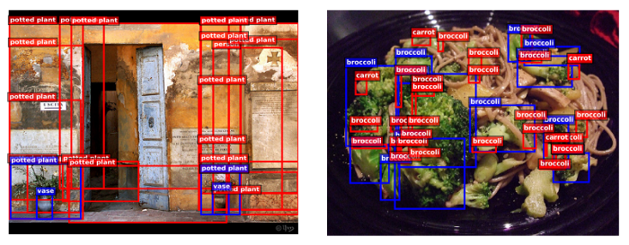
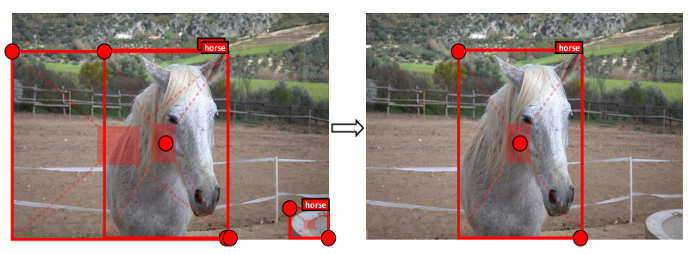
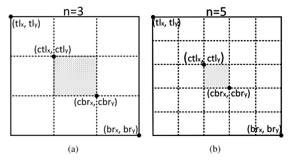
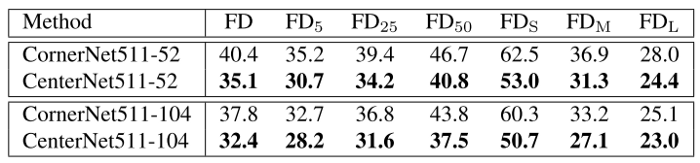

# CenterNet: Keypoint Triplets for Object Detection (2019)

Original Paper: [CenterNet: Keypoint Triplets for Object Detection](https://arxiv.org/abs/1904.08189)

# Overview

In the object detection era, one of the most popular methods is **anchor-based**, where a set of pre-defined boxes are regressed to the desired place with the help of ground-truth objects. However, these approaches often need a large number of anchors to ensure a sufficiently high IoU rate with the ground-truth objects, and the size and aspect ratio of each anchor box need to be manually designed. In addition, anchors are usually not aligned with the ground truth boxes, which is not conducive to the bounding box classification task.

To overcome the drawbacks of anchor-based approaches, a keypoint-based object detection pipeline named **CornerNet** was proposed. It represented each object by a pair of corner keypoints, eliminating the use of anchor boxes. However, since each object is constructed by a pair of corners, CornerNet is sensitive to detect the boundary of objects and relatively weak in referring to the global information of an object. Consequently, it often generates some incorrect bounding boxes that could be easily filtered out with complementary information.

**Figure 1 (a):** The top 100 bounding boxes of CornerNet. Ground-truth (blue), predicted objects (red).

To address this issue, we equip CornerNet with the ability to perceive the visual patterns within each proposed region, so that it can identify the correctness of each bounding box by itself. We present a low-cost yet effective solution named **CenterNet**, which explores the central part of a proposal with one extra keypoint. 

The intuition is that, if a predicted bounding box has a high IoU with the ground-truth box, then the probability that the center keypoint in its central region is predicted as the same class is high, and vice versa. Thus, during inference, after a proposal is generated as a pair of corner keypoints, we determine if the proposal is indeed an object by checking if there is a center keypoint of the same class falling within its central region.

**Figure 1 (b):** CenterNet: Correct predictions can be determined by checking the central parts.

To detect center and corner better, we propose two strategies to enrich center and corner information, respectively.

- **Center pooling** helps the center keypoints obtain more recognizable visual patterns within objects. We achieve this by getting out the max summed response in both horizontal and vertical directions of the center keypoint on a feature map for predicting center keypoints.
- **Cascade corner pooling** equips the original corner pooling module with the ability to perceive internal information. We achieve this by getting out the max summed response in both boundary and internal directions of objects on a feature map for predicting corners.

# Baseline and Motivation

## CornerNet as the baseline

To detect corners, CornerNet produces two heatmaps: a heatmap of top-left corners and a heatmap of bottom-right corners. The heatmaps represent the locations of keypoints of different categories and assign a confidence score for each keypoint. Besides, it also predicts an embedding and a group of offsets for each corner. The embeddings are used to identify if two corners are from the same object. The offsets learn to remap the corners from the heatmaps to the input image.

To generate object bounding boxes, top-k left-top corners and bottom-right corners are selected from the heatmaps according to their scores, respectively. Then, the distance of the embedding vectors of a pair of corners is calculated to determine if the paired corners belong to the same object. An object bounding box is generated if the distance is less than a threshold. The bounding box is assigned a confidence score, which equals the average score of the corner pair.

## Explore the visual patterns within each bounding box

In **Table 1**, we count the FD (false discovery) rate of CornerNet on the MS-COCO validation dataset, defined as the proportion of the incorrect bounding boxes.

- The incorrect bounding boxes account for a large proportion even at low IoU thresholds, e.g., CornerNet obtains a 32.7% FD rate at `IoU = 0.05`. This means on average, 32.7 out of every 100 object bounding boxes have IoU lower than 0.05 with the ground truth.
- The small incorrect bounding boxes are even more, which achieves a 60.3% FD rate.

One of the possible reasons is that CornerNet cannot look into the regions inside the bounding boxes. We propose a highly efficient method called CenterNet to explore the visual patterns within each bounding box. To detect an object, our approach uses a triplet, rather than a pair of keypoints.

# Object Detection as Keypoint Triplets

**Figure 2:** Architecture of CenterNet.

## Center keypoints to filter out incorrect bounding boxes

**We represent each object by a center keypoint and a pair of corners.** Specifically, we embed a heatmap for the center keypoints on the basis of CornerNet and predict the offsets of the center keypoints. Then, we use the method proposed in CornerNet to generate top-k bounding boxes. However, we have an extra step to filter out the incorrect bounding box, following procedure:

- (1) select top-k center keypoints according to their scores;
- (2) use the corresponding offsets to remap these center keypoints to the input image;
- (3) define a central region for each bounding box and check if the central region contains center keypoints with the same class label;
- (4) if a center keypoint is detected in the central region, the bounding box will be preserved and its score will be replaced by the average score of the three points, i.e., the top-left corner, the bottom-right corner, and the center keypoint;
- (5) if there is no center keypoint detected in its central region, the bounding box will be removed.

## Scale-aware central region

The size of the central region in the bounding box affects the detection results. For example, smaller central regions lead to a low recall rate for small bounding boxes, while larger central regions lead to a low precision for large bounding boxes. Therefore, we propose a scale-aware central region to adaptively fit the size of bounding boxes. The scale-aware central region tends to generate a relatively large central region for a small bounding box, while a relatively small central region for a large bounding box.

Suppose we want to determine if a bounding box i needs to be preserved.

where `n` is odd that determines the scale of the central region `j`. In this paper, `n` is set to be 3 and 5 for the scales of bounding boxes less and greater than 150, respectively.

**Figure 3** shows two central regions when `n = 3` and `n = 5`, respectively. The solid rectangles denote the predicted bounding boxes and the shaded regions denote the central regions.

# Enriching Center and Corner Information

## Center pooling

The geometric centers of objects do not necessarily convey very recognizable visual patterns (e.g., the human head contains strong visual patterns, but the center keypoint is often in the middle of the human body). To address this issue, we propose center pooling to capture richer and more recognizable visual patterns.

**Figure 4 (a):** Center pooling.

As shown in **Figure 4(a)**, the detailed process of center pooling is as follows: the backbone outputs a feature map, and to determine if a pixel in the feature map is a center keypoint, we need to find the maximum value in both its horizontal and vertical directions and add them together.

## Cascade corner pooling

Corners are often outside the objects, which lacks local appearance features. CornerNet uses corner pooling to address this issue. As shown in **Figure 4(b)**, corner pooling aims to find the maximum values on the boundary directions so as to determine corners. However, it makes corners sensitive to the edges. To address this problem, we need to let corners “see” the visual patterns of objects and thus propose cascade corner pooling.

**Figure 4 (b)(Left):** Corner pooling. **(c)(Right):** Cascade corner pooling

As presented in **Figure 4(c)**, cascade corner pooling first looks along a boundary to find a boundary maximum value, then looks inside along the location of the boundary maximum value (for the topmost, leftmost, bottommost, and rightmost boundary, look vertically towards the bottom, horizontally towards the right, vertically towards the top and horizontally towards the left, respectively) to find an internal maximum value, and finally, add the two maximum values together. In this way, the corners obtain both the boundary information and the visual patterns of objects.

## Implement by **combining the corner pooling in different directions**

**(a) Center pooling. (b) Corner pooling. (c) Cascade corner pooling.**

**Figure 5:** The structures of the pooling module

Both the center pooling and the cascade corner pooling can be easily achieved by combining the corner pooling in different directions.

- **Figure 5(a)** shows the structure of the center pooling module. To take a maximum value in a direction, e.g., the horizontal direction, we only need to connect the left pooling and the right pooling in series.
- **Figure 5(b)** shows the structure of a cascade top corner pooling module. Compared with the top corner pooling in CornerNet, we add a left corner pooling before the top corner pooling.

# Training and Inference

## Training

Our method is implemented in Pytorch and the network is trained from scratch. The resolution of the input image is `511 × 511`, leading to heatmaps of size `128 × 128`. We use the same data augmentation strategy presented in CornerNet to train a robust model. Adam is used to optimize the training loss:

## Inference

Following CornerNet, for the single-scale testing, we input both the original and horizontally flipped images with the original resolutions into the network. While for the multi-scale testing, we input both the original and horizontally flipped images with the resolutions of `0.6, 1, 1.2, 1.5, and 1.8`. We select top 70 center keypoints, top 70 top-left corners, and top 70 bottom-right corners from the heatmaps to detect the bounding boxes. We flip the bounding boxes detected in the horizontally flipped images and mix them into the original bounding boxes. Soft-NMS is used to remove the redundant bounding boxes. We finally select the top 100 bounding boxes according to their scores as the final detection results.

# Comparisons with State-of-the-art Detectors

## Compare with CornerNet

We evaluate our method on the MS-COCO dataset. It contains 80 categories and more than 1.5 million object instances. A large number of small objects makes it a very challenging dataset. We use the “trainval35k” set for training and test the results on the test-dev set.

Compared with the baseline CornerNet, CenterNet achieves a remarkable improvement. For example, CenterNet511–52 (input resolution: `511²`, backbone: Hourglass-52) reports a single-scale testing AP of 41.6%, an improvement of 3.8% over 37.8%, and a multi-scale testing AP of 43.5%, an improvement of 4.1% over 39.4%, achieved by CornerNet under the same setting.

Meanwhile, the most contribution comes from the small objects (area < `32²`). For instance, CenterNet511-52 improves the AP for small objects by 5.5% (single-scale) and by 6.4% (multi-scale). The benefit stems from the center information modeled by the center keypoints: the smaller the scale of an incorrect bounding box is, the lower probability a center keypoint can be detected in its central region. **Figure 6(a)** and **Figure 6(b)** show some qualitative comparisons.

**Figure 6 (a), (b):** Improvement for small objects. Blue: ground truth, Red: prediction.

CenterNet also leads to a large improvement for reducing medium (`32² < area < 96²`) and large (`area > 96²`) incorrect bounding boxes. CenterNet511–104 (input resolution: `511²`, backbone: Hourglass-104) improves the single-scale testing AP by 4.7% (from 42.7% to 47.4%) and 3.5% (from 53.9% to 57.4%), respectively. **Figure 6(c)** and **Figure 6(d)** show some qualitative comparisons.

**Figure 6 (c), (d):** Improvement for medium and large objects. Blue: ground truth, Red: prediction.

It is worth noting that the AR (maximum recall rate) is also significantly improved. This is because our approach removes lots of incorrect bounding boxes, which is equivalent to improving the confidence of those bounding boxes with accurate locations but lower scores.

## Incorrect Bounding Box Reduction

The AP metric reflects how many high-quality object bounding boxes (usually `IoU ≥ 0.5`) a network can predict, but cannot directly reflect how many incorrect object bounding boxes (usually `IoU << 0.5`) a network generates. The FD rate is a suitable metric, which reflects the proportion of the incorrect bounding boxes.

**Table 3:** Comparison of false discovery rates (%) of CornerNet and CenterNet (MS-COCO validation dataset)

**Table 3** shows the FD rates for CornerNet and CenterNet. CornerNet generates many incorrect bounding boxes even at `IoU = 0.05` threshold. On the other hand, CornerNet generates more small incorrect bounding boxes than medium and large incorrect bounding boxes. CenterNet decreases the FD rates at all criteria via exploring central regions. In addition, the FD rates for small bounding boxes decrease the most. This is also the reason why the AP improvement for small objects is more prominent.

## Compare with other detectors

When comparing other one-stage approaches, CenterNet511–52 reports 41.6% single-scale testing AP. This achievement is already better than those using deeper models (e.g., RetinaNet800 and RefineDet). The best performance of CenterNet is AP 47.0%, dramatically surpassing all the published one-stage approaches to our best knowledge.

At last, the performance of CenterNet is also competitive with the two-stage approaches, e.g., the single-scale testing AP of CenterNet511-52 is comparable to the two-stage approach Fitness R-CNN (41.6% vs. 41.8%) and that of CenterNet511–104 is comparable to D-RFCN + SNIP (44.9% vs. 45.7%), respectively.

Nevertheless, it should be mentioned that two-stage approaches usually use larger resolution input images (e.g., ∼ `1000 × 600`), which significantly improves the detection accuracy, especially for small objects. The multi-scale testing AP 47.0% achieved by CenterNet511–104 closely matches the state-of-the-art AP 47.4%, achieved by the two-stage detector PANet.

# Ablation Study

Our work has contributed three components, including central region exploration, center pooling, and cascade corner pooling. To analyze the contribution of each individual component, we use CornerNet511–52 as the baseline and add the three components one by one while following the default parameter setting. The detailed results are presented in **Table 4** in the original paper.

## Central region exploration

We add a center heatmap branch to the baseline and use a triplet of keypoints to detect bounding boxes. For the center keypoint detection, we only use conventional convolutions. The AP is improved by 2.3% (from 37.6% to 39.9%) while for **the small objects the improvement (4.6%) is more significant than that for other object scales**. The improvement for large objects is almost negligible (from 52.2% to 52.3%). From a probabilistic point of view, it’s not surprising because the center keypoint for a small object is easier to be located than that of a large object.

## Center pooling

We then add the center pooling module to the network. It improves the AP by 0.9% (from 39.9% to 40.8%). Notably, with the help of center pooling, **we improve the AP for large objects by 1.4%** (from 52.2% to 53.6%), which is much higher than the improvement using conventional convolutions (i.e., 1.4% vs. 0.1%).

**Figure 6(e):** without (upper) / with (lower) center pooling

It demonstrates that our center pooling is effective in detecting center keypoints of objects, especially for large objects. Our explanation is that center pooling can extract richer internal visual patterns, and larger objects contain more accessible internal visual patterns. **Figure 6(e)** shows that the conventional convolution fails to locate the center keypoint for the cow, but with center pooling, it successfully locates the center keypoint.

## Cascade corner pooling

We replace corner pooling with cascade corner pooling to detect corners. When testing on the basis of CornerNet511–52, it improves the AP by 0.7% (from 37.6% to 38.3%). When testing on the basis of CenterNet511–52, it improves the AP by 0.5% (from 40.8% to 41.3%).

When testing on the basis of CornerNet511–52, there is almost no change in the AP for large objects (i.e., 52.2% vs. 52.2%), but the AR is improved by 1.8% (from 74.0% to 75.8%). This suggests that cascade corner pooling can “see” more objects due to the rich internal visual patterns in large objects, but too rich visual patterns may interfere with its perception of the boundary information, leading to many inaccurate bounding boxes. After equipping with CenterNet, the inaccurate bounding boxes are effectively suppressed, which improves the AP for large objects by 2.2% (from 53.6% to 55.8%).

**Figure 6(f):** without (upper) / with (lower) cascade corner pooling. It shows that cascade corner pooling can successfully locate a pair of corners for the cat on the left while corner pooling cannot.

# The importance of center keypoints

**Table 5:** Error analysis of center keypoints via using ground-truth.

To understand the importance of center keypoints, we replace the predicted center keypoints with the ground-truth values and evaluate performance on the MS-COCO validation dataset. **Table 5** shows that using the ground-truth center keypoints improves the AP from 41.3% to 56.5% for CenterNet511-52 and from 44.8% to 58.1% for CenterNet511–104, respectively. AP for small, medium and large objects are improved by 15.5%, 16.5%, and 14.5% for CenterNet511–52 and 14.5%, 14.1%, and 13.3% for CenterNet511–104, respectively. The results suggest there is still room for improvement in detecting center keypoints, however, the detection of center keypoints is far from the bottleneck.