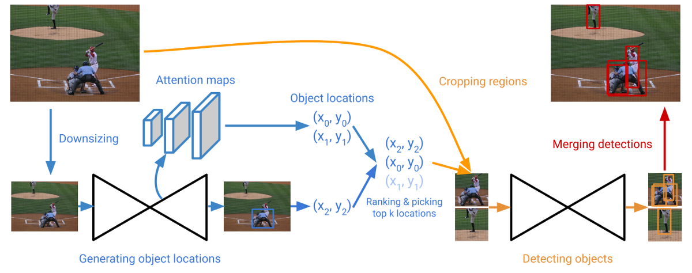

# CornerNet-Lite: Efficient Keypoint Based Object Detection (2019)

Original Paper: [CornerNet-Lite: Efficient Keypoint Based Object Detection](https://arxiv.org/abs/1904.08900)

# Overview

CornerNet allows a simplified design that eliminates the need for anchor boxes and has achieved state-of-the-art accuracy on COCO among single-stage detectors.

However, a major drawback of CornerNet is its inference speed. It achieves an average precision (AP) of 42.2% on COCO at an inference cost of 1.1s per image, which is too slow for video applications that require real-time or interactive rates. This makes CornerNet less competitive with alternatives in terms of the accuracy-efficiency trade-off.

We seek to improve the inference efficiency of CornerNet along with two orthogonal directions and introduce two efficient variants of CornerNet:

- **CornerNet-Saccade** speeds up inference by **reducing the number of pixels to process.** It uses an attention mechanism similar to saccades in human vision. It starts with a downsized full image and generates an attention map, which is then zoomed in on and processed further by the model. CornerNet-Saccade speeds up the original CornerNet by 6.0x with a 1% increase in AP.
- **CornerNet-Squeeze** speeds up inference by **reducing the amount of processing per pixel.** It incorporates ideas from SqueezeNet and MobileNets and introduces a new, compact hourglass backbone that makes extensive use of `1 × 1` convolution, bottleneck layer, and depth-wise separable convolution. CornerNet-Squeeze is faster and more accurate than YOLOv3, the state-of-the-art real-time detector.

Collectively, we refer CornerNet-Saccade and CornerNet-Squeeze as **CornerNet-Lite**. These two variants make the keypoint-based object detectors competitive, covering two popular use cases and both are technically novel.

- **CornerNet-Saccade for off-line processing,** improving efficiency without sacrificing accuracy. It is the first to integrate saccades with keypoint-based object detection.
- **CornerNet-Squeeze for real-time processing,** improving accuracy without sacrificing efficiency. It is the first to integrate SqueezeNet with the stacked hourglass architecture and to apply such a combination to object detection. It shows that the hourglass architecture can be competitive in terms of efficiency, particularly in the context of object detection.

## *Unsuccessful trial: CornerNet-Squeeze-Saccade

CornerNet-Squeeze-Saccade is an unsuccessful trial to combine CornerNet-Squeeze with saccades, aiming to improve its efficiency even further. However, it turns out slower and less accurate than CornerNet-Squeeze.

This is because for saccades to help, the network needs to be able to generate sufficiently accurate attention maps, but the ultra-compact architecture of CornerNet-Squeeze does not have this extra capacity.

In addition, the original CornerNet is applied at multiple scales, which provides ample room for saccades to cut down on the number of pixels to process. In contrast, CornerNet-Squeeze is already applied at a single scale due to the ultra-tight inference budget, which provides much less room for saccades to save.

# CornerNet-Saccade

**Figure 2:** Overview of CornerNet-Saccade.

CornerNet-Saccade detects objects within small regions around possible object locations in an image. It uses the downsized full image to predict attention maps and coarse bounding boxes; both suggest possible object locations. CornerNet-Saccade then detects objects by examining the regions centered at the locations in high resolution.

- We predict a set of possible object locations from the attention maps and bounding boxes generated on a downsized full image.
- We zoom into each location and crop a small region around that location.
- Then we detect objects in top k regions and merge the detections by NMS.

## Estimating Object Locations

Given an image, we downsize it to two scales by resizing the longer side of the image to 255 and 192 pixels. The image of size 192 is padded with zeros to the size of 255 so that they can be processed in parallel.

For a downsized image, CornerNet-Saccade predicts **3 attention maps** for small (longer side < 32 pixels), medium (32 ≤ longer side ≤ 96 pixels), and large (longer side > 96 pixels) objects respectively. Predicting locations separately for different object sizes gives us finer control over how much CornerNet-Saccade should zoom in at each location. We can zoom in more at small object locations and less at medium object locations.

We predict the attention maps by using feature maps at different scales from the backbone hourglass network. **The feature maps from the upsampling layers in the hourglass are used to predict the attention maps.** The feature maps at finer scales are used for smaller objects and the ones at coarser scales are for larger objects. We predict the attention maps by applying a `3 × 3` Conv-ReLU module followed by a `1 × 1` Conv-Sigmoid module to each feature map.

During testing, we only process locations where scores are above a threshold t (`t = 0.3` in our experiments). During training, we set the center of each bounding box on the corresponding attention map to be positive and the rest to negatives. Then we apply the focal loss with `α = 2`.

## Detecting Objects

CornerNet-Saccade uses the locations obtained from the downsized image to determine where to process. We examine the regions at a higher resolution based on the scale information obtained in the first step.

Based on the locations obtained from the attention maps, we can determine different zoom-in scales for different object sizes: `ss` for small objects, `sm` for medium objects, and `sl` for large objects. In general, `ss > sm > sl` because we should zoom in more for smaller objects, so we set `ss = 4`, `sm = 2` and `sl = 1`. At each possible location `(x, y)`, we enlarge the downsized image by `si`, where `i ∈ {s, m, l}` depending on the coarse object scale. Then we apply CornerNet-Saccade to a `255 × 255` window centered at the location.

CornerNet-Saccade uses the same network for attention maps and bounding boxes. Hence, when CornerNet-Saccade processes the downsized image to predict the attention maps, it may already predict boxes for some larger objects in the image. But the boxes may not be accurate. We also zoom into those objects to obtain better boxes. After detecting objects at possible object locations, we merge the bounding boxes and remove redundant ones by applying Soft-NMS.

There are some important implementation details to make processing efficient.

- First, we process the regions in batch to better utilize the GPU.
- Second, we keep the original image in GPU memory and perform resizing and cropping on the GPU to reduce the overhead of transferring image data between CPU and GPU.
- To further utilize the processing power of the GPU, the cropped images are processed in parallel.

**Figure 3 (Left):** When we crop the regions, the regions may include parts of the objects at the crop boundaries. The detector may generate bounding boxes for those objects, which may not be removed by Soft-NMS as they may have low overlaps with the bounding boxes of the full objects. Hence, we remove the bounding boxes which touch the crop boundary.

**Figure 3 (Right):** When objects are close to each other, we may generate regions that highly overlap with each other. It is undesirable to process both regions as processing either one of them is likely to detect objects in the other. We adopt a procedure similar to NMS to remove redundant locations.

## Backbone Network

We design a new hourglass backbone network, named **Hourglass-54**, that works better in CornerNet-Saccade. The new hourglass network consists of 3 hourglass modules and has a depth of 54 layers, while **Hourglass-104** in CornerNet consists of 2 hourglass modules and has a depth of 104. Each hourglass module in Hourglass-54 has fewer parameters and is shallower than the one in Hourglass-104.

# CornerNet-Squeeze

In CornerNet, most of the computational resources are spent on Hourglass-104. To reduce the complexity of Hourglass-104, we use ideas from SqueezeNet and MobileNets to design a lightweight hourglass architecture.

## Ideas from SqueezeNet and MobileNets

We replace the residual block with the **fire module**, the building block of **SqueezeNet**. The fire module first reduces the number of input channels with a squeeze layer consisting of `1 × 1` filters. Then, it feeds the result through an expand layer consisting of a mixture of `1 × 1` and `3 × 3` filters. Furthermore, inspired by the success of MobileNets, we replace the `3 × 3` standard convolution in the second layer with a `3 × 3` depth-wise separable convolution, which further improves inference time.

Other than replacing the residual blocks, we also make a few more modifications.

- We reduce the maximum feature map resolution of the hourglass modules by adding one more down-sampling layer before the hourglass modules and remove one down-sampling layer in each hourglass module. Therefore, CornerNet-Squeeze correspondingly downsizes the image three times before the hourglass module, whereas CornerNet downsizes the image twice.
- We replace the `3 × 3` filters with `1 × 1` filters in the prediction modules of CornerNet.
- Finally, we replace the nearest neighbor up-sampling in the hourglass network with transpose convolution with a `4 × 4` kernel.

# Experiments

## Training Efficiency of CornerNet-Saccade

CornerNet-Saccade not only improves the efficiency in testing but also in training.

## Performance Analysis of Hourglass-54 in CornerNet-Saccade

**Tab. 3** shows that CornerNet-Saccade with Hourglass-54 (42.6% AP) is more accurate than with Hourglass-104 (41.4%). To investigate the difference in performance, we evaluate the quality of both the attention maps and bounding boxes.

- **Quality of the attention maps.** Predicting the attention maps can be seen as a binary classification problem, where the object locations are positives and the rest are negatives. We measure the quality of the attention maps by average precision, denoted as `AP_att`. Hourglass-54 achieves an `AP_att` of 42.7%, while Hourglass-104 achieves 40.1%, suggesting that Hourglass-54 is better at predicting attention maps.
- **Quality of bounding boxes.** We replace the predicted attention maps with the ground-truth attention maps. With the ground-truth attention maps, CornerNet-Saccade with Hourglass-54 achieves an AP of 50.3% while CornerNet-Saccade with Hourglass-104 achieves an AP of 48.9%. CornerNet with Hourglass-54 achieves an AP of 37.2%, while Hourglass-104 achieves 38.2%. The results suggest that Hourglass-54 produces better bounding boxes when combined with saccade.

## **CornerNet-Squeeze Ablation Study**

We study each major change in CornerNet-Squeeze to understand its contribution to the inference time and AP and compare squeezed hourglass network to different networks.

## CornerNet-Squeeze-Saccade

We try combining CornerNet-Squeeze with saccades to further improve the efficiency. The results in Tab. 5 suggest that saccade can only help if the attention maps are sufficiently accurate. CornerNet-Squeeze-Saccade may process more pixels than CornerNet-Squeeze, slowing down the inference time.

## Comparisons with YOLO and CornerNet

CornerNet-Squeeze is faster and more accurate than YOLOv3. CornerNet-Saccade is more accurate than CornerNet at multi-scales and 6 times faster.

