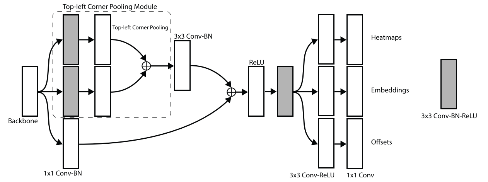
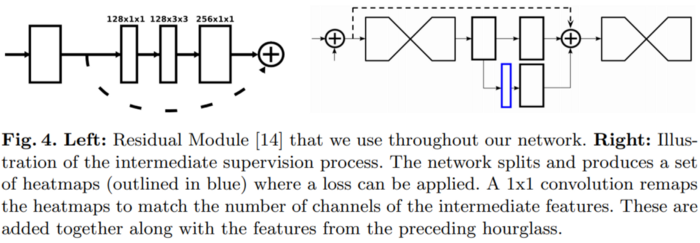
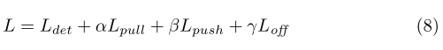

# CornerNet: Detecting Objects as Paired Keypoints (2018)

Original Paper: [CornerNet: Detecting Objects as Paired Keypoints](https://arxiv.org/abs/1808.01244)

# Overview

In CornerNet, we detect an object as a pair of keypoints — the top-left corner and bottom-right corner of the bounding box. We use a single convolutional network to predict:

- Two sets of heatmaps to represent the locations of corners of different object categories, one set for the top-left corners and the other for the bottom-right corners.
- An embedding vector for each detected corner such that the distance between the embeddings of two corners from the same object is small.
- Offsets to slightly adjust the locations of the corners to produce tighter bounding boxes.

With the predicted heatmaps, embeddings, and offsets, a simple post-processing algorithm is applied to obtain the final bounding boxes.

**Fig. 1** Details of Corners

**Fig. 4** Overview of CornerNet

## Eliminate anchor boxes

By detecting objects as paired keypoints, there is no need to design a set of anchor boxes commonly used in prior single-stage detectors. There are some drawbacks of using anchor boxes:

- Typically a very large set of anchor boxes are required to ensure sufficient overlap with ground truth boxes. However, since only a tiny portion of anchor boxes will overlap with ground truth boxes, it creates a huge imbalance between positive and negative anchor boxes and slows down training.
- The use of anchor boxes introduces many hyperparameters and design choices, including how many boxes, what sizes, and what aspect ratios. So far those choices are largely made via ad-hoc heuristics.

## Corner pooling

Usually, there is no local evidence to determine the location of a bounding box corner because it is often outside the object (**Fig. 2**). Instead, we need to look horizontally towards the right for the topmost boundary and look vertically towards the bottom for the leftmost boundary of an object.

**Fig. 2** Often there is no local evidence to determine the location of a bounding box corner.

This observation motivates the introduction of corner pooling: it takes in two feature maps; at each pixel location, it max-pools all feature vectors to the right from the first feature map, max-pools all feature vectors directly below from the second feature map, and then adds the two pooled results together (**Fig. 3**).

**Fig. 3** Corner pooling: for each channel, we take the maximum values (red dots) in two directions (red lines), each from a separate feature map, and add the two maximums together (blue dot).

## Why detecting corners would work better than bounding box centers or proposals?

- The center of a box can be harder to localize because it depends on all 4 sides of the object, whereas locating a corner depends on 2 sides and is thus easier, and even more so with corner pooling, which encodes some explicit prior knowledge about the definition of corners.
- Corners provide a more efficient way of densely discretizing the space of boxes: we just need `O(wh)` corners to represent `O(w²h²)` possible anchor boxes.

## Hourglass network (2016) as the backbone

CornerNet uses the hourglass network as its backbone network. The network is followed by two prediction modules. One module is for the top-left corners, while the other one is for the bottom-right corners. Each module has its own corner pooling module to pool features from the hourglass network before predicting the heatmaps, embeddings, and offsets.

Unlike many other object detectors, we do not use features from different scales to detect objects of different sizes. We only apply both modules to the output of the hourglass network.

# Detecting Corners: heatmaps and offsets

## Category-specific corner heatmaps

We predict two sets of heatmaps, one for top-left corners and one for bottom-right corners. Each set of heatmaps is of size `H × W` and has `C` channels, where `C` is the number of categories. Each channel is a binary mask indicating the locations of the corners for a class. There is no background channel. For each corner, there is one ground-truth positive location, and all other locations are negative.

## Reducing Penalty to Negative Locations

**Fig. 5** “Ground-truth” heatmaps for training. Boxes (green dotted rectangles) whose corners are within the radius of the positive locations (orange circles) still have large overlaps with the ground-truth annotations (red solid rectangles).

During training, instead of equally penalizing negative locations, we reduce the penalty given to negative locations within a radius of the positive location. Because a pair of false corner detections can still produce a box that sufficiently overlaps the ground-truth box if they are close to their respective ground truth locations.

We determine the radius by the size of an object by ensuring that a pair of points within the radius would generate a bounding box with at least t (`t=0.3` in all experiments) IoU with the ground-truth annotation. Given the radius, the amount of penalty reduction is given by an unnormalized 2D Gaussian,

## Location offsets

Many networks involve downsampling layers to gather global information and to reduce memory usage. When they are applied to an image fully convolutionally, the size of the output is usually smaller than the image. Hence a location `(x, y)` in the image is mapped to the location shown below in the heatmaps, where `n` is the downsampling factor.

When we remap the locations from the heatmaps to the input image, some precision may be lost, which can greatly affect the IoU of small bounding boxes with their ground truths. To address this issue we predict location offsets to slightly adjust the corner locations before remapping them to the input resolution.

# Grouping Corners: embeddings

Multiple objects may appear in an image, and thus multiple top-left and bottom-right corners may be detected. We need to determine if a pair of the top-left corner and bottom-right corner is from the same bounding box. We apply the Associative Embedding method proposed by Newell et al. (2017) to our task.

## Associative Embedding

The network predicts an embedding vector for each detected corner such that the distance between the embeddings of two corners from the same object is small. Thus we can group the corners based on the distances between the embeddings of the top-left and bottom-right corners.

# Corner Pooling

# The prediction modules

- The first part of the module is a modified version of the residual block. In this modified residual block, we first process the features from the backbone network by two `3 × 3` Conv-BN-ReLU modules with 128 channels and then apply a corner pooling layer.
- Following the design of a residual block, we then feed the pooled features into a `3 × 3` Conv-BN layer with 256 channels and add back the projection shortcut.
- The modified residual block is followed by a `3 × 3` Conv-BN-ReLU module with 256 channels, and 3 Conv-ReLU-Conv layers to produce the heatmaps, embeddings, and offsets.

# Hourglass Network

CornerNet uses the hourglass network as its backbone network. The hourglass network was first introduced for the human pose estimation task. It is a fully convolutional neural network that consists of one or more hourglass modules.

**Fig. 3.** (Newell et al., 2016) An illustration of a single “hourglass” module.

An hourglass module first downsamples the input features by a series of convolution and max-pooling layers. It then upsamples the features back to the original resolution by a series of upsampling and convolution layers. Since details are lost in the max-pooling layers, skip layers are added to bring back the details to the upsampled features.

**Fig. 1.** (Newell et al., 2016) Multiple stacked hourglass modules

The hourglass module captures both global and local features in a single unified structure. When multiple hourglass modules are stacked in the network, the hourglass modules can reprocess the features to capture a higher level of information. These properties make the hourglass network an ideal choice for object detection as well.

**Fig. 4.** (Newell et al., 2016)

Our hourglass network consists of **two hourglasses**, and we make some modifications to the architecture of the hourglass module.

- Instead of using max pooling, we simply use stride 2 to reduce feature resolution.
- We reduce feature resolutions 5 times and increase the number of feature channels along the way `(256, 384, 384, 384, 512)`.
- When we upsample the features, we apply 2 residual modules followed by a nearest neighbor upsampling.
- Every skip connection also consists of 2 residual modules. There are 4 residual modules with 512 channels in the middle of an hourglass module.
- Before the hourglass modules, we reduce the image resolution by 4 times using a `7 × 7` convolution module with stride 2 and 128 channels followed by a residual block with stride 2 and 256 channels.

Following (Newell et al., 2016), we also add intermediate supervision in training. However, we do not add back the intermediate predictions to the network as we find that this hurts the performance of the network.

We apply a `1 × 1` Conv-BN module to both the input and output of the first hourglass module. We then merge them by element-wise addition followed by a ReLU and a residual block with 256 channels, which is then used as the input to the second hourglass module. The depth of the hourglass network is 104.

Unlike many other state-of-the-art detectors, we only use the features from the last layer of the whole network to make predictions.

# Training Details

- As we apply focal loss, we follow (Lin et al., 2017) to set the biases in the convolution layers that predict the corner heatmaps.
- During training, we set the input resolution of the network to `511 × 511`, which leads to an output resolution of `128 × 128`.
- To reduce overfitting, we adopt standard data augmentation techniques as well as PCA to the input image.

We use Adam to optimize the full training loss:

where `α`, `β`, and `γ` are the weights for the pull, push and offset loss respectively. We set both `α` and `β` to 0.1 and γ to 1. We find that 1 or larger values of `α` and `β` lead to poor performance.

# Testing Details

During testing, we use a simple post-processing algorithm to generate bounding boxes from the heatmaps, embeddings, and offsets.

- We first apply non-maximal suppression (NMS) by using a `3 × 3` max-pooling layer on the corner heatmaps.
- Then we pick the top 100 top-left and top 100 bottom-right corners from the heatmaps. The corner locations are adjusted by the corresponding offsets.
- We calculate the L1 distances between the embeddings of the top-left and bottom-right corners. Pairs that have distances greater than 0.5 or contain corners from different categories are rejected.
- The average scores of the top-left and bottom-right corners are used as the detection scores.

Instead of resizing an image to a fixed size, we maintain the original resolution of the image and pad it with zeros before feeding it to CornerNet. **Both the original and flipped images are used for testing.**

We combine the detections from the original and flipped images, and apply soft-nms (Bodla et al., 2017) to suppress redundant detections. Only the top 100 detections are reported.

# Ablation Study

- **Corner pooling is a key component of CornerNet**, especially for medium and large objects. This is expected because the topmost, bottommost, leftmost, rightmost boundaries of medium and large objects are likely to be further away from the corner locations.

**Fig. 8** Qualitative examples showing corner pooling helps better localize the corners.

- Corner pooling pools over different area sizes in different quadrants of an image. For example, the top-left corner pooling pools over larger areas both horizontally and vertically in the upper-left quadrant of an image, compared to the lower-right quadrant. Therefore, the location of a corner may affect the stability of the corner pooling. We evaluate the performance of our network on detecting both the top-left and bottom-right corners in different quadrants of an image. It’s suggested that corner pooling gives similar improvement to corners at different quadrants, show that **corner pooling is effective and stable over both small and large areas.**
- **Reducing the penalty given to negative locations** around a positive location, within a radius determined by the size of the object helps train CornerNet. It especially benefits medium and large objects.
- The choice of the backbone network is important and **the hourglass network is crucial to the performance of CornerNet.** Since the hourglass network is not commonly used in other state-of-the-art detectors, we perform an experiment to study the contribution of the hourglass network in CornerNet.

# Error Analysis

CornerNet simultaneously outputs heatmaps, offsets, and embeddings, all of which affect detection performance. To understand how each part contributes to the final error, we perform an error analysis by replacing the predicted heatmaps and offsets with the ground-truth values and evaluating performance on the validation set.

**Tab. 6** suggests that although there is still ample room for improvement in both detecting and grouping corners, the main bottleneck is detecting corners. **Fig. 9** shows some qualitative examples where the corner locations or embeddings are incorrect.

