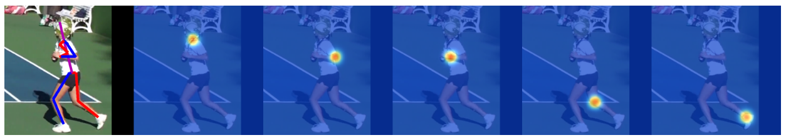
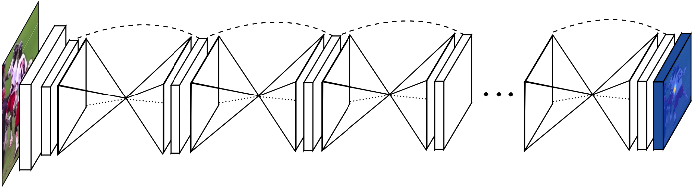
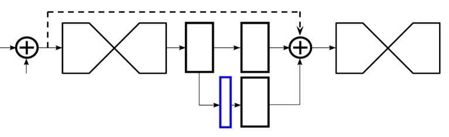
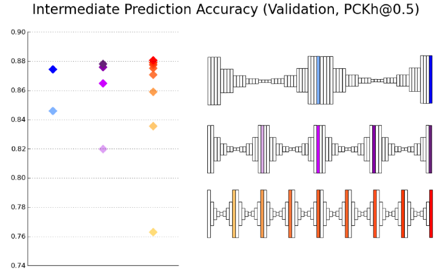
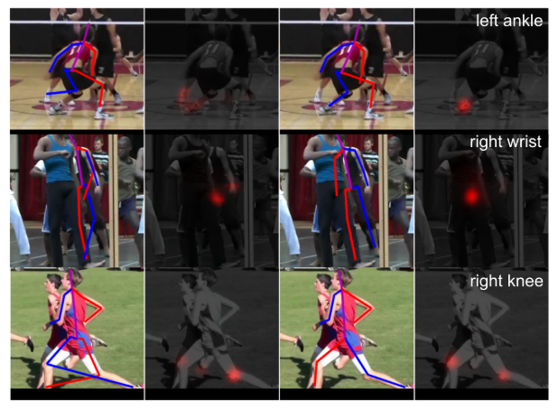

# Stacked Hourglass Networks for Human Pose Estimation (2016)

Original Paper: [Stacked Hourglass Networks for Human Pose Estimation](https://arxiv.org/abs/1603.06937)

This paper is an important reference for CornerNet, CenterNet, and CornerNet-Lite because the Hourglass network is used as the backbone network in all those three methods.

## Overview

We introduce a novel “stacked hourglass” network design for predicting human pose. The network captures and consolidates information across all scales of the image. Like many convolutional approaches that produce pixel-wise outputs, **the hourglass network pools down to a very low resolution, then upsamples and combines features across multiple resolutions.** On the other hand, the hourglass differs from prior designs primarily in its more symmetric topology.

We expand on a single hourglass by consecutively placing multiple hourglass modules together end-to-end. **This allows for repeated bottom-up, top-down inference across scales.** In conjunction with the use of intermediate supervision, the repeated bidirectional inference is critical to the networks' final performance.

## Hourglass Design

The design of the hourglass is motivated by the need to capture information at every scale. While local evidence is essential for identifying features like faces and hands, a final pose estimate requires a coherent understanding of the full body. The person’s orientation, the arrangement of their limbs, and the relationships of adjacent joints are among the many cues that are best recognized at different scales in the image.

**Fig. 2.** Example output produced by our network.

The network must have some mechanism to effectively process and consolidate features across scales. Some approaches tackle this with the use of separate pipelines that process the image independently at multiple resolutions and combine features later on in the network. Instead, we choose to use a single pipeline with skip layers to preserve spatial information at each resolution. The hourglass is set up as follows:

- Convolutional and max-pooling layers are used to process features down to a very low resolution.
- At each max-pooling step, the network branches off and applies more convolutions at the original pre-pooled resolution.
- After reaching the lowest resolution, the network begins the top-down sequence of up-sampling and the combination of features across scales.

To bring together information across two adjacent resolutions, we do nearest neighbor up-sampling of the lower resolution followed by an element-wise addition of the two sets of features. The topology of the hourglass is symmetric, so for every layer present on the way down there is a corresponding layer going up.

**Fig. 3.** An illustration of a single “hourglass” module. Each box in the figure corresponds to a residual module as seen in **Figure 4.** The number of features is consistent across the whole hourglass.

**Fig. 4.** Residual Module that we use throughout our network.

After reaching the output resolution of the network, two consecutive rounds of `1 x 1` convolutions are applied to produce the final network predictions. The output of the network is a set of heat maps where for a given heat map the network predicts the probability of a joint's presence at each and every pixel.

## Layer Implementation

While maintaining the overall hourglass shape, there is still some flexibility in the specific implementation of layers. We explore several options for layer design in our network and experienced an increase in network performance after switching from standard convolutional layers with large filters and no reduction steps to newer methods like the **residual learning modules and “Inception”-based designs**. Our final design makes extensive use of residual modules. Filters greater than `3 × 3` are never used, and the bottlenecking restricts the total number of parameters at each layer curtailing total memory usage.

Operating at the full input resolution of `256 × 256` requires a significant amount of GPU memory, so the highest resolution of the hourglass (and thus the final output resolution) is `64 × 64`. This does not affect the networks' ability to produce precise joint predictions. The full network starts with a `7 × 7` convolutional layer with `stride 2`, followed by a residual module and a round of max-pooling to bring the resolution down from `256` to `64`. Two subsequent residual modules precede the hourglass shown in **Figure 3**. Across the entire hourglass, all residual modules output `256` features.

## Stacked Hourglass with Intermediate Supervision

**Fig. 1.** Our network for pose estimation consists of multiple stacked hourglass modules which allow for repeated bottom-up, top-down inference.

We take our network architecture further by stacking multiple hourglasses end-to-end, feeding the output of one as input into the next. **The key to this approach is the prediction of intermediate heatmaps upon which we can apply a loss.** Predictions are generated after passing through each hourglass where the network has had an opportunity to process features at both local and global contexts. Subsequent hourglass modules allow these high-level features to be processed again to further evaluate and reassess higher-order spatial relationships. This is similar to other pose estimations methods that have demonstrated strong performance with multiple iterative stages and intermediate supervision.

**Fig. 4.** Illustration of the intermediate supervision process.

The network splits and produces a set of heatmaps (outlined in blue) where a loss can be applied. A `1 × 1` convolution remaps the heatmaps to match the number of channels of the intermediate features. These are added together along with the features from the preceding hourglass. The resulting output serves directly as the input for the following hourglass module which generates another set of predictions.

In the final network design, **eight hourglasses** are used. It is important to note that weights are not shared across hourglass modules, and a loss is applied to the predictions of all hourglasses using the same ground truth.

## Ablation Experiments

**Fig. 9.** Validation accuracy at intermediate stages of the network compared across different stacking arrangements

We compare the validation accuracy of `2-`, `4-`, and `8-` stack models that share approximately the same number of parameters, and include the accuracy of their intermediate predictions. There is a modest improvement in the final performance for each successive increase in stacking from 87.4% to 87.8% to 88.1%. The effect is more notable at intermediate stages. For example, halfway through each network, the corresponding accuracies of the intermediate predictions are 84.6%, 86.5%, and 87.1%. Note that the accuracy halfway through the 8-stack network is just short of the final accuracy of the 2-stack network.

**Fig. 9.** Example validation images illustrating the change in predictions from an intermediate stage (second hourglass) (left) to final predictions (eighth hourglass) (right).

It is interesting to observe the mistakes made early and corrected later on by the network. Common mistakes show up like a mix-up of other peoples' joints or mis-attribution of left and right.

- For the running figure, it is apparent from the final heatmap that the decision between left and right is still a bit ambiguous for the network. Given the appearance of the image, the confusion is justified.
- One case worth noting is the middle example where the network initially activates on the visible wrists in the image. Upon further processing the heatmap does not activate at all on the original locations, instead choosing a reasonable position for the occluded wrist.