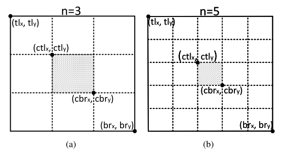

# CenterNet

## Input

```python
def kp_detection(db, nnet, result_dir, debug=False, decode_func=kp_decode):
    top_bboxes = {}
    for ind in tqdm(range(0, num_images), ncols=80, desc="locating kps"):
        db_ind = db_inds[ind]

        image_id = db.image_ids(db_ind)
        image_file = db.image_file(db_ind)
        image = cv2.imread(image_file)

        height, width = image.shape[0:2]

        detections = []
        center_points = []
```

## Multi-scale inference

```python
# multi-scale: scales: [0.6, 1, 1.2, 1.5, 1.8]
for scale in scales:
    new_height = int(height * scale)
    new_width = int(width * scale)
    new_center = np.array([new_height // 2, new_width // 2])

    inp_height = new_height | 127
    inp_width = new_width | 127

    images = np.zeros((1, 3, inp_height, inp_width), dtype=np.float32)
    ratios = np.zeros((1, 2), dtype=np.float32)
    borders = np.zeros((1, 4), dtype=np.float32)
    sizes = np.zeros((1, 2), dtype=np.float32)
	
    out_height = (inp_height + 1) // 4
    out_width = (inp_width + 1) // 4
    height_ratio = out_height / inp_height
    width_ratio = out_width / inp_width

    resized_image = cv2.resize(image, (new_width, new_height))
    resized_image, border, offset = crop_image(
        resized_image, new_center, [inp_height, inp_width]
    )
    resized_image = resized_image / 255.
    normalize_(resized_image, db.mean, db.std)

    images[0] = resized_image.transpose((2, 0, 1))
    borders[0] = border
    sizes[0] = [int(height * scale), int(width * scale)]
    ratios[0] = [height_ratio, width_ratio]
    
    # also test flip
    images = np.concatenate((images, images[:, :, :, ::-1]), axis=0)
    images = torch.from_numpy(images)
    
    # extra: center
    dets, center = decode_func(
        nnet, 
        images, 
        K, 
        ae_threshold=ae_threshold, 
        kernel=nms_kernel
    )
    dets = dets.reshape(2, -1, 8)
    center = center.reshape(2, -1, 4)
    
    # adjust for flip 
    dets[1, :, [0, 2]] = out_width - dets[1, :, [2, 0]]
    center[1, :, [0]] = out_width - center[1, :, [0]]
    
    dets = dets.reshape(1, -1, 8)
    center = center.reshape(1, -1, 4)

    rescale_dets_(dets, ratios, borders, sizes)
    dets[:, :, 0:4] /= scale
    detections.append(dets)
    
    # adjust center points
    center[..., [0]] /= ratios[:, 1][:, None, None]
    center[..., [1]] /= ratios[:, 0][:, None, None]
    center[..., [0]] -= borders[:, 2][:, None, None]
    center[..., [1]] -= borders[:, 0][:, None, None]
    np.clip(
        center[..., [0]], 0, sizes[:, 1][:, None, None], out=center[..., [0]]
    )
    np.clip(
        center[..., [1]], 0, sizes[:, 0][:, None, None], out=center[..., [1]]
    )
    center[:, :, 0:2] /= scale
	# only use center points when scale = 1
    if scale == 1:
        center_points.append(center)
```

## Post-processing



**Figure 3:** (a) The central region when n = 3. (b) The central region when n = 5. The solid rectangles denote the predicted bounding boxes and the shaded regions denote the central regions. In this paper, n is set to be 3 and 5 for the scales of bounding boxes less and greater than 150, respectively.

### Input

```python
detections = np.concatenate(detections, axis=1)
# extra: center points
center_points = np.concatenate(center_points, axis=1)

classes = detections[..., -1]
classes = classes[0]
detections = detections[0]
center_points = center_points[0]

# get valid detections
valid_ind = detections[:, 4] > -1
valid_detections = detections[valid_ind]
box_width = valid_detections[:, 2] - valid_detections[:, 0]
box_height = valid_detections[:, 3] - valid_detections[:, 1]

# small objects and large objects
s_ind = box_width * box_height <= 22500
l_ind = box_width * box_height > 22500
s_detections = valid_detections[s_ind]
l_detections = valid_detections[l_ind]
```

To effectively filter out the incorrect bounding boxes, we leverage the detected center keypoints and resort to the following procedure: 

- (1) select top-k center keypoints according to their scores; 
- (2) use the corresponding offsets to remap these center keypoints to the input image; 
- (3) define a central region for each bounding box and check if the central region contains center keypoints. Note that the class labels of the checked center keypoints should be same as that of the bounding box; 
- (4) if a center keypoint is detected in the central region, we will preserve the bounding box. The score of the bounding box will be replaced by the average scores of the three points. If there are no center keypoints detected in its central region, the bounding box will be removed.

### Small objects

```python
# obtain central region
# (brx - tlx) / 3 + tlx = (brx - tlx + 3 * tlx) / 3
s_left_x = (2 * s_detections[:, 0] + s_detections[:, 2]) / 3
s_right_x = (s_detections[:, 0] + 2 * s_detections[:, 2]) / 3
s_top_y = (2 * s_detections[:, 1] + s_detections[:, 3]) / 3
s_bottom_y = (s_detections[:, 1] + 2 * s_detections[:, 3]) / 3
s_temp_score = copy.copy(s_detections[:, 4])
s_detections[:, 4] = -1

center_x = center_points[:, 0][:, np.newaxis]
center_y = center_points[:, 1][:, np.newaxis]
s_left_x = s_left_x[np.newaxis, :]
s_right_x = s_right_x[np.newaxis, :]
s_top_y = s_top_y[np.newaxis, :]
s_bottom_y = s_bottom_y[np.newaxis, :]

# center points exist
ind_lx = (center_x - s_left_x) > 0
ind_rx = (center_x - s_right_x) < 0
ind_ty = (center_y - s_top_y) > 0
ind_by = (center_y - s_bottom_y) < 0
# center points with same class
ind_cls = (
    center_points[:, 2][:, np.newaxis] - s_detections[:, -1][np.newaxis, :]
) == 0
# any center point satisfy the criterias
ind_s_new_score = (
    np.max(
        (
            (ind_lx + 0)
            & (ind_rx + 0)
            & (ind_ty + 0)
            & (ind_by + 0)
            & (ind_cls + 0)
        ),
        axis=0,
    )
    == 1
)
index_s_new_score = np.argmax(
    ((ind_lx + 0) & (ind_rx + 0) & (ind_ty + 0) & (ind_by + 0) & (ind_cls + 0))[
        :, ind_s_new_score
    ],
    axis=0,
)
# new score is the average of three points
s_detections[:, 4][ind_s_new_score] = (
    s_temp_score[ind_s_new_score] * 2 + center_points[index_s_new_score, 3]
) / 3
```

### Large objects

Similar as small objects.

```python
l_left_x = (3 * l_detections[:, 0] + 2 * l_detections[:, 2]) / 5
l_right_x = (2 * l_detections[:, 0] + 3 * l_detections[:, 2]) / 5
l_top_y = (3 * l_detections[:, 1] + 2 * l_detections[:, 3]) / 5
l_bottom_y = (2 * l_detections[:, 1] + 3 * l_detections[:, 3]) / 5
l_temp_score = copy.copy(l_detections[:, 4])
l_detections[:, 4] = -1

center_x = center_points[:, 0][:, np.newaxis]
center_y = center_points[:, 1][:, np.newaxis]
l_left_x = l_left_x[np.newaxis, :]
l_right_x = l_right_x[np.newaxis, :]
l_top_y = l_top_y[np.newaxis, :]
l_bottom_y = l_bottom_y[np.newaxis, :]

ind_lx = (center_x - l_left_x) > 0
ind_rx = (center_x - l_right_x) < 0
ind_ty = (center_y - l_top_y) > 0
ind_by = (center_y - l_bottom_y) < 0
ind_cls = (
    center_points[:, 2][:, np.newaxis] - l_detections[:, -1][np.newaxis, :]
) == 0
ind_l_new_score = (
    np.max(
        (
            (ind_lx + 0)
            & (ind_rx + 0)
            & (ind_ty + 0)
            & (ind_by + 0)
            & (ind_cls + 0)
        ),
        axis=0,
    )
    == 1
)
index_l_new_score = np.argmax(
    ((ind_lx + 0) & (ind_rx + 0) & (ind_ty + 0) & (ind_by + 0) & (ind_cls + 0))[
        :, ind_l_new_score
    ],
    axis=0,
)
l_detections[:, 4][ind_l_new_score] = (
    l_temp_score[ind_l_new_score] * 2 + center_points[index_l_new_score, 3]
) / 3
```

## Get detections for each category

```python
detections = np.concatenate([l_detections, s_detections], axis=0)
detections = detections[np.argsort(-detections[:, 4])]
classes = detections[..., -1]

keep_inds = detections[:, 4] > -1
detections = detections[keep_inds]
classes = classes[keep_inds]

top_bboxes[image_id] = {}
for j in range(categories):
    keep_inds = classes == j
    top_bboxes[image_id][j + 1] = detections[keep_inds][:, 0:7].astype(
        np.float32
    )
    if merge_bbox:
        soft_nms_merge(
            top_bboxes[image_id][j + 1],
            Nt=nms_threshold,
            method=nms_algorithm,
            weight_exp=weight_exp,
        )
    else:
        soft_nms(
            top_bboxes[image_id][j + 1], Nt=nms_threshold, method=nms_algorithm
        )
    top_bboxes[image_id][j + 1] = top_bboxes[image_id][j + 1][:, 0:5]

scores = np.hstack(
    [top_bboxes[image_id][j][:, -1] for j in range(1, categories + 1)]
)
if len(scores) > max_per_image:
    kth = len(scores) - max_per_image
    thresh = np.partition(scores, kth)[kth]
    for j in range(1, categories + 1):
        keep_inds = top_bboxes[image_id][j][:, -1] >= thresh
        top_bboxes[image_id][j] = top_bboxes[image_id][j][keep_inds]

# final return
return top_bboxes
```

## Decode detections

```python
def kp_decode(nnet, images, K, ae_threshold=0.5, kernel=3):
    # extra: center
    detections, center = nnet.test(
        [images], 
        ae_threshold=ae_threshold, 
        K=K, 
        kernel=kernel
    )
    detections = detections.data.cpu().numpy()
    center = center.data.cpu().numpy()
    return detections, center
```

## _decode

```python
def _decode(
    tl_heat, br_heat, 
    tl_tag, br_tag, 
    tl_regr, br_regr,
    # extra: center points
    ct_heat, ct_regr, 
    K=100, kernel=1, 
    ae_threshold=1, num_dets=1000
):
    batch, cat, height, width = tl_heat.size()

    tl_heat = torch.sigmoid(tl_heat)
    br_heat = torch.sigmoid(br_heat)
    ct_heat = torch.sigmoid(ct_heat)

    # perform nms on heatmaps
    tl_heat = _nms(tl_heat, kernel=kernel)
    br_heat = _nms(br_heat, kernel=kernel)
    ct_heat = _nms(ct_heat, kernel=kernel)
	
    # get top points
    tl_scores, tl_inds, tl_clses, tl_ys, tl_xs = _topk(tl_heat, K=K)
    br_scores, br_inds, br_clses, br_ys, br_xs = _topk(br_heat, K=K)
    ct_scores, ct_inds, ct_clses, ct_ys, ct_xs = _topk(ct_heat, K=K)

    tl_ys = tl_ys.view(batch, K, 1).expand(batch, K, K)
    tl_xs = tl_xs.view(batch, K, 1).expand(batch, K, K)
    br_ys = br_ys.view(batch, 1, K).expand(batch, K, K)
    br_xs = br_xs.view(batch, 1, K).expand(batch, K, K)
    ct_ys = ct_ys.view(batch, 1, K).expand(batch, K, K)
    ct_xs = ct_xs.view(batch, 1, K).expand(batch, K, K)
	
    # offsets
    if tl_regr is not None and br_regr is not None:
        tl_regr = _tranpose_and_gather_feat(tl_regr, tl_inds)
        tl_regr = tl_regr.view(batch, K, 1, 2)
        br_regr = _tranpose_and_gather_feat(br_regr, br_inds)
        br_regr = br_regr.view(batch, 1, K, 2)
        ct_regr = _tranpose_and_gather_feat(ct_regr, ct_inds)
        ct_regr = ct_regr.view(batch, 1, K, 2)

        tl_xs = tl_xs + tl_regr[..., 0]
        tl_ys = tl_ys + tl_regr[..., 1]
        br_xs = br_xs + br_regr[..., 0]
        br_ys = br_ys + br_regr[..., 1]
        ct_xs = ct_xs + ct_regr[..., 0]
        ct_ys = ct_ys + ct_regr[..., 1]

    # all possible boxes based on top k corners (ignoring class)
    bboxes = torch.stack((tl_xs, tl_ys, br_xs, br_ys), dim=3)

    tl_tag = _tranpose_and_gather_feat(tl_tag, tl_inds)
    tl_tag = tl_tag.view(batch, K, 1)
    br_tag = _tranpose_and_gather_feat(br_tag, br_inds)
    br_tag = br_tag.view(batch, 1, K)
    dists  = torch.abs(tl_tag - br_tag)

    tl_scores = tl_scores.view(batch, K, 1).expand(batch, K, K)
    br_scores = br_scores.view(batch, 1, K).expand(batch, K, K)
    scores    = (tl_scores + br_scores) / 2

    # reject boxes based on classes
    tl_clses = tl_clses.view(batch, K, 1).expand(batch, K, K)
    br_clses = br_clses.view(batch, 1, K).expand(batch, K, K)
    cls_inds = (tl_clses != br_clses)

    # reject boxes based on distances
    dist_inds = (dists > ae_threshold)

    # reject boxes based on widths and heights
    width_inds  = (br_xs < tl_xs)
    height_inds = (br_ys < tl_ys)

    # reject boxes
    scores[cls_inds]    = -1
    scores[dist_inds]   = -1
    scores[width_inds]  = -1
    scores[height_inds] = -1
	
    # get top keypoints based on tl + br scores
    scores = scores.view(batch, -1)
    scores, inds = torch.topk(scores, num_dets)
    scores = scores.unsqueeze(2)

    bboxes = bboxes.view(batch, -1, 4)
    bboxes = _gather_feat(bboxes, inds)
    
    clses  = tl_clses.contiguous().view(batch, -1, 1)
    clses  = _gather_feat(clses, inds).float()

    tl_scores = tl_scores.contiguous().view(batch, -1, 1)
    tl_scores = _gather_feat(tl_scores, inds).float()
    br_scores = br_scores.contiguous().view(batch, -1, 1)
    br_scores = _gather_feat(br_scores, inds).float()

    ct_xs = ct_xs[:,0,:]
    ct_ys = ct_ys[:,0,:]
    
    center = torch.cat([
        ct_xs.unsqueeze(2), 
        ct_ys.unsqueeze(2), 
        ct_clses.float().unsqueeze(2), 
        ct_scores.unsqueeze(2)], 
        dim=2
    )
    detections = torch.cat([bboxes, scores, tl_scores, br_scores, clses], dim=2)
    
    # detections are processed the same as in CornerNet
    # center only used in post-processing
    return detections, center
```
