# Object Detection in 20 Years: A Survey (Part 1: Traditional Detectors)

**Original Paper:** [Object Detection in 20 Years: A Survey](https://arxiv.org/abs/1905.05055)

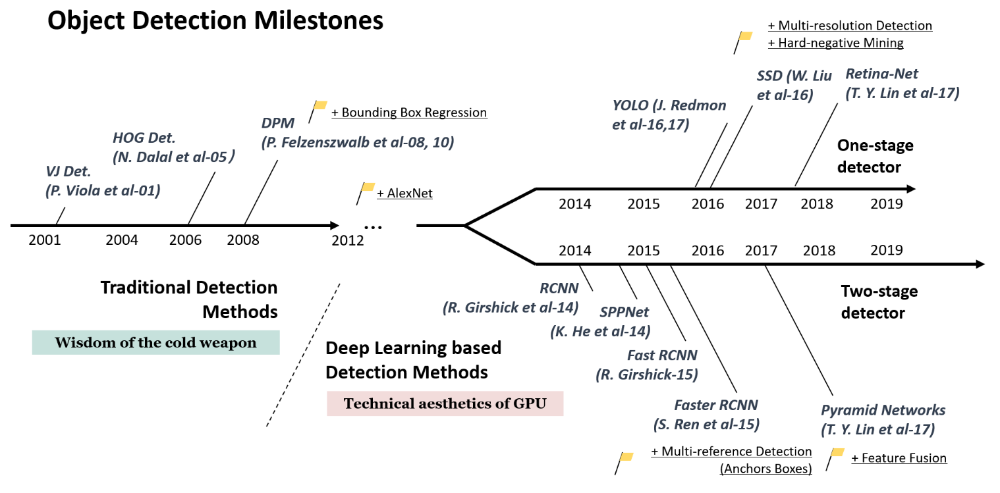

# Milestones: Traditional Detectors

Most of the early object detection algorithms were built based on **handcrafted features**. Due to the lack of effective image representation at that time, people have no choice but to design sophisticated feature representations, and a variety of speed-up skills to exhaust the usage of limited computing resources.

# Viola Jones Detectors (2001)

**Original paper:** [*Rapid Object Detection using a Boosted Cascade of Simple Features*](https://www.cs.cmu.edu/~efros/courses/LBMV07/Papers/viola-cvpr-01.pdf)

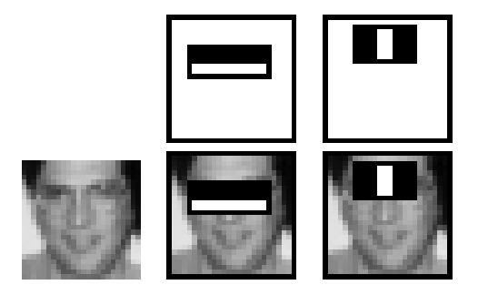

**Figure 3:** The first and second features selected by AdaBoost.

18 years ago (this paper was published in 2019), P. Viola and M. Jones achieved real-time detection of human faces for the first time without any constraints (e.g., skin color segmentation).

The VJ detector follows a most straightforward way of detection, i.e., **sliding windows**: to go through **all possible locations and scales** in an image to see if any window contains a human face. Although it seems to be a very simple process, the calculation behind it was far beyond the computer’s power of its time. The VJ detector has dramatically improved its detection speed by incorporating three important techniques:

## **Integral image**

The integral image is a computational method to speed up box filtering or convolution process. The **Haar wavelet** is used in VJ detector as the feature representation of an image.

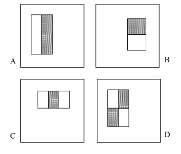

**Figure 1:** Example rectangle features shown relative to the enclosing detection window.

The integral image makes the computational complexity of each window in VJ detector independent of its window size.

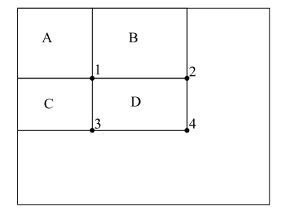

**Figure 2:** The sum of the pixels within rectangle D can be computed with four array references.

The value of the integral image at location **1** is the sum of the pixels in rectangle **A**. The value at location **2** is **A+B**, at location **3** is **A+C** and at location **4** is **A+B+C+D**. Then the sum within **D** can be computed as **4+1-(2+3)**.

## Feature selection

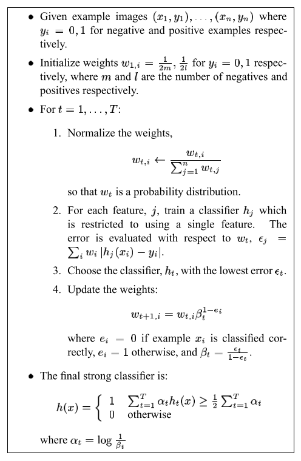

**Table 1:** The AdaBoost algorithm for classifier learning.

Instead of using a set of manually selected Haar basis filters, the authors used **Adaboost algorithm** to select a small set of features that are most helpful for face detection from a huge set of random features pool (about 180k-dimensional). Each round of boosting selects one feature from the 180,000 potential features.

**Question: what exactly is the 180k-dimensional features pool?**

[Viola-Jones' face detection claims 180k features](https://stackoverflow.com/questions/1707620/viola-jones-face-detection-claims-180k-features)

The original paper claims that “Given that the base resolution of the detector is `24 x 24`, the exhaustive set of rectangle features is quite large, over `180,000`.” Thus I think the `“180k”` is from here. But how to calculate the exact number? It actually depends on the total number of features. If we follow the convention [suggested in OpenCV](https://docs.opencv.org/master/db/d28/tutorial_cascade_classifier.html) to use `5 features` shown below:

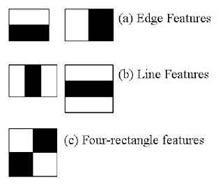

The total size of the features pool can be calculated as shown below. Thus, the size of the set of rectangle features is `160k` when using `5 features`, and `180k` when using `6 features`.

```python
# reference: https://stackoverflow.com/questions/1707620/viola-jones-face-detection-claims-180k-features
# calculate total number of features
count = 0
frame_size = 24

# five different features
features = [(2, 1), (1, 2), (3, 1), (1, 3), (2, 2)]
# six features
# features = [(2, 1), (1, 2), (3, 1), (1, 3), (2, 2), (2, 2)]
num_feats = len(features)

# loop through each features
for (size_x, size_y) in features:
    # loop through all possible starting position (x, y)
    for x in range(frame_size - size_x + 1):
        for y in range(frame_size - size_y + 1):
            # loop through all possible window (w, h)
            for w in range(size_x, frame_size - x + 1, size_x):
                for h in range(size_y, frame_size - y + 1, size_y):
                    count += 1
# count = 162336
# six feature: count = 183072
```

## Detection cascades

A multi-stage detection paradigm was introduced in VJ detector to reduce its computational overhead by spending less computation on background windows but more on face targets.

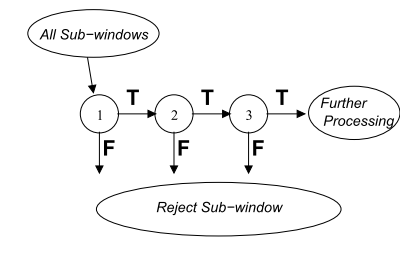

**Figure 4:** Schematic depiction of the detection cascade.

The overall form of the detection process is that of a degenerate decision tree, what we call a “**cascade**”. A positive result from the first classifier triggers the evaluation of a second classifier which has also been adjusted to achieve very high detection rates. A positive result from the second classifier triggers the third classifier, and so on. A negative outcome at any point leads to the immediate rejection of the sub-window. Stages in the cascade are constructed by training classifiers using AdaBoost and then adjusting the threshold to **minimize false negatives**.

The structure of the cascade reflects the fact that within any single image an overwhelming majority of sub-windows are negative. As such, the cascade attempts to reject as many negatives as possible at the earliest stage possible. While a positive instance will trigger the evaluation of every classifier in the cascade, this is an exceedingly rare event.

## Reference

[The Intuition Behind Facial Detection: The Viola-Jones Algorithm](https://towardsdatascience.com/the-intuition-behind-facial-detection-the-viola-jones-algorithm-29d9106b6999)

[OpenCV: Cascade Classifier](https://docs.opencv.org/master/db/d28/tutorial_cascade_classifier.html)

> For this they introduced the concept of **Cascade of Classifiers**. Instead of applying all 6000 features on a window, the features are grouped into different stages of classifiers and applied one-by-one. (Normally the first few stages will contain very many fewer features). If a window fails the first stage, discard it. We don't consider the remaining features on it. If it passes, apply the second stage of features and continue the process. The window which passes all stages is a face region. 
>
> The authors' detector had 6000+ features with 38 stages with 1, 10, 25, 25 and 50 features in the first five stages. According to the authors, on average 10 features out of 6000+ are evaluated per sub-window.

# HOG Detector (2005)

**Original paper:** [*Histograms of Oriented Gradients for Human Detection*](http://lear.inrialpes.fr/people/triggs/pubs/Dalal-cvpr05.pdf)

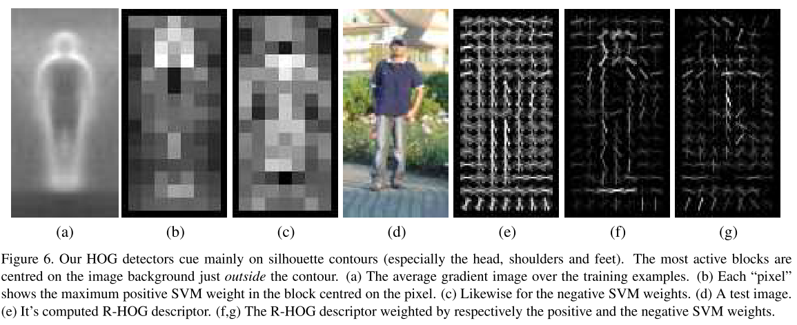

HOG can be considered as an important improvement of the **scale-invariant** feature transform and shape contexts of its time. To balance the feature invariance (including translation, scale, illumination, etc) and the nonlinearity (on discriminating different objects categories), the HOG descriptor is designed to be computed on a **dense grid** of uniformly spaced cells and use overlapping **local contrast normalization** for improving accuracy.

Although HOG can be used to detect a variety of object classes, it was motivated primarily by the problem of **pedestrian detection**. To detect objects of different sizes, the HOG detector **rescales the input image** multiple times while keeping the size of a detection window unchanged.

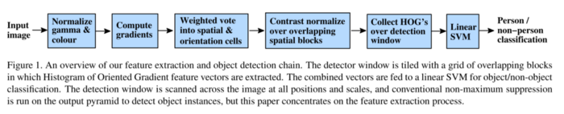

## Process of Calculating the Histogram of Oriented Gradients (HOG)

[Feature Engineering for Images: A Valuable Introduction to the HOG Feature Descriptor](https://www.analyticsvidhya.com/blog/2019/09/feature-engineering-images-introduction-hog-feature-descriptor/)

[Histogram of Oriented Gradients explained using OpenCV](https://learnopencv.com/histogram-of-oriented-gradients/)

### What is a Feature Descriptor?

A feature descriptor is a representation of an image or an image patch that simplifies the image by extracting useful information and throwing away extraneous information.

Typically, a feature descriptor converts an image of size `width x height x 3` (channels ) to a feature vector / array of length `n`. In the case of the HOG feature descriptor, the input image is of size `64 x 128 x 3` and the output feature vector is of length `3780`. The feature vector produced by these algorithms when fed into an image classification algorithms like Support Vector Machine (SVM) produce good results.

In the HOG feature descriptor, the distribution (histograms) of directions of gradients (oriented gradients) are used as features. Gradients (x and y derivatives) of an image are useful because the magnitude of gradients is large around edges and corners (regions of abrupt intensity changes) and we know that edges and corners pack in a lot more information about object shape than flat regions.

### Step 1: Preprocessing

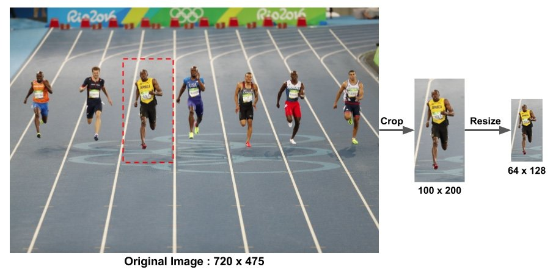

### Step 2: Calculate the Gradient Images

To calculate a HOG descriptor, we need to first calculate the horizontal and vertical gradients; after all, we want to calculate the histogram of gradients. Next, we find the magnitudes and directions of the gradients. 

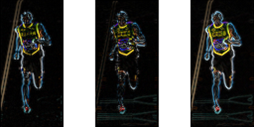

At every pixel, the gradient has a magnitude and a direction. For color images, the gradients of the three channels are evaluated ( as shown in the figure above ). The magnitude of gradient at a pixel is the maximum of the magnitude of gradients of the three channels, and the angle is the angle corresponding to the maximum gradient.

### Step 3: Calculate Histogram of Gradients in 8×8 cells

In this step, the image is divided into `8 × 8` cells and a histogram of gradients is calculated for each `8 × 8` cells. An `8 × 8` image patch contains `8 x 8 x 3 = 192` pixel values. The gradient of this patch contains 2 values (magnitude and direction) per pixel which adds up to `8 x 8 x 2 = 128` numbers. Then these 128 numbers are represented using a `9-bin` histogram which can be stored as an array of 9 numbers. The histogram is essentially a vector (or an array) of 9 bins (numbers) corresponding to angles 0, 20, 40, 60 … 160.

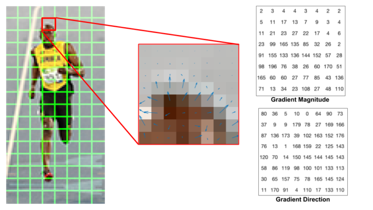

**Center:** The RGB patch and gradients represented using arrows. **Right:** The gradients in the same patch represented as numbers

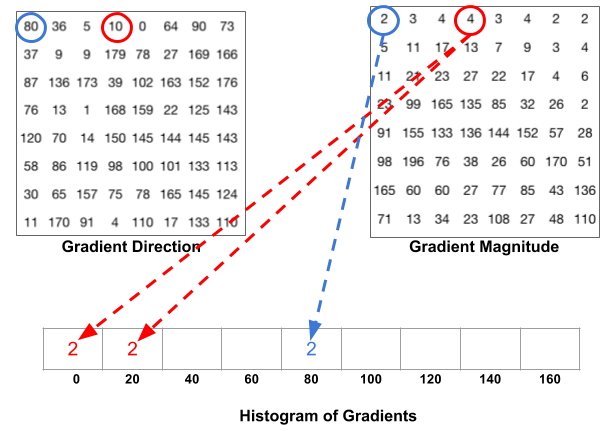

### Step 4: 16×16 Block Normalization

A `16 × 16` block has 4 histograms which can be concatenated to form a `36 x 1` element vector and it can be normalized by the length of this vector. The window is then moved by 8 pixels and a normalized `36 × 1` vector is calculated over this window and the process is repeated.

### Step 5: Calculate the Histogram of Oriented Gradients feature vector

To calculate the final feature vector for the entire image patch, the `36 × 1` vectors are concatenated into one giant vector. 

1. How many positions of the `16×16` blocks do we have? There are 7 horizontal (64) and 15 vertical positions (128) making a total of `7 x 15 = 105` positions.
2. Each `16 × 16` block is represented by a `36 × 1` vector. So when we concatenate them all into one giant vector we obtain a `36 × 105 = 3780` dimensional vector.

## HOG visualization

[How are HoG features represented graphically?](https://stackoverflow.com/questions/13198889/how-are-hog-features-represented-graphically)

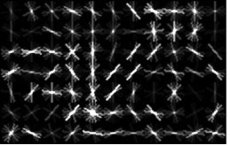

The descriptor is made up of `M x N` cells covering the image window in a grid. Each cell is represented by a histogram of edge orientations, where the number of discretized edge orientations is a parameter (usually 9). The cell histogram is visualized by a "star" showing the strength of the edge orientations in the histogram: the stronger a specific orientation, the longer it is relative to the others.

[Visualizing HOG feature, why the direction of gradient is perpendicular to the real gradient](https://stackoverflow.com/questions/42429598/visualizing-hog-feature-why-the-direction-of-gradient-is-perpendicular-to-the-r)

# Deformable Part-based Model (DPM) (2008)

**Original paper:** [*Object Detection with Discriminatively Trained Part Based Models*](https://cs.brown.edu/people/pfelzens/papers/lsvm-pami.pdf)

**Reference:** http://www.cse.psu.edu/~rtc12/CSE586/lectures/dpmlecture.pdf

DPM, as the winners of VOC-07, -08, and -09 detection challenges, was the peak of the traditional object detection methods. The DPM follows the detection philosophy of “**divide and conquer**”, where the training can be simply considered as the learning of a proper way of decomposing an object, and the inference can be considered as an ensemble of detections on different object parts. For example, the problem of detecting a “car” can be considered as the detection of its window, body, and wheels.

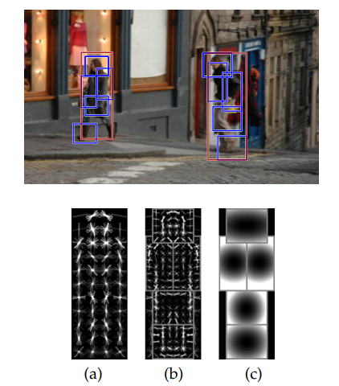

**Fig. 1.** Detections obtained with a single component person model. The model is defined by a coarse root filter (a), several higher resolution part filters (b) and a spatial model for the location of each part relative to the root (c). The filters specify weights for histogram of oriented gradients features. Their visualization show the positive weights at different orientations. The visualization of the spatial models reflects the “cost” of placing the center of a part at different locations relative to the root.

## Feature map and Filter

A feature map is an array whose entries are **d-dimensional feature vectors** computed from a dense grid of locations in an image. Intuitively each feature vector describes a local image patch. In practice we use a variation of the HOG features.

A filter is a rectangular template defined by an array of **d-dimensional weight vectors**. The response, or score, of a `filter F` at a position `(x, y)` in a feature map `G` is the “dot product” of the filter and a sub-window of the feature map with top-left corner at `(x, y)`

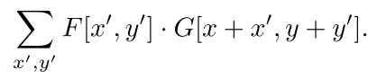

## HOG feature pyramid

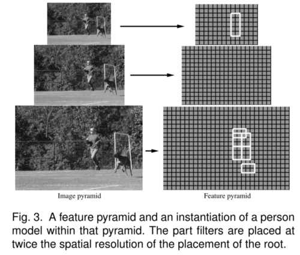

We would like to define a score at **different positions and scales** in an image. This is done using a feature pyramid, which specifies a feature map for a finite number of scales in a fixed range. In practice we compute feature pyramids by computing a standard image pyramid via repeated smoothing and sub-sampling, and then computing a feature map from each level of the image pyramid.

The scale sampling in a feature pyramid is determined by a parameter `λ`, which is the number of levels we need to go down in the pyramid to get to a feature map computed at twice the resolution of another one. In practice we have used `λ = 5` in training and `λ = 10` at test time. Fine sampling of scale space is important for obtaining high performance with our models.

Let `F` be a `w × h` filter. Let `H` be a feature pyramid and `p = (x, y, l)` specify a position `(x, y)` in the `l-th` level of the pyramid. Let `φ(H, p, w, h)` denote the vector obtained by concatenating the feature vectors in the `w × h` sub-window of `H` with top-left corner at `p` in row-major order. The score of `F` at `p` is `F’·φ(H, p, w, h)`, where `F’` is the vector obtained by concatenating the weight vectors in `F` in row-major order. Below we write `F’·φ(H, p)` since the sub-window dimensions are implicitly defined by the dimensions of the filter `F`.

## Deformable Part Models

Our star models are defined by a coarse root filter that approximately covers an entire object (it defines a detection window) and higher resolution part filters (`λ` levels down in the pyramid) that cover smaller parts of the object.

**A model for an object with `n parts`** is formally defined by a `(n + 2)-tuple (F0, P1, ... , Pn, b)` where `F0` is a root filter, `Pi` is a model for the `i-th` part and `b` is a real-valued bias term. Each part model is defined by a `3-tuple (Fi, vi, di)` where `Fi` is a filter for the `i-th` part, `vi` is a two-dimensional vector specifying an “anchor” position for `part i` relative to the root position, and `di` is a four-dimensional vector specifying coefficients of a quadratic function defining a deformation cost for each possible placement of the part relative to the anchor position.

**An object hypothesis** specifies the location of each filter in the model in a feature pyramid, `z = (p0, ... , pn)`, where `pi = (xi, yi, li)` specifies the level and position of the `i-th` filter. We require that the level of each part is such that the feature map at that level was computed at twice the resolution of the root level, `li = l0−λ for i > 0`.

The score of a hypothesis is given by the scores of each filter at their respective locations (the data term) minus a deformation cost that depends on the relative position of each part with respect to the root (the spatial prior), plus the bias,

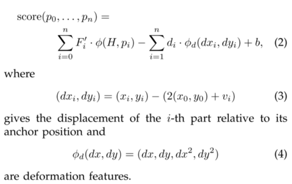

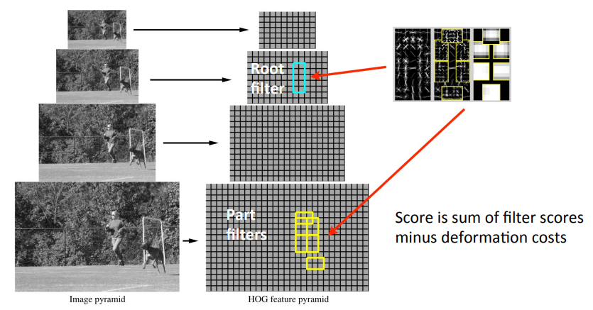

If `di = (0, 0, 1, 1)` the deformation cost for the `i-th part` is the squared distance between its actual position and its anchor position relative to the root. In general the deformation cost is an arbitrary separable quadratic function of the displacements. The bias term is introduced in the score to make the scores of multiple models comparable when we combine them into a mixture model.

The score of a `hypothesis z` can be expressed in terms of a dot product, `β · ψ(H, z)`, between a vector of `model parameters β` and a vector `ψ(H, z)`,

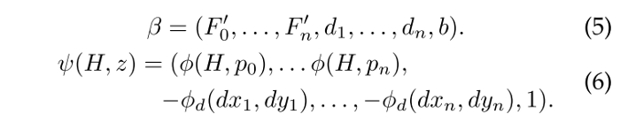

## Matching

To detect objects in an image we compute an overall score for each root location according to the best possible placement of the parts,

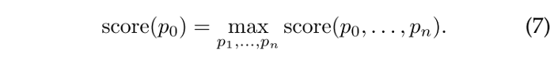

High-scoring root locations define detections while the locations of the parts that yield a high-scoring root location define a full object hypothesis.

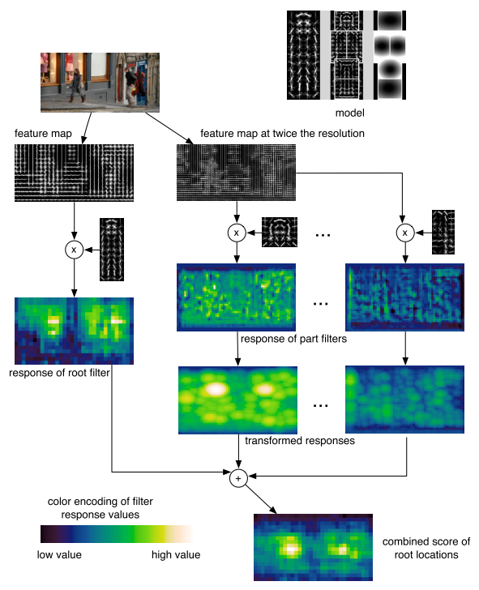

**Fig 4.** The matching process at one scale.

## Mixture Models (Handling Large Variation in Viewpoints)

A mixture model with `m components` is defined by a `m-tuple M = (M1, ... ,Mm)`, where `Mc` is the model for the `c-th` component. An object hypothesis for a mixture model specifies a mixture component, `1 ≤ c ≤ m`, and a location for each filter of `Mc`, `z = (c, p0, ... , pnc)`. Here `nc` is the number of parts in `Mc`. The score of this hypothesis is the score of the hypothesis `z’ = (p0, ... , pnc)` for the `c-th` model component.

As in the case of a single component model the score of a hypothesis for a mixture model can be expressed by a dot product between a vector of `model parameters β` and a vector `ψ(H, z)`. For a mixture model the vector `β` is the concatenation of the model parameter vectors for each component. The vector `ψ(H, z)` is sparse, with non-zero entries defined by `ψ(H, z’)` in a single interval matching the interval of `βc` in `β`,

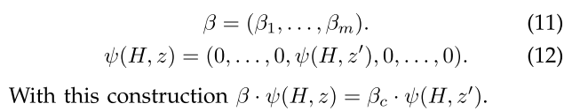

To detect objects using a mixture model we use the matching algorithm described above to find root locations that yield high scoring hypotheses independently for each component.

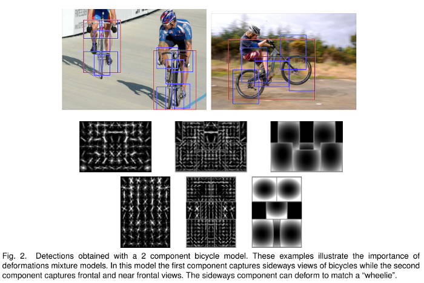

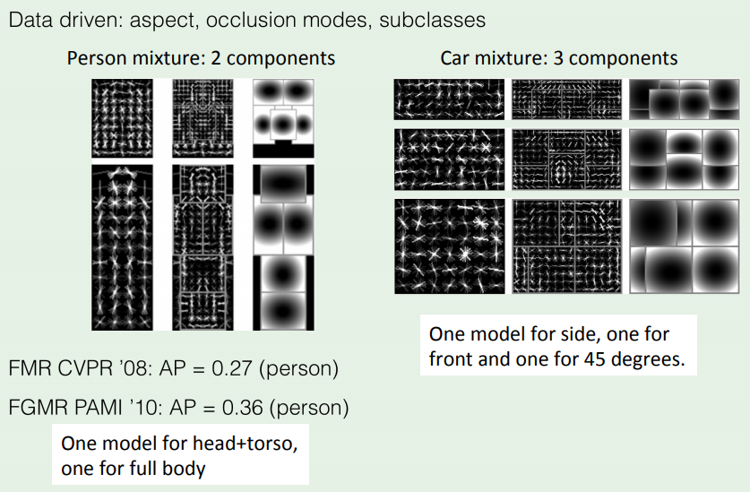

## DPM training

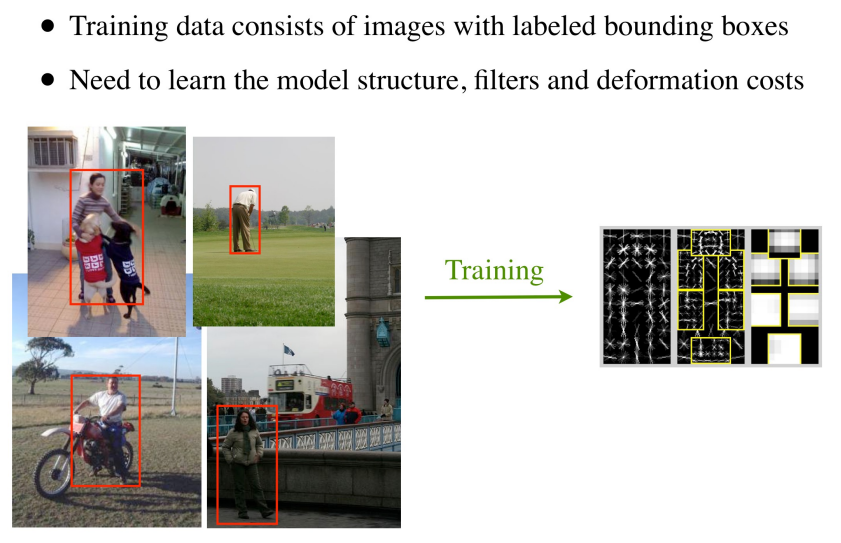

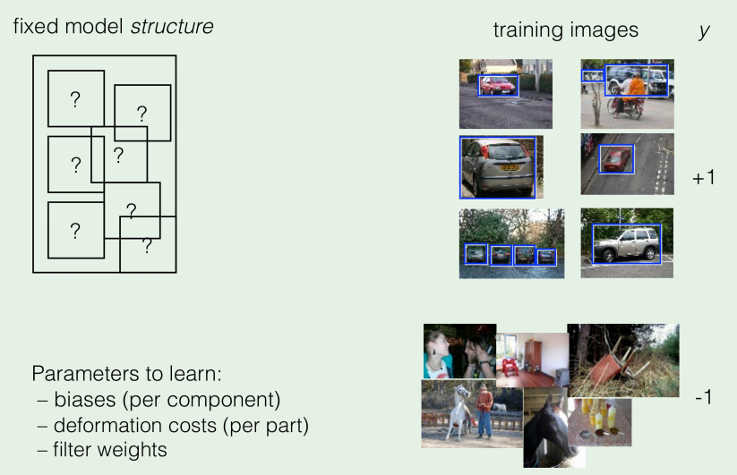

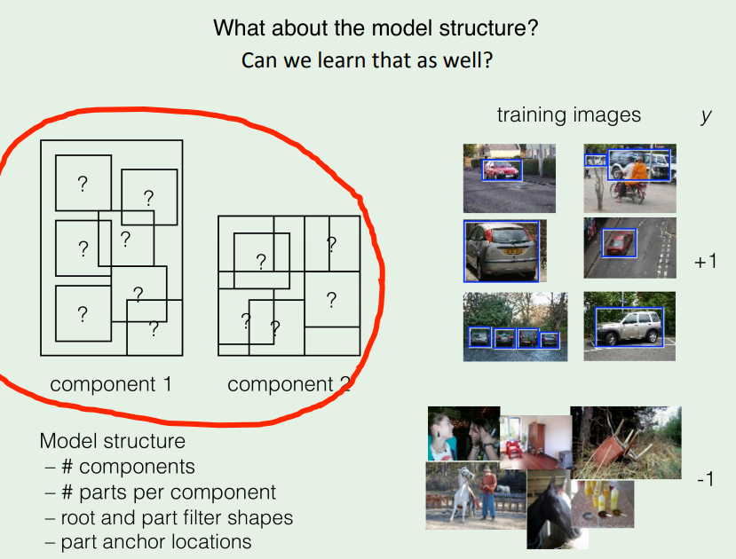

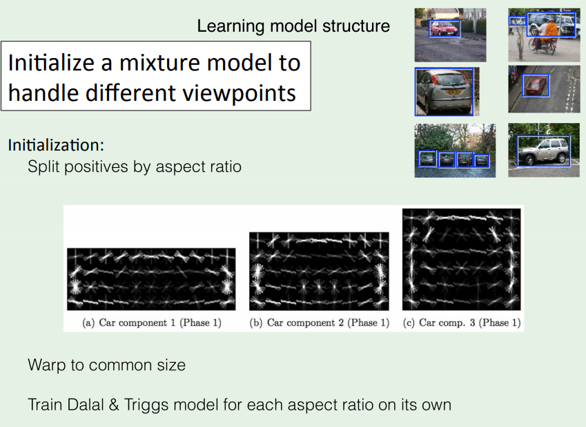

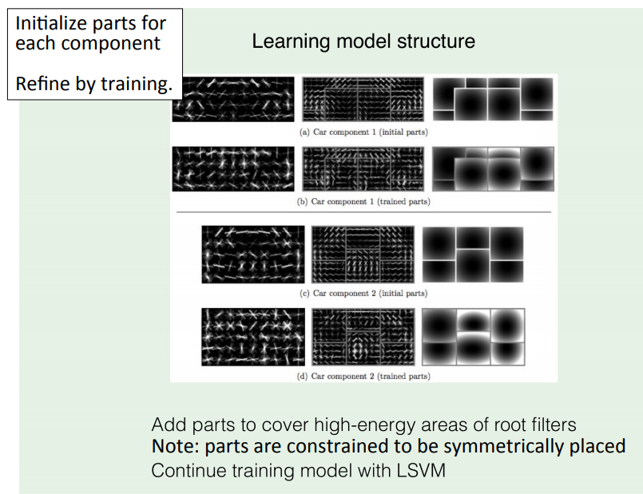

## Latent SVM

Since the training dataset only has the labels for the objects but not their parts, to train models using partially labeled data we use a latent variable formulation of MI-SVM that we call latent SVM (LSVM). In a latent SVM `each example x` is scored by a function of the following form,

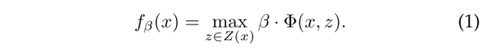

Here `β` is a vector of model parameters, `z` are latent values, and `Φ(x, z)` is a feature vector. In the case of one of our star models `β` is the concatenation of the root filter, the part filters, and deformation cost weights, `z` is a specification of the object configuration, and `Φ(x, z)` is a concatenation of sub-windows from a feature pyramid and part deformation features.

## **Hard negative** mining

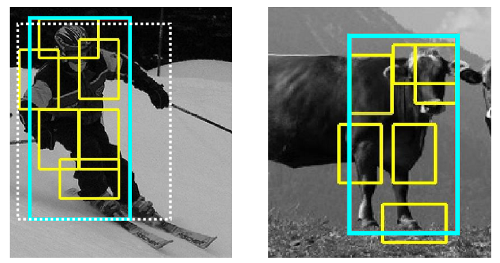

In the case of object detection the training problem is highly unbalanced because there is vastly more background than objects. This motivates a process of searching through the background data to find a relatively small number of potential false positives, or hard negative examples. Here we analyze data-mining algorithms for SVM and LSVM training. We prove that data-mining methods can be made to converge to the optimal model defined in terms of the entire training set.

## PCA and Analytic Dimensionality Reduction

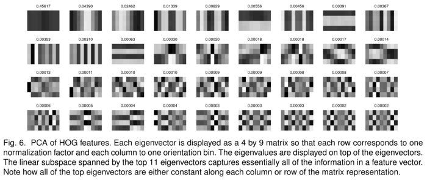

Our object models are defined by filters that score sub-windows of a feature pyramid. We have investigated feature sets similar to the HOG features and found lower dimensional features which perform as well as the original ones. By doing principal component analysis on HOG features the dimensionality of the feature vector can be significantly reduced with no noticeable loss of information. Moreover, by examining the principal eigenvectors we discover structure that leads to “analytic” versions of low-dimensional features which are easily interpretable and can be computed efficiently.

## Post-processing: Bounding Box Prediction

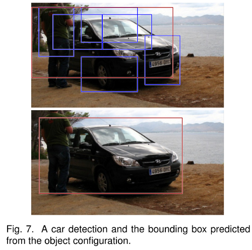

In the previous work, the bounding boxes derived from root filter locations are directly returned as the detection results. However, the model actually also localizes each part filter in addition to the root filter. Furthermore, part filters are localized with greater spatial precision than root filters. Thus it makes sense to use the complete configuration of `an object hypothesis z`, to predict a bounding box for the object.

This is implemented using functions that map a feature vector `g(z)`, to the upper-left, `(x1, y1)`, and lower-right, `(x2, y2)`, corners of the bounding box. For a model with `n parts`, `g(z)` is a `2n + 3` dimensional vector containing the width of the root filter in image pixels (this provides scale information) and the location of the upper-left corner of each filter in the image. This is done via linear least-squares regression.

## Post-processing: Non-Maximum Suppression

Using the matching procedure described in the previous session we usually get multiple overlapping detections for each instance of an object. We use a greedy procedure for eliminating repeated detections via non-maximum suppression.

We have a set of detections D for a particular object category in an image. Each detection is defined by a bounding box and a score. We sort the detections in D by score, and greedily select the highest scoring ones while skipping detections with bounding boxes that are at least 50% covered by a bounding box of a previously selected detection.

## Post-processing: Contextual Information

A simple procedure to re-score detections using contextual information. Let `(D1, ... ,Dk)` be a set of detections obtained using `k` different models (for different object categories) in an `image I`. Each detection `(B, s) ∈ Di` is defined by a bounding box `B = (x1, y1, x2, y2)` and a `score s`. We define the context of `I` in terms of a `k-dimensional vector c(I) = (σ(s1), ... , σ(sk))` where `si` is the score of the highest scoring detection in `Di`, and `σ(x) = 1/(1+exp(−2x))` is a logistic function for re-normalizing the scores. To re-score a detection `(B, s)` in an `image I` we build a 25-dimensional feature vector with the original score of the detection, the top-left and bottom-right bounding box coordinates, and the image context,

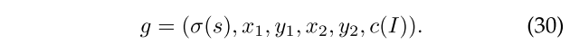

The coordinates `x1, y1, x2, y2 ∈ [0, 1]` are normalized by the width and height of the image. We use a category-specific classifier to score this vector to obtain a new score for the detection. The classifier is trained to distinguish correct detections from false positives by integrating contextual information defined by `g`.