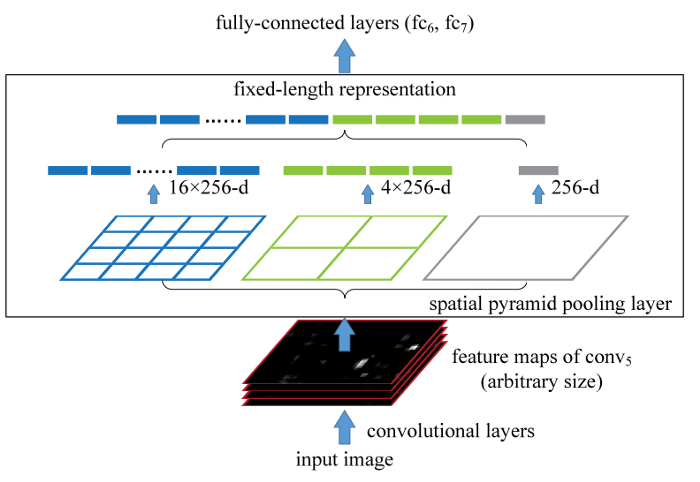
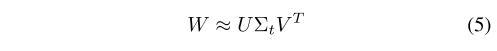

# Object Detection in 20 Years: A Survey (Part 2: CNN based Two-stage Detectors)

**Original Paper:** [Object Detection in 20 Years: A Survey](https://arxiv.org/abs/1905.05055)

# Milestones: CNN based Two-stage Detectors

In 2012, the world saw the rebirth of **convolutional neural networks**. As a deep convolutional network is able to learn robust and high-level feature representations of an image, a natural question is whether we can bring it to object detection? R. Girshick et al. took the lead to break the deadlocks in 2014 by proposing the Regions with CNN features (RCNN) for object detection. Since then, object detection started to evolve at an unprecedented speed.

# R-CNN: Regions with CNN features (2014)

**Original paper:** [*Rich feature hierarchies for accurate object detection and semantic segmentation*](https://arxiv.org/abs/1311.2524)

## Overview

R-CNN (1) takes an input image, (2) extracts around 2000 bottom-up region proposals, (3) computes features for each proposal using a large convolutional neural network (CNN), and then (4) classifies each region using class-specific linear SVMs. The object detection system consists of three modules:

- Category-independent **region proposals** generation. These proposals define the set of candidate detections available to the detector.
- A large **convolutional neural network** that extracts a fixed-length feature vector from each region.
- A set of **class-specific linear SVMs**.

Although RCNN has made great progress, its drawbacks are obvious: the redundant feature computations on a large number of overlapped proposals (over 2000 boxes from one image) leads to an extremely slow detection speed (14s per image with GPU).

## Region proposals

There are a variety of methods for generating category-independent region proposals, including objectness, selective search, category-independent object proposals, etc. While R-CNN is agnostic to the particular region proposal method, we use **selective search** to enable a controlled comparison with prior detection work.

## Feature extraction

**Figure 2:** Warped training samples from VOC 2007 train.

We extract a `4096-dimensional` feature vector from each region proposal using the Caffe implementation of AlexNet. Features are computed by forward propagating a mean-subtracted `227 × 227` RGB image through five convolutional layers and two fully connected layers. 

Regardless of the size or aspect ratio of the candidate region, we warp all pixels in a tight bounding box around it to the required size. Prior to warping, we dilate the tight bounding box so that at the warped size there are exactly `p pixels` of warped image context around the original box (we use `p = 16`).

## CNN Training

**Supervised pre-training.** We discriminatively pre-trained the CNN on the ImageNet dataset using image-level annotations only (bounding-box labels are not available for this data).

**Domain-specific fine-tuning.** To adapt our CNN to the new task (detection) and the new domain (warped proposal windows), we continue training the CNN using only warped region proposals. Aside from replacing the CNN's ImageNet-specific `1000-way` classification layer with a randomly initialized `(N + 1)-way` classification layer (where `N` is the number of object classes, plus `1 for background`), the CNN architecture is unchanged. 

We treat all region proposals with `≥ 0.5 IoU` overlap with a ground-truth box as positives for that box's class and the rest as negatives. In each SGD iteration, we uniformly sample `32 positive` windows (over all classes) and `96 background` windows to construct a mini-batch of `size 128`. We bias the sampling towards positive windows because they are extremely rare compared to the background.

## Object category classifier (**class-specific linear SVMs**)

We define negatives with an IoU overlap threshold, below which regions are defined as negatives. The `overlap threshold, 0.3`, was selected by a grid search over `{0, 0.1, ... , 0.5}` on a validation set. We found that selecting this threshold carefully is important. Positive examples are defined simply to be the ground-truth bounding boxes for each class. Once features are extracted and training labels are applied, we optimize one linear SVM per class adopting the standard hard negative mining method.

## Bounding-box regression

We implemented a simple method to reduce localization errors by training a linear regression model to predict a new detection window given the `pool5` features for a selective search region proposal.

## Test-time detection

At test time, we run selective search (“fast mode”) on the test image to extract around **2000 region proposals**. We warp each proposal and forward propagate it through the CNN in order to compute features. Then, for each class, we score each extracted feature vector using the SVM trained for that class. Given all scored regions in an image, we apply a greedy non-maximum suppression (for each class independently) that rejects a region if it has an intersection-over-union (IoU) overlap with a higher scoring selected region larger than a learned threshold.

# Spatial Pyramid Pooling Networks: SPPNet (2014)

**Original paper:** [*Spatial Pyramid Pooling in Deep Convolutional Networks for Visual Recognition*](https://arxiv.org/abs/1406.4729)

## Overview

Existing CNNs usually require a fixed size input image, we think this requirement is “artificial” and may reduce the recognition accuracy for the images or sub-images of an arbitrary size/scale. To remove this constraint, we introduce a **spatial pyramid pooling (SPP) layer** and add it on top of the last convolutional layer. The SPP layer pools the features and generates fixed-length outputs, which are then fed into the fully connected layers (or other classifiers).

SPP-net shows great strength in object detection. The feature computation in R-CNN is time-consuming because it repeatedly applies the deep convolutional networks to the raw pixels of thousands of warped regions per image. We show that we can run the convolutional layers only once on the entire image (regardless of the number of windows), and then extract features by SPPNet on the feature maps.

However, although SPPNet has effectively improved the detection speed, there are still some drawbacks: first, the training is still multi-stage; second, SPPNet only fine-tunes its fully connected layers while simply ignores all previous layers.

## Convolutional Layers and Feature Maps

We notice that the requirement of fixed input sizes is only due to the fully connected layers that demand fixed-length vectors as inputs. On the other hand, the convolutional layers accept inputs of arbitrary sizes. The convolutional layers use sliding filters, and their outputs have roughly the same aspect ratio as the inputs. These outputs are known as feature maps — they involve not only the strength of the responses but also their spatial positions.

**Figure 2:** Visualization of the feature maps.

(a) Two images in Pascal VOC 2007. (b) The feature maps of some `conv5` filters. The arrows indicate the strongest responses and their corresponding positions in the images. (c) The ImageNet images have the strongest responses of the corresponding filters. The green rectangles mark the receptive fields of the strongest responses.

## The Spatial Pyramid Pooling Layer

The convolutional layers accept arbitrary input sizes, but they produce outputs of variable sizes. The classifiers (SVM/softmax) or fully connected layers require fixed-length vectors. Such vectors can be generated by the Bag-of-Words (BoW) approach that pools the features together.

Spatial pyramid pooling improves BoW in that it can maintain spatial information by pooling in local spatial bins. These spatial bins have sizes proportional to the image size, so the number of bins is fixed regardless of the image size. This is in contrast to the sliding window pooling, where the number of sliding windows depends on the input size.

**Figure 3:** A network structure with a spatial pyramid pooling layer. Here `256` is the filter number of the `conv5` layer, and `conv5` is the last convolutional layer.

In each spatial bin, we pool the responses of each filter (throughout this paper we use `max pooling`). The outputs of the spatial pyramid pooling are `kM-dimensional` vectors with the number of bins denoted as `M` (`k` is the number of filters in the last convolutional layer). The fixed-dimensional vectors are the input to the fully connected layer.

With spatial pyramid pooling, the input image can be of any size. This not only allows arbitrary aspect ratios but also allows arbitrary scales. We can resize the input image to any scale (e.g., `min(w, h) = 180, 224, …`) and apply the same deep network. When the input image is at different scales, the network (with the same filter sizes) will extract features at different scales.

Interestingly, the coarsest pyramid level has a single bin that covers the entire image. This is in fact a `"global pooling"` operation.

## Training the Network: Single-size training

Theoretically, the above network structure can be trained with standard backpropagation, regardless of the input image size. But in practice, the GPU implementations are preferably run on fixed input images.

We first consider a network taking a fixed-size input (`224 × 224`) cropped from images. The cropping is for the purpose of data augmentation. For an image with a given size, we can pre-compute the bin sizes needed for spatial pyramid pooling. Consider the feature maps after `conv5` that have a size of `a × a` (e.g., `13 × 13`). With a pyramid level of `n × n` bins, we implement this pooling level as a sliding window pooling, where the window size `win = ceiling(a/n)` and stride `str = floor(a/n)`. With an `l-level` pyramid, we implement `l such layers`. The next fully connected layer (`fc6`) will concatenate the `l outputs`. The main purpose of our single-size training is to enable multi-level pooling behavior.

## Training the Network: Multi-size training

Our network with SPP is expected to be applied to images of any size. To address the issue of varying image sizes in training, we consider a set of pre-defined sizes. We consider two sizes: `180 × 180` in addition to `224 × 224`. Rather than crop a smaller `180 × 180` region, we resize the aforementioned `224 × 224` region to `180 × 180`. So the regions at both scales differ only in resolution but not in content/layout. 

For the network to accept `180 × 180` inputs, we implement another fixed-size-input (`180 × 180`) network. The feature map size after `conv5` is `a × a = 10 × 10` in this case. Then we still use `win = ceiling(a/n)` and stride `str = floor(a/n)` to implement each pyramid pooling level. The output of the spatial pyramid pooling layer of this `180-network` has the same fixed length as the `224-network`. As such, this `180-network` has exactly the same parameters as the `224-network` in each layer. 

In other words, during training, we implement the varying-input-size SPPNet by two fixed-size networks that share parameters. To reduce the overhead to switch from one network (e.g., `224`) to the other (e.g., `180`), we train each full epoch on one network and then switch to the other one (keeping all weights) for the next full epoch. This is iterated.

The main purpose of our multi-size training is to simulate the varying input sizes while still leveraging the existing well-optimized fixed-size implementations. Note that the above single/multi-size solutions are
for training only. At the testing stage, it is straightforward to apply SPPNet on images of any size.

## SPPNet for object detection

R-CNN repeatedly applies the deep convolutional network to about 2,000 windows per image, it is time-consuming. Feature extraction is the major timing bottleneck in testing.

**Figure 5:** Pooling features from arbitrary windows on feature maps. The feature maps are computed from the entire image. The pooling is performed in candidate windows.

With SPPNet, we extract the feature maps from the entire image only once (possibly at multiple scales). Then we apply the spatial pyramid pooling on each candidate window of the feature maps to pool a fixed-length representation of this window. Because the time-consuming convolutions are only applied once, our method can run orders of magnitude faster.

We use the "fast" mode of selective search to generate about 2,000 candidate windows per image. Then we resize the image such that `min(w, h) = s`, and extract the feature maps from the entire image. We use the SPPNet model of ZF-5 (single-size trained) for the time being. In each candidate window, we use a `4-level` spatial pyramid (`1 × 1, 2 × 2, 3 × 3, 6 × 6, totally 50 bins`) to pool the features. This generates a `12,800-d (256 × 50)` representation for each window. These representations are provided to the fully connected layers of the network. Then we train a binary linear SVM classifier for each category on these features, following the implementation of R-CNN.

**Our method can be improved by multi-scale feature extraction.** We resize the image such that `min(w, h) = s ∈ S = {480, 576, 688, 864, 1200}`, and compute the feature maps of `conv5` for each scale. For each candidate window, we choose a single scale `s ∈ S` such that the scaled candidate window has a number of pixels closest to `224 × 224`. Then we only use the feature maps extracted from this scale to compute the feature of this window.

**We also fine-tune our pre-trained network**, following R-CNN. Since our features are pooled from the `conv5` feature maps from windows of any size, for simplicity we only fine-tune the fully connected layers. In this case, the data layer accepts the fixed-length pooled features after `conv5`, and the `fc6,7` layers and a new `21-way` (one extra negative category) `fc8` layer follow.

**We use bounding box regression to post-process the prediction windows.** The features used for regression are the pooled features from `conv5` (as a counterpart of the `pool5` features used in R-CNN). The windows used for the regression training are those overlapping with a ground-truth window by at least 50%.

## Detection Complexity and Running Time

Despite having comparable accuracy, our method is much faster than R-CNN. The complexity of the convolutional feature computation in R-CNN is `O(n · 227 · 227)` with the window number `n (∼2000)`. This complexity of our method is `O(r · s · s)` at a scale of `s`, where `r` is the aspect ratio. Assume `r` is about `4/3`. In the single-scale version when `s = 688`, this complexity is about `1/160` of R-CNN's; in the `5-scale` version, this complexity is about `1/24` of R-CNN's.

# Fast R-CNN (2015)

**Original paper:** [*Fast R-CNN*](https://arxiv.org/abs/1504.08083)

## Overview

We propose a new training algorithm that fixes the disadvantages of R-CNN and SPPNet while improving their speed and accuracy. The Fast R-CNN method has several advantages:

- **Higher detection quality** (mAP) than R-CNN, SPPNet.
- **Training is single-stage**, using a multi-task loss. Unlike R-CNN and SPPNet, training is a multi-stage pipeline that involves extracting features, fine-tuning a network with log loss, training SVMs, and finally fitting bounding-box regressors.
- Training can **update all network layers**. Unlike SPPNet, the fine-tuning algorithm cannot update the convolutional layers that precede the spatial pyramid pooling, which limits the accuracy of deep networks.
- **No disk storage** is required for feature caching. For both R-CNN and SPPNet, during SVM and bounding-box regressor training stage, features are extracted and written to disk. These features require hundreds of gigabytes of storage.

Although Fast-RCNN successfully integrates the advantages of R-CNN and SPPNet, its detection speed is still limited by proposal detection. Then, a question naturally arises: **“can we generate object proposals with a CNN model?”**

## Fast R-CNN architecture

An input image and multiple **regions of interest (RoIs)** are input into a fully convolutional network. Each RoI is pooled into a fixed-size feature map and then mapped to a feature vector by fully connected layers (`FCs`). The network has two output vectors per `RoI`: softmax probabilities and per-class bounding-box regression offsets. The architecture is trained end-to-end with a multi-task loss.

## The RoI pooling layer

The RoI pooling layer uses max pooling to convert the features inside any valid region of interest into a small feature map with a fixed spatial extent of `H × W` (e.g., `7 × 7`), where H and W are layer hyper-parameters that are independent of any particular RoI. It is simply the special case of the spatial pyramid pooling layer used in SPPNet in which there is only one pyramid level.

Each RoI is defined by a `four-tuple (r, c, h, w)` that specifies its top-left corner `(r, c)` and its height and width `(h, w)`. RoI max-pooling works by dividing the `h × w` RoI window into a `H × W` grid of sub-windows of approximate size `h/H × w/W` and then max-pooling the values in each sub-window into the corresponding output grid cell. Pooling is applied independently to each feature map channel, as in standard max pooling.

## Initializing from pre-trained networks

We experiment with three pre-trained ImageNet networks. When a pre-trained network initializes a Fast R-CNN network, it undergoes three transformations.

- First, the last max-pooling layer is replaced by an RoI pooling layer that is configured by setting H and W to be compatible with the net's first fully connected layer (e.g., `H = W = 7 for VGG16`).
- Second, the network's last fully connected layer and softmax are replaced with the two sibling layers (a fully connected layer and softmax over `K+1` categories and category-specific bounding-box regressors).
- Third, the network is modified to take two data inputs: a list of images and a list of RoIs in those images.

## Multi-task loss

Fast R-CNN uses a streamlined training process with one fine-tuning stage that jointly optimizes a softmax classifier and bounding-box regressors, rather than training a softmax classifier, SVMs, and regressors in three separate stages. Each training RoI is labeled with a ground-truth `class u` and a ground-truth bounding-box `regression target v`. We use a multi-task `loss L` on each labeled RoI to jointly train for classification and bounding-box regression:

- The first task loss, `L_cls(p, u)=−log p_u` is log loss for `true class u`. Here `p = (p0, ... , pK)` is a discrete probability distribution (per RoI) over `K + 1` categories.
- The second task loss, `L_loc`, is defined over a tuple of true bounding-box regression targets for `class u`, `v=(v_x, v_y, v_w, v_h)`, and a predicted tuple `t_u=(tu_x , tu_y , tu_w, tu_h)` for `class u`. The Iverson bracket indicator function `[u ≥ 1]` evaluates to `1 when u ≥ 1 and 0 otherwise`. By convention, the catch-all background class is labeled `u = 0`. Thus for background RoIs, `L_loc` is ignored.

For bounding-box regression, we use a robust L1 loss that is less sensitive to outliers than the L2 loss used in R-CNN and SPPNet. When the regression targets are unbounded, training with L2 loss can require careful tuning of learning rates in order to prevent exploding gradients.

The hyper-parameter `λ` in Eq. 1 controls the balance between the two task losses. We normalize the ground-truth regression targets `v_i` to have zero mean and unit variance. All experiments use `λ=1`.

## Mini-batch sampling

We propose a more efficient training method that takes advantage of feature sharing during training. In Fast R-CNN training, stochastic gradient descent (SGD) mini-batches are sampled hierarchically, first by sampling `N images` and then by sampling `R/N RoIs` from each image. Critically, RoIs from the same image share computation and memory in the forward and backward passes. Making `N` small decreases mini-batch computation. For example, when using `N = 2` and `R = 128`, the proposed training scheme is roughly `64×` faster than sampling one RoI from 128 different images (i.e., the R-CNN and SPPNet strategy).

One concern over this strategy is it may cause slow training convergence because RoIs from the same image are correlated. **This concern does not appear to be a practical issue** and we achieve good results with `N = 2` and `R = 128` using fewer SGD iterations than R-CNN.

In detail, each SGD mini-batch is constructed from `N = 2` images, chosen uniformly at random. We use mini-batches of size `R = 128`, sampling `64 RoIs` from each image. We take `25%` of the RoIs from object proposals that have intersection over union (IoU) overlap with a ground-truth bounding box of `at least 0.5`. These RoIs comprise the examples labeled with a foreground object class, i.e. `u ≥ 1`. The remaining RoIs are sampled from object proposals that have a maximum IoU with ground truth in the interval `[0.1, 0.5)`. These are the background examples and are labeled with `u=0`. The lower threshold of `0.1` appears to act as a heuristic for hard example mining. During training, images are horizontally flipped with a probability of 0.5. No other data augmentation is used.

## Back-propagation through RoI pooling layers

For clarity, we assume only one image per mini-batch `(N = 1)`. Let `x_i ∈ R` be the `i-th` activation input into the RoI pooling layer and let `y_rj` be the layer's `j-th` output from the `r-th` RoI. The RoI pooling layer computes `y_rj = x_i*(r, j)`, in which `i*(r, j) = argmax(i'∈ R(r, j))x_i'`. `R(r, j)` is the index set of inputs in the sub-window over which the output unit `y_rj` max pools. A single `x_i` may be assigned to several different outputs `y_rj`. The RoI pooling layer's backwards function computes the partial derivative of the loss function with respect to each input variable `x_i` by following the argmax switches:

For each mini-batch `RoI r` and for each pooling output unit `y_rj`, the partial derivative `∂L/∂y_rj` is accumulated if `i` is the argmax selected for `y_rj` by max pooling. In back-propagation, the partial derivatives `∂L/∂y_rj` are already computed by the backwards function of the layer on top of the RoI pooling layer.

## Scale invariance

We explore two ways of achieving scale-invariant object detection.

- **"Brute force" learning.** Each image is processed at a pre-defined pixel size during both training and testing. The network must directly learn scale-invariant object detection from the training data.
- **Using image pyramids.** This method provides approximate scale-invariance to the network through an image pyramid. At test-time, the image pyramid is used to approximately scale-normalize each object proposal. During multi-scale training, we randomly sample a pyramid scale each time an image is sampled, as a form of data augmentation.

## Test time object detection

At test-time, `R` is typically around 2000. When using an image pyramid, each RoI is assigned to the scale such that the scaled RoI is closest to `224 × 224` pixels in the area. For each test `RoI r`, the forward pass outputs a class posterior `probability distribution p` and a set of predicted `bounding-box offsets relative to r` (each of the `K classes` gets its own refined bounding-box prediction). We assign detection confidence to `r` for each object `class k` using the estimated probability:

We then perform non-maximum suppression independently for each class using the algorithm and settings from R-CNN.

## Truncated SVD for faster detection

**Figure 2.** Timing for VGG16 before and after truncated SVD.

For whole-image classification, the time spent computing the fully connected layers is small compared to the `conv` layers. On the contrary, for detection the number of RoIs to process is large and nearly half of the forward pass time is spent computing the fully connected layers (Before SVD, fully connected layers `fc6` and `fc7` take `45%` of the time). Large fully connected layers are easily accelerated by compressing them with truncated SVD. In this technique, a layer parameterized by the weight matrix `W (u × v)` is approximately factorized as

using SVD. In this factorization, `U` is a `u × t` matrix comprising the first t left-singular vectors of `W`, `Σt` is a `t × t` diagonal matrix containing the top `t singular values of W`, and `V` is `v × t` matrix comprising the first `t right-singular vectors of W`. Truncated SVD reduces the parameter count from `uv` to `t(u + v)`, which can be significant if `t` is much smaller than `min(u, v)`.

To compress a network, the single fully connected layer corresponding to `W` is replaced by two fully connected layers, without a non-linearity between them. The first of these layers use the weight matrix `ΣtV_T` (and no biases) and the second uses `U` (with the original biases associated with `W`). This simple compression method gives good speedups when the number of RoIs is large.

# Faster R-CNN (2015)

**Original paper:** [*Faster R-CNN: Towards Real-Time Object Detection with Region Proposal Networks*](https://arxiv.org/abs/1506.01497)

## Overview

Region proposals are the test-time computational bottleneck in state-of-the-art detection systems. We show that computing proposals with a deep convolutional neural network lead to an elegant and effective solution where proposal computation is nearly cost-free given the detection network's computation.

We observe that the convolutional feature maps used by region-based detectors, like Fast R-CNN, can also be used for generating region proposals. On top of these convolutional features, we construct an **RPN (Region Proposal Network)** by adding a few additional convolutional layers that simultaneously regress region bounds and objectness scores at each location on a regular grid. 

The RPN is thus a kind of fully convolutional network (FCN) and can be trained end-to-end specifically for the task of generating detection proposals. RPNs are designed to efficiently predict region proposals with a wide range of scales and aspect ratios.

**Figure 2:** Faster R-CNN is a single, unified network for object detection.

Our object detection system, called Faster R-CNN, is composed of two modules. The first module is a deep fully convolutional network that proposes regions, and the second module is the Fast R-CNN detector that uses the proposed regions. The entire system is a single, unified network for object detection. Using the recently popular terminology of neural networks with "attention" mechanisms, the RPN module tells the Fast R-CNN module where to look.

## RPN: Overview

A Region Proposal Network (RPN) takes an image (of any size) as input and outputs a set of rectangular object proposals, each with an objectness score. We model this process with a fully convolutional network. Because our ultimate goal is to share computation with a Fast R-CNN object detection network, we assume that both nets share a common set of convolutional layers.

To generate region proposals, we slide a small network over the convolutional feature map output by the last shared convolutional layer. This small network takes as input an `n × n` spatial window of the input convolutional feature map. Each sliding window is mapped to a lower-dimensional feature. This feature is fed into two sibling fully-connected layers — a box-regression layer (reg) and a box-classification layer (cls). We use `n = 3` in this paper. Note that because the mini-network operates in a sliding window fashion, the fully connected layers are shared across all spatial locations.

## RPN: Anchors

At each sliding window location, we simultaneously predict multiple region proposals, where the number of maximum possible proposals for each location is denoted as `k`. So the reg layer has `4k` outputs encoding the coordinates of `k boxes`, and the cls layer outputs `2k scores` that estimate the probability of object or not object for each proposal. The `k proposals` are parameterized relative to `k reference boxes`, which we call **anchors**. 

An anchor is centered at the sliding window and is associated with a scale and aspect ratio. By default we use `3 scales` and `3 aspect ratios`, yielding `k = 9 anchors` at each sliding position. For a convolutional feature map of a size `W × H`, there are `WHk anchors` in total.

## RPN: Translation-Invariant Anchors

An important property of our approach is that it is translation invariant, both in terms of the anchors and the functions that compute proposals relative to the anchors. If one translates an object in an image, the proposal should translate and the same function should be able to predict the proposal in either location.

The translation-invariant property also reduces the model size. Our method has a `(4 + 2) × 9-dimensional` convolutional output layer in the case of `k = 9 anchors`. As a result, our output layer has `2.8 × 10^4` parameters `(512 × (4 + 2) × 9 for VGG-16)`. We expect our method to have less risk of overfitting on small datasets, like PASCAL VOC.

## RPN: Multi-Scale Anchors as Regression References

**Figure 1:** Different schemes for addressing multiple scales and sizes.

Our design of anchors presents a novel scheme for addressing multiple scales (and aspect ratios). As shown in **Figure 1**, there have been two popular ways for multi-scale predictions.

- (a) Pyramids of images and feature maps are built, and the classifier is run at all scales. This way is often useful but is time-consuming.
- (b) Pyramids of filters with multiple scales/sizes are run on the feature map. It is usually adopted jointly with the first way.
- (c) We use pyramids of reference boxes (anchors) in the regression functions. Our method classifies and regresses bounding boxes with reference to **anchor boxes of multiple scales and aspect ratios**. It only relies on images and feature maps of a single scale and uses filters (sliding windows on the feature map) of a single size. This design is a key component for sharing features without extra cost for addressing scales.

## RPN: Loss Function

For training RPNs, we assign a binary class label (of being an object or not) to each anchor.

- **Positive anchors:** (i) the anchor/anchors with the highest Intersection-over-Union (IoU) overlap with a ground-truth box, or (ii) an anchor that has an IoU overlap higher than `0.7` with any ground-truth box.
- **Negative anchors:** if its IoU ratio is lower than `0.3` for all ground-truth boxes.
- **Other anchors:** anchors that are neither positive nor negative do not contribute to the training objective.

Our loss function for an image is defined as:

The two terms are normalized by `N_cls` and `N_reg` and weighted by a balancing parameter `λ`. In our current implementation, `N_cls = 256` is the mini-batch size; `N_reg ~ 2400` is the number of anchor locations. By default, we set `λ = 10`, and thus the two terms are roughly equally weighted. However, we show by experiments that the results are insensitive to the values of `λ` in a wide range and the normalization is not required and could be simplified.

For bounding box regression, we adopt the parameterizations of the `4 coordinates` following. This can be thought of as bounding-box regression from an anchor box to a nearby ground-truth box.

In our formulation, the features used for regression are of the same spatial size `(3 × 3)` on the feature maps. To account for varying sizes, a set of `k bounding-box regressors` are learned. Each regressor is responsible for one scale and one aspect ratio, and **the k regressors do not share weights**. As such, it is still possible to predict boxes of various sizes even though the features are of a fixed size/scale, thanks to the design of anchors.

## RPN: Training

The RPN can be trained end-to-end by back-propagation and stochastic gradient descent (SGD). We follow the "image-centric" sampling strategy. Each mini-batch arises from a single image that contains many positive and negative example anchors. 

It is possible to optimize for the loss functions of all anchors, but this will bias towards negative samples as they are dominant. Instead, we randomly sample `256 anchors` in an image to compute the loss function of a mini-batch, where the sampled positive and negative anchors have a ratio of up to `1:1`. If there are fewer than 128 positive samples in an image, we pad the mini-batch with negative ones.

## Sharing Features for RPN and Fast R-CNN

For the detection network, we adopt Fast R-CNN. To allow sharing convolutional layers between RPN and Fast R-CNN, we investigate three ways

- **(i) Alternating training.** In this solution, we first train RPN and use the proposals to train Fast R-CNN. The network tuned by Fast R-CNN is then used to initialize RPN, and this process is iterated.

- **(ii) Approximate joint training.** In this solution, the RPN and Fast R-CNN networks are merged into one network during training. In each SGD iteration, the forward pass generates region proposals which are treated just like fixed, pre-computed proposals when training a Fast R-CNN detector. The backward propagation takes place as usual, where for the shared layers the backward propagated signals from both the RPN loss and the Fast R-CNN loss are combined. 

  This solution is easy to implement. But this solution ignores the derivative w.r.t. the proposal boxes' coordinates that are also network responses, so is approximate. In our experiments, we have empirically found this solver produces close results, yet reduces the training time by about 25–50% comparing with alternating training.

- **(iii) Non-approximate joint training.** As discussed above, a theoretically valid backpropagation solver should also involve gradients w.r.t. the box coordinates. These gradients are ignored in the above approximate joint training. In a non-approximate joint training solution, we need an RoI pooling layer that is differentiable w.r.t. the box coordinates.

**4-Step Alternating Training.** In this paper, we adopt a pragmatic 4-step training algorithm to learn shared features via alternating optimization.

- **Step-1:** Train the RPN. This network is initialized with an ImageNet pre-trained model and fine-tuned end-to-end for the region proposal task.
- **Step-2:** Train a separate detection network by Fast R-CNN using the proposals generated by the step-1 RPN. This detection network is also initialized by the ImageNet pre-trained model.

At this point, the two networks do not share convolutional layers.

- **Step-3:** Use the detector network to initialize RPN training, but fix the shared convolutional layers and only fine-tune the layers unique to RPN.

Now the two networks share convolutional layers.

- **Step-4:** Keeping the shared convolutional layers fixed, fine-tune the unique layers of Fast R-CNN.

As such, both networks share the same convolutional layers and form a unified network. Similar alternating training can be run for more iterations, but we have observed negligible improvements.

## Some Implementation Details

We re-scale the images such that their shorter side is `s = 600` pixels. For anchors, we use 3 scales with box areas of `128², 256², and 512²` pixels, and 3 aspect ratios of `1:1, 1:2, and 2:1`.

The anchor boxes that cross image boundaries need to be handled with care. During training, we ignore all cross-boundary anchors so they do not contribute to the loss. During testing, however, we still apply the fully convolutional RPN to the entire image. This may generate cross-boundary proposal boxes, which we clip to the image boundary.

Some RPN proposals highly overlap with each other. To reduce redundancy, we adopt non-maximum suppression (NMS) on the proposal regions based on their cls scores. We fix the IoU threshold for NMS at `0.7`, which leaves us about `2000 proposal regions` per image. As we will show, NMS does not harm the ultimate detection accuracy but substantially reduces the number of proposals.

# Feature Pyramid Networks (2017)

**Original paper:** [*Feature Pyramid Networks for Object Detection*](https://arxiv.org/abs/1612.03144)

## Overview

The goal of this paper is to naturally leverage the pyramidal shape of a ConvNet's feature hierarchy while creating a **feature pyramid that has strong semantics at all scales**. To achieve this goal, we rely on an architecture that combines low-resolution, semantically strong features with high-resolution, semantically weak features via a top-down pathway and lateral connections. The result is a feature pyramid that has rich semantics at all levels and is built quickly from a single input image scale.

Feature maps are indicated by blue outlines and thicker outlines denote semantically stronger features.

- (a) Using an image pyramid to build a feature pyramid. Features are computed on each of the image scales independently, which is slow.
- (b) Use only single-scale features for faster detection.
- (c) An alternative is to reuse the pyramidal feature hierarchy computed by a ConvNet as if it were a featurized image pyramid.
- (d) Our proposed Feature Pyramid Network (FPN) is fast like (b) and (c), but more accurate.

**Top:** a top-down architecture with skip connections, where predictions are made on the finest level.

**Bottom:** our model has a similar structure but leverages it as a feature pyramid, with predictions made independently at all levels.

## Bottom-up pathway

The bottom-up pathway is the feed-forward computation of the backbone ConvNet, which computes a feature hierarchy consisting of feature maps at several scales with a `scaling step of 2`. 

There are often many layers producing output maps of the same size and we say these layers are in the same network stage. For our feature pyramid, we define **one pyramid level for each stage**. We choose the output of the last layer of each stage as our reference set of feature maps, which we will enrich to create our pyramid. This choice is natural since the deepest layer of each stage should have the strongest features.

Specifically, for ResNets we use the feature activations output by each stage's last residual block. We denote the output of these last residual blocks as `{C2, C3, C4, C5}` for `conv2, conv3, conv4, and conv5` outputs, and note that they have `strides of {4, 8, 16, 32}` pixels with respect to the input image.

## Top-down pathway and lateral connections

The top-down pathway hallucinates higher resolution features by up-sampling spatially coarser, but semantically stronger, feature maps from higher pyramid levels. These features are then enhanced with features from the bottom-up pathway via lateral connections. Each lateral connection merges feature maps of the same spatial size from the bottom-up pathway and the top-down pathway. The bottom-up feature map is of lower-level semantics, but its activations are more accurately localized as it was sub-sampled fewer times.

With a coarser-resolution feature map, we up-sample the spatial resolution by `a factor of 2` (nearest neighbor up-sampling). The up-sampled map is then merged with the corresponding bottom-up map (which undergoes a `1 × 1` convolutional layer to reduce channel dimensions) by element-wise addition. This process is iterated until the finest resolution map is generated.

To start the iteration, we simply attach a `1 × 1` convolutional layer on `C5` to produce the coarsest resolution map. Finally, we append a `3 × 3` convolution on each merged map to generate the final feature map, which is to reduce the aliasing effect of up-sampling. This final set of feature maps is called `{P2, P3, P4, P5}`, corresponding to `{C2, C3, C4, C5}` that are respectively of the same spatial sizes.

Because all levels of the pyramid use shared classifiers/regressors as in a traditional featurized image pyramid, we fix the feature dimension (numbers of channels, denoted as `d`) in all the feature maps. We set `d = 256` in this paper and thus all extra convolutional layers have `256-channel` outputs.

## Feature Pyramid Networks for RPN

In the original RPN design, a small subnetwork is evaluated on dense `3 × 3` sliding windows, on top of a single-scale convolutional feature map. We adapt RPN by replacing the single-scale feature map with our FPN. We attach a head of the same design `(3 × 3 conv and two sibling 1 × 1 convs)` to each level on our feature pyramid. Because the head slides densely over all locations in all pyramid levels, it is not necessary to have multi-scale anchors on a specific level. Instead, we assign anchors of a single scale to each level. 

Formally, we define the anchors to have areas of the square of `{32, 64, 128, 256, 512}` pixels on `{P2, P3, P4, P5, P6}` respectively. We also use anchors of multiple aspect ratios `{1:2, 1:1, 2:1}` at each level. So in total, there are `15 anchors` over the pyramid.

We assign training labels to the anchors following the same convention in Faster R-CNN. Note that scales of ground-truth boxes are not explicitly used to assign them to the levels of the pyramid; instead, ground-truth boxes are associated with anchors, which have been assigned to pyramid levels.

We note that the parameters of the heads are shared across all feature pyramid levels; we have also evaluated the alternative without sharing parameters and observed similar accuracy. The good performance of sharing parameters indicates that all levels of our pyramid share similar semantic levels.

## Feature Pyramid Networks for Fast R-CNN

Fast R-CNN is a region-based object detector in which Region-of-Interest (RoI) pooling is used to extract features. Fast R-CNN is most commonly performed on a single-scale feature map. To use it with our FPN, we need to assign RoIs of different scales to the pyramid levels. We assign an RoI of `width w` and `height h` to the level `P_k` of our feature pyramid by:

We attach predictor heads (in Fast R-CNN the heads are class-specific classifiers and bounding box regressors) to all RoIs of all levels. Again, the heads all share parameters, regardless of their levels.