# Object Detection in 20 Years: A Survey (Part 3: CNN based One-stage Detectors)

**Original Paper:** [Object Detection in 20 Years: A Survey](https://arxiv.org/abs/1905.05055)

# Milestones: CNN based One-stage Detectors

In the deep learning era, object detection can be grouped into two genres: "two-stage detection" and "one-stage detection", where the former frames the detection as a "coarse-to-fine" process while the latter frames it as to "complete in one step".

# YOLO: You Only Look Once (2015)

**Original paper:** [*You Only Look Once: Unified, Real-Time Object Detection*](https://arxiv.org/abs/1506.02640)

## Overview

We reframe object detection as a single regression problem, straight from image pixels to bounding box coordinates and class probabilities. Using our system, you only look once (YOLO) at an image to predict what objects are present and where they are.

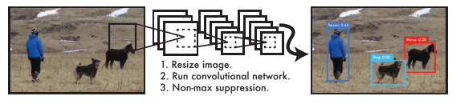

The YOLO Detection System.

- (1) Resize the input image to `448 × 448`.
- (2) Run a single convolutional network on the image.
- (3) Threshold the resulting detections by the model’s confidence.

YOLO trains on full images and directly optimizes detection performance. This unified model has several benefits over traditional methods of object detection.

- **First, YOLO is extremely fast.** Since we frame detection as a regression problem we don’t need a complex pipeline.
- **Second, YOLO reasons globally about the image when making predictions.** Unlike sliding window and region proposal-based techniques, YOLO sees the entire image during training and test time so it implicitly encodes contextual information about classes as well as their appearance.
- **Third, YOLO learns generalizable representations of objects.** It is less likely to break down when applied to new domains or unexpected inputs.

However, YOLO still lags behind state-of-the-art detection systems in terms of accuracy. While it can quickly identify objects in images it struggles to precisely localize some objects, especially small ones. Later, the author has made a series of improvements on basis of YOLO and has proposed its v2 and v3 editions, which further improve the detection accuracy while keeps a very high detection speed.

## Unified Detection

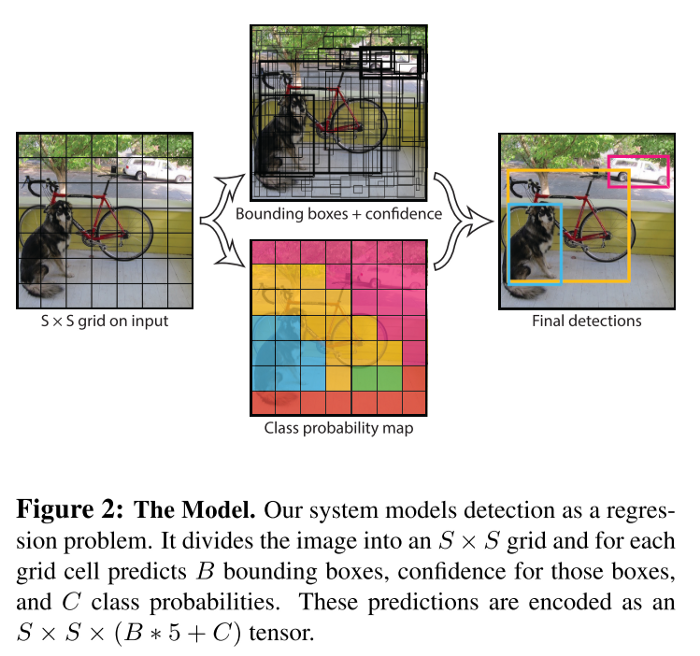

We unify the separate components of object detection into a single neural network. Our network uses features from the entire image to predict each bounding box. It also predicts all bounding boxes across all classes for an image simultaneously. This means our network reasons globally about the full image and all the objects in the image.

Our system divides the input image into an `S × S` grid. If the center of an object falls into a grid cell, that grid cell is responsible for detecting that object. Each grid cell predicts `B bounding boxes`, each bounding box consists of `5 predictions`:

- **4 box coordinates:** The `(x, y)` coordinates represent the center of the box relative to the bounds of the grid cell. The width and height are predicted relative to the whole image.
- **1 confidence score:** **Pr(Object) ∗ IOU(truth_pred)**. If no object exists in that cell, it should be zero. Otherwise, it should be equal the intersection over union (IOU) between the predicted box and the ground truth. It reflects how confident the model is that the box contains an object and also how accurate it thinks the box is that it predicts.

Each grid cell also predicts `C` conditional class probabilities: `Pr(Class_i|Object)`. These probabilities are conditioned on the grid cell containing an object. We only predict one set of class probabilities per grid cell, regardless of the number of `boxes B`.

At test time we multiply the conditional class probabilities and the individual box confidence predictions to calculate class-specific confidence scores for each box. These scores encode both the probability of that class appearing in the box and how well the predicted box fits the object.

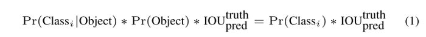

For evaluating YOLO on PASCAL VOC, we use `S = 7, B = 2`. PASCAL VOC has 20 labeled classes so `C = 20`. Our final prediction is a `7 × 7 × 30` tensor.

## Network Design

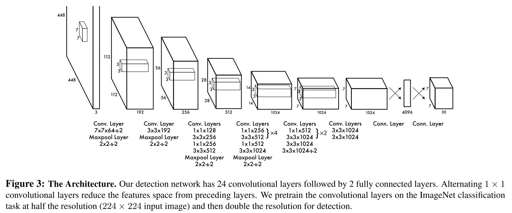

We implement this model as a convolutional neural network and evaluate it on the PASCAL VOC detection dataset. The initial convolutional layers of the network extract features from the image while the fully connected layers predict the output probabilities and coordinates. The final output of our network is the `7 × 7 × 30` tensor of predictions.

## Training

We pre-train our convolutional layers on the ImageNet 1000-class competition dataset. For pretraining we use the first 20 convolutional layers from **Figure 3** followed by an average-pooling layer and a fully connected layer. 

We then convert the model to perform detection by adding four convolutional layers and two fully connected layers with randomly initialized weights. Detection often requires fine-grained visual information so we increase the input resolution of the network from `224 × 224` to `448 × 448`.

**Our final layer predicts both class probabilities and bounding box coordinates.** We normalize the `bounding box width and height` by the image width and height so that they fall between 0 and 1. We parametrize the bounding box `x and y coordinates` to be offsets of a particular grid cell location so they are also bounded between 0 and 1.

We use a linear activation function for the final layer and all other layers use the following leaky rectified linear activation:

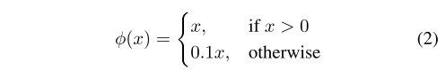

We optimize for sum-squared error in the output of our model because it is easy to optimize, however it does not perfectly align with our goal of maximizing average precision. It weights localization error equally with classification error which may not be ideal. Also, in every image, many grid cells do not contain any object. This pushes the "confidence" scores of those cells towards zero, often overpowering the gradient from cells that do contain objects. This can lead to model instability, causing training to diverge early on.

To remedy this, we increase the loss from bounding box coordinate predictions and decrease the loss from confidence predictions for boxes that don't contain objects. We use two parameters, `λ_coord` and `λ_noobj` to accomplish this and set `λ_coord = 5` and `λ_noobj = 0.5`.

The sum-squared error also equally weights errors in large boxes and small boxes. Our error metric should reflect that small deviation in large boxes matter less than in small boxes, thus we predict the square root of the bounding box width and height instead of the width and height directly.

**YOLO predicts multiple bounding boxes per grid cell.** At training time we only want one bounding box predictor to be responsible for each object. We assign one predictor to be "responsible" for predicting an object based on which prediction has the highest current IOU with the ground truth. This leads to specialization between the bounding box predictors. Each predictor gets better at predicting certain sizes, aspect ratios, or classes of object, improving overall recall. During training we optimize the following multi-part loss function:

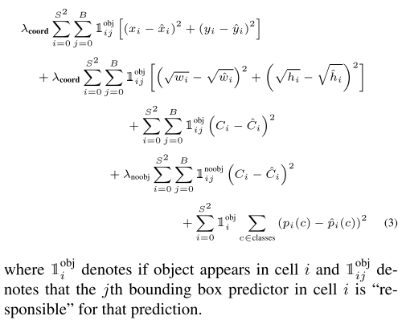

Note that the loss function only penalizes classification error if an object is present in that grid cell. It also only penalizes bounding box coordinate error if that predictor is "responsible" for the ground truth box (i.e. has the highest IOU of any predictor in that grid cell).

## Inference

Just like in training, predicting detections for a test image only requires one network evaluation, thus YOLO is extremely fast at test time.

The grid design enforces spatial diversity in the bounding box predictions. Often it is clear which grid cell an object falls in to and the network only predicts one box for each object. However, some large objects or objects near the border of multiple cells can be well localized by multiple cells. Non-maximal suppression can be used to fix these multiple detections.

## Limitations of YOLO

- It imposes strong spatial constraints on bounding box predictions since each grid cell only predicts two boxes and can only have one class. This spatial constraint limits the number of nearby objects that the model can predict.
- It struggles with small objects that appear in groups, such as flocks of birds.
- It struggles to generalize to objects in new or unusual aspect ratios or configurations since it learns to predict bounding boxes from data.
- It also uses relatively coarse features for predicting bounding boxes since the architecture has multiple downsampling layers from the input image.

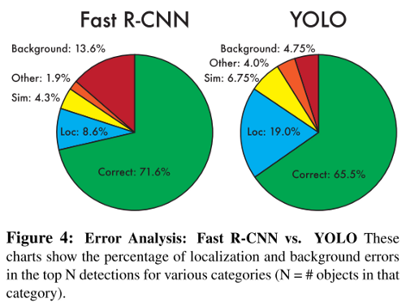

- The loss function treats errors the same in small bounding boxes versus large bounding boxes. A small error in a large box is generally benign but a small error in a small box has a much greater effect on IOU. The main source of error is incorrect localizations.

# SSD: Single Shot MultiBox Detector (2015)

**Original paper:** [*SSD: Single Shot MultiBox Detector*](https://arxiv.org/abs/1512.02325)

## Overview

- SSD is a single-shot detector for multiple categories that is faster and significantly more accurate than YOLO.
- It is in fact as accurate as slower techniques that perform explicit region proposals and pooling (including Faster R-CNN).
- The core of SSD is predicting category scores and box offsets for a fixed set of default bounding boxes using small convolutional filters applied to feature maps.
- It produces predictions of different scales from feature maps of different scales and explicitly separates predictions by aspect ratio.
- These design features lead to simple end-to-end training and high accuracy, even on low-resolution input images, further improving the speed vs accuracy trade-off.

## SSD: Framework

- (a) SSD only needs an input image and ground truth boxes for each object during training.
- In a convolutional fashion, we evaluate a small set (e.g. 4) of default boxes of different aspect ratios at each location in several feature maps with different scales (e.g. `8 × 8` and `4 × 4` in (b) and (c)).
- For each default box, we predict both the shape offsets and the confidences for all object categories (`(c1, c2, ..., cp)`).
- At training time, we first match these default boxes to the ground truth boxes. For example, we have matched two default boxes with the cat and one with the dog, which are treated as positives and the rest as negatives.
- The model loss is a weighted sum between localization loss (e.g. Smooth L1) and confidence loss (e.g. Softmax).

## SSD: Model

The SSD approach is based on a feed-forward convolutional network that produces a fixed-size collection of bounding boxes and scores for the presence of object class instances in those boxes, followed by a non-maximum suppression step to produce the final detections.

The early network layers are based on a standard architecture used for high-quality image classification (truncated before any classification layers), which we will call the **base network**. We then add auxiliary structure to the network to produce detections with the following key features:

### Multi-scale feature maps for detection

We add convolutional feature layers to the end of the truncated base network. These layers decrease in size progressively and allow predictions of detections at multiple scales. The convolutional model for predicting detections is different for each feature layer (YOLO operates on a single-scale feature map).

### Convolutional predictors for detection

Each added feature layer (or optionally an existing feature layer from the base network) can produce a fixed set of detection predictions using a set of convolutional filters. For a feature layer of size `m × n with p channels`, the basic element for predicting parameters of a potential detection is a `3 × 3 × p` small kernel that produces either a score for a category or a shape offset relative to the default box coordinates.

At each of the `m × n` locations where the kernel is applied, it produces an output value. The bounding box offset output values are measured relative to a default box position relative to each feature map location (YOLO uses an intermediate fully connected layer instead of a convolutional filter for this step).

### Default boxes and aspect ratios

We associate a set of default bounding boxes with each feature map cell, for multiple feature maps at the top of the network. The default boxes tile the feature map in a convolutional manner so that the position of each box relative to its corresponding cell is fixed. At each feature map cell, we predict the offsets relative to the default box shapes in the cell, as well as the per-class scores that indicate the presence of a class instance in each of those boxes.

Specifically, for each box out of `k` at a given location, we compute `c class scores` and the `4 offsets` relative to the original default box shape. This results in a total of `(c + 4)k` filters that are applied around each location in the feature map, yielding `(c + 4)kmn` outputs for a `m × n` feature map.

**Our default boxes are similar to the anchor boxes used in Faster R-CNN, however, we apply them to several feature maps of different resolutions.** Allowing different default box shapes in several feature maps let us efficiently discretize the space of possible output box shapes.

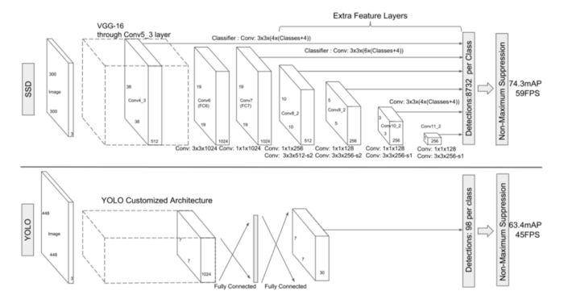

**Fig. 2:** A comparison between two single-shot detection models: SSD and YOLO.

SSD adds several feature layers to the end of a base network, which predict the offsets to default boxes of different scales and aspect ratios and their associated confidences.

## SSD: Training

### Match ground truth detection to default boxes

During training, we need to determine which default boxes correspond to a ground truth detection. For each ground truth box, we are selecting from default boxes that vary over location, aspect ratio, and scale. We begin by matching each ground truth box to the default box with the best Jaccard Overlap. Then we match default boxes to any ground truth with Jaccard Overlap higher than a threshold (`0.5`). This simplifies the learning problem, allowing the network to predict high scores for multiple overlapping default boxes rather than requiring it to pick only the one with maximum overlap.

### Choosing scales and aspect ratios for default boxes

To handle different object scales, we utilize feature maps from several different layers in a single network for prediction and share parameters across all object scales.

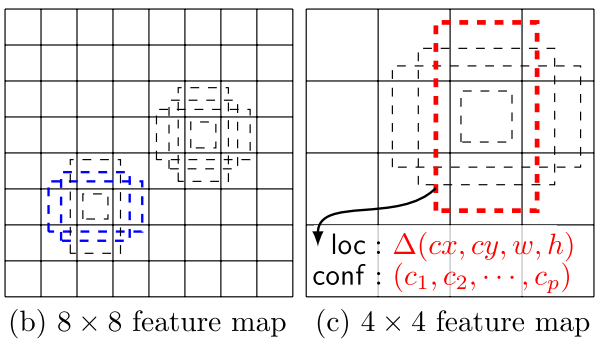

**Figure 1** shows two exemplar feature maps (8×8 and 4×4) which are used in the framework. In practice, we can use many more with a small computational overhead.

Feature maps from different levels within a network are known to have different (empirical) receptive field sizes. Fortunately, within the SSD framework, the default boxes do not necessarily need to correspond to the actual receptive fields of each layer. We design the tiling of default boxes so that specific feature maps learn to be responsive to particular scales of the objects. Suppose we want to use `m feature maps` for prediction. The scale of the default boxes for each feature map is computed as:

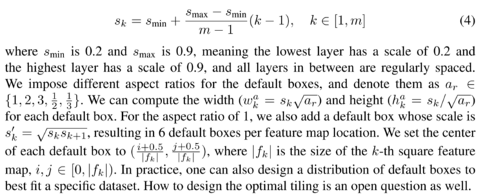

By combining predictions for all default boxes with different scales and aspect ratios from all locations of many feature maps, we have a diverse set of predictions, covering various input object sizes and shapes.

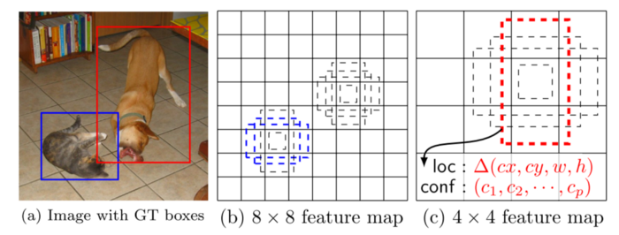

For example, the dog is matched to a default box in the `4 × 4` feature map, but not to any default boxes in the `8 × 8` feature map. This is because those boxes have different scales and do not match the dog box, and therefore are considered as negatives during training.

### Hard negative mining

After the matching step, most of the default boxes are negatives, especially when the number of possible default boxes is large. This introduces a significant imbalance between the positive and negative training examples. Instead of using all the negative examples, we sort them using the highest confidence loss for each default box and pick the top ones so that the ratio between the negatives and positives is at most `3:1`. We found that this leads to faster optimization and more stable training.

### Data augmentation

To make the model more robust to various input object sizes and shapes, each training image is randomly sampled by one of the following options:

- Use the entire original input image.
- Sample a patch so that the minimum Jaccard Overlap with the objects is `0.1, 0.3, 0.5, 0.7, or 0.9`.
- Randomly sample a patch.

The size of each sampled patch is `[0.1, 1]` of the original image size, and the aspect ratio is between `1/2 and 2`. We keep the overlapped part of the ground truth box if the center of it is in the sampled patch. After the aforementioned sampling step, each sampled patch is resized to a fixed size and is horizontally flipped with a probability of 0.5, in addition to applying some photometric distortions.

## Model analysis

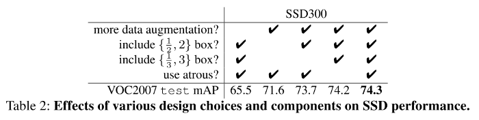

**Data augmentation is crucial.** Fast and Faster R-CNN use the original image and the horizontal flip to train. We use a more extensive sampling strategy, similar to YOLO. **Table 2** shows that we can improve 8.8% mAP with this sampling strategy.

**More default box shapes are better.** **Table 2** shows that removing boxes significantly harms performance. Using a variety of default box shapes seems to make the task of predicting boxes easier for the network.

**Atrous is faster.** We used the atrous version of a subsampled VGG16. If we use the full VGG16, the result is about the same while the speed is about 20% slower.

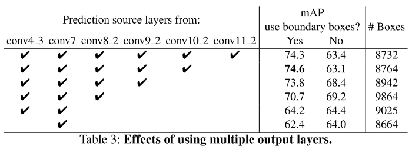

**Multiple output layers at different resolutions are better.** A major contribution of SSD is using default boxes of different scales on different output layers. To measure the advantage gained, we progressively remove layers and compare results. For a fair comparison, every time we remove a layer, we adjust the default box tiling to keep the total number of boxes similar to the original (8732). This is done by stacking more scales of boxes on the remaining layers and adjusting the scales of boxes if needed. When we stack boxes of multiple scales on a layer, many are on the image boundary and need to be handled carefully. We tried the strategy used in Faster R-CNN, ignoring boxes that are on the boundary. We do not exhaustively optimize the tiling for each setting. **Table 3** shows a decrease in accuracy with fewer layers, dropping monotonically from 74.3 to 62.4.

## Data Augmentation for Small Object Accuracy

Without a follow-up feature resampling step as in Faster R-CNN, the classification task for small objects is relatively hard for SSD. The data augmentation strategy described in the previous session helps to improve the performance dramatically, especially on small datasets.

The random crops generated by the strategy can be thought of as a **"zoom in"** operation and can generate many larger training examples. To implement a **"zoom out"** operation that creates more small training examples, we randomly place an image on a canvas of `16×` of the original image size filled with mean values before we do any random crop operation.

Because we have more training images by introducing this new "expansion" data augmentation trick, we have to double the training iterations. We have seen a consistent increase of 2%-3% mAP across multiple datasets and the new augmentation trick significantly improves the performance on small objects. This result underscores the importance of the data augmentation strategy for the final model accuracy.

# RetinaNet (2017)

**Original paper:** [*Focal Loss for Dense Object Detection*](https://arxiv.org/abs/1708.02002)

## Overview

The highest accuracy object detectors to date are based on a two-stage approach popularized by R-CNN, where a classifier is applied to a sparse set of candidate object locations. In contrast, one-stage detectors that are applied over a regular, dense sampling of possible object locations have the potential to be faster and simpler but have trailed the accuracy of two-stage detectors thus far. 

In this paper, we investigate why this is the case. We discover that the **extreme foreground-background class imbalance** encountered during the training of dense detectors is the central cause. We propose to address this class imbalance by reshaping the standard cross-entropy loss such that it down-weights the loss assigned to well-classified examples. 

Our novel **Focal Loss** focuses training on a sparse set of hard examples and prevents the vast number of easy negatives from overwhelming the detector during training. The loss function is a dynamically scaled cross-entropy loss, where the scaling factor decays to zero as confidence in the correct class increases. Intuitively, this scaling factor can automatically down-weight the contribution of easy examples during training and rapidly focus the model on hard examples.

To evaluate the effectiveness of Focal Loss, we design and train a simple dense detector we call RetinaNet. Our results show that when trained with the focal loss, RetinaNet is able to match the speed of previous one-stage detectors while surpassing the accuracy of all existing state-of-the-art two-stage detectors.

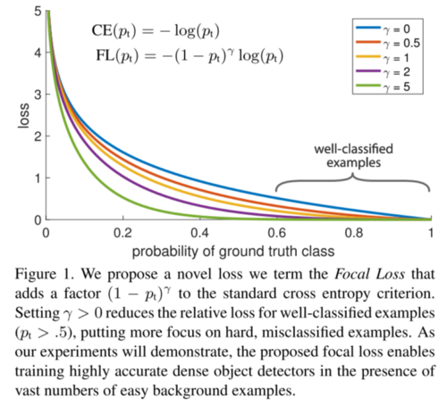

## Cross-Entropy Loss

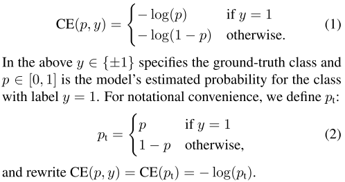

We introduce the focal loss starting from the cross-entropy loss for binary classification. The CE loss can be seen as the **blue (top) curve** in **Figure 1**. One notable property of this loss is that even examples that are easily classified incur a loss with non-trivial magnitude. When summed over a large number of easy examples, these small loss values can overwhelm the rare class.

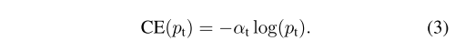

A common method for addressing class imbalance is to introduce a weighting factor `α ∈ [0, 1]` for different classes. In practice, `α` may be set by inverse class frequency or treated as a hyperparameter to set by cross-validation.

## Focal Loss

We find that the large class imbalance encountered during the training of dense detectors overwhelms the cross-entropy loss. Easily classified negatives comprise the majority of the loss and dominate the gradient. While `α` balances the importance of **positive/negative examples**, it does not differentiate between **easy/hard examples**. Instead, we propose to reshape the loss function to down-weight easy examples and thus focus training on hard negatives.

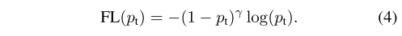

We define the focal loss as above, where `γ ≥ 0` is a tunable focusing parameter. We note two properties of the focal loss.

- (1) When an example is misclassified and `p_t` is small, the modulating factor is near 1 and the loss is unaffected. As `p_t` is closing to 1, the factor goes to 0 and the loss for well-classified examples is down-weighted.
- (2) The focusing parameter `γ` smoothly adjusts the rate at which easy examples are down-weighted. When `γ = 0`, FL is equivalent to CE, and as `γ` is increased the effect of the modulating factor is likewise increased (we found `γ = 2` to work best in our experiments).

Intuitively, the modulating factor reduces the loss contribution from easy examples and extends the range in which an example receives low loss. For instance, with `γ = 2`, an example classified with `p_t = 0.9` would have `100×` lower loss compared with CE. This in turn increases the importance of correcting misclassified examples.

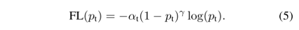

In practice, we use an `α-balanced` variant of the focal loss as it yields slightly improved accuracy over the `non-α-balanced` form.

## Class Imbalance and Model Initialization

Binary classification models are by default initialized to have an equal probability of outputting either `y = −1 or 1`. Under such an initialization, in the presence of class imbalance, the loss due to the frequent class can dominate total loss and cause instability in early training. 

To counter this, we introduce the concept of a "prior" for the value of `p` estimated by the model for the rare class (foreground) at the start of training. We denote the prior by `π` and set it so that the model's `estimated p` for examples of the rare class is low, e.g. `0.01`. 

We note that this is a change in model initialization and not of the loss function. We found this to improve training stability for both the cross-entropy and focal loss in the case of heavy class imbalance.

## Class Imbalance and Two-stage Detectors

Two-stage detectors are often trained with the standard cross-entropy loss and address class imbalance through two mechanisms: (1) a two-stage cascade and (2) biased minibatch sampling. 

The first cascade stage is an object proposal mechanism that reduces the nearly infinite set of possible object locations down to one or two thousand. Importantly, the selected proposals are not random but are likely to correspond to true object locations, which removes the vast majority of easy negatives. 

When training the second stage, biased sampling is typically used to construct mini-batches that contain, for instance, a `1:3` ratio of positive to negative examples. This ratio is like an implicit `α-balancing` factor that is implemented via sampling. 

Focal loss is designed to address these mechanisms in a one-stage detection system directly via the loss function.

## RetinaNet Detector

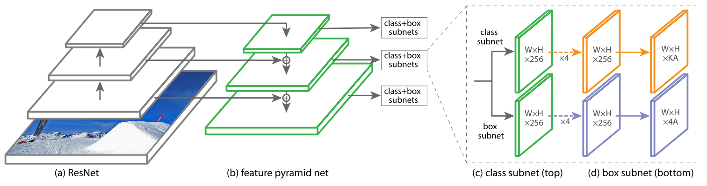

**Figure 3.** The one-stage RetinaNet network architecture uses a Feature Pyramid Network (FPN) backbone on top of a feedforward ResNet architecture

- (a) to generate a rich, multi-scale convolutional feature pyramid (b).
- To this backbone, RetinaNet attaches two subnetworks, one for classifying anchor boxes (c) and one for regressing from anchor boxes to ground-truth object boxes (d).
- The network design is intentionally simple, which enables this work to focus on a novel focal loss function that eliminates the accuracy gap between our one-stage detector and state-of-the-art two-stage detectors like Faster R-CNN with FPN while running at faster speeds.

### Feature Pyramid Network Backbone

We adopt the Feature Pyramid Network (FPN) as the backbone network for RetinaNet. In brief, FPN augments a standard convolutional network with a top-down pathway and lateral connections so the network efficiently constructs a rich, multi-scale feature pyramid from a single resolution input image. Each level of the pyramid can be used for detecting objects at a different scale. 

We build FPN on top of the ResNet architecture. We construct a pyramid with `levels P3 through P7`, where `l` indicates pyramid level (`Pl` has resolution `2l` lower than the input). All pyramid levels have `C = 256 channels`. While many design choices are not crucial, we emphasize the use of the FPN backbone is; preliminary experiments using features from only the final ResNet layer yielded low AP.

### Anchors

The anchors have areas of `32²` to `512²` on pyramid levels `P3` to `P7`, respectively. At each pyramid level, we use anchors at three aspect ratios `{1:2, 1:1, 2:1}`. For denser scale coverage than the original FPN, at each level, we add anchors of sizes `{2⁰, 2^(1/3), 2^(2/3)}` of the original set of `3 aspect ratios` anchors. This improves AP in our setting. 

In total there are `A = 9 anchors` per level and across levels, they cover the scale range `32–813 pixels` with respect to the network's input image. Each anchor is assigned a length **K one-hot vector of classification targets**, where K is the number of object classes and a **4-vector of box regression targets**.

Anchors are assigned to ground-truth object boxes using an intersection-over-union (IoU) threshold of `0.5`; and to background if their IoU is in `[0, 0.4)`. As each anchor is assigned to at most one object box, we set the corresponding entry in its length K label vector to 1 and all other entries to 0. If an anchor is unassigned, which may happen with the overlap in `[0.4, 0.5)`, it is ignored during training. Box regression targets are computed as the offset between each anchor and its assigned object box, or omitted if there is no assignment.

### Classification Subnet

The classification subnet predicts the probability of object presence at each spatial position for each of the A anchors and `K object classes`. This subnet is a small FCN attached to each FPN level; parameters of this subnet are shared across all pyramid levels. 

Taking an input feature map with `C channels` from a given pyramid level, the subnet applies `four 3 × 3 conv layers`, each with `C filters` and each followed by ReLU activations, followed by a `3 × 3 conv layer` with `KA filters`. Finally, sigmoid activations are attached to output the `KA` binary predictions per spatial location. We use `C = 256` and `A = 9` in most experiments. It does not share parameters with the box regression subnet.

### Box Regression Subnet

The design of the box regression subnet is identical to the classification subnet except that it terminates in `4A linear outputs` per spatial location. For each of the `A anchors` per spatial location, these `4 outputs` predict the relative offset between the anchor and the ground-truth box. 

We use a **class-agnostic bounding box regressor** that uses fewer parameters and we found it to be equally effective. The object classification subnet and the box regression subnet, though sharing a common structure, use separate parameters.

## Inference and Training

### Inference

To improve speed, we only decode box predictions from at most `1k top-scoring` predictions per FPN level, after thresholding detector confidence at `0.05`. The top predictions from all levels are merged and non-maximum suppression with a threshold of `0.5` is applied to yield the final detections.

### Focal Loss

We use the focal loss introduced in this work as the loss on the output of the classification subnet. We find that `γ = 2` works well in practice and the RetinaNet is relatively robust to `γ ∈ [0.5, 5]`. The total focal loss of an image is computed as the sum of the focal loss over all `∼100k anchors`, normalized by the number of anchors assigned to a ground-truth box, instead of total anchors, since the vast majority of anchors are easy negatives and receive negligible loss values under the focal loss. 

Finally, we note that `α`, the weight assigned to the rare class, also has a stable range, but it interacts with `γ` making it necessary to select the two together. In general, `α` should be decreased slightly as `γ` is increased (`for γ = 2, α = 0.25` works best).

### Initialization

All new conv layers except the final one in the RetinaNet subnets are initialized with bias `b = 0` and a Gaussian weight fill with `σ = 0.01`. For the final conv layer of the classification subnet, we set the bias initialization to `b = −log((1 − π)/π)`, where `π` specifies that at the start of training every anchor should be labeled as foreground with the confidence of `∼π`. We use `π = 0.01` in all experiments, although the results are robust to the exact value. This initialization prevents a large number of background anchors from generating a large, destabilizing loss value in the first iteration of training.