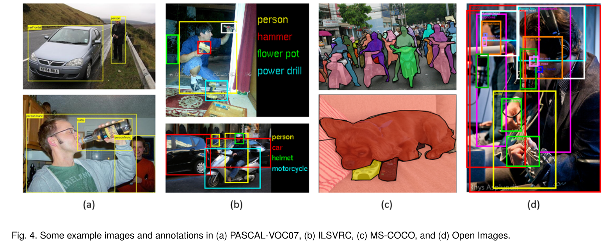
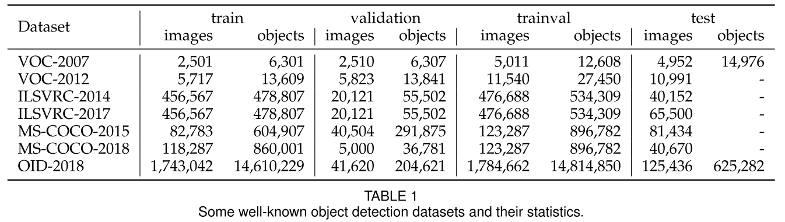
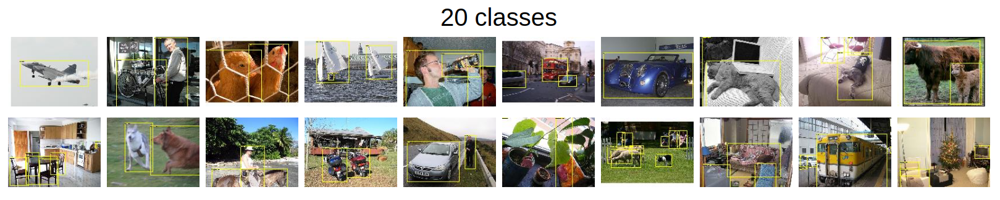
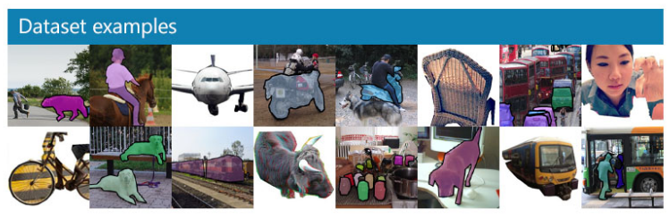

# Object Detection in 20 Years: A Survey (Part 4: Object Detection Datasets and Metrics)

**Original Paper:** [Object Detection in 20 Years: A Survey](https://arxiv.org/abs/1905.05055)

# Object Detection Datasets and Metrics

Building larger datasets with less bias is critical for developing advanced computer vision algorithms. In object detection, a number of well-known datasets and benchmarks have been released in the past 10 years.

# Dataset: Pascal VOC

[The PASCAL Visual Object Classes](http://host.robots.ox.ac.uk/pascal/VOC/index.html)

The PASCAL Visual Object Classes (VOC) Challenges (from 2005 to 2012) was one of the most important competition in early computer vision community. Two versions of Pascal-VOC are mostly used in object detection:

- **VOC07**: 5k tr. images + 12k annotated objects
- **VOC12**: 11k tr. images + 27k annotated objects

**20 classes of objects** that are common in life are annotated in these two datasets:

- **Person**: person
- **Animal**: bird, cat, cow, dog, horse, sheep
- **Vehicle**: aeroplane, bicycle, boat, bus, car, motor-bike, train
- **Indoor**: bottle, chair, dining table, potted plant, sofa, tv/monitor

# Dataset: ILSVRC

[ImageNet](https://image-net.org/challenges/LSVRC/)

The ImageNet Large Scale Visual Recognition Challenge (ILSVRC) (from 2010 to 2017) contains a detection challenge using ImageNet images. The ILSVRC detection dataset contains **200 classes** of visual objects. The number of its images/object instances is two orders of magnitude larger than VOC. For example, ILSVRC-14 contains 517k images and 534k annotated objects.

# Dataset: MS-COCO

[COCO - Common Objects in Context](https://cocodataset.org/#home)

MS-COCO (competition since 2015) is the most challenging object detection dataset available today. It has less number of object categories than ILSVRC, but more object instances. For example, MS-COCO-17 contains 164k images and 897k annotated objects from 80 categories. 

Compared with VOC and ILSVRC, the biggest progress of MS-COCO is that apart from the bounding box annotations, each object is further labeled using **per-instance segmentation** to aid in precise localization. In addition, MS-COCO contains **more small objects** (whose area is smaller than 1% of the image) and more **densely located objects** than VOC and ILSVRC. All these features make the objects distribution in MS-COCO closer to those of the real world.

# Dataset: Open Images

[Open Images](https://storage.googleapis.com/openimages/web/index.html)

The Open Images Detection (OID) challenge (since 2018) contains two tasks: 1) the standard object detection, and 2) the visual relationship detection which detects paired objects in particular relations. For the object detection task, the dataset consists of 1,910k images with 15,440k annotated bounding boxes on 600 object categories.

# Datasets of Other Detection Tasks

In addition to general object detection, the past 20 years also witness the prosperity of detection applications in specific areas, such as pedestrian detection, face detection, text detection, traffic sign/light detection, and remote sensing target detection. For the details about the datasets for different applications, please refer to the original paper.

# Object Detection Evaluation Metrics

In recent years, the most frequently used evaluation for object detection is **“Average Precision (AP)”**, which was originally introduced in VOC2007. AP is defined as the average detection precision under different recalls, and is usually evaluated **in a category specific manner**. To compare performance over all object categories, the **mean AP (mAP)** averaged over all object categories is usually used as the final metric of performance.

To measure the object localization accuracy, the **Intersection over Union (IoU)** is used to check whether the IoU between the predicted box and the ground truth box is greater than a predefined threshold, say, 0.5. If yes, the object will be identified as “successfully detected”, otherwise will be identified as “missed”. The **0.5-IoU based mAP** has then become the de facto metric for object detection problems for years.

After 2014, due to the popularity of MS-COCO datasets, researchers started to pay more attention to the accuracy of **the bounding box location**. Instead of using a fixed IoU threshold, **MS-COCO AP is averaged over multiple IoU thresholds between 0.5 (coarse localization) and 0.95 (perfect localization)**. This change of the metric has encouraged more accurate object localization and may be of great importance for some real-world applications.

Recently, there are some further developments of the evaluation in the Open Images dataset. However, the VOC/COCO-based mAP is still the most frequently used evaluation metric for object detection.