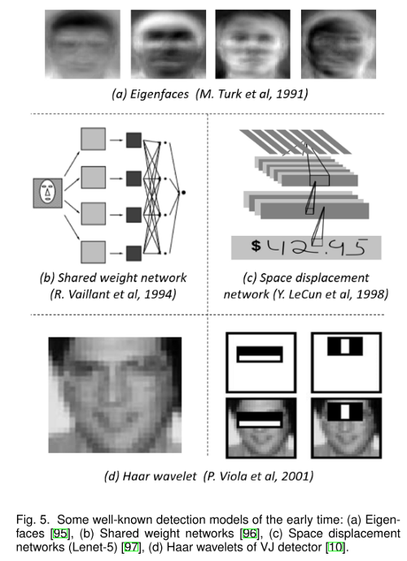
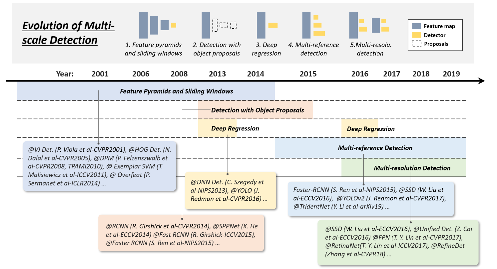
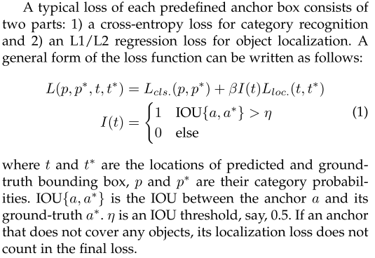
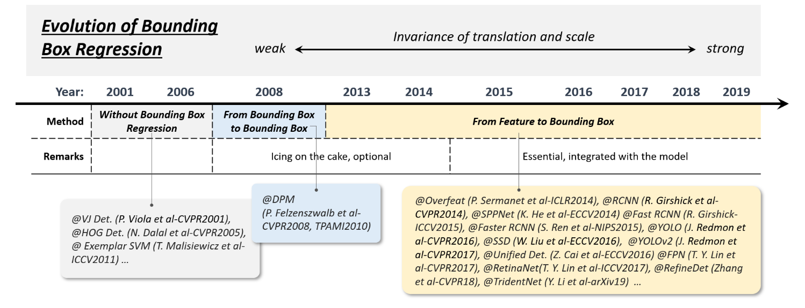
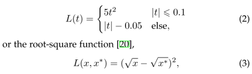
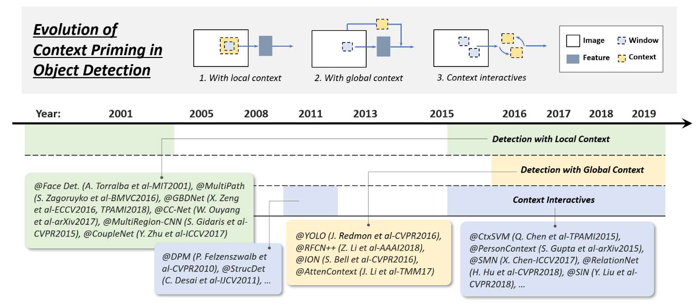
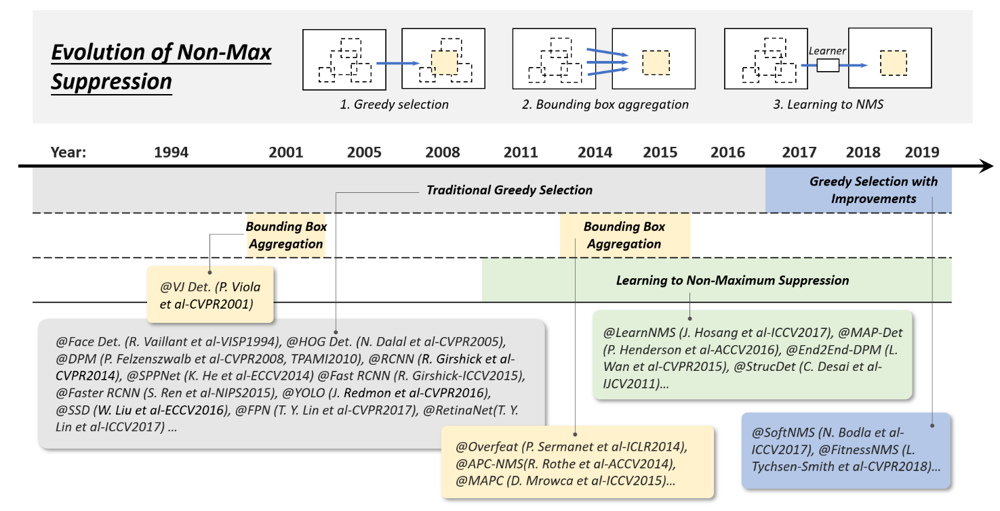
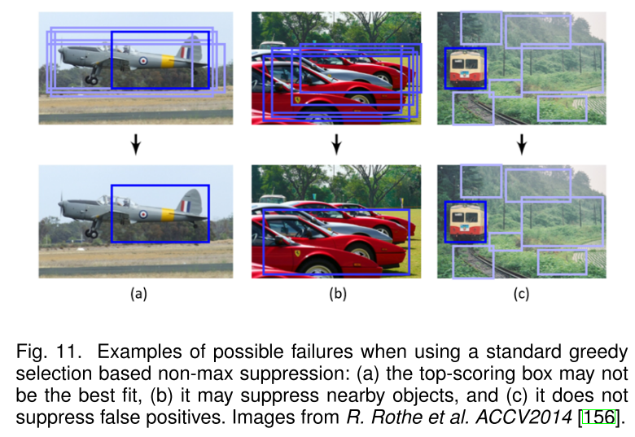
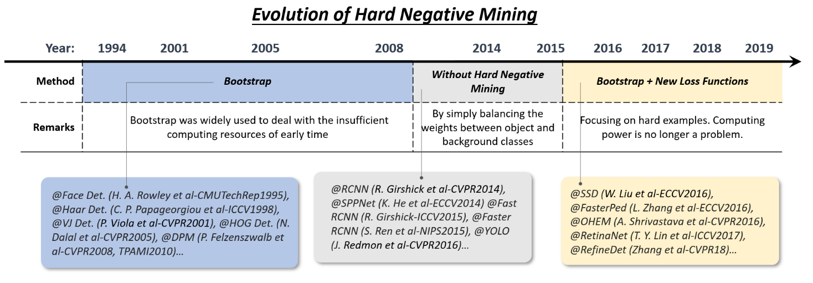

# Object Detection in 20 Years: A Survey (Part 5: Technical Evolution in Object Detection)

**Original Paper:** [Object Detection in 20 Years: A Survey](https://arxiv.org/abs/1905.05055)

# Early Time’s Dark Knowledge

The early time’s object detection (before 2000) did not follow a unified detection philosophy. Detectors at that time were usually designed based on low-level and mid-level vision.

## Components, shapes, and edges

Some early researchers framed object detection as a measurement of similarity between the object components, shapes, and contours. Despite promising initial results, things did not work out well on more complicated detection problems.

Therefore, **machine learning based detection methods** were beginning to prosper. Machine learning based detection has gone through multiple periods, including the statistical models of appearance (before 1998), wavelet feature representations (1998–2005), and gradient-based representations (2005–2012).

Building **statistical models** of an object, like Eigenfaces as shown in **Fig 5 (a),** was the first wave of learning-based approaches in object detection history. Compared with the rule-based or template-based approaches of its time, a statistical model better provides holistic descriptions of an object’s appearance by learning task-specific knowledge from data.

**Wavelet feature transform** had started to dominate visual recognition and object detection since 2000. The essence of this group of methods is learning by transforming an image from pixels to a set of wavelet coefficients. Among these methods, the **Haar wavelet**, owing to its high computational efficiency, has been mostly used in many object detection tasks. **Fig 5 (d)** shows a set of Haar wavelets basis learned by a VJ detector for human faces.

## Early time’s CNN for object detection

The history of using CNN to detecting objects can be traced back to the 1990s, where Y. LeCun et al. **(Fig. 5 (b)-(c))** have made great contributions at that time. Due to limitations in computing resources, CNN models at the time were much smaller and shallower than those of today. Despite this, the **computational efficiency** was still considered as one of the tough nuts to crack in early times’ CNN-based detection models.

# Technical Evolution of Multi-Scale Detection

Multi-scale detection of objects with **“different sizes”** and **“different aspect ratios”** is one of the main technical challenges in object detection.

**Fig. 6.** Evolution of multi-scale detection techniques in object detection from 2001 to 2019.

## Feature pyramids + sliding windows (before 2014)

Early detection models like VJ detector and HOG detector were specifically designed to detect objects with a **“fixed aspect ratio”** (e.g., faces and upright pedestrians) by simply building the feature pyramid and sliding a fixed size detection window on it. The detection of **“various aspect ratios”** was not considered at that time.

To detect objects with a more complex appearance like those in PASCAL VOC, the **“mixture model”** was one of the best solutions at that time, by training multiple models to detect objects with different aspect ratios. Apart from this, **exemplar-based** detection provided another solution by training individual models for every object instance (exemplar) of the training set.

## Detection with object proposals (2010–2015)

Object proposals refer to a group of **class-agnostic candidate boxes** that are likely to contain any objects. Detection with object proposals helps to avoid the exhaustive sliding window search across an image.

An object proposal detection algorithm should meet the following **three requirements:** 1) high recall rate, 2) high localization accuracy, and 3) on basis of the first two requirements, to improve precision and reduce processing time. Modern proposal detection methods can be divided into **three categories**: 1) segmentation grouping approaches, 2) window scoring approaches, and 3) neural network-based approaches.

Early time’s proposal detection methods followed a bottom-up detection philosophy and were deeply affected by visual saliency detection. Later, researchers started to move to low-level vision (e.g., edge detection) and more careful handcrafted skills to improve the localization of candidate boxes. After 2014, with the popularity of deep CNN in visual recognition, the top-down, learning-based approaches began to show more advantages in this problem. Since then, object proposal detection has evolved from the bottom-up vision to **“overfitting to a specific set of object classes”**, and the distinction between detectors and proposal generators is becoming blurred.

## Deep regression (2013–2016)

In recent years, with the increase of GPU’s computing power, the way people deal with multi-scale detection has become more and more straightforward and brute-force. The idea of using deep regression is to directly predict the coordinates of a bounding box based on the deep learning features. It is simple and easy to implement while the localization may not be accurate enough especially for some small objects.

## Multi-reference/-resolution detection (after 2015)

Multi-reference detection is the most popular framework for multi-scale object detection. Its main idea is to **pre-define a set of reference boxes** (a.k.a. anchor boxes) with different sizes and aspect ratios at different locations of an image, and then predict the detection box based on these references.

Another popular technique in the last two years is **multi-resolution detection**, i.e. by detecting objects of different scales at different layers of the network. Since a CNN naturally forms a feature pyramid during its forward propagation, it is easier to detect larger objects in deeper layers and smaller ones in shallower layers.

Multi-reference and multi-resolution detection have now become two basic building blocks in state-of-the-art object detection systems.

# Technical Evolution of Bounding Box Regression

The Bounding Box (BB) regression is an important technique in object detection. It aims to refine the location of a predicted bounding box based on the initial proposal or the anchor box.

**Fig. 7.** Evolution of bounding box regression techniques in object detection from 2001 to 2019.

## Without BB regression (before 2008)

Most of the early detection methods such as VJ detector and HOG detector do not use BB regression, and usually directly consider the sliding window as the detection result. To obtain accurate locations of an object, researchers have no choice but to build a very dense pyramid and slide the detector densely on each location.

## From BB to BB (2008–2013)

The first time that BB regression was introduced to an object detection system was in DPM as a post-processing block. The method predicts a bounding box based on the complete configuration of an object hypothesis and formulates this process as a linear least-squares regression problem. This method yields noticeable improvements in the detection under PASCAL criteria.

## From features to BB (after 2013)

After the introduction of Faster RCNN in 2015, BB regression no longer serves as an individual post-processing block but has been integrated with the detector and trained in an end-to-end fashion. At the same time, BB regression has evolved to predicting BB directly based on CNN features.

In order to get more robust predictions, the **smooth-L1** function is commonly used, as their regression loss, which is more robust to the outliers than the least square loss used in DPM. Some researchers also choose to normalize the coordinates to get more robust results.

# Technical Evolution of Context Priming

Visual objects are usually embedded in a typical context with the surrounding environments. Our brain takes advantage of the associations among objects and environments to facilitate visual perception and cognition. Context priming has long been used to improve detection.

**Fig. 8.** Evolution of context priming in object detection from 2001 to 2019.

## Detection with local context

Local context refers to the visual information in the area that surrounds the object to detect. It has long been acknowledged that local context helps improve object detection.

## Detection with global context

Global context exploits scene configuration as an additional source of information for object detection. For early time’s object detectors, a common way of integrating global context is to integrate a statistical summary of the elements that comprise the scene, like Gist. 

For modern deep learning-based detectors, there are two methods: (1) take advantage of a large receptive field (even larger than the input image); (2) global pooling operation of a CNN feature.

## Context interactive

Context interactive refers to the piece of information that conveys by the interactions of visual elements, such as the constraints and dependencies. For most object detectors, object instances are detected and recognized individually without exploiting their relations. 

Some recent researches have suggested that modern object detectors can be improved by considering context interactives. Some recent improvements can be grouped into two categories: (1) explore the relationship between individual objects; (2) explore modeling the dependencies between objects and scenes.

# Technical Evolution of Non-Maximum Suppression

As the neighboring windows usually have similar detection scores, the non-maximum suppression is herein used as a post-processing step to remove the replicated bounding boxes and obtain the final detection result. During the past 20 years, NMS has been gradually developed into the following three groups of methods: 1) greedy selection, 2) bounding box aggregation, and 3) learning to NMS.

**Fig. 9.** Evolution of non-max suppression (NMS) techniques in object detection from 1994 to 2019.

## Greedy selection

Greedy selection is an old-fashioned but the most popular way to perform NMS in object detection. The idea behind this process is simple and intuitive: for a set of overlapped detections, the bounding box with the maximum detection score is selected while its neighboring boxes are removed according to a predefined overlap threshold (say, **0.5**). The above processing is iteratively performed in a greedy manner. Although greedy selection has now become the de facto method for NMS, it still has some space for improvement.

## BB aggregation

BB aggregation is another group of techniques for NMS with the idea of combining or clustering multiple overlapped bounding boxes into one final detection. The advantage of this type of method is that it takes full consideration of object relationships and their spatial layout.

## Learning to NMS

A recent group of NMS improvements that have recently received much attention is learning to. The main idea is to think of NMS as a filter to re-score all raw detections and to train the NMS as part of a network in an end-to-end fashion. These methods have shown promising results in improving occlusion and dense object detection over traditional hand-crafted NMS methods.

# Technical Evolution of Hard Negative Mining

The training of an object detector is essentially an imbalanced data learning problem. In the case of sliding window based detectors, the imbalance between backgrounds and objects could be as extreme as **10⁴∼10⁵** background windows to every object. 

Modern detection datasets require the prediction of object aspect ratio, further increasing the background data will be harmful to training as the vast imbalanced ratio to **10⁶∼10⁷**. In this case, using all easy negatives will overwhelm the learning process. **Hard negative mining (HNM)** aims to deal with the problem of imbalanced data during training.

**Fig. 10.** Evolution of hard negative mining techniques in object detection from 1994 to 2019.

## Bootstrap

Bootstrap in object detection refers to a group of training techniques in which the training starts with a small part of background samples and then iteratively adds new misclassified backgrounds during the training process. 

In early times object detectors, bootstrap was initially introduced with the purpose of reducing the training computations over millions of background samples. Later it became a standard training technique in DPM and HOG detectors for solving the data imbalance problem.

## HNM in deep learning based detectors

Later in the deep learning era, due to the improvement of computing power, bootstrap was shortly discarded in object detection during 2014–2016. To ease the data-imbalance problem during training, detectors like Faster RCNN and YOLO simply balance the weights between the positive and negative windows. 

However, researchers later noticed that the weight-balancing cannot completely solve the imbalanced data problem. To this end, after 2016, the bootstrap was re-introduced to deep learning based detectors. An alternative improvement is to design new loss functions, by reshaping the standard cross-entropy loss so that it will put more focus on hard, misclassified examples.