# Object Detection in 20 Years: A Survey (Part 6: Speed-up of Detection)

**Original Paper:** [Object Detection in 20 Years: A Survey](https://arxiv.org/abs/1905.05055)

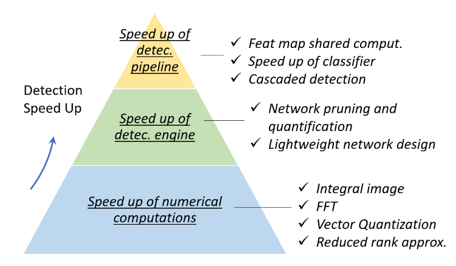

**Fig. 12.** An overview of the speed up techniques in object detection.

## Feature Map Shared Computation

Among the different computational stages of an object detector, feature extraction usually dominates the amount of computation. For a sliding window based detector, the computational redundancy starts from both positions and scales, where the former one is caused by the overlap between adjacent windows, while the latter one is by the feature correlation between adjacent scales.

### Spatial Computational Redundancy and SpeedUp

Feature map shared computation is to compute the feature map of the whole image only once before sliding window on it. The "image pyramid" of a traditional detector herein can be considered as a "feature pyramid".

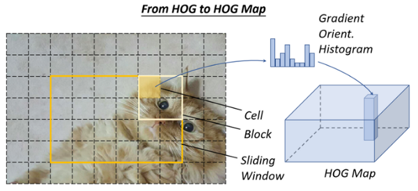

**Fig. 13.** An illustration of how to compute the HOG map of an image.

For example, to speed up HOG pedestrian detector, researchers usually accumulate the "HOG map" of the whole input image, as shown in **Fig. 13**. However, the drawback of this method is also obvious, i.e., the feature map resolution (the minimum step size of the sliding window on this feature map) will be limited by the cell size. If a small object is located between two cells, it could be ignored by all detection windows. One solution to this problem is to build an integral feature pyramid.

The same idea has also been extensively used in convolutional-based detectors. Most of the CNN-based detectors in recent years, e.g., SPPNet, Fast-RCNN, and Faster-RCNN have applied similar ideas, which have achieved tens or even hundreds of times of acceleration.

### Scale Computational Redundancy and SpeedUp

To reduce the scale computational redundancy, the most successful way is to directly scale the features rather than the images, which has been first applied in the VJ detector. However, such an approach cannot be applied directly to HOG-like features because of blurring effects. For this problem, it's discovered that there was a strong (log-linear) correlation between the neighbor scales of the HOG and integral channel features. This correlation can be used to accelerate the computation of a feature pyramid by approximating the feature maps of adjacent scales.

Building a "detector pyramid" is another solution, i.e., to detect objects of different scales by simply sliding multiple detectors on one feature map rather than re-scaling the image or features.

## Speed up of Classifier

Traditional sliding window based detectors, e.g., HOG detector and DPM, prefer using linear classifiers to nonlinear ones due to their low computational complexity. Detection with nonlinear classifiers such as kernel SVM suggests higher accuracy, but at the same time brings high computational overhead. As a standard non-parametric method, the traditional kernel method has no fixed computational complexity.

In object detection, the "model approximation" is the most commonly used way to speed up kernelized classifiers. Since the decision boundary of a classical kernel SVM can only be determined by a small set of its training samples (support vectors), the computational complexity at the inference stage would be proportional to the number of support vectors: **O(N_sv)**. **Reduced Set Vectors** is an approximation method for kernel SVM, which aims to obtain an equivalent decision boundary in terms of a small number of synthetic vectors. Another way to speed up kernel SVM in object detection is to approximate its decision boundary to **a piece-wise linear form** so as to achieve a constant inference time. The kernel method can also be accelerated with the **sparse encoding methods**.

## Cascaded Detection

Cascaded detection takes a **coarse to fine** detection philosophy: to filter out most of the simple background windows using simple calculations, then to process those more difficult windows with complex ones. The VJ detector is representative of cascaded detection. After that, many subsequent classical object detectors such as the HOG detector and DPM have been accelerated by using this technique.

In recent years, cascaded detection has also been applied to deep learning based detectors, especially for those detection tasks of **"small objects in large scenes"**, e.g., face detection, pedestrian detection, etc. In addition to the algorithm acceleration, cascaded detection has been applied to solve other problems, e.g., to improve the detection of hard examples, to integrate context information, and to improve localization accuracy.

## Network Pruning and Quantification

Network Pruning and Quantification are two commonly used techniques to speed up a CNN model, where the former refers to pruning the network structure or weight to reduce its size and the latter refers to reducing the code-length of activations or weights.

### Network Pruning

The research of "network pruning" can be traced back to as early as the 1980s. At that time, Y. LeCun et al. proposed a method called "optimal brain damage" to compress the parameters of a multi-layer perceptron network. The network pruning methods in recent years usually take an **iterative training and pruning process**, i.e., to remove only a small group of unimportant weights after each stage of training, and to repeat those operations. As traditional network pruning simply removes unimportant weights, which may result in some sparse connectivity patterns in a convolutional filter, it can not be directly applied to compress a CNN model. A simple solution to this problem is to remove the whole filters instead of the independent weights.

### Network Quantification

The recent works on network quantification mainly focus on network binarization, which aims to accelerate a network by quantifying its activations or weights to binary variables (say, 0/1) so that the **floating-point operation is converted to AND, OR, NOT logical operations**. Network binarization can significantly speed up computations and reduce the network's storage so that it can be much easier to be deployed on mobile devices. One possible implementation of the above ideas is to approximate the convolution by binary variables with the least squares method. A more accurate approximation can be obtained by using linear combinations of multiple binary convolutions. In addition, some researchers have further developed GPU acceleration libraries for binarized computation, which obtained more significant acceleration results.

### Network Distillation

Network distillation is a general framework to compress the knowledge of a large network ("teacher net") into a small one ("student net"). One straightforward approach is to use a teacher net to instruct the training of a (light-weight) student net so that the latter can be used for speed-up detection. Another approach is to make transform of the candidate regions so as to minimize the features distance between the student net and teacher net.

## Lightweight Network Design

Another method is to directly design a lightweight network instead of using off-the-shelf detection engines. Researchers have long been exploring the right configurations of a network so that to gain accuracy under a constrained time cost.

### Factorizing Convolutions

It is the simplest and most straightforward way to build a lightweight CNN model. There are two groups of factorizing methods.

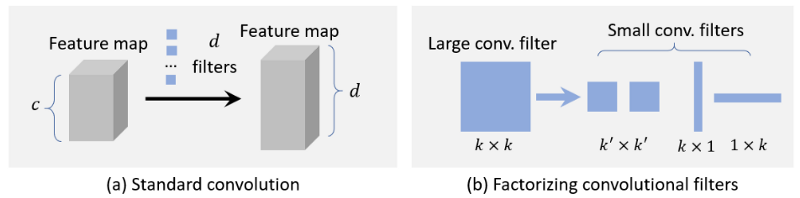

The first group of methods is to factorize a large convolution filter into a set of small ones in their spatial dimension. For example, one can factorize a `7 × 7` filter into three `3 × 3` filters, where they share the same receptive field but the latter one is more efficient. Another example is to factorize a `k × k` filter into a `k × 1` filter and a `1 × k` filter, which could be more efficient for very large filters, say `15 × 15`.

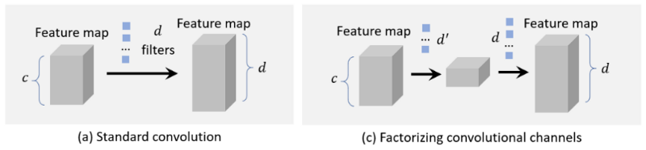

The second group of methods is to factorize a large group of convolutions into two small groups in their channel dimension. For example, one can approximate a convolution layer with `d` filters and a feature map of `c` channels by `d'` filters + a nonlinear activation + another `d` filters `(d' < d)`. In this case, the complexity `O(dk²c)` of the original layer can be reduced to `O(d'k²c) +O(dd')`.

### Group Convolution

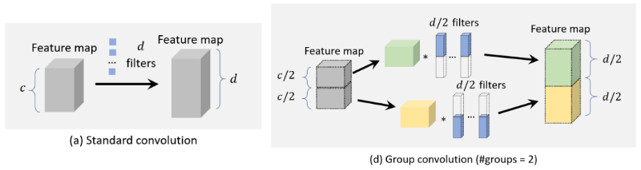

Group convolution divides the feature channels into many different groups and then convolves on each group independently. If we evenly divide the feature channels into `m groups`, without changing other configurations, the computational complexity of the convolution will theoretically be reduced to `1/m` of that before.

### Depth-wise Separable Convolution

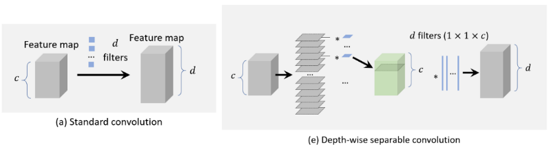

Depth-wise separable convolution can be viewed as a special case of group convolution when the number of groups is set equal to the number of channels. Suppose we have a convolutional layer with `d filters` and a feature map of `c channels`. The size of each filter is `k × k`. For a depth-wise separable convolution, every `k × k × c filter` is first split into `c slices` each with the size of `k × k × 1`, and then the convolutions are performed individually in each channel with each slice of the filter. Finally, a number of `1 × 1` filters are used to make a dimension transform so that the final output should have `d` channels. By using depth-wise separable convolution, the computational complexity can be reduced from `O(dk²c)` to `O(ck²) + O(dc)`.

### Bottle-neck Design

A bottleneck layer in a neural network contains **fewer nodes** compared to the previous layers. It can be used to learning efficient data encodings of the input with reduced dimensionality, which has been commonly used in deep autoencoders. 

In recent years, the bottle-neck design has been widely used for designing lightweight networks. Among these methods, one common approach is to compress the input layer of a detector to reduce the amount of computation from the very beginning of the detection pipeline. Another approach is to compress the output of the detection engine to make the feature map thinner, so as to make it more efficient for subsequent detection stages.

### Neural Architecture Search

More recently, there has been significant interest in designing network architectures automatically by neural architecture search (NAS) instead of relying heavily on expert experience and knowledge. NAS has been applied to large-scale image classification, object detection, and image segmentation tasks. NAS also shows promising results in designing lightweight networks very recently, where the constraints on the prediction accuracy and computational complexity are both considered during the searching process.

## Numerical Acceleration

### SpeedUp with Integral Image

The integral image helps to rapidly calculate summations over image sub-regions. The essence of integral image is the integral-differential separability of convolution in signal processing:

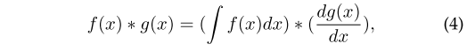

Although the VJ detector is well known for the integral image acceleration, before it was born, the integral image has already been used to speed up a CNN model and achieved more than **10 times acceleration**. Besides, integral image can also be used to speed up more general features in object detection, e.g., color histogram, gradient histogram, etc.

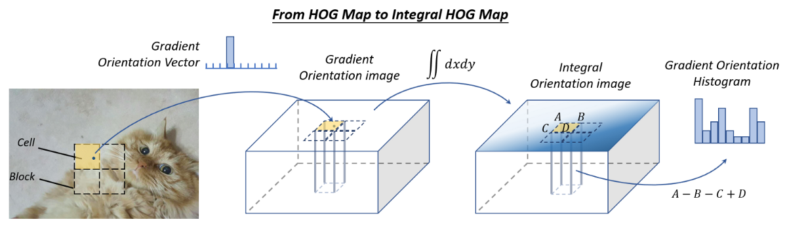

**Fig. 15.** An illustration of how to compute the "Integral HOG Map".

A typical example is to speed up HOG by computing integral HOG maps. Instead of accumulating pixel values in a traditional integral image, the integral HOG map accumulates gradient orientations in an image. As the histogram of a cell can be viewed as the summation of the gradient vector in a certain region, by using the integral image, it is possible to compute a histogram in a rectangle region of an arbitrary position and size with constant computational overhead.

Later in 2009, a new type of image feature called **Integral Channel Features (ICF)** was proposed, which can be considered as a more general case of the integral image features, and has been successfully used in pedestrian detection.

### SpeedUp in Frequency Domain

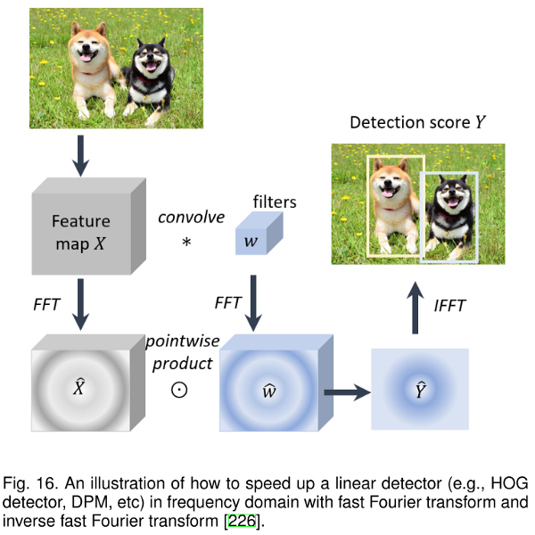

As the detection of a linear detector can be viewed as the window-wise inner product between the feature map and detector's weights, this process can be implemented by convolutions. The convolution can be accelerated in many ways, where the **Fourier transform** is a very practical choice especially for speeding up those large filters. The theoretical basis for accelerating convolution in the frequency domain is the convolution theorem in signal processing, that is, under suitable conditions, the Fourier transform of a convolution of two signals is the point-wise product in their Fourier space:

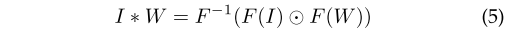

The above calculation can be accelerated by using the Fast Fourier Transform (FFT) and the Inverse Fast Fourier Transform (IFFT).

### Vector Quantization

The Vector Quantization (VQ) is a classical quantization method in signal processing that aims to approximate the distribution of a large group of data by a small set of prototype vectors. It can be used for data compression and accelerating the inner product operation in object detection. 

For example, with VQ, the HOG histograms can be grouped and quantified into a set of prototype histogram vectors. Then in the detection stage, the inner product between the feature vector and detection weights can be implemented by a table-look-up operation. As there is no floating-point multiplication and division in this process, the speed of a DPM and exemplar SVM detector can be accelerated over an order of magnitude.

### Reduced Rank Approximation

In deep networks, the computation in a fully connected layer is essentially a multiplication of two matrices. When the parameter matrix `W ∈ R(u×v)` is large, the computing burden of a detector will be heavy. The reduced rank approximation is a method to accelerate matrix multiplications. It aims to make a low-rank decomposition of the matrix W:

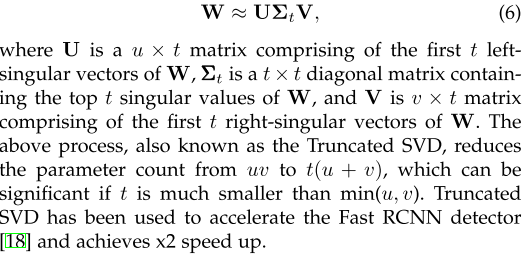