# Object Detection in 20 Years: A Survey (Part 7: Recent Advances in Object Detection)

**Original Paper:** [Object Detection in 20 Years: A Survey](https://arxiv.org/abs/1905.05055)

# Detection with Better Engines

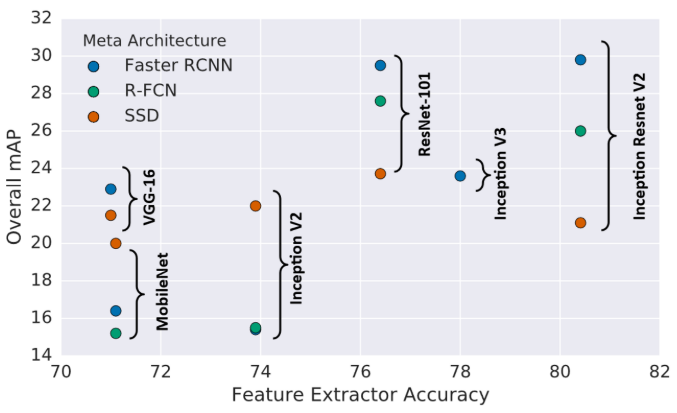

**Fig. 17.** A comparison of detection accuracy of three detectors: Faster RCNN, R-FCN and SSD on MS-COCO dataset with different detection engines.

As the accuracy of a detector depends heavily on its feature extraction networks, we refer to the backbone networks, e.g. the ResNet and VGG, as the "engine" of a detector. Here we introduce some of the important detection engines in the deep learning era.

## AlexNet (2012)

AlexNet, an **eight-layer** deep network, was the first CNN model that started the deep learning revolution in computer vision.

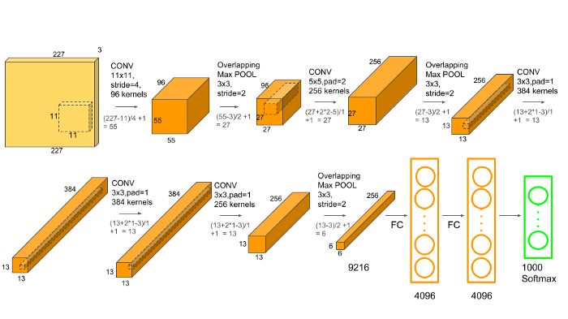

AlexNet Architecture (Source: https://neurohive.io/en/popular-networks/alexnet-imagenet-classification-with-deep-convolutional-neural-networks/)

## VGG (2014)

VGG was proposed by Oxford’s Visual Geometry Group (VGG) in 2014. It increased the model’s depth to **16–19 layers** and used **very small (`3 × 3`) convolution filters** instead of `5 × 5` and `7 × 7` which were previously used in AlexNet.

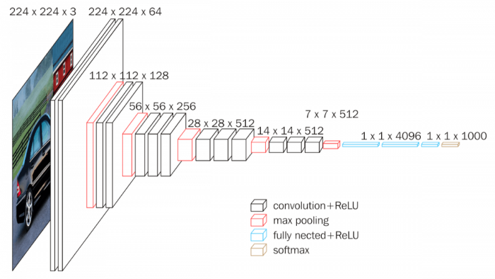

VGG16 Architecture (Source: https://neurohive.io/en/popular-networks/vgg16/)

## GoogLeNet (2016)

GoogLeNet increased both of a CNN’s width and depth (up to **22 layers**). The main contribution of the Inception family is the introduction of **factorizing convolution** and **batch normalization**.

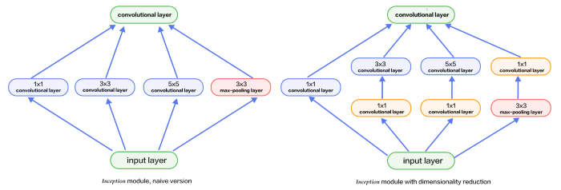

GoogLeNet Inception Architecture (Source: http://book.paddlepaddle.org/03.image_classification/image/inception_en.png)

## ResNet (2015)

ResNet is a new type of convolutional network architecture that is substantially **deeper** (**up to 152 layers**) than those used previously. ResNet aims to ease the training of networks by reformulating its layers as learning **residual functions** with reference to the layer inputs.

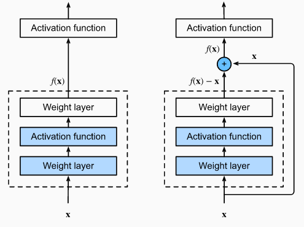

Residual Blocks (Source: https://d2l.ai/chapter_convolutional-modern/resnet.html)

## DenseNet (2017)

The success of ResNet suggested that the shortcut connection in CNN enables us to train deeper and more accurate models.

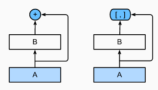

The main difference between ResNet (left) and DenseNet (right) in cross-layer connections: use of addition and **use of concatenation**. (Source: https://d2l.ai/chapter_convolutional-modern/densenet.html)

The authors of DenseNet embraced this observation and introduced a densely connected block, which connects each layer to every other layer in a feed-forward fashion.

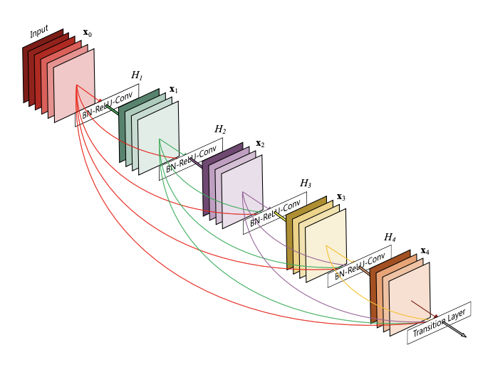

DenseNet Architecture: (Source: https://pytorch.org/hub/pytorch_vision_densenet/)

## SENet (2018)

The main contribution of SENet is the integration of global pooling and shuffling to learn the **channel-wise importance of the feature map**.

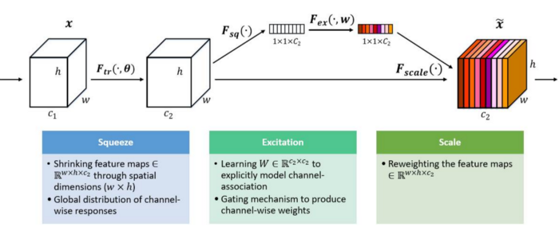

Squeeze-and-Excitation Module (Source: https://blog.csdn.net/Evan123mg/article/details/80058077)

## Object detectors with new engines

In recent years, many of the latest engines have been applied to object detection. For example, some latest object detection models such as STDN, DSOD, TinyDSOD, and Pelee choose DenseNet as their detection engine. The Mask RCNN, as the state-of-the-art model for instance segmentation, applied the next generation of ResNet: ResNeXt as its detection engine. Besides, to speed up detection, the depth-wise separable convolution operation, which was introduced by Xception, an improved version of Incepion, has also been used in detectors such as MobileNet and LightHead RCNN.

# Detection with Better Features

The quality of feature representations is critical for object detection. In recent years, many researchers have made efforts to further improve the quality of image features on basis of some latest engines, where the most important two groups of methods are: 1) feature fusion and 2) learning high-resolution features with large receptive fields.

## Why Feature Fusion is Important?

Invariance and equivariance are two important properties in image feature representations.

- **Classification** desires **invariant** feature representations since it aims at learning high-level semantic information.
- **Object localization** desires **equivariant** representations since it aims at discriminating position and scale changes.

As object detection consists of two sub-tasks of object recognition and localization, it is crucial for a detector to learn both invariance and equivariance at the same time. Feature fusion has been widely used in object detection in the last three years. As a CNN model consists of a series of convolutional and pooling layers:

- **Features in deeper layers** will have stronger **invariance** but less equivariance. Although this could be beneficial to category recognition, it suffers from low localization accuracy in object detection.
- On the contrary, **features in shallower layers** are not conducive to learning semantics, but it helps object localization as it contains more information about edges and contours.

Therefore, the integration of deep and shallow features in a CNN model helps improve both invariance and equivariance.

## Feature Fusion in Different Ways: Processing flow

Recent feature fusion methods in object detection can be divided into two categories: 1) bottom-up fusion, 2) top-down fusion, as shown below:

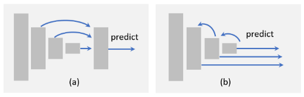

**Fig. 18–1.** An illustration of different feature fusion methods: (a) bottom-up fusion, (b) top-down fusion

**Bottom-up fusion** feeds forward shallow features to deeper layers via skip connections.

- [*Scale-Transferrable Object Detection*](https://openaccess.thecvf.com/content_cvpr_2018/papers/Zhou_Scale-Transferrable_Object_Detection_CVPR_2018_paper.pdf)
- [*Enhancement of SSD by concatenating feature maps for object detection*](https://arxiv.org/abs/1705.09587)
- [*Residual Features and Unified Prediction Network for Single Stage Detection*](https://arxiv.org/abs/1707.05031)
- [*Feature-Fused SSD: Fast Detection for Small Objects*](https://arxiv.org/abs/1709.05054)

In comparison, **top-down fusion** feeds back the features of deeper layers into the shallower ones.

- [*Feature Pyramid Networks for Object Detection*](https://arxiv.org/abs/1612.03144)
- [*Single-Shot Refinement Neural Network for Object Detection*](https://arxiv.org/abs/1711.06897)
- [*Extend the shallow part of Single Shot MultiBox Detector via Convolutional Neural Network*](https://arxiv.org/abs/1801.05918)
- [*Beyond Skip Connections: Top-Down Modulation for Object Detection*](https://arxiv.org/abs/1612.06851)
- [*RON: Reverse Connection with Objectness Prior Networks for Object Detection*](https://arxiv.org/abs/1707.01691)
- [*StairNet: Top-Down Semantic Aggregation for Accurate One Shot Detection*](https://arxiv.org/abs/1709.05788)

Apart from these methods, there are more complex approaches proposed recently.

- **weaving features** across different layers: [*Weaving Multi-scale Context for Single Shot Detector*](https://arxiv.org/abs/1712.03149).

As the feature maps of different layers may have different sizes both in terms of their spatial and channel dimensions, one may need to accommodate the feature maps, such as by adjusting the number of channels, up-sampling low-resolution maps, or down-sampling high-resolution maps to a proper size. 

The easiest way to do this is to use nearest- or bilinear-interpolation.

- [*Feature Pyramid Networks for Object Detection*](https://arxiv.org/abs/1612.03144)
- [*Beyond Skip Connections: Top-Down Modulation for Object Detection*](https://arxiv.org/abs/1612.06851)]

Besides, fractional strided convolution (a.k.a. transpose convolution) is another recent popular way to resize the feature maps and adjust the number of channels. The advantage of using fractional strided convolution is that it can learn an appropriate way to perform up-sampling by itself.

- [*Visualizing and Understanding Convolutional Networks*](https://arxiv.org/abs/1311.2901)
- [*Adaptive deconvolutional networks for mid and high level feature learning*](https://ieeexplore.ieee.org/document/6126474)

## Feature Fusion in Different Ways: Element-wise operation

From a local point of view, feature fusion can be considered as the element-wise operation between different feature maps. There are three groups of methods: 1) element-wise sum, 2) element-wise product, and 3) concatenation, as shown below.

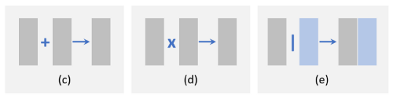

**Fig. 18–2.** An illustration of different feature fusion methods: (c) element-wise sum, (d) element-wise product, and (e) concatenation.

The **element-wise sum** is the easiest way to perform feature fusion. 

The **element-wise product** is very similar to the element-wise sum, while the only difference is the use of multiplication instead of summation. An advantage of element-wise product is that it can be used to suppress or highlight the features within a certain area, which may further benefit small object detection

- [*RON: Reverse Connection with Objectness Prior Networks for Object Detection*](https://arxiv.org/abs/1707.01691)
- [*Face Attention Network: An Effective Face Detector for the Occluded Faces*](https://arxiv.org/abs/1711.07246)
- [*Single Shot Text Detector with Regional Attention*](https://arxiv.org/abs/1709.00138)

**Feature concatenation** is another way of feature fusion. Its advantage is that it can be used to integrate context information of different regions, while its disadvantage is the increase of memory.

- [*A Unified Multi-scale Deep Convolutional Neural Network for Fast Object Detection*](https://arxiv.org/abs/1607.07155)
- [*Object detection via a multi-region & semantic segmentation-aware CNN model*](https://arxiv.org/abs/1505.01749)
- [*Attentive Contexts for Object Detection*](https://arxiv.org/abs/1603.07415)
- [*R-CNN for Small Object Detection*](https://link.springer.com/chapter/10.1007/978-3-319-54193-8_14)

## Learning High Resolution Features with Large Receptive Fields

**Receptive field** refers to the spatial range of input pixels that contribute to the calculation of a single pixel of the output. A network with a larger receptive field is able to capture a larger scale of context information, while that with a smaller one may concentrate more on the local details.

**Feature resolution** corresponds to the down-sampling rate between the input and the feature map. The lower the feature resolution is, the harder will be to detect small objects.

The most straightforward way to increase the feature resolution is to remove the pooling layer or to reduce the convolution down-sampling rate. But this will cause a new problem, the receptive field will become too small due to the decreasing of output stride. In other words, this will narrow a detector's "sight" and may result in the miss detection of some large objects.

A piratical method to increase both the receptive field and feature resolution at the same time is to introduce **dilated convolution** (a.k.a. atrous convolution, or convolution with holes). Dilated convolution is originally proposed in semantic segmentation tasks [[*Multi-Scale Context Aggregation by Dilated Convolutions*](https://arxiv.org/abs/1511.07122), [*Dilated Residual Networks*](https://arxiv.org/abs/1705.09914)]. Its main idea is to expand the convolution filter and use sparse parameters.

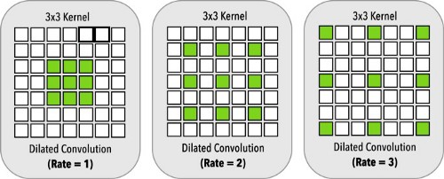

Dilated convolution. (Source: [Spinal cord gray matter segmentation using deep dilated convolutions](https://www.nature.com/articles/s41598-018-24304-3))

On the left, we have the dilated convolution with a dilation rate `r = 1`, equivalent to the standard convolution. In the middle with have a dilation `r = 2` and in the right a dilation rate of `r = 3`. All dilated convolutions have a `3 × 3` kernel size and the same number of parameters.

For example, a `3 × 3` filter with a dilation rate of `2` will have the same receptive field as a `5 × 5` kernel but only have 9 parameters. Dilated convolution has now been widely used in object detection, and proves to be effective for improved accuracy without any additional parameters and computational cost.

# Beyond Sliding Window

Although object detection has evolved from using hand-crafted features to deep neural networks, the detection still follows a paradigm of "sliding window on feature maps" [[*Deformable Part Models are Convolutional Neural Networks*](https://arxiv.org/abs/1409.5403)]. Recently, there are some detectors built beyond sliding windows.

## Detection as sub-region search

Sub-region search provides a new way of performing detection. 

- One recent method is to think of detection as a path planning process that starts from initial grids and finally converges to the desired ground truth boxes [[*G-CNN: an Iterative Grid Based Object Detector*](https://arxiv.org/abs/1512.07729)].
- Another method is to think of detection as an iterative updating process to refine the corners of a predicted bounding box [[*AttentionNet: Aggregating Weak Directions for Accurate Object Detection*](https://arxiv.org/abs/1506.07704)].

## Detection as key points localization

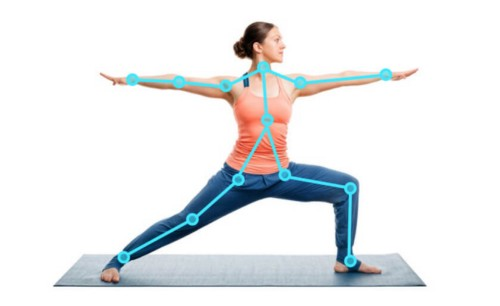

Source: https://usmsystems.com/human-pose-estimation-and-analysis-software-development/

Key points localization is an important computer vision task that has extensively broad applications, such as: 

- facial expression recognition [[*HyperFace: A Deep Multi-task Learning Framework for Face Detection, Landmark Localization, Pose Estimation, and Gender Recognition*](https://arxiv.org/abs/1603.01249)]
- human poses identification [[*Realtime Multi-Person 2D Pose Estimation using Part Affinity Fields*](https://arxiv.org/abs/1611.08050)]

As an object in an image can be uniquely determined by its **upper left corner** and **lower right corner** of the ground truth box, the detection task, therefore, can be equivalently framed as a pair-wise key points localization problem. One recent implementation of this idea is to predict a heat-map for the corners [[*CornerNet: Detecting Objects as Paired Keypoints*](https://arxiv.org/abs/1808.01244)]. The advantage of this approach is that it can be implemented under a semantic segmentation framework, and there is no need to design multi-scale anchor boxes.

# Improvements of Localization

## Bounding Box Refinement

The most intuitive way to improve localization accuracy is bounding box refinement, which can be considered as a post-processing of the detection results. Although the bounding box regression has been integrated into most of the modern object detectors, there are still some objects with unexpected scales that **cannot be well captured by any of the predefined anchors**. This will inevitably lead to an inaccurate prediction of their locations.

For this reason, the "iterative bounding box refinement" has been introduced recently by iteratively feeding the detection results into a BB regressor until the prediction converges to a correct location and size. 

- [*Cascade R-CNN: Delving into High Quality Object Detection*](https://arxiv.org/abs/1712.00726)
- [*RefineNet: Iterative refinement for accurate object localization*](https://ieeexplore.ieee.org/document/7795760)
- [*Refining faster-RCNN for accurate object detection*](https://ieeexplore.ieee.org/document/7986913)

However, some researchers also claimed that this method does not guarantee the monotonicity of localization accuracy.

## Improving Loss Functions for Accurate Localization

In most modern detectors, object localization is considered a **coordinate regression problem**. However, there are two drawbacks of this paradigm.

- First, the regression loss function does not correspond to the final evaluation of localization. For example, we can not guarantee that a lower regression error will always produce a higher IoU prediction.
- Second, the traditional bounding box regression method does not provide the confidence of localization. When there are multiple BB's overlapping with each other, this may lead to failure in non-maximum suppression.

The above problems can be alleviated by designing new loss functions. 

- The most intuitive design is to directly use IoU as the localization loss function [[*UnitBox: An Advanced Object Detection Network*](https://arxiv.org/abs/1608.01471)]. 
- Some other researchers have further proposed an IoU-guided NMS to improve localization in both training and detection stages [[*Acquisition of Localization Confidence for Accurate Object Detection*](https://arxiv.org/abs/1807.11590)].
- Besides, some researchers have also tried to improve localization under a probabilistic inference framework [[*LocNet: Improving Localization Accuracy for Object Detection*](https://arxiv.org/abs/1511.07763)] by predicting the probability distribution of a bounding box location.

# Learning with Segmentation

Recent researches suggest object detection can be improved by learning with semantic segmentation.

## Why Segmentation Improves Detection?

- **Segmentation helps category recognition.** Edges and boundaries are the basic elements that constitute human visual cognition. As the feature of semantic segmentation tasks well captures the boundary of an object, segmentation may be helpful for category recognition.
- **Segmentation helps accurate localization.** The ground-truth bounding box of an object is determined by its well-defined boundary. As object boundaries can be well encoded in semantic segmentation features, learning with segmentation would be helpful for accurate object localization.
- **Segmentation can be embedded as context.** Objects in daily life are surrounded by different backgrounds, such as the sky, water, grass, etc, and all these elements constitute the context of an object. Integrating the context of semantic segmentation will be helpful for object detection, say, an aircraft is more likely to appear in the sky than on the water.

## How Segmentation Improves Detection?

- **Learning with enriched features.** The simplest way is to think of the segmentation network as a fixed feature extractor and to integrate it into a detection framework as additional features. It is easy to implement but the segmentation network may bring additional calculations.

  - [*Object detection via a multi-region & semantic segmentation-aware CNN model*](https://arxiv.org/abs/1505.01749)
  - [*StuffNet: Using ‘Stuff’ to Improve Object Detection*](https://arxiv.org/abs/1610.05861)
  - [*Contextual Priming and Feedback for Faster R-CNN*](https://link.springer.com/chapter/10.1007/978-3-319-46448-0_20)

- **Learning with multi-task loss functions.** Another way is to introduce an additional segmentation branch on top of the original detection framework and to train this model with multi-task loss functions (**segmentation loss + detection loss**) [[*Mask R-CNN*](https://arxiv.org/abs/1703.06870), [*StuffNet: Using ‘Stuff’ to Improve Object Detection*](https://arxiv.org/abs/1610.05861)]. 

  In most cases, the segmentation brunch will be removed at the inference stage. In this way, the detection speed will not be affected, but the training requires pixel-level image annotations. To this end, some researchers have followed the idea of "weakly supervised learning": instead of training based on pixel-wise annotation masks, they simply train the segmentation brunch based on the bounding-box level annotations.

  - [*Face Attention Network: An Effective Face Detector for the Occluded Faces*](https://arxiv.org/abs/1711.07246)
  - [*Single-shot object detection with enriched semantics*](https://openaccess.thecvf.com/content_cvpr_2018/papers/Zhang_Single-Shot_Object_Detection_CVPR_2018_paper.pdf)

# Robust Detection of Rotation and Scale Changes

Object rotation and scale changes are important challenges in object detection. As the features learned by CNN are not invariant to rotation and a large degree of scale changes, in recent years, many people have made efforts in this problem.

## Rotation Robust Detection

Object rotation is very common in detection tasks. 

- The most straightforward solution to this problem is **data augmentation** so that an object in any orientation can be well covered by the augmented data [[*Orientation robust object detection in aerial images using deep convolutional neural network*](https://ucassdl.cn/downloads/publication/ICIP2015_ZhuHaigang.pdf)]. 
- Another solution is to train independent detectors **for every orientation**.
  - [*Online Exemplar-Based Fully Convolutional Network for Aircraft Detection in Remote Sensing Images*](https://ieeexplore.ieee.org/document/8356628)
  - [*Multi-class geospatial object detection and geographic image classification based on collection of part detectors*](https://www.sciencedirect.com/science/article/abs/pii/S0924271614002524)

Apart from these traditional approaches, recently, there are some new improvement methods.

- **Rotation invariant loss functions.** The idea of learning with rotation invariant loss function can be traced back to the 1990s [[*Transformation invariance in pattern recognition — tangent distance and tangent propagation*](http://yann.lecun.com/exdb/publis/pdf/simard-00.pdf)]. Some recent works have introduced a constraint on the original detection loss function so that to make the features of rotated objects unchanged. 
  - [*RIFD-CNN: Rotation-Invariant and Fisher Discriminative Convolutional Neural Networks for Object Detection*](https://ieeexplore.ieee.org/document/7780684)
  - [*Learning Rotation-Invariant Convolutional Neural Networks for Object Detection in VHR Optical Remote Sensing Images*](https://ieeexplore.ieee.org/document/7560644)
- **Rotation calibration.** Another way is to make geometric transformations of the objects candidates. This will be especially helpful for multi-stage detectors, where the correlation at early stages will benefit the subsequent detections. The representative of this idea is Spatial Transformer Networks (STN). STN has now been used in rotated text detection and rotated face detection.
  - [*Real-Time Rotation-Invariant Face Detection with Progressive Calibration Networks*](https://arxiv.org/abs/1804.06039)
  - [*Spatial Transformer Networks*](https://arxiv.org/abs/1506.02025)
  - [*Supervised Transformer Network for Efficient Face Detection*](https://arxiv.org/abs/1607.05477)

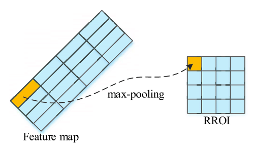

Source: [Arbitrary-Oriented Inshore Ship Detection based on Multi-Scale Feature Fusion and Contextual Pooling on Rotation Region Proposals](https://www.researchgate.net/publication/338729038_Arbitrary-Oriented_Inshore_Ship_Detection_based_on_Multi-Scale_Feature_Fusion_and_Contextual_Pooling_on_Rotation_Region_Proposals)

- **Rotation RoI Pooling.** In a two-stage detector, feature pooling aims to extract a fixed-length feature representation for an object proposal with any location and size by first dividing the proposal evenly into a set of grids, and then concatenating the grid features. As the grid meshing is performed in **cartesian coordinates**, the features are not invariant to rotation transform. A recent improvement is to mesh the grids in **polar coordinates** so that the features could be robust to the rotation changes [[*Online Exemplar-Based Fully Convolutional Network for Aircraft Detection in Remote Sensing Images*](https://ieeexplore.ieee.org/document/8356628)].

## Scale Robust Detection

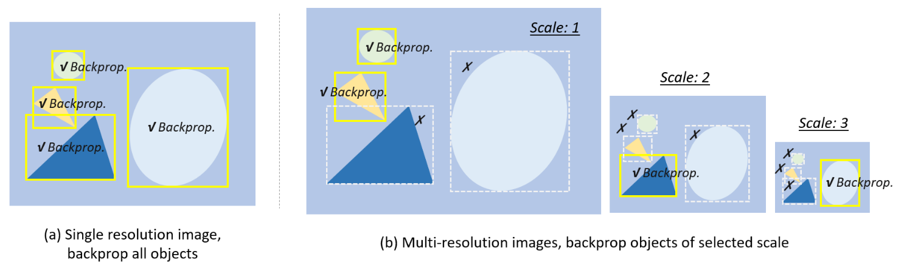

**Fig. 19.** Different training strategies for multi-scale object detection.

### Scale adaptive training

Most of the modern detectors re-scale the input image to a fixed size and backpropagate the loss of the objects in all scales, as shown in **Fig. 19 (a)**. However, a drawback of doing this is there will be a "scale imbalance" problem. 

- Building an image pyramid during detection could alleviate this problem but not fundamentally.
  - [*R-FCN: Object Detection via Region-based Fully Convolutional Networks*](https://arxiv.org/abs/1605.06409)
  - [*Deep residual learning for image recognition*](https://arxiv.org/abs/1605.06409)
- A recent improvement is **Scale Normalization for Image Pyramids (SNIP)** [[*An Analysis of Scale Invariance in Object Detection — SNIP*](https://arxiv.org/abs/1711.08189)], which builds image pyramids at both training and detection stages and only backpropagates the loss of some selected scales, as shown in **Fig. 19 (b)**. Some researchers have further proposed a more efficient training strategy: SNIP with Efficient Resampling (SNIPER) [[*SNIPER: Efficient Multi-Scale Training*](https://arxiv.org/abs/1805.09300)], i.e. to crop and re-scale an image to a set of sub-regions so that to benefit from large batch training.

### Scale adaptive detection

Most modern detectors use fixed configurations for detecting objects of different sizes. For example, in a typical CNN-based detector, we need to carefully **define the size of anchors**. A drawback of doing this is the configurations cannot be adaptive to unexpected scale changes. 

To improve the detection of **small objects**, some "adaptive zoom-in" techniques are proposed in some recent detectors to adaptively enlarge the small objects into the "larger ones".

- [*Dynamic Zoom-in Network for Fast Object Detection in Large Images*](https://arxiv.org/abs/1711.05187)
- [*Adaptive Object Detection Using Adjacency and Zoom Prediction*](https://arxiv.org/abs/1512.07711)

Another recent improvement is learning to predict the scale distribution of objects in an image, and then adaptively re-scaling the image according to the distribution.

- [*ScaleNet: Guiding Object Proposal Generation in Supermarkets and Beyond*](https://arxiv.org/abs/1704.06752)
- [*Scale-Aware Face Detection*](https://arxiv.org/abs/1706.09876)

# Training from Scratch

Most deep learning based detectors are first pre-trained on large-scale datasets, say ImageNet, and then fine-tuned on specific detection tasks. People have always believed that pre-training helps to improve generalization ability and training speed and the question is, **do we really need to pre-training a detector on ImageNet?** In fact, there are some limitations when adopting the pre-trained networks in object detection.

- The first limitation is the **divergence** between ImageNet classification and object detection, including their loss functions and scale/category distributions.
- The second limitation is the **domain mismatch**. As images in ImageNet are RGB images while detection sometimes will be applied to depth image (RGB-D) or 3D medical images, the pre-trained knowledge can not be well transfer to these detection tasks.

In recent years, some researchers have tried to train an object detector from scratch. To speed up training and improve stability, some researchers introduce dense connection and batch normalization to accelerate the backpropagation in shallow layers.

- [*DSOD: Learning Deeply Supervised Object Detectors from Scratch*](https://arxiv.org/abs/1708.01241)
- [*ScratchDet: Training Single-Shot Object Detectors from Scratch*](https://arxiv.org/abs/1810.08425)

A recent work by K. He et al. [[*Rethinking ImageNet Pre-training*](https://arxiv.org/abs/1811.08883)] has further questioned the paradigm of pre-training even further by exploring the opposite regime: they reported competitive results on object detection on the COCO dataset using standard models trained from random initialization, with the sole exception of increasing the number of training iterations so the randomly initialized models may converge. Training from random initialization is also surprisingly robust even using only 10% of the training data, which indicates that ImageNet pre-training may speed up convergence but does not necessarily provide regularization or improve final detection accuracy.

# Adversarial Training

Generative Adversarial Networks (GAN) have been widely used for many computer vision tasks such as image generation, image style transfer, and image super-resolution. In recent years, GAN has also been applied to object detection, especially for improving the detection of small and occluded objects.

GAN has been used to **enhance the detection of small objects** by narrowing the representations between small and large ones [[*Perceptual Generative Adversarial Networks for Small Object Detection*](https://arxiv.org/abs/1706.05274)*,* [*Sod-mtgan: Small object detection via multi-task generative adversarial network*](https://openaccess.thecvf.com/content_ECCV_2018/papers/Yongqiang_Zhang_SOD-MTGAN_Small_Object_ECCV_2018_paper.pdf)]. 

To improve the **detection of occluded objects**, one recent idea is to generate occlusion masks by using adversarial training [[*A-Fast-RCNN: Hard Positive Generation via Adversary for Object Detection*](https://arxiv.org/abs/1704.03414)]. Instead of generating examples in pixel space, the adversarial network directly modifies the features to mimic occlusion.

In addition to these works, "adversarial attack" [[*ShapeShifter: Robust Physical Adversarial Attack on Faster R-CNN Object Detector*](https://arxiv.org/abs/1804.05810)], which aims to study how to attack a detector with adversarial examples, has drawn increasing attention recently. The research on this topic is especially important for autonomous driving, as it cannot be fully trusted before guaranteeing the robustness to adversarial attacks.

# Weakly Supervised Object Detection

The training of a modern object detector usually requires a large amount of manually labeled data, while the labeling process is time-consuming, expensive, and inefficient. Weakly Supervised Object Detection (WSOD) aims to solve this problem by training a detector with only image-level annotations instead of bounding boxes.

Recently, **multi-instance learning** has been used for WSOD.

- [*Weakly Supervised Object Localization with Multi-fold Multiple Instance Learning*](https://arxiv.org/pdf/1503.00949.pdf)
- [*We don’t need no bounding-boxes: Training object class detectors using only human verification*](https://arxiv.org/abs/1602.08405)

Multi-instance learning is a group of supervised learning methods.

- [*Support Vector Machines for Multiple-Instance Learning*](https://proceedings.neurips.cc/paper/2002/file/3e6260b81898beacda3d16db379ed329-Paper.pdf)
- [*Solving the multiple instance problem with axis-parallel rectangles*](https://www.sciencedirect.com/science/article/pii/S0004370296000343)

Instead of learning with a set of instances that are individually labeled, a multi-instance learning model receives a set of labeled bags, each containing many instances. If we consider **object candidates** in one image as a bag, and **image-level annotation** as the label, then the WSOD can be formulated as a multi-instance learning process.

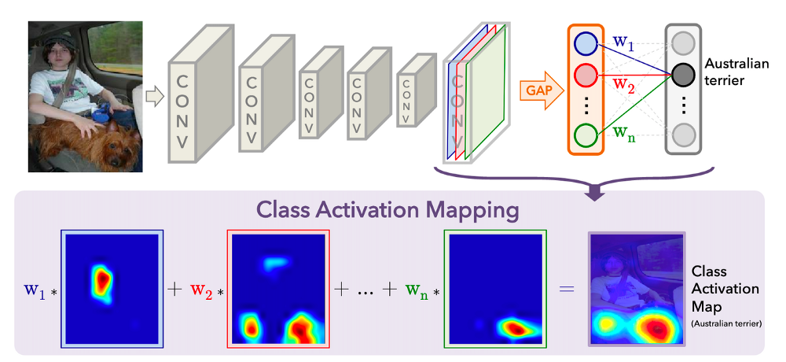

- **Class activation mapping** is another recent group of methods for WSOD. The research on CNN visualization has shown that the convolution layer of a CNN behaves as an object detector despite there is no supervision on the location of the object. Class activation mapping sheds light on how to enable a CNN to have localization ability despite being trained on image-level labels [[*Learning Deep Features for Discriminative Localization*](https://arxiv.org/abs/1512.04150)].
  - [*Soft Proposal Networks for Weakly Supervised Object Localization*](https://arxiv.org/abs/1709.01829)
  - [*Weakly Supervised Cascaded Convolutional Networks*](https://arxiv.org/abs/1611.08258)

- In addition to the above approaches, some other researchers considered the WSOD as a proposal ranking process by selecting the most informative regions and then training these regions with image-level annotation. 
- Another simple method for WSOD is to mask out different parts of the image. If the detection score drops sharply, then an object would be covered with high probability [[*Self-taught object localization with deep networks*](https://arxiv.org/abs/1409.3964)]. 
- Besides, interactive annotation takes human feedback into consideration during training so that to improve WSOD [[*We don’t need no bounding-boxes: Training object class detectors using only human verification*](https://arxiv.org/abs/1602.08405)]. 
- More recently, generative adversarial training has been used for WSOD [[*Generative Adversarial Learning Towards Fast Weakly Supervised Detection*](https://openaccess.thecvf.com/content_cvpr_2018/papers/Shen_Generative_Adversarial_Learning_CVPR_2018_paper.pdf)].