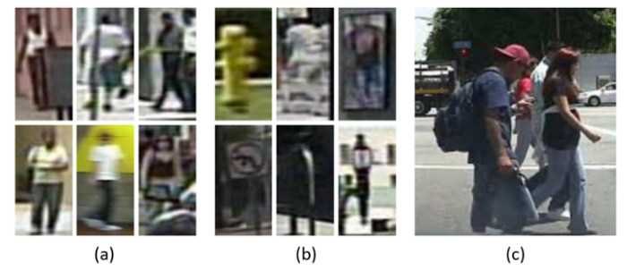
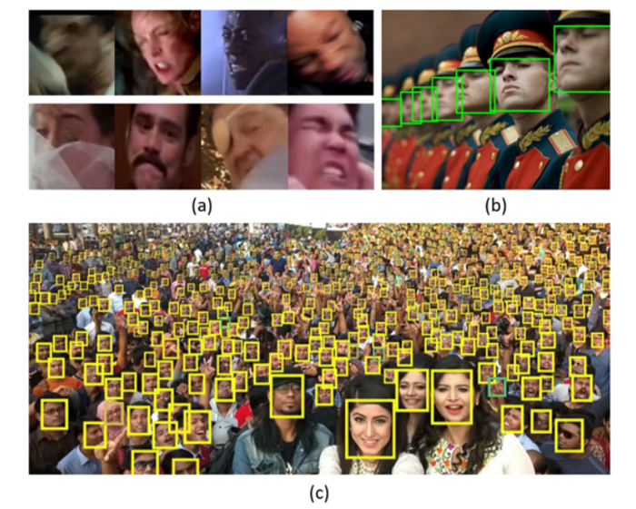
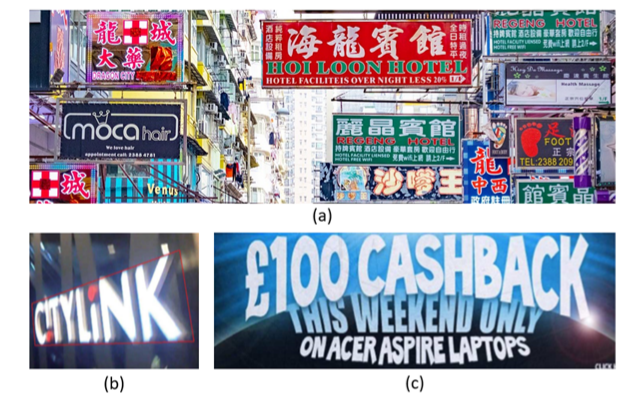
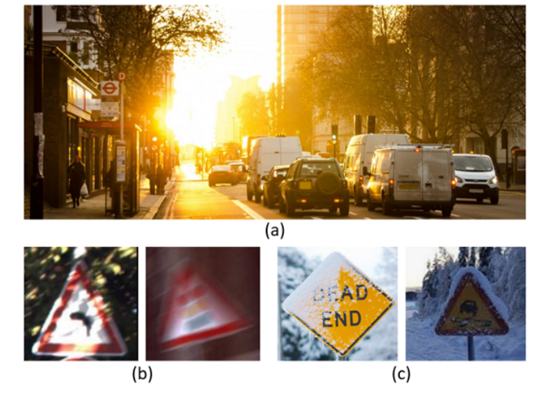
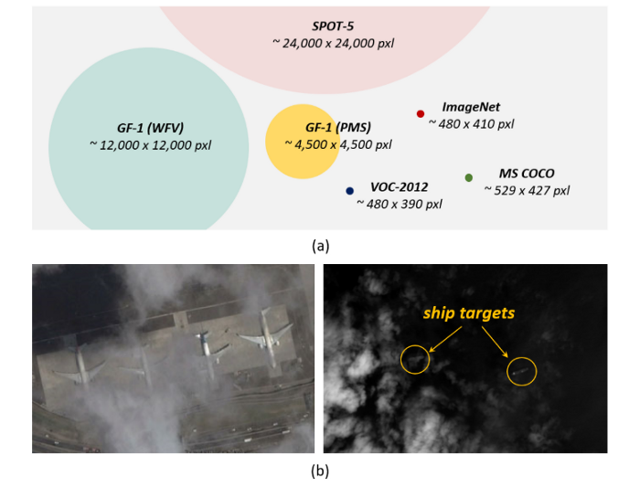

# Object Detection in 20 Years: A Survey (Part 8: Applications and Future Directions)

**Original Paper:** [Object Detection in 20 Years: A Survey](https://arxiv.org/abs/1905.05055)

# Pedestrian Detection

Pedestrian detection, as an important object detection application, has received extensive attention in many areas such as autonomous driving, video surveillance, criminal investigation, etc. Some early time’s pedestrian detection methods laid a solid foundation for general object detection in terms of:

- **Feature representation:** HOG detector [[*Histograms of Oriented Gradients for Human Detection*](http://lear.inrialpes.fr/people/triggs/pubs/Dalal-cvpr05.pdf)], ICF detector [[*Integral Channel Features*](https://authors.library.caltech.edu/60048/1/dollarBMVC09ChnFtrs.pdf)]
- **Design of classifier:** [[*Classification using intersection kernel support vector machines is efficient*](https://ieeexplore.ieee.org/document/4587630)]
- **Detection acceleration:** [[*Fast Human Detection Using a Cascade of Histograms of Oriented Gradients*](https://ieeexplore.ieee.org/document/1640933)].

In recent years, some general object detection algorithms have been introduced to pedestrian detection and have greatly promoted the progress of this area: e.g., Faster RCNN [[*Faster R-CNN: Towards Real-Time Object Detection with Region Proposal Networks*](https://arxiv.org/abs/1506.01497)*,* [*Is Faster R-CNN Doing Well for Pedestrian Detection?*](https://arxiv.org/abs/1607.07032)].

## Difficulties and Challenges

**Fig. 20.** Some hard examples of pedestrian detection from Caltech dataset

- **(a) Small pedestrians:** Some examples of the small pedestrians that are captured far from the camera. In Caltech Dataset, 15% of the pedestrians are less than 30 pixels in height.
- **(b) Hard negatives:** Some backgrounds in street view images are very similar to pedestrians in their visual appearance.
- **(c) Dense and occluded pedestrian:** Some examples of dense and occluded pedestrians. In the Caltech Dataset, pedestrians that haven’t been occluded only account for 29% of the total pedestrian instances.
- **Real-time detection:** The real-time pedestrian detection from HD video is crucial for some applications like autonomous driving and video surveillance.

## Traditional pedestrian detection methods

### Haar wavelet feature

Due to the limitations of computing resources, the **Haar wavelet feature** has been broadly used in early-time pedestrian detection. 

- [*A Trainable System for Object Detection*](https://link.springer.com/article/10.1023/A:1008162616689)
- [*Example-based object detection in images by components*](https://ieeexplore.ieee.org/document/917571)
- [*Detecting pedestrians using patterns of motion and appearance*](https://ieeexplore.ieee.org/document/1238422)

### Detection by components

To improve the detection of occluded pedestrians, one popular idea of that time was "**detection by components**", i.e., to think of the detection as an ensemble of multiple part detectors that trained individually on different human parts, e.g. head, legs, and arms.

- [*Example-based object detection in images by components*](https://ieeexplore.ieee.org/document/917571)
- [*Detection of multiple, partially occluded humans in a single image by Bayesian combination of edgelet part detectors*](https://ieeexplore.ieee.org/document/1541243)
- [*An HOG-LBP human detector with partial occlusion handling*](https://ieeexplore.ieee.org/document/5459207)

### Gradient-based representation

With the increase of computing power, people started to design more complex detection models, and since 2005, **gradient-based representation**:

- [*Histograms of Oriented Gradients for Human Detection*](http://lear.inrialpes.fr/people/triggs/pubs/Dalal-cvpr05.pdf)
- [*Fast Human Detection Using a Cascade of Histograms of Oriented Gradients*](https://ieeexplore.ieee.org/document/1640933)
- [*An HOG-LBP human detector with partial occlusion handling*](https://ieeexplore.ieee.org/document/5459207)
- [*Detecting Pedestrians by Learning Shapelet Features*](https://ieeexplore.ieee.org/document/4270159)

and **DPM** have become the mainstream of pedestrian detection.

- [*Object Detection with Discriminatively Trained Part-Based Models*](https://ieeexplore.ieee.org/document/5255236)
- [*Object Detection with Grammar Models*](https://proceedings.neurips.cc/paper/2011/file/6faa8040da20ef399b63a72d0e4ab575-Paper.pdf)
- [*30Hz Object Detection with DPM V5*](https://link.springer.com/chapter/10.1007/978-3-319-10590-1_5) 

### Integral Channel Features (ICF)

In 2009, by using the integral image acceleration, an effective and lightweight feature representation: **the Integral Channel Features (ICF)**, was proposed [[*Integral Channel Features*](https://authors.library.caltech.edu/60048/1/dollarBMVC09ChnFtrs.pdf)]. ICF then became the new benchmark of pedestrian detection at that time [[*Pedestrian Detection: An Evaluation of the State of the Art*](https://ieeexplore.ieee.org/document/5975165)].

### Domain knowledge

In addition to the feature representation, some **domain knowledge** also has been considered, such as appearance constancy and shape symmetry:

- [*Pedestrian Detection Inspired by Appearance Constancy and Shape Symmetry*](https://ieeexplore.ieee.org/abstract/document/7569095)

and stereo information:

- [*Pedestrian detection at 100 frames per second*](https://ieeexplore.ieee.org/document/6248017)
- [*Stixels estimation without depth map computation*](https://ieeexplore.ieee.org/document/6130495)

## Deep learning based pedestrian detection methods

### Improve small pedestrian detection

Although deep learning object detectors such as Fast/Faster R-CNN have shown state of the art performance for general object detection, they have limited success for detecting small pedestrians due to the low resolution of their convolutional features. Some recent solutions to this problem include:

- Feature fusion: [[*Is Faster R-CNN Doing Well for Pedestrian Detection?*](https://arxiv.org/abs/1607.07032)]
- Introducing extra high-resolution handcrafted features: [[*Learning Multilayer Channel Features for Pedestrian Detection*](https://arxiv.org/abs/1603.00124), [*What Can Help Pedestrian Detection?*](https://arxiv.org/abs/1705.02757)]
- Ensembling detection results on multiple resolutions: [[*Pushing the Limits of Deep CNNs for Pedestrian Detection*](https://arxiv.org/abs/1603.04525)]

### Improve hard negative detection

Some recent improvements include the integration of:

- Boosted decision tree: [[*Is Faster R-CNN Doing Well for Pedestrian Detection?*](https://arxiv.org/abs/1607.07032)]
- Semantics segmentation (as the context of the pedestrians): [[*Pedestrian Detection aided by Deep Learning Semantic Tasks*](https://arxiv.org/abs/1412.0069)]
- In addition, the idea of "cross-modal learning" has also been introduced to enrich the feature of hard negatives by using both RGB and infrared images [[*Learning Cross-Modal Deep Representations for Robust Pedestrian Detection*](https://arxiv.org/abs/1704.02431)].

### Improve dense and occluded pedestrian detection

As mentioned in the paper, the features in deeper layers of CNN have richer semantics but are not effective for detecting dense objects.

- To this end, some researchers have designed new loss function by considering the attraction of target and the repulsion of other surrounding objects [[*Repulsion Loss: Detecting Pedestrians in a Crowd*](https://arxiv.org/abs/1711.07752)].
- Target occlusion is another problem that usually comes up with dense pedestrians. The ensemble of part detectors [[*Deep Learning Strong Parts for Pedestrian Detection*](https://ieeexplore.ieee.org/document/7410578), [*Jointly Learning Deep Features, Deformable Parts, Occlusion and Classification for Pedestrian Detection*](https://ieeexplore.ieee.org/document/8008790)] and the attention mechanism [[*Occluded Pedestrian Detection Through Guided Attention in CNNs*](https://ieeexplore.ieee.org/document/8578829)] are the most common ways to improve occluded pedestrian detection.

# Face Detection

Face detection is one of the oldest computer vision appliations. Early time's face detection, such as the VJ detector [[*Rapid Object Detection using a Boosted Cascade of Simple Features*](https://www.cs.cmu.edu/~efros/courses/LBMV07/Papers/viola-cvpr-01.pdf)], has greatly promoted the object detection where many of its remarkable ideas are still playing important roles even in today's object detection.

## Difficulties and Challenges

**Fig. 21.** Challenges in face detection.

- **(a) Intra-class variation:** (image from WildestFaces Dataset) Human faces may present a variety of expressions, skin colors, poses, and movements.
- **(b) Face occlusion:** (image from UFDD Dataset) Faces may be partially occluded by other objects.
- **(c) Multi-scale face detection:** (image from P. Hu et al. CVPR2017) Detecting faces in a large variety of scales, especially for some tiny faces.
- **Real-time detection:** Face detection on mobile devices usually requires a CPU real-time detection speed.

## Early time’s face detection (before 2001)

The early time’s face detection algorithms can be divided into three groups:

- **Rule-based methods.** This group of methods encode human knowledge of what constitutes a typical face and capture the relationships between facial elements.

  - [*Human face detection in a complex background*](https://www.sciencedirect.com/science/article/abs/pii/0031320394900175)
  - [*Finding face features*](https://link.springer.com/chapter/10.1007/3-540-55426-2_12)

- **Subspace analysis-based methods.** This group of methods analyze the face distribution in underlying linear subspace. Eigenfaces is the representative of this group of methods.

  -  [*Eigenfaces for Recognition*](https://direct.mit.edu/jocn/article/3/1/71/3025/Eigenfaces-for-Recognition)
  - [*View-based and modular eigenspaces for face recognition*](https://ieeexplore.ieee.org/document/323814)

- **Learning based methods.** To frame the face detection as a sliding window + binary classification (target vs background) process. Some commonly used models of this group include neural network:

  - [*Original approach for the localisation of objects in images*](https://www.semanticscholar.org/paper/Original-approach-for-the-localisation-of-objects-Vaillant-Monrocq/09ebd9ad4fa21c0d56433ac57a4cd69e94c72281)
  - [*Human face detection in visual scenes*](http://citeseerx.ist.psu.edu/viewdoc/download?doi=10.1.1.889.3962&rep=rep1&type=pdf)
  - [*Neural network-based face detection*](https://ieeexplore.ieee.org/document/655647)

  and SVM:

  - [*A general framework for object detection*](https://ieeexplore.ieee.org/document/710772)
  - [*Training support vector machines: an application to face detection*](https://ieeexplore.ieee.org/document/609310)

## Traditional face detection (2000–2015)

There are two groups of face detectors in this period.

- The first group of methods are built based on **boosted decision trees**. These methods are easy to compute, but usually suffer from low detection accuracy under complex scenes.
  - [*Rapid Object Detection using a Boosted Cascade of Simple Features*](https://www.cs.cmu.edu/~efros/courses/LBMV07/Papers/viola-cvpr-01.pdf)
  - [*Robust Real-Time Face Detection*](https://link.springer.com/article/10.1023/B:VISI.0000013087.49260.fb)
  - [*Boosting chain learning for object detection*](https://ieeexplore.ieee.org/document/1238417)
- The second group is based on **early time’s convolutional neural networks**, where the shared computation of features are used to speed up detection.
  - [*A neural architecture for fast and robust face detection*](https://ieeexplore.ieee.org/document/1048232)
  - [*Synergistic Face Detection and Pose Estimation with Energy-Based Models*](https://link.springer.com/chapter/10.1007/11957959_10)

## Deep learning based face detection (after 2015)

In deep learning era, most of the face detection algorithms follow the detection idea of the general object detectors such as Faster RCNN and SSD.

### Speed up face detection

Cascaded detection is the most common way to speed up a face detector in deep learning era.

- [*A convolutional neural network cascade for face detection*](https://ieeexplore.ieee.org/document/7299170)
- [*Joint Face Detection and Alignment using Multi-task Cascaded Convolutional Networks*](https://arxiv.org/abs/1604.02878)

Another speed up method is to predict the scale distribution of the faces in an image [[*Scale-Aware Face Detection*](https://arxiv.org/abs/1706.09876)] and then run detection on some selected scales.

### Improve multi-pose and occluded face detection

The idea of "face calibration" has been used to improve multi-pose face detection by: 

- estimating the calibration parameters [[*Supervised Transformer Network for Efficient Face Detection*](https://arxiv.org/abs/1607.05477)] or
- using progressive calibration through multiple detection stages [[*Real-Time Rotation-Invariant Face Detection with Progressive Calibration Networks*](https://arxiv.org/abs/1804.06039)].

### Improve occluded face detection

Two methods have been proposed recently. 

- The first one is to incorporate "attention mechanism" so that to highlight the features of underlying face targets [[*Face Attention Network: An Effective Face Detector for the Occluded Faces*](https://arxiv.org/abs/1711.07246)]. 
- The second one is "detection based on parts" [[*Faceness-Net: Face Detection through Deep Facial Part Responses*](https://arxiv.org/abs/1701.08393)], which inherits ideas from DPM.

### Improve multi-scale face detection

Recent works on multi-scale face detection use similar detection strategies as those in general object detection, including multi-scale feature fusion and multi-resolution detection.

- [*Finding Tiny Faces*](https://arxiv.org/abs/1612.04402)
- [*Face Detection through Scale-Friendly Deep Convolutional Networks*](https://arxiv.org/abs/1706.02863)
- [*SSH: Single Stage Headless Face Detector*](https://arxiv.org/abs/1708.03979)
- [*S³FD: Single Shot Scale-invariant Face Detector*](https://arxiv.org/abs/1708.05237)

# Text Detection

Text has long been the major information carrier of the human for thousands of years. The fundamental goal of text detection is to determine whether or not there is text in a given image, and if there is, to localize, and recognize it. Text detection has very broad applications.

It **helps** **people who are visually impaired** to "read" street signs and currency.

- [*A camera phone based currency reader for the visually impaired*](https://dl.acm.org/doi/10.1145/1414471.1414551)
- [*Improved text-detection methods for a camera-based text reading system for blind persons*](https://ieeexplore.ieee.org/document/1575549)

In **geographic information systems**, the detection and recognition of house numbers and street signs make it easier to build digital maps.

- [*Convolutional Neural Networks Applied to House Numbers Digit Classification*](https://arxiv.org/abs/1204.3968)
- [*Attention-based Extraction of Structured Information from Street View Imagery*](https://arxiv.org/abs/1704.03549)

## Difficulties and Challenges

**Fig. 22.** Challenges in text detection and recognition.

- **(a) Different fonts and languages:** (image from maxpixel) Texts may have different fonts, colors, and languages.
- **(b) Text rotation and perspective distortion:** (image from Y. Liu et al. CVPR2017) Texts may have different orientations and even may have perspective distortion.
- **(c) Densely arranged text localization:** (image from Y. Wu et al. ICCV2017) Text lines with large aspect ratios and dense layout are difficult to localize accurately.
- **Broken and blurred characters:** Broken and blurred characters are common in street view images.

## Step-wise detection vs integrated detection

### Step-wise detection methods

It consists of a series of processing steps including character segmentation, candidate region verification, character grouping, and word recognition.

- [*Scene Text Localization and Recognition with Oriented Stroke Detection*](https://ieeexplore.ieee.org/abstract/document/6751121)
- [*Robust Text Detection in Natural Scene Images*](https://arxiv.org/abs/1301.2628)

**Advantage:** Most of the background can be filtered in the coarse segmentation step, which greatly reduces the computational cost of the following process.

**Disadvantage:** The parameters of all steps need to be set carefully, and the errors will occur and accumulate throughout each of these steps.

### Integrated methods

It frames the text detection as a joint probability inference problem, where the steps of character localization, grouping, and recognition are processed under a unified framework.

- [*End-to-end scene text recognition*](https://ieeexplore.ieee.org/document/6126402)
- [*End-to-end text recognition with convolutional neural networks*](https://ieeexplore.ieee.org/document/6460871)
- [*Text Flow: A Unified Text Detection System in Natural Scene Images*](https://arxiv.org/abs/1604.06877)
- [*Deep Features for Text Spotting*](https://link.springer.com/chapter/10.1007/978-3-319-10593-2_34)

**Advantage:** It avoids the cumulative error and is easy to integrate language models.

**Disadvantage:** The inference will be computationally expensive when considering a large number of character classes and candidate windows.

## Traditional methods vs deep learning methods

### Traditional methods

Most of the traditional text detection methods generate text candidates in an **unsupervised way**, where the commonly used techniques include:

- Maximally Stable Extremal Regions (MSER) segmentation [[*Robust Text Detection in Natural Scene Images*](https://arxiv.org/abs/1301.2628)]
- Morphological filtering [[*Multi-Orientation Scene Text Detection with Adaptive Clustering*](https://ieeexplore.ieee.org/document/7001081)]

Some **domain knowledge**, such as the symmetry of texts and the structures of strokes, also have been considered in these methods: 

- [*Scene Text Localization and Recognition with Oriented Stroke Detection*](https://ieeexplore.ieee.org/abstract/document/6751121)
- [*Robust Text Detection in Natural Scene Images*](https://arxiv.org/abs/1301.2628)
- [*Symmetry-based text line detection in natural scenes*](https://ieeexplore.ieee.org/document/7298871)

In recent years, researchers have paid more attention to the problem of **text localization** rather than recognition. Two groups of methods are proposed recently.

- The first group of methods frame the text detection as a **special case of general object detection**. These methods have a unified detection framework, but it is less effective for detecting texts with orientation or with large aspect ratio.
  - [*Single Shot Text Detector with Regional Attention*](https://arxiv.org/abs/1709.00138)
  - [*Reading Text in the Wild with Convolutional Neural Networks*](https://arxiv.org/abs/1412.1842)
- The second group of methods frame the text detection as an **image segmentation** problem. The advantage of these methods is there are no special restrictions for the shape and orientation of text, but the disadvantage is that it is not easy to distinguish densely arranged text lines from each other based on the segmentation result. 
  - [*Deep Matching Prior Network: Toward Tighter Multi-oriented Text Detection*](https://arxiv.org/abs/1703.01425)
  - [*Self-Organized Text Detection with Minimal Post-processing via Border Learning*](https://ieeexplore.ieee.org/document/8237797)
  - [*Scene Text Detection via Holistic, Multi-Channel Prediction*](https://arxiv.org/abs/1606.09002)
  - [*Accurate Scene Text Detection through Border Semantics Awareness and Bootstrapping*](https://arxiv.org/abs/1807.03547)
  - [*Multi-Oriented Scene Text Detection via Corner Localization and Region Segmentation*](https://arxiv.org/abs/1802.08948)

### Deep learning methods

The recent deep learning based text detection methods have proposed some solutions to the above problems.

### Text rotation and perspective changes

The most common solution to this problem is to introduce additional parameters in anchor boxes and RoI pooling layer that are associated with rotation and perspective changes.

- [*Arbitrary-Oriented Scene Text Detection via Rotation Proposals*](https://arxiv.org/abs/1703.01086)
-  [*R2CNN: Rotational Region CNN for Orientation Robust Scene Text Detection*](https://arxiv.org/abs/1706.09579)
- [*Deep Direct Regression for Multi-Oriented Scene Text Detection*](https://arxiv.org/abs/1703.08289)
- [*Deep Matching Prior Network: Toward Tighter Multi-oriented Text Detection*](https://arxiv.org/abs/1703.01425)
- [*EAST: An Efficient and Accurate Scene Text Detector*](https://arxiv.org/abs/1704.03155)

### Improve densely arranged text detection

The segmentation-based approach shows more advantages in detecting densely arranged texts. To distinguish the adjacent text lines, two groups of solutions have been proposed recently. 

- The first one is "**segment and linking**", where "segment" refers to the character heatmap, and "linking" refers to the connection between two adjacent segments indicating that they belong to the same word or line of text.
  - [*Deep Matching Prior Network: Toward Tighter Multi-oriented Text Detection*](https://arxiv.org/abs/1703.01425)
  - [*Scene Text Detection via Holistic, Multi-Channel Prediction*](https://arxiv.org/abs/1606.09002)
- The second group is to introduce an **additional corner/border detection task** to help separate densely arrange texts, where a group of corners or a closed boundary corresponds to an individual line of text.
  - [*Self-Organized Text Detection with Minimal Post-processing via Border Learning*](https://ieeexplore.ieee.org/document/8237797)
  - [*Accurate Scene Text Detection through Border Semantics Awareness and Bootstrapping*](https://arxiv.org/abs/1807.03547)
  - [*Multi-Oriented Scene Text Detection via Corner Localization and Region Segmentation*](https://arxiv.org/abs/1802.08948)

### Improve broken and blurred text detection

A recent idea to deal with broken and blurred texts is to use **word level** recognition:

- [*Synthetic Data and Artificial Neural Networks for Natural Scene Text Recognition*](https://arxiv.org/abs/1406.2227)
- [*Detecting Text in Natural Image with Connectionist Text Proposal Network*](https://arxiv.org/abs/1609.03605)

and **sentence level** recognition [[*Attention-based Extraction of Structured Information from Street View Imagery*](https://arxiv.org/abs/1704.03549)]. 

To deal with texts with different fonts, the most effective way is training with **synthetic samples**.

- [*Synthetic Data and Artificial Neural Networks for Natural Scene Text Recognition*](https://arxiv.org/abs/1406.2227)
- [*Reading Text in the Wild with Convolutional Neural Networks*](https://arxiv.org/abs/1412.1842)

# Traffic Sign and Traffic Light Detection

With the development of self-driving technology, the automatic detection of traffic sign and traffic light has attracted great attention in recent years.

## Difficulties and Challenges

**Fig. 23.** Challenges in traffic sign detection and traffic light detection.

- **(a) Illumination changes:** (image from pxhere) The detection will be particularly difficult when driving into the sun glare or at night.
- **(b) Motion blur:** (image from GTSRB Dataset) The image captured by an on-board camera will become blurred due to the motion of the car.
- **(c) Detection under bad weather:** (image from Flickr and Max Pixel) In bad weathers, e.g., rainy and snowy days, the image quality will be affected.
- **Real-time detection:** This is particularly important for autonomous driving.

## Traditional detection methods

As traffic sign/light has particular shape and color, the traditional detection methods are usually based on:

**Color thresholding:**

- [*Automatic Detection and Classification of Traffic Signs*](https://ieeexplore.ieee.org/document/4279118)
-  [*Traffic sign recognition and analysis for intelligent vehicles*](https://www.sciencedirect.com/science/article/abs/pii/S0262885602001567)
- [*Road traffic sign detection in color images*](https://ieeexplore.ieee.org/document/1301930)
- [*Road-Sign Detection and Recognition Based on Support Vector Machines*](https://ieeexplore.ieee.org/document/4220659)
- [*Traffic light detection with color and edge information*](https://ieeexplore.ieee.org/document/5234518)

**Visual saliency detection:** [[*Unifying visual saliency with HOG feature learning for traffic sign detection*](https://ieeexplore.ieee.org/abstract/document/5164247)]

**Morphological filtering:** [[*Real time visual traffic lights recognition based on Spot Light Detection and adaptive traffic lights templates*](https://ieeexplore.ieee.org/document/5164304?denied=)]

**Edge/contour analysis:** 

- [*A single target voting scheme for traffic sign detection*](https://ieeexplore.ieee.org/document/5940429)
- [*Fast and Robust Traffic Sign Detection*](https://ieeexplore.ieee.org/document/1571333)

As the above methods are merely designed based on low-level vision, they usually fail under complex environments, therefore, some researchers began to find other solutions **beyond vision-based approaches**, e.g., to combine GPS and digital maps in traffic light detection.

- [*Traffic light mapping and detection*](https://ieeexplore.ieee.org/document/5980164)
- [*Traffic light mapping, localization, and state detection for autonomous vehicles*](https://ieeexplore.ieee.org/document/5979714)

## Deep learning based detection methods

In deep learning era, some well-known detectors such as Faster RCNN and SSD were applied in traffic sign/light detection tasks.

- [*Traffic-Sign Detection and Classification in the Wild*](https://ieeexplore.ieee.org/document/7780601)
- [*A deep learning approach to traffic lights: Detection, tracking, and classification*](https://ieeexplore.ieee.org/document/7989163)
- [*Traffic signal detection and classification in street views using an attention model*](https://link.springer.com/article/10.1007/s41095-018-0116-x)
- [*Deep Convolutional Traffic Light Recognition for Automated Driving*](https://ieeexplore.ieee.org/document/8569522)

On basis on these detectors, some new techniques, such as the attention mechanism and adversarial training have been used to improve detection under complex traffic environments.

- [*Perceptual Generative Adversarial Networks for Small Object Detection*](https://arxiv.org/abs/1706.05274)
- [*Traffic signal detection and classification in street views using an attention model*](https://link.springer.com/article/10.1007/s41095-018-0116-x)

# Remote Sensing Target Detection

Remote sensing imaging technique has opened a door for people to better understand the earth. In recent years, as the resolution of remote sensing images has increased, remote sensing target detection (e.g., the detection of airplane, ship, oil-pot, etc), has become a research hot-spot. Remote sensing target detection has broad applications, such as military investigation, disaster rescue, and urban traffic management.

## Difficulties and Challenges

**Fig. 24.** Challenges in remote sensing target detection.

- **(a) Detection in "big data":** A comparison on data volume between remote sensing images and natural images (VOC, ImageNet, and MS-COCO). Due to the huge data volume of remote sensing images, how to quickly and accurately detect remote sensing targets remains a problem.
- **(b) Targets occluded by cloud:** (images from S. Qiu et al. JSTARS2017 and Z. Zou et al. TGRS2016) Over 50% of the earth's surface is covered by cloud every day.
- **Domain adaptation:** Remote sensing images captured by different sensors (e.g., with different modulates and resolutions) present a high degree of differences.

## Traditional detection methods

Most of the traditional remote sensing target detection methods follow a **two-stage detection paradigm**:

### Stage 1: Candidate extraction

Some frequently used methods include:

**Gray value filtering based methods:** 

- [*Characterization of a Bayesian Ship Detection Method in Optical Satellite Images*](https://ieeexplore.ieee.org/document/5291776)
- [*A Novel Hierarchical Method of Ship Detection from Spaceborne Optical Image Based on Shape and Texture Features*](https://ieeexplore.ieee.org/document/5454348)

**Visual saliency-based methods:** 

- [*Unsupervised Ship Detection Based on Saliency and S-HOG Descriptor From Optical Satellite Images*](https://ieeexplore.ieee.org/document/7059210)
- [*A Visual Search Inspired Computational Model for Ship Detection in Optical Satellite Images*](https://ieeexplore.ieee.org/document/6145735)
- [*Efficient, simultaneous detection of multi-class geospatial targets based on visual saliency modeling and discriminative learning of sparse coding*](https://www.sciencedirect.com/science/article/abs/pii/S0924271614000033)
- [*Object Detection in Optical Remote Sensing Images Based on Weakly Supervised Learning and High-Level Feature Learning*](https://ieeexplore.ieee.org/document/6991537)

**Wavelet transform based methods:** [[*Compressed-Domain Ship Detection on Spaceborne Optical Image Using Deep Neural Network and Extreme Learning Machine*](https://ieeexplore.ieee.org/abstract/document/6866146)]

**Anomaly detection based methods:** [[*Ship Detection in High-Resolution Optical Imagery Based on Anomaly Detector and Local Shape Feature*](https://ieeexplore.ieee.org/document/6650006)]

One similarity of the above methods is they are all **unsupervised methods**, thus usually fail in complex environments.

### Stage 2: Target verification 

In target verification stage, some frequently used features include:

**HOG (Histogram of oriented gradients):** 

- [*Ship Detection in High-Resolution Optical Imagery Based on Anomaly Detector and Local Shape Feature*](https://ieeexplore.ieee.org/document/6650006)
- [*Vehicle Detection Using Partial Least Squares*](https://ieeexplore.ieee.org/document/5601737)

**LBP (Local Binary Pattern):** [[*A Novel Hierarchical Method of Ship Detection from Spaceborne Optical Image Based on Shape and Texture Features*](https://ieeexplore.ieee.org/document/5454348)]

**SIFT (Scale-invariant feature transform):**

- [*A Visual Search Inspired Computational Model for Ship Detection in Optical Satellite Images*](https://ieeexplore.ieee.org/document/6145735)
- [*Object Detection in Optical Remote Sensing Images Based on Weakly Supervised Learning and High-Level Feature Learning*](https://ieeexplore.ieee.org/document/6991537)
- [*Affine Invariant Description and Large-Margin Dimensionality Reduction for Target Detection in Optical Remote Sensing Images*](https://ieeexplore.ieee.org/abstract/document/7932197)

Besides, there are also some other methods following the **sliding window detection paradigm:**

- [*Vehicle Detection Using Partial Least Squares*](https://ieeexplore.ieee.org/document/5601737)
- [*Affine Invariant Description and Large-Margin Dimensionality Reduction for Target Detection in Optical Remote Sensing Images*](https://ieeexplore.ieee.org/abstract/document/7932197)
- [*Robust Vehicle Detection in Aerial Images Using Bag-of-Words and Orientation Aware Scanning*](https://ieeexplore.ieee.org/document/8412109)
- [*Detection of Cars in High-Resolution Aerial Images of Complex Urban Environments*](https://ieeexplore.ieee.org/document/7982952)

To detect targets with particular structure and shape such as oil-pots and inshore ships, some **domain knowledge** is used. 

- For example, the **oil-pot detection** can be considered as circle/arc detection problem.
  - [*A Hierarchical Oil Tank Detector With Deep Surrounding Features for High-Resolution Optical Satellite Imagery*](https://ieeexplore.ieee.org/document/7229258)
  - [*Framework design and implementation for oil tank detection in optical satellite imagery*](https://ieeexplore.ieee.org/document/6352236)
- The **inshore ship detection** can be considered as the detection of the foredeck and the stern.
  - [*A New Method on Inshore Ship Detection in High-Resolution Satellite Images Using Shape and Context Information*](https://ieeexplore.ieee.org/document/6600859)
  - [*Automatic Detection of Inshore Ships in High-Resolution Remote Sensing Images Using Robust Invariant Generalized Hough Transform*](https://ieeexplore.ieee.org/document/6812149)

To improve the occluded target detection, one commonly used idea is **"detection by parts"**: 

- [*Occluded Object Detection in High-Resolution Remote Sensing Images Using Partial Configuration Object Model*](https://ieeexplore.ieee.org/document/7855669)
- [*An On-Road Vehicle Detection Method for High-Resolution Aerial Images Based on Local and Global Structure Learning*](https://ieeexplore.ieee.org/abstract/document/7937949)

To detect targets with different orientations, the **"mixture model"** is used by training different detectors for targets of different orientations [[*Multi-class geospatial object detection and geographic image classification based on collection of part detectors*](https://www.sciencedirect.com/science/article/abs/pii/S0924271614002524)].

## Deep learning based detection methods

After the great success of RCNN in 2014, **deep CNN** has been soon applied to remote sensing target detection.

- [*RIFD-CNN: Rotation-Invariant and Fisher Discriminative Convolutional Neural Networks for Object Detection*](https://ieeexplore.ieee.org/document/7780684)
- [*Learning Rotation-Invariant Convolutional Neural Networks for Object Detection in VHR Optical Remote Sensing Images*](https://ieeexplore.ieee.org/document/7560644)
- [*Efficient Saliency-Based Object Detection in Remote Sensing Images Using Deep Belief Networks*](https://ieeexplore.ieee.org/document/7378278)
- [*Airport Detection on Optical Satellite Images Using Deep Convolutional Neural Networks*](https://ieeexplore.ieee.org/document/7946140)

The general object detection framework like **Faster RCNN and SSD** have attracted increasing attention in remote sensing community.

- [*Random Access Memories: A New Paradigm for Target Detection in High Resolution Aerial Remote Sensing Images*](https://ieeexplore.ieee.org/document/8106808)
- [*Vehicle Detection in Aerial Images Based on Region Convolutional Neural Networks and Hard Negative Example Mining*](https://www.ncbi.nlm.nih.gov/pmc/articles/PMC5335960/)
- [*Ship Detection in Spaceborne Optical Image With SVD Networks*](https://ieeexplore.ieee.org/document/7493617)
- [*Can a Machine Generate Humanlike Language Descriptions for a Remote Sensing Image?*](https://ieeexplore.ieee.org/document/7891049)
- [*An Efficient and Robust Integrated Geospatial Object Detection Framework for High Spatial Resolution Remote Sensing Imagery*](https://www.mdpi.com/2072-4292/9/7/666)
- [*Deformable ConvNet with Aspect Ratio Constrained NMS for Object Detection in Remote Sensing Imagery*](https://www.mdpi.com/2072-4292/9/12/1312)
- [*Integrated Localization and Recognition for Inshore Ships in Large Scene Remote Sensing Images*](https://ieeexplore.ieee.org/abstract/document/7911301)

Due to the **huge different between a remote sensing image and an everyday image**, some investigations have been made on the effectiveness of deep CNN features for remote sensing images.

- [*Do deep features generalize from everyday objects to remote sensing and aerial scenes domains?*](https://ieeexplore.ieee.org/document/7301382)
- [*Fast Vehicle Detection in Aerial Imagery*](https://arxiv.org/abs/1709.08666)
- [*Comprehensive Analysis of Deep Learning-Based Vehicle Detection in Aerial Images*](https://ieeexplore.ieee.org/document/8485630)
- People discovered that in spite of its great success, the deep CNN is no better than traditional methods for spectral data [[*Do deep features generalize from everyday objects to remote sensing and aerial scenes domains?*](https://ieeexplore.ieee.org/document/7301382)].

To detect targets with different orientations, some researchers have improved the ROI Pooling layer for **better rotation invariance**.

- [*Online Exemplar-Based Fully Convolutional Network for Aircraft Detection in Remote Sensing Images*](https://ieeexplore.ieee.org/document/8356628)
- [*Rotated region based CNN for ship detection*](https://ieeexplore.ieee.org/document/8296411)

To improve **domain adaptation**, some researchers formulated the detection from a Bayesian view that at the detection stage, the model is adaptively updated based on the distribution of test images [[*Random Access Memories: A New Paradigm for Target Detection in High Resolution Aerial Remote Sensing Images*](https://ieeexplore.ieee.org/document/8106808)].

In addition, the attention mechanisms and feature fusion strategy also have been used to improve **small target detection**.

- [*Fully Convolutional Network With Task Partitioning for Inshore Ship Detection in Optical Remote Sensing Images*](https://ieeexplore.ieee.org/document/8000357)
- [*Maritime Semantic Labeling of Optical Remote Sensing Images with Multi-Scale Fully Convolutional Network*](https://www.mdpi.com/2072-4292/9/5/480)

# Future Directions

The future research of object detection may focus but is not limited to the following aspects:

- **Lightweight object detection:** To speed up the detection algorithm so that it can run smoothly on **mobile devices**. Some important applications include mobile augmented reality, smart cameras, face verification, etc.
- **Detection meets AutoML:** Recent deep learning based detectors are becoming more and more sophisticated and heavily relies on experiences. A future direction is to reduce human intervention when **designing the detection model** (e.g., how to design the engine and how to set anchor boxes) by using neural architecture search.
- **Detection meets domain adaptation:** The training process of any target detector can be essentially considered as a likelihood estimation process under the assumption of independent and identically distributed (i.i.d.) data. Object detection with non-i.i.d. data, especially for some real-world applications, still remains a challenge. GAN has shown promising results in domain adaptation and may be of great help to object detection in the future.
- **Weakly supervised detection:** The training of a deep learning based detector usually relies on a large amount of well-annotated images. The annotation process is time-consuming, expensive, and inefficient. Developing weakly supervised detection techniques where the detectors are **only trained with image-level annotations**, or partially with bounding box annotations is of great importance for reducing labor costs and improving detection flexibility.
- **Small object detection:** Detecting small objects in large scenes has long been a challenge. Some potential application of this research direction includes counting the population of wild animals with remote sensing images and detecting the state of some important military targets. Some further directions may include the integration of the **visual attention mechanisms** and the design of **high resolution lightweight** networks.
- **Detection in videos:** Real-time object detection/tracking in HD videos is of great importance for video surveillance and autonomous driving. Traditional object detectors are usually designed under for image-wise detection, while simply ignores the correlations between videos frames. Improving detection by **exploring the spatial and temporal correlation** is an important research direction.
- **Detection with information fusion:** Object detection with multiple sources/modalities of data, e.g., RGB-D image, 3d point cloud, LIDAR, etc, is of great importance for autonomous driving and drone applications. Some open questions include: how to immigrate well-trained detectors to **different modalities of data**, how to make information fusion to improve detection, etc.