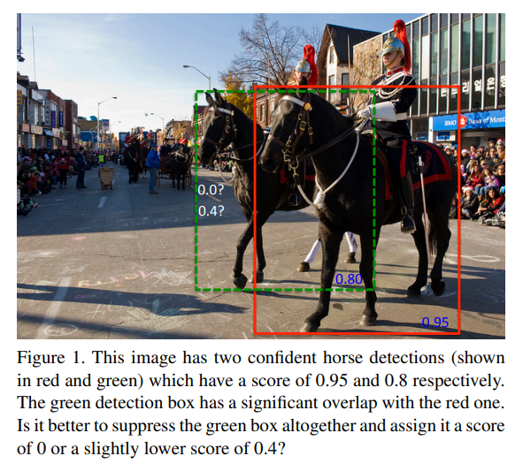
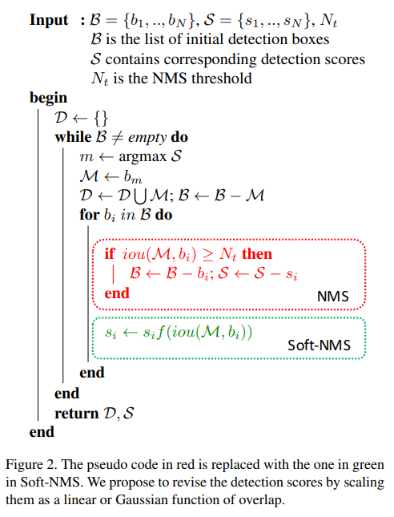

# Non-maximum suppression

## NMS

```python
def nms(np.ndarray[np.float32_t, ndim=2] dets, np.float thresh):
    cdef np.ndarray[np.float32_t, ndim=1] x1 = dets[:, 0]
    cdef np.ndarray[np.float32_t, ndim=1] y1 = dets[:, 1]
    cdef np.ndarray[np.float32_t, ndim=1] x2 = dets[:, 2]
    cdef np.ndarray[np.float32_t, ndim=1] y2 = dets[:, 3]
    cdef np.ndarray[np.float32_t, ndim=1] scores = dets[:, 4]

    cdef np.ndarray[np.float32_t, ndim=1] areas = (x2 - x1 + 1) * (y2 - y1 + 1)
    cdef np.ndarray[np.int_t, ndim=1] order = scores.argsort()[::-1]

    cdef int ndets = dets.shape[0]
    cdef np.ndarray[np.int_t, ndim=1] suppressed = \
            np.zeros((ndets), dtype=np.int)

    # nominal indices
    cdef int _i, _j
    # sorted indices
    cdef int i, j
    # temp variables for box i's (the box currently under consideration)
    cdef np.float32_t ix1, iy1, ix2, iy2, iarea
    # variables for computing overlap with box j (lower scoring box)
    cdef np.float32_t xx1, yy1, xx2, yy2
    cdef np.float32_t w, h
    cdef np.float32_t inter, ovr

    keep = []
    for _i in range(ndets):
        i = order[_i]
        # if it has already been suppressed by other boxes
        if suppressed[i] == 1:
            continue
        keep.append(i)
        ix1 = x1[i]
        iy1 = y1[i]
        ix2 = x2[i]
        iy2 = y2[i]
        iarea = areas[i]
        for _j in range(_i + 1, ndets):
            j = order[_j]
            if suppressed[j] == 1:
                continue
            # calculate iou between two boxes
            xx1 = max(ix1, x1[j])
            yy1 = max(iy1, y1[j])
            xx2 = min(ix2, x2[j])
            yy2 = min(iy2, y2[j])
            w = max(0.0, xx2 - xx1 + 1)
            h = max(0.0, yy2 - yy1 + 1)
            inter = w * h
            ovr = inter / (iarea + areas[j] - inter)
            # suppress when iou is above certain threshold
            if ovr >= thresh:
                suppressed[j] = 1

    return keep
```

## Soft NMS

reference: https://paperswithcode.com/method/soft-nms





```python
nms_algorithm = {
    "nms": 0,
    "linear_soft_nms": 1, 
    "exp_soft_nms": 2
}
soft_nms_merge(top_bboxes[j + 1], Nt=nms_threshold, method=nms_algorithm, weight_exp=weight_exp)
```

```python
def soft_nms(np.ndarray[float, ndim=2] boxes, float sigma=0.5, float Nt=0.3, float threshold=0.001, unsigned int method=0):
    cdef unsigned int N = boxes.shape[0]
    cdef float iw, ih, box_area
    cdef float ua
    cdef int pos = 0
    cdef float maxscore = 0
    cdef int maxpos = 0
    cdef float x1,x2,y1,y2,tx1,tx2,ty1,ty2,ts,area,weight,ov

    for i in range(N):
        maxscore = boxes[i, 4]
        maxpos = i

        tx1 = boxes[i,0]
        ty1 = boxes[i,1]
        tx2 = boxes[i,2]
        ty2 = boxes[i,3]
        ts = boxes[i,4]

        pos = i + 1
        # get max box
        while pos < N:
            if maxscore < boxes[pos, 4]:
                maxscore = boxes[pos, 4]
                maxpos = pos
            pos = pos + 1

        # add max box as a detection 
        boxes[i,0] = boxes[maxpos,0]
        boxes[i,1] = boxes[maxpos,1]
        boxes[i,2] = boxes[maxpos,2]
        boxes[i,3] = boxes[maxpos,3]
        boxes[i,4] = boxes[maxpos,4]

        # swap ith box with position of max box
        boxes[maxpos,0] = tx1
        boxes[maxpos,1] = ty1
        boxes[maxpos,2] = tx2
        boxes[maxpos,3] = ty2
        boxes[maxpos,4] = ts

        tx1 = boxes[i,0]
        ty1 = boxes[i,1]
        tx2 = boxes[i,2]
        ty2 = boxes[i,3]
        ts = boxes[i,4]

        pos = i + 1
        # NMS iterations, note that N changes if detection boxes fall below threshold
        while pos < N:
            x1 = boxes[pos, 0]
            y1 = boxes[pos, 1]
            x2 = boxes[pos, 2]
            y2 = boxes[pos, 3]
            s = boxes[pos, 4]

            area = (x2 - x1 + 1) * (y2 - y1 + 1)
            iw = (min(tx2, x2) - max(tx1, x1) + 1)
            if iw > 0:
                ih = (min(ty2, y2) - max(ty1, y1) + 1)
                if ih > 0:
                    ua = float((tx2 - tx1 + 1) * (ty2 - ty1 + 1) + area - iw * ih)
                    ov = iw * ih / ua #iou between max box and detection box

                    if method == 1: # linear
                        if ov > Nt: 
                            weight = 1 - ov
                        else:
                            weight = 1
                    elif method == 2: # gaussian
                        weight = np.exp(-(ov * ov)/sigma)
                    else: # original NMS
                        if ov > Nt: 
                            weight = 0
                        else:
                            weight = 1

                    boxes[pos, 4] = weight*boxes[pos, 4]
                                
                    # if box score falls below threshold, discard the box by swapping with last box
                    # update N
                    if boxes[pos, 4] < threshold:
                        boxes[pos,0] = boxes[N-1, 0]
                        boxes[pos,1] = boxes[N-1, 1]
                        boxes[pos,2] = boxes[N-1, 2]
                        boxes[pos,3] = boxes[N-1, 3]
                        boxes[pos,4] = boxes[N-1, 4]
                        N = N - 1
                        pos = pos - 1

            pos = pos + 1

    keep = [i for i in range(N)]
    return keep
```

## Soft NMS Merge

For multi-scale inference

```python
def soft_nms_merge(np.ndarray[float, ndim=2] boxes, float sigma=0.5, float Nt=0.3, float threshold=0.001, unsigned int method=0, float weight_exp=6):
    cdef unsigned int N = boxes.shape[0]
    cdef float iw, ih, box_area
    cdef float ua
    cdef int pos = 0
    cdef float maxscore = 0
    cdef int maxpos = 0
    cdef float x1,x2,y1,y2,tx1,tx2,ty1,ty2,ts,area,weight,ov
    # extra
    cdef float mx1,mx2,my1,my2,mts,mbs,mw

    for i in range(N):
        maxscore = boxes[i, 4]
        maxpos = i

        tx1 = boxes[i,0]
        ty1 = boxes[i,1]
        tx2 = boxes[i,2]
        ty2 = boxes[i,3]
        ts = boxes[i,4]

        pos = i + 1
        # get max box
        while pos < N:
            if maxscore < boxes[pos, 4]:
                maxscore = boxes[pos, 4]
                maxpos = pos
            pos = pos + 1

        # add max box as a detection 
        boxes[i,0] = boxes[maxpos,0]
        boxes[i,1] = boxes[maxpos,1]
        boxes[i,2] = boxes[maxpos,2]
        boxes[i,3] = boxes[maxpos,3]
        boxes[i,4] = boxes[maxpos,4]

        # detections = torch.cat([bboxes, scores, tl_scores, br_scores, clses], dim=2)
        mx1 = boxes[i, 0] * boxes[i, 5]
        my1 = boxes[i, 1] * boxes[i, 5]
        mx2 = boxes[i, 2] * boxes[i, 6]
        my2 = boxes[i, 3] * boxes[i, 6]
        mts = boxes[i, 5]
        mbs = boxes[i, 6]

        # swap ith box with position of max box
        boxes[maxpos,0] = tx1
        boxes[maxpos,1] = ty1
        boxes[maxpos,2] = tx2
        boxes[maxpos,3] = ty2
        boxes[maxpos,4] = ts

        tx1 = boxes[i,0]
        ty1 = boxes[i,1]
        tx2 = boxes[i,2]
        ty2 = boxes[i,3]
        ts = boxes[i,4]

        pos = i + 1
        # NMS iterations, note that N changes if detection boxes fall below threshold
        while pos < N:
            x1 = boxes[pos, 0]
            y1 = boxes[pos, 1]
            x2 = boxes[pos, 2]
            y2 = boxes[pos, 3]
            s = boxes[pos, 4]

            area = (x2 - x1 + 1) * (y2 - y1 + 1)
            iw = (min(tx2, x2) - max(tx1, x1) + 1)
            if iw > 0:
                ih = (min(ty2, y2) - max(ty1, y1) + 1)
                if ih > 0:
                    ua = float((tx2 - tx1 + 1) * (ty2 - ty1 + 1) + area - iw * ih)
                    ov = iw * ih / ua #iou between max box and detection box

                    if method == 1: # linear
                        if ov > Nt: 
                            weight = 1 - ov
                        else:
                            weight = 1
                    elif method == 2: # gaussian
                        weight = np.exp(-(ov * ov)/sigma)
                    else: # original NMS
                        if ov > Nt: 
                            weight = 0
                        else:
                            weight = 1

                    mw  = (1 - weight) ** weight_exp
                    mx1 = mx1 + boxes[pos, 0] * boxes[pos, 5] * mw
                    my1 = my1 + boxes[pos, 1] * boxes[pos, 5] * mw
                    mx2 = mx2 + boxes[pos, 2] * boxes[pos, 6] * mw
                    my2 = my2 + boxes[pos, 3] * boxes[pos, 6] * mw
                    mts = mts + boxes[pos, 5] * mw
                    mbs = mbs + boxes[pos, 6] * mw

                    boxes[pos, 4] = weight*boxes[pos, 4]
                                
                    # if box score falls below threshold, discard the box by swapping with last box
                    # update N
                    if boxes[pos, 4] < threshold:
                        boxes[pos,0] = boxes[N-1, 0]
                        boxes[pos,1] = boxes[N-1, 1]
                        boxes[pos,2] = boxes[N-1, 2]
                        boxes[pos,3] = boxes[N-1, 3]
                        boxes[pos,4] = boxes[N-1, 4]
                        N = N - 1
                        pos = pos - 1

            pos = pos + 1

        boxes[i, 0] = mx1 / mts
        boxes[i, 1] = my1 / mts
        boxes[i, 2] = mx2 / mbs
        boxes[i, 3] = my2 / mbs

    keep = [i for i in range(N)]
    return keep
```

