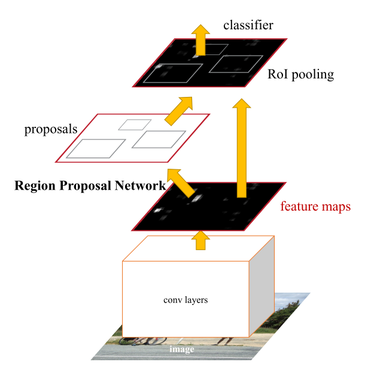
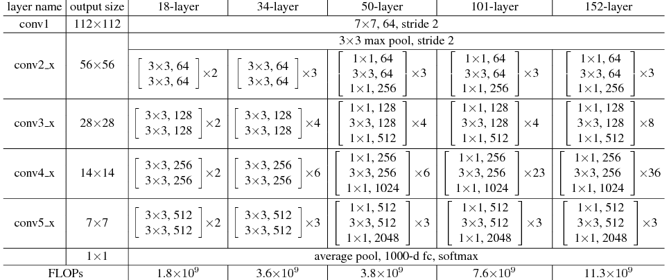

# FasterRCNN




```python
model = FasterRCNN(
    num_classes=20,
    anchor_scales=[8, 16, 32],
    backbone='resnet50',
    pretrained=False,
)
```

## initialize

```python
class FasterRCNN(nn.Module):
    def __init__(
        self,
        num_classes,
        mode="training",
        feat_stride=16,
        anchor_scales=[8, 16, 32],
        ratios=[0.5, 1, 2],
        backbone="resnet50",
        pretrained=False,
    ):
        super(FasterRCNN, self).__init__()
        self.feat_stride = feat_stride
```

## backbone (resnet50)

```python
        # self.extractor: model.layer3
        # classifier: model.layer4, model.avgpool
        self.extractor, classifier = resnet50(pretrained)
```



```python
def resnet50(pretrained = False):
    model = ...
    features = list([
        model.conv1, model.bn1, model.relu, model.maxpool, 
        model.layer1, model.layer2, model.layer3
    ])
    classifier = list([model.layer4, model.avgpool])
    features = nn.Sequential(*features)
    classifier = nn.Sequential(*classifier)
    
    return features, classifier
```

## rpn

Details: [rpn](rpn.md)

```python
        self.rpn = RegionProposalNetwork(
            in_channels=1024,
            mid_channels=512,
            ratios=[0.5, 1, 2],
            anchor_scales=[8, 16, 32],
            feat_stride=16,
            mode="training",
        )
```

## head

Details: [roi_head](roi_head.md)

```python
        self.head = Resnet50RoIHead(
            n_class=num_classes + 1,
            roi_size=14,
            spatial_scale=1,
            classifier=classifier,
        )
```

## forward

```python
    def forward(self, x, scale=1.0):
        img_size = x.shape[2:]
        
        # get feature
        # resnet50: model.layer3, (1024, 14, 14)
        base_feature = self.extractor.forward(x)
        
        # get proposal boxes
        _, _, rois, roi_indices, _ = self.rpn.forward(
            base_feature, img_size, scale
        )
        
        # get final predictions
        roi_cls_locs, roi_scores = self.head.forward(
            base_feature, rois, roi_indices, img_size
        )
        return roi_cls_locs, roi_scores, rois, roi_indices
```

