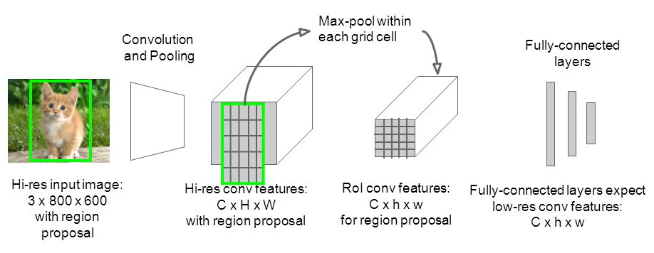

# RoIHead

```python
        self.head = Resnet50RoIHead(
            n_class=num_classes + 1,
            roi_size=14,
            spatial_scale=1,
            classifier=classifier,
        )
```

## initialize

```python
class Resnet50RoIHead(nn.Module):
    def __init__(self, n_class, roi_size, spatial_scale, classifier):
        super(Resnet50RoIHead, self).__init__()
        self.classifier = classifier
        self.cls_loc = nn.Linear(2048, n_class * 4)
        self.score = nn.Linear(2048, n_class)
        normal_init(self.cls_loc, 0, 0.001)
        normal_init(self.score, 0, 0.01)
        
        # from torchvision.ops import RoIPool
        self.roi = RoIPool((roi_size, roi_size), spatial_scale)
```

## roi pooling

Reference: https://github.com/Parsa33033/RoiPooling

The last max-pooling layer is replaced by an RoI pooling layer that is configured by setting H and W to be compatible with the net’s first fully connected layer (e.g., `H = W = 7` for VGG16). Similar to SPPNet but only with one pyramid level (`H × W`).



Each RoI is defined by a four-tuple `(r, c, h, w)` that specifies its top-left corner `(r, c)` and its height and width `(h, w)`. RoI max-pooling works by dividing the `h × w` RoI window into a `H × W` grid of sub-windows of approximate size `h/H × w/W` and then max-pooling the values in each sub-window into the corresponding output grid cell. Pooling is applied independently to each feature map channel, as in standard max pooling.

```python
# self.roi = RoIPool((roi_size, roi_size), spatial_scale)
class RoIPool(nn.Module):
    def __init__(self, output_size: BroadcastingList2[int], spatial_scale: float):
        super(RoIPool, self).__init__()
        self.output_size = output_size
        # self.output_size = (roi_size, roi_size)
        self.spatial_scale = spatial_scale

    def forward(self, input: Tensor, rois: Tensor) -> Tensor:
        return roi_pool(input, rois, self.output_size, self.spatial_scale)
        # return.shape: [K, C, roi_size, roi_size]
    
torchvision.ops.roi_pool(
    input,
    boxes=rois,
    output_size=self.output_size,
    spatial_scale=self.spatial_scale
)
```

## forward

```python
    def forward(self, x, rois, roi_indices, img_size):
        n, _, _, _ = x.shape
        rois_feature_map = torch.zeros_like(rois)
        rois_feature_map[:, [0, 2]] = rois[:, [0, 2]] / img_size[1] * x.size()[3]
        rois_feature_map[:, [1, 3]] = rois[:, [1, 3]] / img_size[0] * x.size()[2]

        indices_and_rois = torch.cat([roi_indices[:, None], rois_feature_map], dim=1)
        # x.shape: (n, 1024, 14, 14)
        pool = self.roi(x, indices_and_rois)
        
        # classifier = list([model.layer4, model.avgpool])
        fc7 = self.classifier(pool)
        fc7 = fc7.view(fc7.size(0), -1)
        # fc7.shape: (..., 2048)
        
        # self.cls_loc = nn.Linear(2048, n_class * 4)
        roi_cls_locs = self.cls_loc(fc7)
        # self.score = nn.Linear(2048, n_class)
        roi_scores = self.score(fc7)
        
        roi_cls_locs = roi_cls_locs.view(n, -1, roi_cls_locs.size(1))
        roi_scores = roi_scores.view(n, -1, roi_scores.size(1))
        return roi_cls_locs, roi_scores
```

