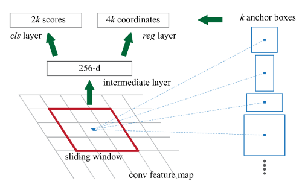
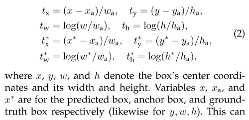

# RegionProposalNetwork



A Region Proposal Network (RPN) is a fully convolutional network that takes an image (of any size) as input and **outputs a set of rectangular object proposals, each with an objectness score.** It shares a common set of convolutional layers with a Fast R-CNN object detection network.

## initialize

```python
class RegionProposalNetwork(nn.Module):
    def __init__(
        self,
        in_channels=1024,
        mid_channels=512,
        ratios=[0.5, 1, 2],
        anchor_scales=[8, 16, 32],
        feat_stride=16,
        mode="training",
    ):
        super(RegionProposalNetwork, self).__init__()
```

## generate_anchor_base

```python
        self.anchor_base = generate_anchor_base(
            anchor_scales=anchor_scales, ratios=ratios
        )
        n_anchor = self.anchor_base.shape[0]
```

An anchor is centered at the sliding window and is associated with a scale and aspect ratio. In the paper, 3 different scales (`128², 256², 512²`) and aspect ratios (`1:1, 1:2, 2:1`) are used, yielding `k = 9 anchors` at each sliding window. Thus for a convolutional feature map of a size `W × H`, there are `WHk anchors` in total.

```python
def generate_anchor_base(
    base_size=16, 
    ratios=[0.5, 1, 2], 
    anchor_scales=[8, 16, 32]
):
    anchor_base = np.zeros(
        (len(ratios) * len(anchor_scales), 4), dtype=np.float32
    )
    # anchor_base.shape: (9, 4)
    # [8, 16, 32] * 16 = [128, 256, 512]
    
    for i in range(len(ratios)):
        for j in range(len(anchor_scales)):
            h = base_size * anchor_scales[j] * np.sqrt(ratios[i])
            w = base_size * anchor_scales[j] * np.sqrt(1. / ratios[i])
            index = i * len(anchor_scales) + j
            anchor_base[index, 0] = - h / 2.
            anchor_base[index, 1] = - w / 2.
            anchor_base[index, 2] = h / 2.
            anchor_base[index, 3] = w / 2.
    return anchor_base

anchor_base = array([
    [ -45.254833,  -90.50967 ,   45.254833,   90.50967 ],
    [ -90.50967 , -181.01933 ,   90.50967 ,  181.01933 ],
    [-181.01933 , -362.03867 ,  181.01933 ,  362.03867 ],
    [ -64.      ,  -64.      ,   64.      ,   64.      ],
    [-128.      , -128.      ,  128.      ,  128.      ],
    [-256.      , -256.      ,  256.      ,  256.      ],
    [ -90.50967 ,  -45.254833,   90.50967 ,   45.254833],
    [-181.01933 ,  -90.50967 ,  181.01933 ,   90.50967 ],
    [-362.03867 , -181.01933 ,  362.03867 ,  181.01933 ]
], dtype=float32)
```

## features and heads

To generate region proposals, a small network slides over the convolutional feature map output by the last shared convolutional layer. This small network takes an `n × n` (`n = 3` in the paper) spatial window of the input convolutional feature map as input. 

Each sliding window is mapped to a lower-dimensional feature and fed into **two sibling fully-connected layers — a box-regression layer (reg) and a box-classification layer (cls).** Because the mini-network operates in a sliding window fashion, the fully connected layers are shared across all spatial locations.

At each sliding window location, `k region proposals` are predicted simultaneously. So the reg layer outputs `4k coordinates` and the cls layer outputs `2k scores`. The `k proposals` are parameterized relative to `k reference boxes`, which are called **anchors**. 

```python
        # rpn network
        self.conv1 = nn.Conv2d(in_channels, mid_channels, 3, 1, 1)
        
        # objectness score
        self.score = nn.Conv2d(mid_channels, n_anchor * 2, 1, 1, 0)
        
        # box regression
        self.loc = nn.Conv2d(mid_channels, n_anchor * 4, 1, 1, 0)

        self.feat_stride = feat_stride
        
        # weight initialization
        normal_init(self.conv1, 0, 0.01)
        normal_init(self.score, 0, 0.01)
        normal_init(self.loc, 0, 0.01)
```

## proposal_layer

```python
        self.proposal_layer = ProposalCreator(mode)
```

```python
class ProposalCreator:
    def __init__(
        self,
        mode,
        nms_iou=0.7,
        n_train_pre_nms=12000,
        n_train_post_nms=600,
        n_test_pre_nms=3000,
        n_test_post_nms=300,
        min_size=16,
    ):
        # ...
    def __call__(self, loc, score, anchor, img_size, scale=1.0):
        if self.mode == "training":
            n_pre_nms = self.n_train_pre_nms
            n_post_nms = self.n_train_post_nms
        else:
            n_pre_nms = self.n_test_pre_nms
            n_post_nms = self.n_test_post_nms

        anchor = torch.from_numpy(anchor).cuda()
        # (dx, dy, dw, dh) -> (xmin, ymin, xmax, ymax)
        roi = loc2bbox(anchor, loc)
        
        # remove invalid boxes
        roi[:, [0, 2]] = torch.clamp(roi[:, [0, 2]], min=0, max=img_size[1])
        roi[:, [1, 3]] = torch.clamp(roi[:, [1, 3]], min=0, max=img_size[0])
        min_size = self.min_size * scale
        keep = torch.where(
            ((roi[:, 2] - roi[:, 0]) >= min_size)
            & ((roi[:, 3] - roi[:, 1]) >= min_size)
        )[0]
        roi = roi[keep, :]
        score = score[keep]
        
        # rank boxes by scores
        order = torch.argsort(score, descending=True)
        if n_pre_nms > 0:
            order = order[:n_pre_nms]
        roi = roi[order, :]
        score = score[order]
        
        # nms on boxes
        # from torchvision.ops import nms
        keep = nms(roi, score, self.nms_iou)
        keep = keep[:n_post_nms]
        roi = roi[keep]
        return roi
```



The bounding box regression adopts the parameterizations of the `4 coordinates`. This can be thought of as bounding-box regression from an anchor box to a nearby ground-truth box.

```python
# roi = loc2bbox(anchor, loc)
def loc2bbox(src_bbox, loc):
    if src_bbox.size()[0] == 0:
        return torch.zeros((0, 4), dtype=loc.dtype)

    src_width = torch.unsqueeze(src_bbox[:, 2] - src_bbox[:, 0], -1)
    src_height = torch.unsqueeze(src_bbox[:, 3] - src_bbox[:, 1], -1)
    src_ctr_x = torch.unsqueeze(src_bbox[:, 0], -1) + 0.5 * src_width
    src_ctr_y = torch.unsqueeze(src_bbox[:, 1], -1) + 0.5 * src_height

    dx = loc[:, 0::4]
    dy = loc[:, 1::4]
    dw = loc[:, 2::4]
    dh = loc[:, 3::4]

    ctr_x = dx * src_width + src_ctr_x
    ctr_y = dy * src_height + src_ctr_y
    w = torch.exp(dw) * src_width
    h = torch.exp(dh) * src_height

    dst_bbox = torch.zeros_like(loc)
    dst_bbox[:, 0::4] = ctr_x - 0.5 * w
    dst_bbox[:, 1::4] = ctr_y - 0.5 * h
    dst_bbox[:, 2::4] = ctr_x + 0.5 * w
    dst_bbox[:, 3::4] = ctr_y + 0.5 * h

    return dst_bbox
```

## forward

```python
_, _, rois, roi_indices, _ = self.rpn.forward(
    base_feature, img_size, scale
)
```

```python
    def forward(self, x, img_size, scale=1.0):
        # x.shape: (n, 1024, 14, 14)
        n, _, h, w = x.shape
        
        # self.conv1 = nn.Conv2d(1024, 512, 3, 1, 1)
        x = F.relu(self.conv1(x))
        # x.shape: (n, 512, 14, 14)
        
        # self.loc = nn.Conv2d(512, 9 * 4, 1, 1, 0)
        rpn_locs = self.loc(x)
        # rpn_locs.shape: (n, 36, 14, 14)
        rpn_locs = rpn_locs.permute(0, 2, 3, 1).contiguous().view(n, -1, 4)
        
        # self.score = nn.Conv2d(512, 9 * 2, 1, 1, 0)
        rpn_scores = self.score(x)
        rpn_scores = rpn_scores.permute(0, 2, 3, 1).contiguous().view(n, -1, 2)

        # rpn_softmax_scores[:, :, 1]: objectness score
        rpn_softmax_scores = F.softmax(rpn_scores, dim=-1)
        rpn_fg_scores = rpn_softmax_scores[:, :, 1].contiguous()
        rpn_fg_scores = rpn_fg_scores.view(n, -1)

        anchor = _enumerate_shifted_anchor(
            np.array(self.anchor_base), self.feat_stride, h, w
        )
        # anchor.shape: (K * A, 4)

        rois = list()
        roi_indices = list()
        for i in range(n):
            # get roi for each image
            roi = self.proposal_layer(
                loc=rpn_locs[i], 
                score=rpn_fg_scores[i], 
                anchor=anchor, 
                img_size=img_size, 
                scale=scale
            )
            batch_index = i * torch.ones((len(roi),))
            rois.append(roi)
            roi_indices.append(batch_index)

        rois = torch.cat(rois, dim=0)
        roi_indices = torch.cat(roi_indices, dim=0)

        return rpn_locs, rpn_scores, rois, roi_indices, anchor
```

```python
def _enumerate_shifted_anchor(anchor_base, feat_stride, height, width):
    # calculate the grid center points
    shift_x = np.arange(0, width * feat_stride, feat_stride)
    shift_y = np.arange(0, height * feat_stride, feat_stride)
    shift_x, shift_y = np.meshgrid(shift_x, shift_y)
    shift = np.stack(
        (
            shift_x.ravel(),
            shift_y.ravel(),
            shift_x.ravel(),
            shift_y.ravel(),
        ),
        axis=1,
    )
    
    A = anchor_base.shape[0]
    K = shift.shape[0]
    anchor = anchor_base.reshape((1, A, 4)) + shift.reshape((K, 1, 4))
    anchor = anchor.reshape((K * A, 4)).astype(np.float32)
    return anchor
```