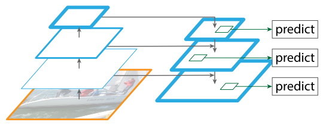
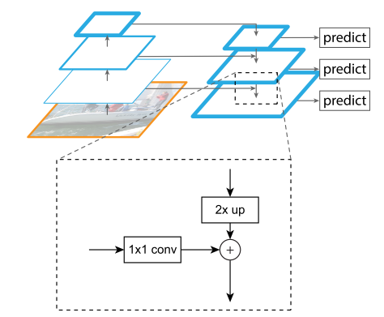
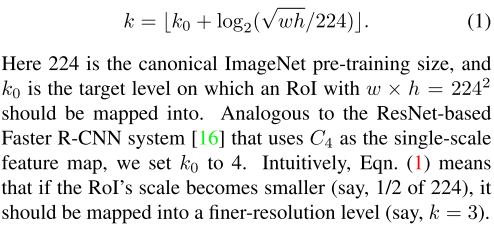

# Feature Pyramid Networks (2017)

**Original Paper:** [Feature Pyramid Networks for Object Detection](https://arxiv.org/abs/1612.03144)

## Improvement against Faster R-CNN

**Feature Pyramid Networks**

- Construct feature pyramids that have rich semantics at all levels with marginal extra cost by naturally leveraging the pyramidal shape of a ConvNet’s feature hierarchy.
- Using FPN in a basic Faster R-CNN system achieves SOTA performance.

## Test time detection

Same as the detection system it is applied to.

## Feature Pyramid Networks

The construction of the pyramid involves a (1) bottom-up pathway; a (2) top-down pathway, and (3) lateral connections.

### The bottom-up pathway

The bottom-up pathway is the feed-forward computation of the backbone ConvNet, which computes a feature hierarchy consisting of feature maps at several scales with **a scaling step of 2**. 

There are often many layers producing output maps of the same size and these layers are grouped in the same network stage. **One pyramid level is defined for each stage** and the output of the last later of each stage is chosen to form the reference set of feature maps. These feature maps will be enriched to create the feature pyramid.

Specifically, for ResNets, feature activations output by each stage’s last residual block are chosen. The output of these last residual blocks is denoted as `{C2, C3, C4, C5}` for `conv2, conv3, conv4, and conv5` outputs. They have strides of `{4, 8, 16, 32}` pixels with respect to the input image.

### The top-down pathway and lateral connections

The top-down pathway hallucinates higher resolution features by upsampling spatially coarser, but semantically stronger, feature maps from higher pyramid levels. These features are then enhanced with features from the bottom-up pathway via lateral connections. Each lateral connection merges feature maps of the same spatial size from the bottom-up pathway and the top-down pathway. The bottom-up feature map is of lower-level semantics, but its activations are more accurately localized as it was subsampled fewer times.

With a coarser-resolution feature map, we upsample the spatial resolution by a factor of 2 (nearest neighbor upsampling). The upsampled map is then merged with the corresponding bottom-up map (which undergoes a `1 × 1` convolutional layer to reduce channel dimensions) by element-wise addition. This process is iterated until the finest resolution map is generated.

To start the iteration, a `1 × 1` convolutional layer is attached on `C5` to produce the coarsest resolution map. Finally, a `3 × 3` convolution is appended on each merged map to generate the final feature map, aiming to reduce the aliasing effect of upsampling. This final set of feature maps is called `{P2, P3, P4, P5}`, corresponding to `{C2, C3, C4, C5}` that are respectively of the same spatial sizes.

Because all levels of the pyramid use shared classifiers/regressors as in a traditional featurized image pyramid, the feature dimension (numbers of channels, denoted as `d`) in all the feature maps are fixed (`d=256` in the paper) and thus all extra convolutional layers have d-channel outputs.

## Feature Pyramid Networks for RPN

In the original RPN design, a small subnetwork is evaluated on dense `3 × 3` sliding windows, on top of a single-scale convolutional feature map. It can be simply adapted by replacing the single-scale feature map with the FPN: **the same subnetwork is attached to each level on the feature pyramid.**

Because the subnetwork slides densely over all locations in all pyramid levels, **multi-scale anchors on a specific level are not necessary anymore.** Instead, the anchors are designed to have areas of `{32², 64², 128², 256², 512²}` pixels on `{P2, P3, P4, P5, P6}` respectively and have multiple aspect ratios `{1:2, 1:1, 2:1}` at each level. In total, there are `15 anchors` over the pyramid.

The training labels are assigned to the anchors following the same convention in Faster R-CNN. **Note that scales of ground-truth boxes are not explicitly used to assign them to the levels of the pyramid;** instead, ground-truth boxes are associated with anchors, which have been assigned to pyramid levels. The parameters of the subnetwork are shared across all feature pyramid levels since it’s believed that all levels of the pyramid share similar semantic levels.

## Feature Pyramid Networks for Fast R-CNN

Fast R-CNN uses RoI pooling to extract features and mostly performs on a single-scale feature map. To use it with FPN, **RoIs of different scales (produced by the RPN) need to be assigned to the pyramid levels**. An RoI of `width w and height h` is assigned to the level `P_k` of the feature pyramid by:

The predictor heads (in Fast R-CNN the heads are class-specific classifiers and bounding box regressors) are attached to all RoIs of all levels. Again, the heads all share parameters, regardless of their levels.