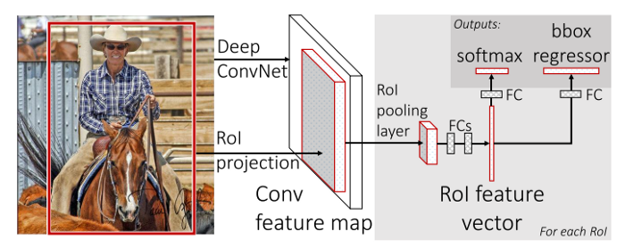
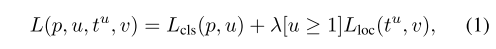
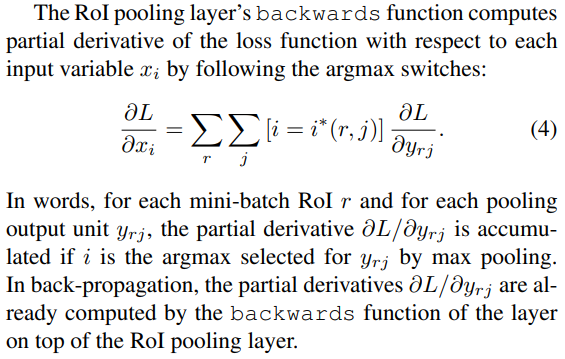
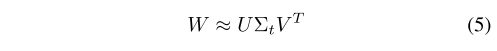

# Fast R-CNN (2015)

**Original Paper:** [Fast R-CNN](https://arxiv.org/abs/1504.08083)

## Improvement against R-CNN and SPPNet

- Higher detection quality (mAP).
- **Training is single-stage, using a multi-task loss.** Unlike R-CNN and SPPNet, training is a multi-stage pipeline.
- Training can update all network layers. Unlike SPPNet, the fine-tuning algorithm cannot update the convolutional layers that precede the spatial pyramid pooling.
- No disk storage is required for feature caching. For both R-CNN and SPPNet, SVMs and bounding-box regressor training require features are extracted and written to disk.

Fast R-CNN architecture

## Test time detection

- **Input image:** A test image.
- **Extract region proposals:** Extract ~2000 region proposals and name them as regions of interest (`RoIs`).
- **Compute CNN features:** Compute the feature maps of the entire image. Each RoI is pooled into a fixed-size feature map and then mapped to a feature vector by fully connected layers (`FCs`).
- **Classification and Bounding-box regression:** For each `RoI r`, the network produces two output vectors: softmax class probabilities and per-class bounding-box regression offsets relative to `r`.
- **Post-processing:** For each object class, assign detection confidence to r using the estimated probability of that class. Then perform non-maximum suppression independently for each class using the algorithm and settings from R-CNN.

## The RoI pooling layer

The RoI layer is simply **the special case of the spatial pyramid pooling layer used in SPPNet in which there is only one pyramid level**. 

Each RoI is defined by a four-tuple `(r, c, h, w)` that specifies its top-left corner `(r, c)` and its height and width `(h, w)`. RoI max-pooling works by dividing the `h × w` RoI window into a `H × W` grid of sub-windows of approximate size `h/H × w/W` and then max-pooling the values in each sub-window into the corresponding output grid cell. Pooling is applied independently to each feature map channel, as in standard max pooling.

## Initializing from pre-trained CNNs

The pre-trained CNN undergoes three transformations:

- The last max-pooling layer is replaced by an RoI pooling layer that is configured by **setting H and W to be compatible with the net’s first fully connected layer** (e.g., `H = W = 7` for VGG16). Similar to SPPNet but only with one pyramid level (`H × W`).

- The network’s last fully connected layer and softmax are replaced with the two sibling layers. With these two new layers, the class-specific SVMs and box regressor won’t be required anymore.
  - (1) a fully connected layer and softmax over `K + 1` categories; 
  - (2) **category-specific** bounding-box regressors. 
- The network is modified to take two data inputs: a list of images and a list of RoIs in those images.

## CNN domain-specific fine-tuning

Each training RoI is labeled with `a ground-truth class u` and `a ground-truth bounding-box regression target v`.

- **Foreground (positive)** **examples:** Object proposals that have `≥ 0.5 IoU` overlap with a ground-truth bounding box.
- **Background (negative) examples:** Object proposals that have a maximum IoU with ground truth in the interval `[0.1, 0.5)`.

Fast R-CNN uses a streamlined training process with one fine-tuning stage that jointly optimizes a softmax classifier and bounding-box regressors using a multi-task loss:

- `L_cls(p, u)`: The log loss for `true class u`.
- `[u ≥ 1]L_loc(tu, v)`: The robust L1 loss for bounding-box regression when `u ≥ 1`. `L_loc` is ignored for background RoIs.

- `Hyper-parameter λ` controls the balance between the two task losses.

Unlike SPPNet, where only the fully-connected layers are fine-tuned, Fast R-CNN updates all network layers by backpropagation through RoI pooling layers.

**Mini-batch:** (`size R=128`) Choose `N=2` images uniformly at random, sampling `64 RoIs` from each image, where 25% of the samples are foreground examples.

## Truncated SVD for faster detection

Large fully connected layers are accelerated by truncated SVD. A layer parameterized by the weight matrix `W (u × v)` is approximately factorized as

Truncated SVD reduces the parameter count from `uv` to `t(u + v)`, which can be significant if `t` is much smaller than `min(u, v)`.

## Drawbacks

Although Fast-RCNN successfully integrates the advantages of R-CNN and SPPNet, its detection speed is still limited by region proposals.