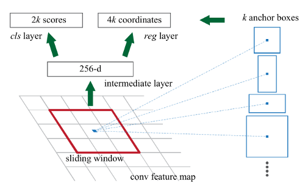
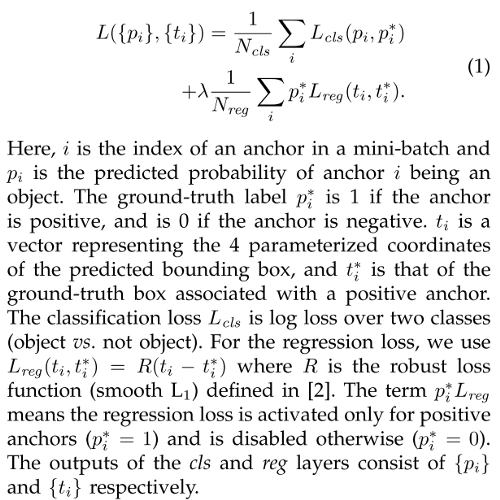
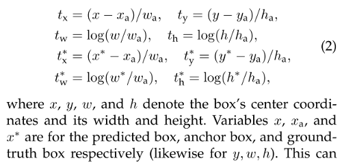

# Faster R-CNN (2015)

**Original Paper:** [Faster R-CNN: Towards Real-Time Object Detection with Region Proposal Networks](https://arxiv.org/abs/1506.01497)

## Improvement against Fast R-CNN

Faster R-CNN is a single, unified network for object detection.

- Get rid of region proposals by introducing **Region Proposal Network (RPN)**, where region proposals are generated directly from convolutional feature maps used by region-based detectors.
- The RPN is simply a kind of fully convolutional network (FCN) and can be trained end-to-end specifically for the task of generating detection proposals with a wide range of scales and aspect ratios.
- Faster R-CNN is a combination of a deep fully convolution network that proposes regions and the Fast R-CNN detector that uses the proposed regions. The entire system is a single, unified network for object detection.

## Test time detection

Similar to Fast R-CNN, but Faster R-CNN generates region proposals (from the RPN branch) and computes CNN features from the same network. Non-maximum suppression is adopted to reduce redundancy due to some highly overlap RPN proposals and finally yields ~2000 proposal regions per image.

## Region Proposal Network (RPN)

A Region Proposal Network (RPN) is a fully convolutional network that takes an image (of any size) as input and **outputs a set of rectangular object proposals, each with an objectness score.** It shares a common set of convolutional layers with a Fast R-CNN object detection network.

To generate region proposals, a small network slides over the convolutional feature map output by the last shared convolutional layer. This small network takes an `n × n` (`n = 3` in the paper) spatial window of the input convolutional feature map as input. 

Each sliding window is mapped to a lower-dimensional feature and fed into **two sibling fully-connected layers — a box-regression layer (reg) and a box-classification layer (cls).** Because the mini-network operates in a sliding window fashion, the fully connected layers are shared across all spatial locations.

At each sliding window location, `k region proposals` are predicted simultaneously. So the reg layer outputs `4k coordinates` and the cls layer outputs `2k scores`. The `k proposals` are parameterized relative to `k reference boxes`, which are called **anchors**. 

An anchor is centered at the sliding window and is associated with a scale and aspect ratio. In the paper, 3 different scales (`128², 256², 512²`) and aspect ratios (`1:1, 1:2, 2:1`) are used, yielding `k = 9 anchors` at each sliding window. Thus for a convolutional feature map of a size `W × H`, there are `WHk anchors` in total.

### RPN training

To train an RPN, a binary class label (an object or not) is assigned to each anchor.

- **Positive anchors:** 
  - (i) the anchor/anchors with the highest IoU overlap with a ground-truth box, or 
  - (ii) an anchor that has an IoU overlap higher than 0.7 with any ground-truth box.
- **Negative anchors:** if its IoU ratio is lower than 0.3 for all ground-truth boxes.
- **Other anchors:** anchors that are neither positive nor negative do not contribute to the training objective.

### Loss function for an image

The two terms are normalized by `N_cls` and `N_reg` and weighted by a `balancing parameter λ`. In the paper’s implementation, `N_cls = 256` is the mini-batch size; `N_reg ~ 2400` is the number of anchor locations. By default, `λ = 10` thus the two terms are roughly equally weighted.

### Bounding box regression

The bounding box regression adopts the parameterizations of the `4 coordinates`. This can be thought of as bounding-box regression from an anchor box to a nearby ground-truth box.

Since the features used for regression are of the same spatial size (`3 × 3`) on the feature maps, to account for varying sizes, a set of `k bounding-box regressors` are learned. Each regressor is responsible for one scale and one aspect ratio, and the k regressors do not share weights.

**Mini-batch:** (`size=256`) Choose a single image that contains many positive and negative example anchors. 256 anchors are sampled randomly, where the sampled positive and negative anchors have a ratio of up to `1:1`. If there are fewer than 128 positive samples in an image, the mini-batch is padded with negative ones.

## Sharing Features for RPN and Fast R-CNN

We adopt a pragmatic 4-step training algorithm to learn shared features via alternating optimization.

- **Step-1:** Train the RPN. This network is initialized with an ImageNet pre-trained model and fine-tuned end-to-end for the region proposal task.
- **Step-2:** Train a separate detection network by Fast R-CNN using the proposals generated by the step-1 RPN. This detection network is also initialized by the ImageNet pre-trained model.

At this point, the two networks do not share convolutional layers.

- **Step-3:** Use the detector network to initialize RPN training, but fix the shared convolutional layers and only fine-tune the layers unique to RPN.

Now the two networks share convolutional layers.

- **Step-4:** Keeping the shared convolutional layers fixed, fine-tune the unique layers of Fast R-CNN.

As such, both networks share the same convolutional layers and form a unified network.

