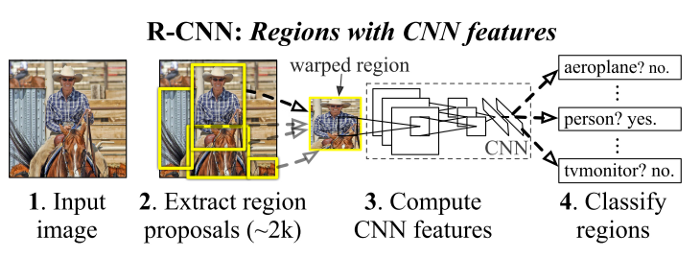

# R-CNN: Regions with CNN features (2014)

**Original Paper:** [Rich feature hierarchies for accurate object detection and semantic segmentation](https://arxiv.org/abs/1311.2524v5)

Object detection system overview.

## Test time detection

- **Input:** A test image.
- **Extract region proposals:** Extract ~2000 region proposals using selective search.
- **Compute CNN features:** Wrap each proposal and forward propagate it through a CNN (AlexNet).
- **Classify regions:** For each extracted feature vector, score it through a bunch of SVMs for each class. Apply a greedy non-maximum suppression for each class independently.
- **Bounding-box regression:** Post-process the prediction windows.

## CNN s**upervised pre-training**

Pre-trained the CNN (AlexNet) on the ImageNet dataset using image-level annotations only (bounding-box labels are not available for this data).

## CNN d**omain-specific fine-tuning**

To adapt the CNN to the new task (detection) and the new domain (warped proposal windows), the pre-trained CNN is further fine-tuned using the only warped region proposals.

**Image input:** For each proposal region, convert image data in that region into a fixed pixel size (`227 × 227`) as required by the CNN. Regardless of the size or aspect ratio of the candidate region, warp all pixels in a tight bounding box around it to the required size. The tight bounding box is created by dilating the original box so that at the warped size there are exactly `p (p = 16)` pixels of warped image context around the original box.

**Output layer:** The 1000-way classification layer is replaced with a randomly initialized `(N + 1)-way` classification layer `(N object classes + background)`. The training labels are defined as:

- **Positive examples:** Region proposals with `≥ 0.5 IoU` overlap with a ground-truth box as positives for that box’s class.
- **Negative examples:** Rest region proposals.

**Mini-batch:** `(size=128)` Uniformly sample 32 positive and 96 background examples.

## O**bject category classifiers**

Train class-specific linear SVMs. **The positive and negative examples are defined differently from fine-tuning:**

- **Positive examples:** Ground-truth bounding boxes for each class.
- **Negative examples:** Region proposals with `≤ 0.3 IoU` overlap with a ground-truth box as negatives for that box’s class.

Once features are extracted (from the fine-tuned CNN) and training labels are assigned, optimize one linear SVM per class adopting the standard hard negative mining method.

## Bounding-box regression

Train a linear regression model to predict a new detection window given the `pool5` features for a selective search region proposal.

## Drawbacks

The redundant feature computations on a large number of overlapped proposals (over **2000 boxes** from one image) lead to an extremely slow detection speed.