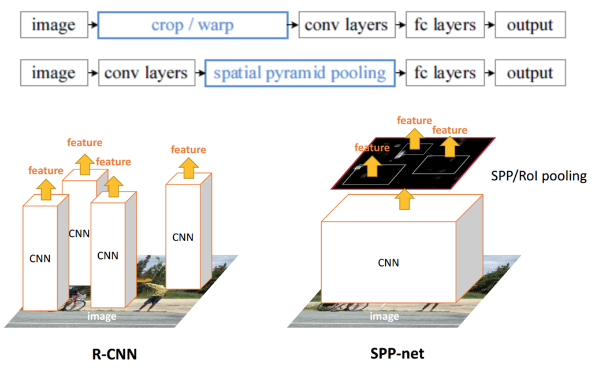
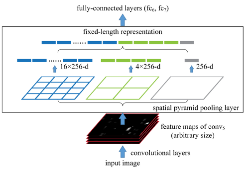
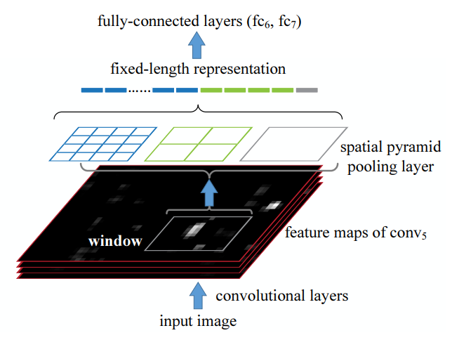

# Spatial Pyramid Pooling Networks: SPPNet (2014)

**Original Paper:** [Spatial Pyramid Pooling in Deep Convolutional Networks for Visual Recognition](https://arxiv.org/abs/1406.4729)

## Improvement against R-CNN

- R-CNN is slow because it repeatedly applies the deep convolutional network to **~2000** windows per image.
- SPPNet can run orders of magnitude faster than R-CNN because it allows running the convolutional layers only once on the entire image (possibly at multiple scales), and then extract features for each candidate windows on the feature maps.

## Test time detection

Similar to R-CNN, the only difference:

- **Compute CNN features:** Instead of computing features for each proposal region, compute the feature map on the entire image and then extract features for each proposal region on the feature map.

## The Spatial Pyramid Pooling Layer

A network structure with a spatial pyramid pooling layer. Here `256` is the filter number of the `conv5` layer, and `conv5` is the last convolutional layer.

**To extract features for proposal regions of various sizes from the feature map**, a spatial pyramid pooling layer is added on top of the last convolution layer. Spatial pyramid pooling can maintain spatial information by pooling (`max-pooling` in the paper) in local spatial bins. These spatial bins have sizes proportional to the image size, so **the number of bins is fixed regardless of the image size**. Thus SPP layer can accept inputs of arbitrary aspect ratios and scales and generates fixed-length outputs, which are then fed into the fully connected layers to generate the final features.

**Figure 5:** Pooling features from arbitrary windows on feature maps. The feature maps are computed from the entire image. The pooling is performed in candidate windows.

The outputs of the spatial pyramid pooling are `kM-dimensional` vectors with the number of bins denoted as `M` (`k` is the number of filters in the last convolutional layer). In the paper, for each candidate window, a `4-level` spatial pyramid (`1×1, 2×2, 3×3, 6×6, totally 50 bins`) is used to pool the features. This generates a `12,800-d (256×50)` representation for each window. These representations are provided to the fully connected layers of the network.

## CNN supervised pre-training

Pre-trained the CNN (**ZF-5**) on the ImageNet dataset using image-level annotations only, following R-CNN. However, there is a small modification to the CNN architecture: An `l-level` spatial pyramid pooling layer is added on top of the last convolutional layer, then the input of the next fully connected layer (`fc6`) is the concatenation of the `l` outputs.

## CNN domain-specific fine-tuning

Similar to the implementation in R-CNN. However, since the features are pooled from the `conv5` feature maps, for simplicity only the fully-connected layers are fine-tuned. In this case, the data layer accepts the fixed-length pooled features after `conv5`, and the `fc6,7` layers and a new `(N + 1)-way fc8` layer follow. In each mini-batch, 25% of the samples are positive.

## Object category classifiers

Similar to the implementation in R-CNN. Any negative sample is removed if it overlaps another negative sample by more than 70%.

## Bounding-box regression

Similar to the implementation in R-CNN. However, the features used for regression are the pooled features from `conv5`, as a counterpart of the `pool5` features used in R-CNN. The windows used for the regression training are those overlapping with a ground-truth window by at least 50%.

## Drawbacks

- The training is still multi-stage.
- SPPNet only fine-tunes its fully connected layers while simply ignores all previous layers.