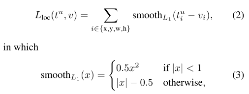

# train

## initialize

```python
input_shape = [600, 600]
backbone = "resnet50"
anchors_size = [8, 16, 32]

# dataset: voc2007
train_annotation_path = "2007_train.txt"
val_annotation_path = "2007_val.txt"

# num_classes = 20
class_names, num_classes = get_classes(classes_path)
```

## model

Details: [FasterRCNN](../model/frcnn.md)

```python
model = FasterRCNN(
    num_classes=20,
    anchor_scales=[8, 16, 32],
    backbone='resnet50',
    pretrained=False,
)
model_train = torch.nn.DataParallel(model.train()).cuda()
cudnn.benchmark = True
```

## optimizer and lr_scheduler

```python
optimizer = optim.Adam(model_train.parameters(), lr, weight_decay=5e-4)
lr_scheduler = optim.lr_scheduler.StepLR(optimizer, step_size=1, gamma=0.96)
```

## dataset and dataloader

Details: [FRCNNDataset](../data/frcnn_dataset.md)

```python
train_dataset = FRCNNDataset(
    train_lines, input_shape, train=True
)

gen = DataLoader(
    train_dataset,
    shuffle=True,
    batch_size=batch_size,
    num_workers=num_workers,
    pin_memory=True,
    drop_last=True,
    collate_fn=frcnn_dataset_collate,
)
```

## trainer

Details: [TargetCreator](target_creator.md)

```python
train_util = FasterRCNNTrainer(model_train, optimizer)
```

### initialize

```python
class FasterRCNNTrainer(nn.Module):
    def __init__(self, faster_rcnn, optimizer):
        super(FasterRCNNTrainer, self).__init__()
        self.faster_rcnn = faster_rcnn
        self.optimizer = optimizer

        self.rpn_sigma = 1
        self.roi_sigma = 1

        self.anchor_target_creator = AnchorTargetCreator()
        self.proposal_target_creator = ProposalTargetCreator()

        self.loc_normalize_std = [0.1, 0.1, 0.2, 0.2]
```

### forward

```python
    def forward(self, imgs, bboxes, labels, scale):
        n = imgs.shape[0]
        img_size = imgs.shape[2:]
        base_feature = self.faster_rcnn.module.extractor(imgs)
        
        rpn_locs, rpn_scores, rois, roi_indices, anchor = self.faster_rcnn.module.rpn(
            base_feature, img_size, scale
        )
        
        # for each image
        for i in range(n):
            bbox = bboxes[i]
            label = labels[i]
            rpn_loc = rpn_locs[i]
            rpn_score = rpn_scores[i]
            roi = rois[roi_indices == i]
            feature = base_feature[i]
            
            # rpn target
            gt_rpn_loc, gt_rpn_label = self.anchor_target_creator(bbox, anchor)
            gt_rpn_loc = torch.Tensor(gt_rpn_loc).cuda()
            gt_rpn_label = torch.Tensor(gt_rpn_label).long().cuda()

            # rpn loss
            rpn_loc_loss = self._fast_rcnn_loc_loss(
                rpn_loc, gt_rpn_loc, gt_rpn_label, self.rpn_sigma
            )
            rpn_cls_loss = F.cross_entropy(
                rpn_score, gt_rpn_label, ignore_index=-1
            )

            # detection target
            sample_roi, gt_roi_loc, gt_roi_label = self.proposal_target_creator(
                roi, bbox, label, self.loc_normalize_std
            )
            sample_roi = torch.Tensor(sample_roi).cuda()
            gt_roi_loc = torch.Tensor(gt_roi_loc).cuda()
            gt_roi_label = torch.Tensor(gt_roi_label).long().cuda()
            sample_roi_index = torch.zeros(len(sample_roi)).cuda()

            roi_cls_loc, roi_score = self.faster_rcnn.module.head(
                torch.unsqueeze(feature, 0), sample_roi, sample_roi_index, img_size
            )
            n_sample = roi_cls_loc.size()[1]
            roi_cls_loc = roi_cls_loc.view(n_sample, -1, 4)
            roi_loc = roi_cls_loc[torch.arange(0, n_sample), gt_roi_label]

            # detection loss, similar with the rpn loss
            roi_loc_loss = self._fast_rcnn_loc_loss(
                roi_loc, gt_roi_loc, gt_roi_label.data, self.roi_sigma
            )
            roi_cls_loss = nn.CrossEntropyLoss()(roi_score[0], gt_roi_label)
```

### rpn box regression loss

```python
rpn_loc_loss = self._fast_rcnn_loc_loss(
    rpn_loc, gt_rpn_loc, gt_rpn_label, self.rpn_sigma
)
```



```python
    def _fast_rcnn_loc_loss(self, pred_loc, gt_loc, gt_label, sigma):
        # only when the current box is responsible
        pred_loc = pred_loc[gt_label > 0]
        gt_loc = gt_loc[gt_label > 0]

        sigma_squared = sigma ** 2
        regression_diff = gt_loc - pred_loc
        regression_diff = regression_diff.abs()
        regression_loss = torch.where(
            regression_diff < (1.0 / sigma_squared),
            0.5 * sigma_squared * regression_diff ** 2,
            regression_diff - 0.5 / sigma_squared,
        )
        regression_loss = regression_loss.sum()
        num_pos = (gt_label > 0).sum().float()

        regression_loss /= torch.max(num_pos, torch.ones_like(num_pos))
        return regression_loss
```

### train_step

```python
    def train_step(self, imgs, bboxes, labels, scale):
        self.optimizer.zero_grad()
        losses = self.forward(imgs, bboxes, labels, scale)
        losses[-1].backward()
        self.optimizer.step()
        return losses
```

## training loop

```python
    for epoch in range(start_epoch, end_epoch):
        fit_one_epoch(
            ...
        )
        lr_scheduler.step()
```

