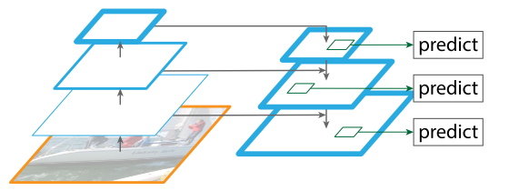
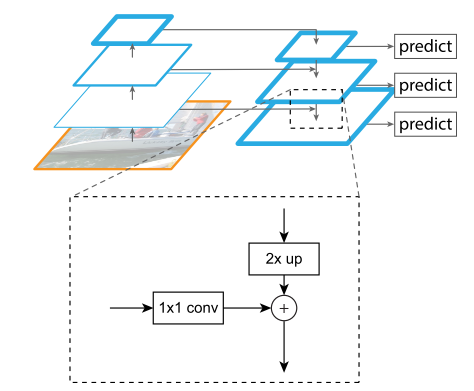

# Feature Pyramid



```python
# fpn_sizes: [layer2, layer3, layer4]
# BasicBlock (ResNet-18/34): [128, 256, 512]
# Bottleneck (ResNet-50/101/152): [512, 1024, 2048]
self.fpn = PyramidFeatures(fpn_sizes[0], fpn_sizes[1], fpn_sizes[2])
```

RetinaNet uses feature pyramid levels P3 to P7:

- P3 to P5 are computed from the output of the corresponding ResNet residual stage (C3 to C5, layer2 to layer4) using top-down and lateral connections just as in FPN
- P6 is obtained via a `3 × 3 stride-2` conv on C5, and P7 is computed by applying ReLU followed by a `3 × 3 stride-2` conv on P6. 

This differs slightly from FPN: 

- we don’t use the high-resolution pyramid level P2 for computational reasons
- P6 is computed by strided convolution instead of downsampling
- we include P7 to improve large object detection

These minor modifications improve speed while maintaining accuracy.

```python
class PyramidFeatures(nn.Module):
    def __init__(self, C3_size, C4_size, C5_size, feature_size=256):
        super(PyramidFeatures, self).__init__()

        # upsample C5 to get P5 from the FPN paper
        self.P5_1 = nn.Conv2d(
            C5_size, feature_size, kernel_size=1, stride=1, padding=0
        )
        self.P5_upsampled = nn.Upsample(scale_factor=2, mode='nearest')
        self.P5_2 = nn.Conv2d(
            feature_size, feature_size, kernel_size=3, stride=1, padding=1
        )

        # add P5 elementwise to C4
        self.P4_1 = nn.Conv2d(
            C4_size, feature_size, kernel_size=1, stride=1, padding=0
        )
        self.P4_upsampled = nn.Upsample(scale_factor=2, mode='nearest')
        self.P4_2 = nn.Conv2d(
            feature_size, feature_size, kernel_size=3, stride=1, padding=1
        )

        # add P4 elementwise to C3
        self.P3_1 = nn.Conv2d(
            C3_size, feature_size, kernel_size=1, stride=1, padding=0
        )
        self.P3_2 = nn.Conv2d(
            feature_size, feature_size, kernel_size=3, stride=1, padding=1
        )

        # "P6 is obtained via a 3x3 stride-2 conv on C5"
        self.P6 = nn.Conv2d(
            C5_size, feature_size, kernel_size=3, stride=2, padding=1
        )

        # "P7 is computed by applying ReLU followed by a 3x3 stride-2 conv on P6"
        self.P7_1 = nn.ReLU()
        self.P7_2 = nn.Conv2d(
            feature_size, feature_size, kernel_size=3, stride=2, padding=1
        )
```

## forward



```python
    def forward(self, inputs):
        C3, C4, C5 = inputs
        # B, C, H, W
        # C3: [2, 512, 80, 104]
        # C4: [2, 1024, 40, 52]
        # C5: [2, 2048, 20, 26]
        
        # (C5_size, C5_H, C5_W) -> 
        # (feature_size, C5_H, C5_W), (k=1,s=1)
        P5_x = self.P5_1(C5)
        # (feature_size, C5_H, C5_W) -> 
        # (feature_size, C4_H, C4_W)
        P5_upsampled_x = self.P5_upsampled(P5_x)
        # (feature_size, C5_H, C5_W) -> 
        # (feature_size, C5_H, C5_W), (k=3,s=1)
        P5_x = self.P5_2(P5_x)
        # C5: [2, 2048, 20, 26]
        # P5_upsampled_x: [2, 256, 40, 52]
        # P5_x: [2, 256, 20, 26]
        
        # (C4_size, C4_H, C4_W) -> 
        # (feature_size, C4_H, C4_W), (k=1,s=1)
        P4_x = self.P4_1(C4)
        P4_x = P5_upsampled_x + P4_x
        # (feature_size, C4_H, C4_W) -> 
        # (feature_size, C3_H, C3_W)
        P4_upsampled_x = self.P4_upsampled(P4_x)
        # (feature_size, C4_H, C4_W) -> 
        # (feature_size, C4_H, C4_W), (k=3,s=1)
        P4_x = self.P4_2(P4_x)
        # C4: [2, 1024, 40, 52]
        # P4_upsampled_x: [2, 256, 80, 104]
        # P4_x: [2, 256, 40, 52]
        
        # (C3_size, C3_H, C3_W) -> 
        # (feature_size, C3_H, C3_W), (k=1,s=1)
        P3_x = self.P3_1(C3)
        P3_x = P3_x + P4_upsampled_x
        # (feature_size, C3_H, C3_W) -> 
        # (feature_size, C3_H, C3_W), (k=3,s=1)
        P3_x = self.P3_2(P3_x)
        # C3: [2, 512, 80, 104]
        # P3_x: [2, 256, 80, 104]
        
        # (C5_size, C5_H, C5_W) -> 
        # (feature_size, C5_H // 2, C5_W // 2), (k=3,s=2)
        P6_x = self.P6(C5)
        # C5: [2, 2048, 20, 26]
        # P6_x: [2, 256, 10, 13]
        
        P7_x = self.P7_1(P6_x)
        # (feature_size, C5_H // 2, C5_W // 2) -> 
        # (feature_size, C5_H // 4, C5_W // 4), (k=3,s=2)
        P7_x = self.P7_2(P7_x)
        # P6_x: [2, 256, 10, 13]
        # P7_x: [2, 256, 5, 7]

        return [P3_x, P4_x, P5_x, P6_x, P7_x]
        # P3_x: [2, 256, 80, 104]
        # P4_x: [2, 256, 40, 52]
        # P5_x: [2, 256, 20, 26]
        # P6_x: [2, 256, 10, 13]
        # P7_x: [2, 256, 5, 7]
```

