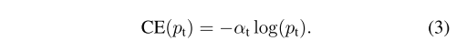
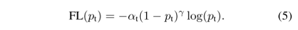
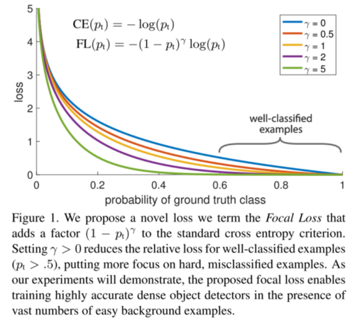
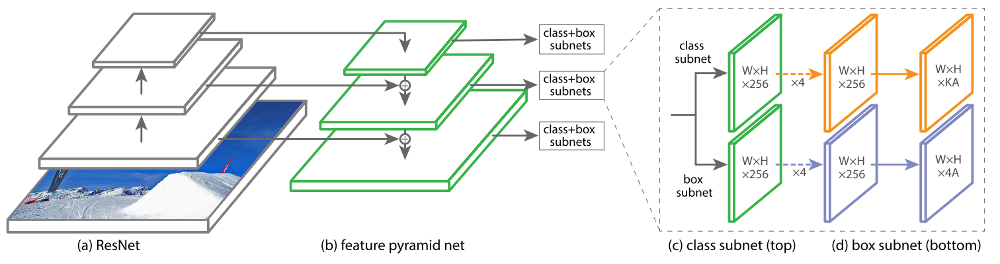

# Focal Loss for Dense Object Detection (2017)

**Original Paper:** [Focal Loss for Dense Object Detection](https://arxiv.org/abs/1708.02002)

## Improvement against other detectors

- The authors investigate the reason why one-stage detectors perform worse than two-stage detectors and discover that it is because of the **extreme foreground-background class imbalance during training**.
- A novel loss named **Focal Loss** is introduced to address this class imbalance issue. It is essentially a dynamically scaled cross-entropy loss such that it down-weights the loss assigned to well-classified examples.
- A simple dense detector called **RetinaNet** is designed to evaluate the effectiveness of Focal Loss. It’s shown that when trained with Focal Loss, RetinaNet is able to match the speed of previous one-stage detectors while surpassing the accuracy of all existing state-of-the-art two-stage detectors.

## Focal Loss

It’s found that the extreme class imbalance encountered during the training of dense detectors overwhelms the cross-entropy loss, where easily classified negatives comprise the majority of the loss and dominate the gradient.

A weighting factor `α ∈ [0, 1]` can be introduced for different classes, however, it only balances the importance of **positive/negative** examples but not **easy/hard** examples. Therefore, it’s proposed to reshape the loss function such that easy examples are down-weight and thus the training can focus on hard negatives. **Focal Loss** is defined as shown below, where `γ ≥ 0` is a tunable focusing parameter.

In practice, an `α-balanced` variant of the focal loss is used as it yields slightly improved accuracy over the `non-α-balanced` form.

- (1) When an example is misclassified and `p_t` is small, the modulating factor is near 1 and the loss is unaffected. As `p_t` is closing to 1, the factor goes to 0 and the loss for well-classified examples is down-weighted.

- (2) The focusing parameter `γ` smoothly adjusts the rate at which easy examples are down-weighted. When `γ = 0`, FL is equivalent to CE, and as `γ` is increased the effect of the modulating factor is likewise increased.

Intuitively, the modulating factor reduces the loss contribution from easy examples and extends the range in which an example receives low loss. For instance, with `γ = 2`, an example classified with `p_t = 0.9` would have 100× lower loss compared with CE. This in turn increases the importance of correcting misclassified examples.

### Compare with Two-stage Detectors in handling class imbalance

Two-stage detectors are often trained with the standard cross-entropy loss and address class imbalance through two mechanisms: (1) a two-stage cascade and (2) biased minibatch sampling.

- The first cascade stage is an **object proposal mechanism** that reduces the nearly infinite set of possible object locations down to one or two thousand. Importantly, the selected proposals are not random but are likely to correspond to true object locations, which removes the vast majority of easy negatives.
- When training the second stage, **biased sampling** is typically used to construct mini-batches that contain, for instance, a 1:3 ratio of positive to negative examples. This ratio is like an implicit α-balancing factor that is implemented via sampling.

**Focal loss** is designed to address these mechanisms in a one-stage detection system directly via the loss function.

## RetinaNet

The one-stage RetinaNet network architecture uses a Feature Pyramid Network (FPN) backbone on top of a feedforward ResNet architecture.

### Feature Pyramid Network Backbone

The **Feature Pyramid Network (FPN)(b)** is adopted as the backbone network for RetinaNet. In brief, FPN augments a standard convolutional network with a top-down pathway and lateral connections so the network efficiently constructs a rich, multi-scale feature pyramid from a single resolution input image. Each level of the pyramid can be used for detecting objects at a different scale.

The FPN is built on top of the ResNet architecture, and a pyramid with levels P3 through P7 is constructed (level l has a resolution 2l lower than the input), where all pyramid levels have `C=256` channels.

### Anchors

The anchors have areas of `32²` to `512²` on pyramid levels P3 to P7, respectively. At each pyramid level, anchors have three aspect ratios: `{1:2, 1:1, 2:1}`. In addition, anchors of sizes `{2⁰, 2^(1/3), 2^(2/3)}` of the original set of 3 aspect ratios anchors are added for denser scale coverage than the original FPN.

In total there are `A=9` anchors per level and across levels, they cover the scale range `32–813` pixels with respect to the network’s input image. Each anchor is assigned a K-dimensional one-hot vector of classification targets, and a 4-dimensional vector of box regression targets.

Anchors are assigned to ground-truth object boxes using an IoU threshold of `0.5`; and to background if their IoU is in `[0, 0.4)`. Each anchor is assigned to at most one object box. An anchor is ignored during training if it is unassigned (when IoU is in `[0.4, 0.5)`). Box regression targets are computed as the offset between each anchor and its assigned object box, or omitted if there is no assignment.

### Classification Subnet (c)

The classification subnet is a small FCN attached to each FPN level, where parameters are shared across all pyramid levels. Taking an input feature map with `C` channels from a given pyramid level, the subset applies four `3 × 3` conv layers, each with `C` filters and each followed by ReLU activation, followed by a `3 × 3` conv layer with `KA` filters. Finally, sigmoid activations are attached to output the `KA` (A anchors and K object classes) binary predictions per spatial location.

### Box Regression Subnet (d)

The design is identical to the classification subnet except that it terminates in `4A` (A anchors and 4-dimensional box regression targets) linear outputs per spatial location. The bounding box regressor is class-agnostic. The object classification subnet and the box regression subnet, though sharing a common structure, use separate parameters.