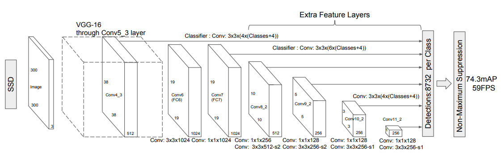

# multibox



### Multi-scale feature maps for detection

A bunch of convolutional feature layers is added to the end of the truncated base network. These layers decrease in size progressively and allow predictions of detections at multiple scales. The convolutional model for predicting detections is different for each feature layer. 

### Default boxes and aspect ratios

A set of default bounding boxes is associated with each feature map cell for multiple feature maps. The default boxes are similar to the anchor boxes used in Faster R-CNN, however, they are applied to several feature maps of different resolutions.


Each feature map cell predicts `k` bounding boxes, where each bounding box contains `c + 4` predictions: (1) `c` class scores; (2) `4 offsets` relative to the original default box shape. Thus, for a `m × n` feature map, the predictions are encoded as an `m × n × k × (c + 4)` tensor.

```python
cfg = [4, 6, 6, 6, 4, 4]

def multibox(vgg, extra_layers, cfg, num_classes):
    loc_layers = []
    conf_layers = []
    vgg_source = [21, -2]
    
    # vgg
    for k, v in enumerate(vgg_source):
        loc_layers += [
            nn.Conv2d(
                vgg[v].out_channels,
                cfg[k] * 4, 
                kernel_size=3, 
                padding=1
            )
        ]
        conf_layers += [
            nn.Conv2d(
                vgg[v].out_channels,
                cfg[k] * num_classes, 
                kernel_size=3, 
                padding=1
            )
        ]
    
    # extra_layers
    for k, v in enumerate(extra_layers[1::2], 2):
        loc_layers += [
            nn.Conv2d(
                v.out_channels, 
                cfg[k] * 4, 
                kernel_size=3, 
                padding=1
            )
        ]
        conf_layers += [
            nn.Conv2d(
                v.out_channels, 
                cfg[k] * num_classes, 
                kernel_size=3, 
                padding=1
            )
        ]
    return vgg, extra_layers, (loc_layers, conf_layers)
```

### Convolutional predictors for detection

Each added feature layer (or optionally an existing feature layer from the base network) can produce a fixed set of detection predictions using a set of convolutional filters. 

For a feature layer of size `m × n` with `p` channels, the basic element for predicting parameters of a potential detection is a `3 × 3 × p` small kernel that produces either a score for a category or a shape offset relative to the default box coordinates.

At each of the `m × n` locations where the kernel is applied, it produces an output value. The bounding box offset output values are measured relative to a default box position relative to each feature map location. 

#### loc_layers

`conf_layers` is almost the same except the number of outputs.

```python
loc_layers = [
    # 4-vgg[21]: Conv2d(512, 512, kernel_size=(3, 3), stride=(1, 1), padding=(1, 1))
    Conv2d(512, 16, kernel_size=(3, 3), stride=(1, 1), padding=(1, 1)),
    
    # 6-vgg[-2]: Conv2d(1024, 1024, kernel_size=(1, 1), stride=(1, 1))
    Conv2d(1024, 24, kernel_size=(3, 3), stride=(1, 1), padding=(1, 1)),
    
    # 6-Conv2d(256, 512, kernel_size=(3, 3), stride=(2, 2), padding=(1, 1))
    Conv2d(512, 24, kernel_size=(3, 3), stride=(1, 1), padding=(1, 1)),
    
    # 6-Conv2d(128, 256, kernel_size=(3, 3), stride=(2, 2), padding=(1, 1))
    Conv2d(256, 24, kernel_size=(3, 3), stride=(1, 1), padding=(1, 1)),
    
    # 4-Conv2d(128, 256, kernel_size=(3, 3), stride=(1, 1))
    Conv2d(256, 16, kernel_size=(3, 3), stride=(1, 1), padding=(1, 1)),
    
    # 4-Conv2d(128, 256, kernel_size=(3, 3), stride=(1, 1))
    Conv2d(256, 16, kernel_size=(3, 3), stride=(1, 1), padding=(1, 1))
]
```