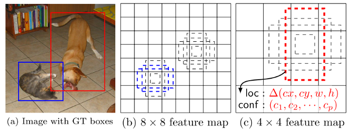
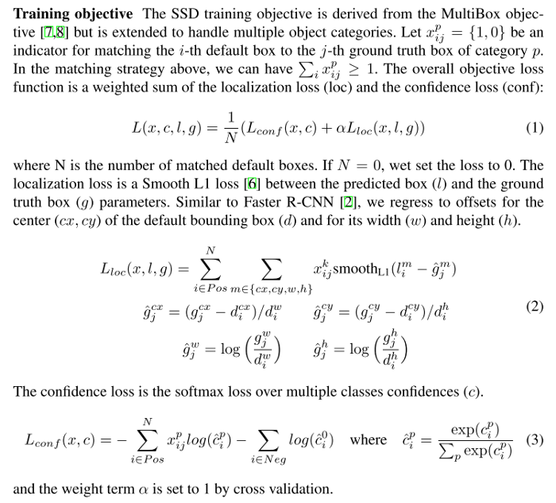

# MultiBoxLoss

```python
criterion = MultiBoxLoss(
    num_classes=cfg['num_classes'], 
    overlap_thresh=0.5, 
    prior_for_matching=True, 
    bkg_label=0, 
    neg_mining=True, 
    neg_pos=3, 
    neg_overlap=0.5,
    encode_target=False, 
    use_gpu=args.cuda
)
```

## initialize

```python
class MultiBoxLoss(nn.Module):
    """SSD Weighted Loss Function
    Compute Targets:
        1) Produce Confidence Target Indices by matching  ground truth boxes
           with (default) 'priorboxes' that have jaccard index > threshold parameter
           (default threshold: 0.5).
        2) Produce localization target by 'encoding' variance into offsets of ground
           truth boxes and their matched  'priorboxes'.
        3) Hard negative mining to filter the excessive number of negative examples
           that comes with using a large number of default bounding boxes.
           (default negative:positive ratio 3:1)
    Objective Loss:
        L(x,c,l,g) = (Lconf(x, c) + αLloc(x,l,g)) / N
        Where, Lconf is the CrossEntropy Loss and Lloc is the SmoothL1 Loss
        weighted by α which is set to 1 by cross val.
        Args:
            c: class confidences,
            l: predicted boxes,
            g: ground truth boxes
            N: number of matched default boxes
        See: https://arxiv.org/pdf/1512.02325.pdf for more details.
    """

    def __init__(self, num_classes, overlap_thresh, prior_for_matching,
                 bkg_label, neg_mining, neg_pos, neg_overlap, encode_target,
                 use_gpu=True):
        super(MultiBoxLoss, self).__init__()
        self.use_gpu = use_gpu
        self.num_classes = num_classes
        self.threshold = overlap_thresh
        # self.threshold = 0.5
        self.background_label = bkg_label
        self.encode_target = encode_target
        # self.encode_target = False
        self.use_prior_for_matching = prior_for_matching
        # self.use_prior_for_matching = True
        self.do_neg_mining = neg_mining
        # self.do_neg_mining = True
        self.negpos_ratio = neg_pos
        # self.negpos_ratio = 3
        self.neg_overlap = neg_overlap
        # self.neg_overlap = 0.5
        self.variance = cfg['variance']
        # self.variance = [0.1, 0.2]
```

## forward

```python
    def forward(self, predictions, targets):
        """Multibox Loss
        Args:
            predictions (tuple): A tuple containing loc preds, conf preds,
            and prior boxes from SSD net.
                conf shape: torch.size(batch_size,num_priors,num_classes)
                loc shape: torch.size(batch_size,num_priors,4)
                priors shape: torch.size(num_priors,4)
            targets (tensor): Ground truth boxes and labels for a batch,
                shape: [batch_size,num_objs,5] (last idx is the label).
        """
        loc_data, conf_data, priors = predictions
           # batch size
        num = loc_data.size(0)
        priors = priors[:loc_data.size(1), :]
        num_priors = (priors.size(0))
        num_classes = self.num_classes
        
        loc_t = torch.Tensor(num, num_priors, 4)
        conf_t = torch.LongTensor(num, num_priors)
        
        # loop for the whole batch
        for idx in range(num):
            truths = targets[idx][:, :-1].data
            labels = targets[idx][:, -1].data
            defaults = priors.data
            # Match each prior box with the ground truth box 
            # of the highest jaccard overlap, 
            # encode the bounding boxes, 
            # then return the matched indices 
            # corresponding to both confidence and location preds.
            match(
                threshold=self.threshold, # 0.5
                truths=truths, 
                priors=defaults, 
                variances=self.variance, # [0.1, 0.2]
                labels=labels,
                loc_t=loc_t, 
                conf_t=conf_t, 
                idx=idx
            )
            
        if self.use_gpu:
            loc_t = loc_t.cuda()
            conf_t = conf_t.cuda()
        # wrap targets
        loc_t = Variable(loc_t, requires_grad=False)
        conf_t = Variable(conf_t, requires_grad=False)
        
        # positive priors
        pos = conf_t > 0
        num_pos = pos.sum(dim=1, keepdim=True)
```

### match priors (default boxes) and ground truth boxes

- Match each ground truth box to the default box with the best Jaccard Overlap.
- Match default boxes to any ground truth with Jaccard Overlap higher than a threshold (`0.5`).

This simplifies the learning problem, allowing the network to predict high scores for multiple overlapping default boxes rather than requiring it to pick only the one with maximum overlap.



For example, the dog is matched to a default box in the `4 × 4` feature map, but not to any default boxes in the `8 × 8` feature map. This is because those boxes have different scales and do not match the dog box, and therefore are considered as negatives during training.

```python
def match(threshold, truths, priors, variances, labels, loc_t, conf_t, idx):
    """Match each prior box with the ground truth box of the highest jaccard
    overlap, encode the bounding boxes, then return the matched indices
    corresponding to both confidence and location preds.
    Args:
        threshold: (float) The overlap threshold used when mathing boxes.
        truths: (tensor) Ground truth boxes, Shape: [num_obj, num_priors].
        priors: (tensor) Prior boxes from priorbox layers, Shape: [n_priors,4].
        variances: (tensor) Variances corresponding to each prior coord,
            Shape: [num_priors, 4].
        labels: (tensor) All the class labels for the image, Shape: [num_obj].
        loc_t: (tensor) Tensor to be filled w/ endcoded location targets.
        conf_t: (tensor) Tensor to be filled w/ matched indices for conf preds.
        idx: (int) current batch index
    Return:
        The matched indices corresponding to 1)location and 2)confidence preds.
    """
    # jaccard index
    overlaps = jaccard(
        truths,
        # Convert prior_boxes to (xmin, ymin, xmax, ymax)
        point_form(priors)
    )
    # jaccard overlap: (tensor) Shape: [truths.size(0), priors.size(0)]
    
    # (Bipartite Matching)
    # [1,num_objects] best prior for each ground truth
    best_prior_overlap, best_prior_idx = overlaps.max(1, keepdim=True)
    # [1,num_priors] best ground truth for each prior
    best_truth_overlap, best_truth_idx = overlaps.max(0, keepdim=True)
    best_truth_idx.squeeze_(0)
    best_truth_overlap.squeeze_(0)
    best_prior_idx.squeeze_(1)
    best_prior_overlap.squeeze_(1)
    best_truth_overlap.index_fill_(0, best_prior_idx, 2)  # ensure best prior
    
    # TODO refactor: index  best_prior_idx with long tensor
    # ensure every gt matches with its prior of max overlap
    for j in range(best_prior_idx.size(0)):
        best_truth_idx[best_prior_idx[j]] = j
        
    matches = truths[best_truth_idx]
    # matches.shape: [num_priors, 4]
    
    conf = labels[best_truth_idx] + 1         
    # conf.shape: [num_priors]
    
    # overlap with gt < threshold
    conf[best_truth_overlap < threshold] = 0  
    # label as background

    # Encode the variances from the priorbox layers into the ground truth boxes
    loc = encode(matches, priors, variances)
    loc_t[idx] = loc    
    # [num_priors,4] encoded offsets to learn
    conf_t[idx] = conf  
    # [num_priors] top class label for each prior
```



```python
def encode(matched, priors, variances):
    """Encode the variances from the priorbox layers into the ground truth boxes
    we have matched (based on jaccard overlap) with the prior boxes.
    Args:
        matched: (tensor) Coords of ground truth for each prior in point-form
            Shape: [num_priors, 4].
        priors: (tensor) Prior boxes in center-offset form
            Shape: [num_priors,4].
        variances: (list[float]) Variances of priorboxes
    Return:
        encoded boxes (tensor), Shape: [num_priors, 4]
    """
    # variances: [0.1, 0.2]
    # dist b/t match center and prior's center
    g_cxcy = (matched[:, :2] + matched[:, 2:]) / 2 - priors[:, :2]
    # encode variance
    g_cxcy /= (variances[0] * priors[:, 2:])
    
    # match wh / prior wh
    g_wh = (matched[:, 2:] - matched[:, :2]) / priors[:, 2:]
    g_wh = torch.log(g_wh) / variances[1]
    
    # return target for smooth_l1_loss
    return torch.cat([g_cxcy, g_wh], 1)  
    # [num_priors,4]
```

### Localization Loss (Smooth L1)

```python
        # Shape: [batch, num_priors, 4]
        pos_idx = pos.unsqueeze(pos.dim()).expand_as(loc_data)
        loc_p = loc_data[pos_idx].view(-1, 4)
        loc_t = loc_t[pos_idx].view(-1, 4)
        loss_l = F.smooth_l1_loss(loc_p, loc_t, size_average=False)
```

### Hard negative mining

After the matching step, most of the default boxes are negatives. To balance between the positive and negative training examples, negative examples are sorted using the highest confidence loss, and the top ones are picked so that the ratio between the negatives and positives is at most `3:1`.

```python
        batch_conf = conf_data.view(-1, self.num_classes)
        loss_c = log_sum_exp(batch_conf) - batch_conf.gather(1, conf_t.view(-1, 1))

        # Hard Negative Mining
        loss_c[pos] = 0  # filter out pos boxes for now
        loss_c = loss_c.view(num, -1)
        _, loss_idx = loss_c.sort(1, descending=True)
        _, idx_rank = loss_idx.sort(1)
        num_pos = pos.long().sum(1, keepdim=True)
        num_neg = torch.clamp(self.negpos_ratio * num_pos, max=pos.size(1)-1)
        neg = idx_rank < num_neg.expand_as(idx_rank)

        # Confidence Loss Including Positive and Negative Examples
        pos_idx = pos.unsqueeze(2).expand_as(conf_data)
        neg_idx = neg.unsqueeze(2).expand_as(conf_data)
        conf_p = conf_data[(pos_idx+neg_idx).gt(0)].view(-1, self.num_classes)
        targets_weighted = conf_t[(pos+neg).gt(0)]
        loss_c = F.cross_entropy(conf_p, targets_weighted, size_average=False)

        # Sum of losses: L(x,c,l,g) = (Lconf(x, c) + αLloc(x,l,g)) / N
        N = num_pos.data.sum()
        loss_l /= N
        loss_c /= N
        return loss_l, loss_c

def log_sum_exp(x):
    """Utility function for computing log_sum_exp while determining
    This will be used to determine unaveraged confidence loss across
    all examples in a batch.
    Args:
        x (Variable(tensor)): conf_preds from conf layers
    """
    x_max = x.data.max()
    return torch.log(torch.sum(torch.exp(x-x_max), 1, keepdim=True)) + x_max
```

