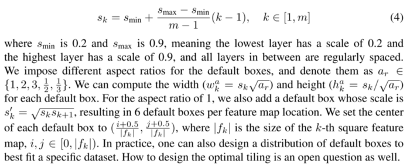

# PriorBox

```python
self.priorbox = PriorBox(self.cfg)
self.priors = Variable(self.priorbox.forward(), volatile=True)
```

## initialize

```python
class PriorBox(object):
    """Compute priorbox coordinates in center-offset form for each source
    feature map.
    """
    def __init__(self, cfg):
        super(PriorBox, self).__init__()
        self.image_size = cfg['min_dim']
        # number of priors for feature map location (either 4 or 6)
        self.num_priors = len(cfg['aspect_ratios'])
        self.variance = cfg['variance'] or [0.1] 
        self.feature_maps = cfg['feature_maps']
        self.min_sizes = cfg['min_sizes']
        self.max_sizes = cfg['max_sizes']
        self.steps = cfg['steps']
        self.aspect_ratios = cfg['aspect_ratios']
        self.clip = cfg['clip']
        self.version = cfg['name']
        for v in self.variance:
            if v <= 0:
                raise ValueError('Variances must be greater than 0')
        # COCO
        # self.num_priors = 6
        # self.variance = [0.1, 0.2] 
        # self.feature_maps = [38, 19, 10, 5, 3, 1]
        # self.min_sizes = [21, 45, 99, 153, 207, 261]
        # self.max_sizes = [45, 99, 153, 207, 261, 315]
        # self.steps = [8, 16, 32, 64, 100, 300]
        # self.aspect_ratios = [[2], [2, 3], [2, 3], [2, 3], [2], [2]]
        # self.clip = True
        # self.version = 'COCO'
```

## forward

```python
    def forward(self):
        mean = []
        for k, f in enumerate(self.feature_maps):
            # k, f: 0, 38
            
            for i, j in product(range(f), repeat=2):
                # for each grid of 38 * 38
                # i, j: 0, 0
                
                # size of each grid
                f_k = self.image_size / self.steps[k]
                # f_k = 300 / 8 = 37.5
                
                # unit center x,y
                cx = (j + 0.5) / f_k
                cy = (i + 0.5) / f_k
                # cx, cy: 0.013, 0.013
                # when i, j = 37, 37; cx, cy = 1, 1
```

### Choosing scales and aspect ratios for default boxes

Feature maps from different layers are used to handle different object scales, while parameters across all object scales are shared. Suppose there are `m` feature maps used for prediction, the scale of the default boxes for each feature map is computed as:



```python
                # self.min_sizes = [21, 45, 99, 153, 207, 261]
                # self.max_sizes = [45, 99, 153, 207, 261, 315]

                # aspect_ratio: 1
                # rel size: min_size
                s_k = self.min_sizes[k] / self.image_size
                # s_k = 21 / 300 = 0.07
                mean += [cx, cy, s_k, s_k]
                # [cx, cy, s_k, s_k] = [0.013, 0.013, 0.07, 0.07]

                # aspect_ratio: 1
                # rel size: sqrt(s_k * s_(k+1))
                s_k_prime = sqrt(s_k * (self.max_sizes[k] / self.image_size))
                # s_k_prime = sqrt(0.07 * (45 / 300)) = 0.1025
                mean += [cx, cy, s_k_prime, s_k_prime]
                # [cx, cy, s_k, s_k] = [0.013, 0.013, 0.1025, 0.1025]

                # rest of aspect ratios
                # self.aspect_ratios[k]: [2]
                for ar in self.aspect_ratios[k]:
                    mean += [cx, cy, s_k * sqrt(ar), s_k / sqrt(ar)]
                    mean += [cx, cy, s_k / sqrt(ar), s_k * sqrt(ar)]
                    
        # back to torch land
        output = torch.Tensor(mean).view(-1, 4)
        if self.clip:
            output.clamp_(max=1, min=0)
        return output
        # output.shape: torch.Size([8732, 4])
        # (38 ** 2 + 3 ** 2 + 1 ** 2) * 4 + (19 ** 2 + 10 ** 2 + 5 ** 2) * 6 = 8732
```

