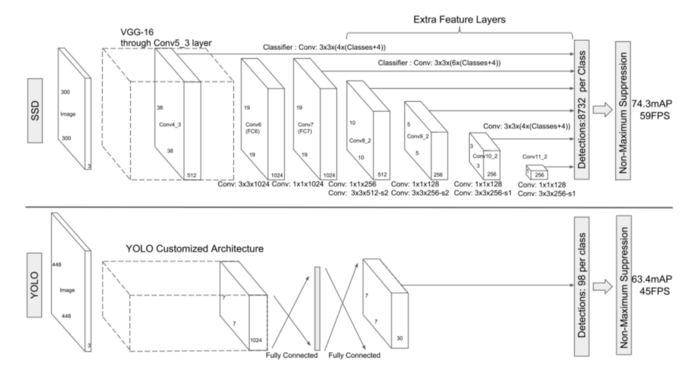
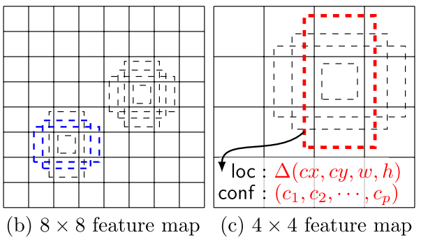
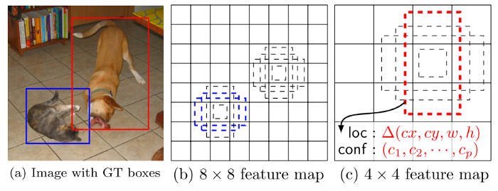
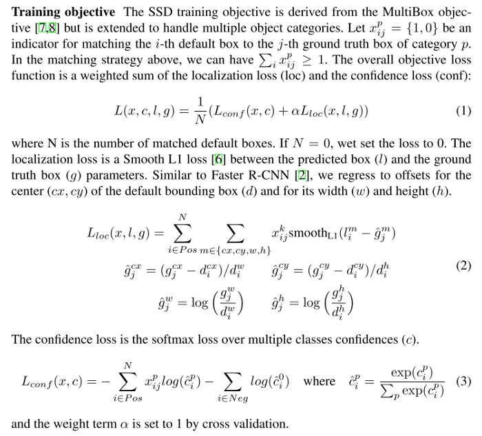

# SSD: Single Shot MultiBox Detector (2015)

**Original Paper:** [SSD: Single Shot MultiBox Detector](https://arxiv.org/abs/1512.02325)

## Improvement against other detectors

- SSD is a single-shot detector for multiple categories that is faster and significantly more accurate than YOLO.
- It is in fact as accurate as slower techniques that perform explicit region proposals and pooling (including Faster R-CNN).

## SSD: System overview

Similar to YOLO, the SSD approach is based on a feed-forward convolutional network. The early network layers (base network) are based on a standard architecture used for high-quality image classification (truncated before any classification layers). To perform detection, an auxiliary structure is introduced with the following key features:

A comparison between two single-shot detection models: **SSD and YOLO**.

### Multi-scale feature maps for detection

A bunch of convolutional feature layers is added to the end of the truncated base network. These layers decrease in size progressively and allow predictions of detections at multiple scales. The convolutional model for predicting detections is different for each feature layer. **YOLO operates on a single-scale feature map.**

### Convolutional predictors for detection

Each added feature layer (or optionally an existing feature layer from the base network) can produce a fixed set of detection predictions using a set of convolutional filters. For a feature layer of size `m × n` with `p` channels, the basic element for predicting parameters of a potential detection is a `3 × 3 × p` small kernel that produces either a score for a category or a shape offset relative to the default box coordinates.

At each of the `m × n` locations where the kernel is applied, it produces an output value. The bounding box offset output values are measured relative to a default box position relative to each feature map location. **YOLO uses an intermediate fully connected layer instead of a convolutional filter for this step.**

### Default boxes and aspect ratios

A set of default bounding boxes is associated with each feature map cell for multiple feature maps. The default boxes are similar to the anchor boxes used in Faster R-CNN, however, they are applied to several feature maps of different resolutions.

Each feature map cell predicts `k` bounding boxes, where each bounding box contains `c + 4` predictions: (1) `c` class scores; (2) `4 offsets` relative to the original default box shape. Thus, for a `m × n` feature map, the predictions are encoded as an `m × n × k × (c + 4)` tensor. **YOLO predicts B bounding boxes and one single set of classification scores per grid cell. For a `S × S` feature map, the predictions are encoded as an `S × S × (B ∗ 5 + C)` tensor.**

## SSD: Training

### Choosing scales and aspect ratios for default boxes

Feature maps from different layers are used to handle different object scales, while parameters across all object scales are shared. Suppose there are `m` feature maps used for prediction, the scale of the default boxes for each feature map is computed as:

### Match ground truth detection to default boxes

- Match each ground truth box to the default box with the best Jaccard Overlap.
- Match default boxes to any ground truth with Jaccard Overlap higher than a threshold (`0.5`).

This simplifies the learning problem, allowing the network to predict high scores for multiple overlapping default boxes rather than requiring it to pick only the one with maximum overlap.

For example, the dog is matched to a default box in the `4 × 4` feature map, but not to any default boxes in the `8 × 8` feature map. This is because those boxes have different scales and do not match the dog box, and therefore are considered as negatives during training.

After the matching step, most of the default boxes are negatives. To balance between the positive and negative training examples, negative examples are sorted using the highest confidence loss, and the top ones are picked so that the ratio between the negatives and positives is at most `3:1`.

