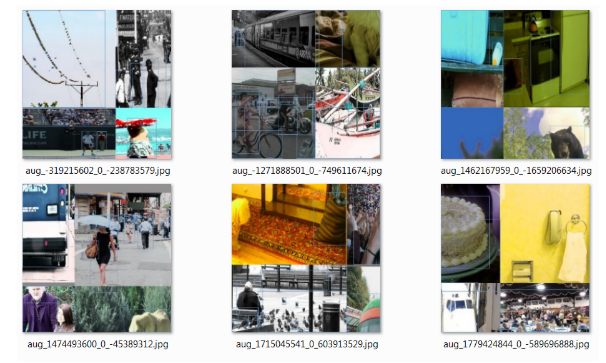
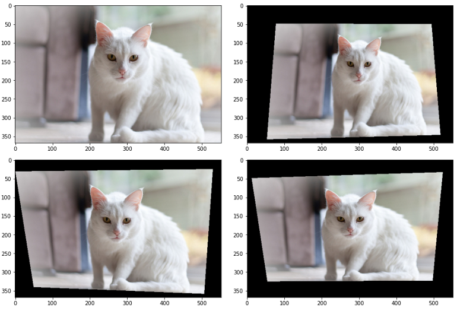
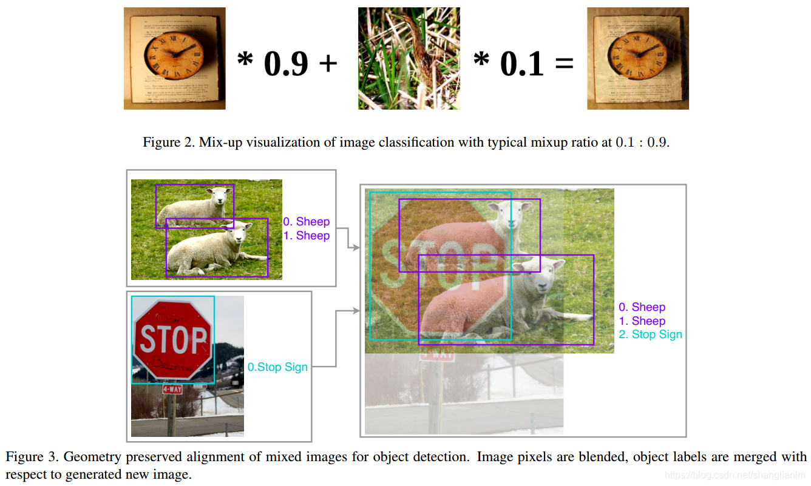
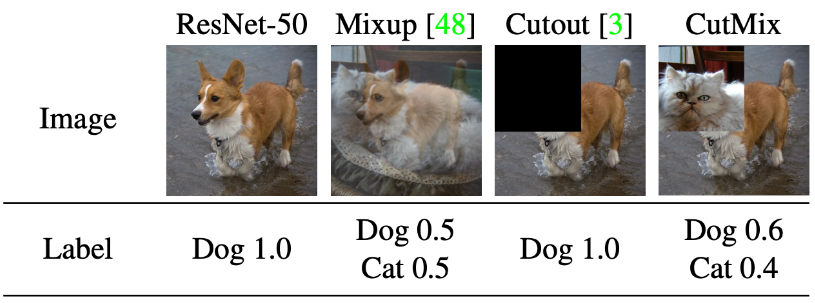

# Data Augmentation

## Table of contents

- [Mosaic](#mosaic)
- [Random Perspective](#random_perspective)
- [MixUp](#mixup)
- [CutMix](#cutmix)
- [Self-Adversarial Training (SAT)](#sat)
- [Random training shapes (Multi-Scale Training)](#random_training_shapes)

## Mosaic <a name="mosaic"></a>

**Mosaic** is a data augmentation method that mixes 4 training images and thus 4 different contexts, while CutMix only mixes 2 input images. It allows detecting objects outside their normal context. In addition, batch normalization calculates activation statistics from 4 different images on each layer. This significantly reduces the need for a large mini-batch size.



```python
# loads images in a 4-mosaic

labels4, segments4 = [], []
s = self.img_size

yc, xc = [int(random.uniform(-x, 2 * s + x)) for x in self.mosaic_border] 
# self.mosaic_border: [-320, -320] 
# mosaic center x, y: yc, xc: 808, 862

indices = [index] + random.choices(self.indices, k=3)  
# 3 additional image indices
# indices: [42, 32, 63, 57]

for i, index in enumerate(indices):
    # Load image
    img, _, (h, w) = load_image(self, index)

    # place img in img4
    if i == 0:  
    # top left
    # i, h, w: 0, 480, 640
        img4 = np.full((s * 2, s * 2, img.shape[2]), 114, dtype=np.uint8)  
        # img4.shaoe: (1280, 1280, 3)
        # base image with 4 tiles
        x1a, y1a, x2a, y2a = max(xc - w, 0), max(yc - h, 0), xc, yc  
        # xmin, ymin, xmax, ymax (large image)
        # x1a, y1a, x2a, y2a: 168, 382, 808, 862
        x1b, y1b, x2b, y2b = w - (x2a - x1a), h - (y2a - y1a), w, h  
        # xmin, ymin, xmax, ymax (small image)
        # x1b, y1b, x2b, y2b = 0, 0, 640, 480
    elif i == 1:  
    # top right
        x1a, y1a, x2a, y2a = xc, max(yc - h, 0), min(xc + w, s * 2), yc
        x1b, y1b, x2b, y2b = 0, h - (y2a - y1a), min(w, x2a - x1a), h
    elif i == 2:  
    # bottom left
        x1a, y1a, x2a, y2a = max(xc - w, 0), yc, xc, min(s * 2, yc + h)
        x1b, y1b, x2b, y2b = w - (x2a - x1a), 0, w, min(y2a - y1a, h)
    elif i == 3:  
    # bottom right
        x1a, y1a, x2a, y2a = xc, yc, min(xc + w, s * 2), min(s * 2, yc + h)
        x1b, y1b, x2b, y2b = 0, 0, min(w, x2a - x1a), min(y2a - y1a, h)

    img4[y1a:y2a, x1a:x2a] = img[y1b:y2b, x1b:x2b]  
    # img4[ymin:ymax, xmin:xmax]
    padw = x1a - x1b
    padh = y1a - y1b
    # i, padw, padh: 0, 168, 382

    # Labels
    labels, segments = self.labels[index].copy(), self.segments[index].copy()
    if labels.size:
        labels[:, 1:] = xywhn2xyxy(labels[:, 1:], w, h, padw, padh)  
        # normalized xywh to pixel xyxy format
        segments = [xyn2xy(x, w, h, padw, padh) for x in segments]
    labels4.append(labels)
    segments4.extend(segments)
```

## Random Perspective <a name="random_perspective"></a>

**Reference:** [`torchvision.transforms.RandomPerspective`](https://pytorch.org/vision/stable/transforms.html#torchvision.transforms.RandomPerspective)

Performs a random perspective transformation of the given image with a given probability.



## MixUp <a name="mixup"></a>

**Paper:** *MixUp: Beyond empirical risk minimization, 2017*

Uses two images to multiply and superimpose with different coefficient ratios, and then adjusts the label with these superimposed ratios.



```python
img2, labels2 = load_mosaic(self, random.randint(0, self.n - 1))
r = np.random.beta(8.0, 8.0)  # mixup ratio, alpha=beta=8.0
img = (img * r + img2 * (1 - r)).astype(np.uint8)
labels = np.concatenate((labels, labels2), 0)
```

## CutMix <a name="cutmix"></a>

**Reference:** https://paperswithcode.com/method/cutmix

Instead of simply removing pixels as in [Cutout](https://paperswithcode.com/method/cutout), we replace the removed regions with a patch from another image. The ground truth labels are also mixed proportionally to the number of pixels of combined images. The added patches further enhance localization ability by requiring the model to identify the object from a partial view.



```python
for i, (input, target) in enumerate(train_loader):
    input = input.cuda()
    target = target.cuda()
    r = np.random.rand(1)
    
    # args.beta = 1.0
    # args.cutmix_prob = 0.5
    if args.beta > 0 and r < args.cutmix_prob:
        # Generate mixed sample
        
        # Draw samples from a Beta distribution.
        lam = np.random.beta(args.beta, args.beta)
        
        # Returns a random permutation of integers from 0 to n - 1.
        rand_index = torch.randperm(input.size()[0]).cuda()
        
        target_a = target
        target_b = target[rand_index]
        
        # generate a random box from input
        bbx1, bby1, bbx2, bby2 = rand_bbox(input.size(), lam)
        
        # random mix
        input[:, :, bbx1:bbx2, bby1:bby2] = input[rand_index, :, bbx1:bbx2, bby1:bby2]
        
        # adjust lambda to exactly match pixel ratio
        lam = 1 - ((bbx2 - bbx1) * (bby2 - bby1) / (input.size()[-1] * input.size()[-2]))
        
        # compute output
        output = model(input)
        loss = criterion(output, target_a) * lam + \
        	criterion(output, target_b) * (1. - lam)
        

def rand_bbox(size, lam):
    W = size[2]
    H = size[3]
    cut_rat = np.sqrt(1. - lam)
    cut_w = np.int(W * cut_rat)
    cut_h = np.int(H * cut_rat)

    # uniform
    cx = np.random.randint(W)
    cy = np.random.randint(H)

    bbx1 = np.clip(cx - cut_w // 2, 0, W)
    bby1 = np.clip(cy - cut_h // 2, 0, H)
    bbx2 = np.clip(cx + cut_w // 2, 0, W)
    bby2 = np.clip(cy + cut_h // 2, 0, H)

    return bbx1, bby1, bbx2, bby2
```

## Self-Adversarial Training (SAT) <a name="sat"></a>

[*Self Adversarial Training for Human Pose Estimation, 2017*]

**Reference:** https://github.com/louis2889184/pytorch-adversarial-training

**Self-Adversarial Training (SAT)** also represents a new data augmentation technique. It uses back-propagation with two iterations of forward-backward passes. On the first backward pass, to minimize the cost function, we alter the original image instead of the network weights. Contrary to the usual method, this actually degrades the network performance, or simply put, the model performs an “adversarial attack” on itself. Now, this modified image is used to train the network on the second iteration. This way we are able to reduce overfitting and make the model more universal. (*This paragraph is directly quoted from this* [*clarification*](https://www.reddit.com/r/MachineLearning/comments/kywh2c/d_how_does_selfadversarial_training_as_described/)) *by the author.*)

```python
class FastGradientSignUntargeted():
    b"""
        Fast gradient sign untargeted adversarial attack, 
        minimizes the initial class activation
        with iterative grad sign updates
    """
    def __init__(self, model, epsilon, alpha, min_val, max_val, max_iters, _type='linf'):
        self.model = model

        # Maximum perturbation
        self.epsilon = epsilon
        # Movement multiplier per iteration
        self.alpha = alpha
        # Minimum value of the pixels
        self.min_val = min_val
        # Maximum value of the pixels
        self.max_val = max_val
        # Maximum numbers of iteration to generated adversaries
        self.max_iters = max_iters
        # The perturbation of epsilon
        self._type = _type
        
    def perturb(self, original_images, labels, reduction4loss='mean', random_start=False):
        # original_images: values are within self.min_val and self.max_val

        # The adversaries created from random close points to the original data
        if random_start:
            rand_perturb = torch.FloatTensor(
                original_images.shape).uniform_(
                -self.epsilon, self.epsilon)
            rand_perturb = tensor2cuda(rand_perturb)
            x = original_images + rand_perturb
            x.clamp_(self.min_val, self.max_val)
        else:
            x = original_images.clone()

        x.requires_grad = True 
        self.model.eval()

        with torch.enable_grad():
            for _iter in range(self.max_iters):
                outputs = self.model(x, _eval=True)
                loss = F.cross_entropy(outputs, labels, reduction=reduction4loss)

                if reduction4loss == 'none':
                    grad_outputs = tensor2cuda(torch.ones(loss.shape))
                else:
                    grad_outputs = None

                grads = torch.autograd.grad(
                    loss, x, grad_outputs=grad_outputs, 
                    only_inputs=True
                )[0]
                # so loss will increase
                x.data += self.alpha * torch.sign(grads.data) 

                # the adversaries' pixel value should within max_x and min_x due 
                # to the l_infinity / l2 restriction
                x = project(x, original_images, self.epsilon, self._type)
                # the adversaries' value should be valid pixel value
                x.clamp_(self.min_val, self.max_val)

        self.model.train()
        return x
```

## Random training shapes (Multi-Scale Training) <a name="random_training_shapes"></a>

Since our model only uses convolutional and pooling layers, it can be resized on the fly. To make YOLOv2 robust to images of different sizes, instead of fixing the input image size, we let the model randomly choose a new image dimension size and continue training every 10 batches. The image dimension is pulled from several multiples of `32: {320, 352, …, 608}`, as our model is downsampled by a factor of 32. This regime forces the network to learn to predict across various input dimensions so that it can predict detections at various resolutions.

