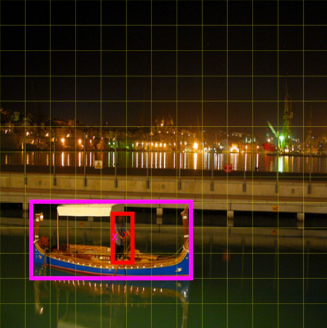
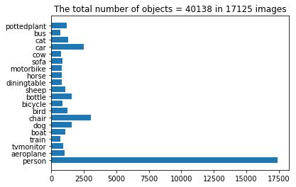
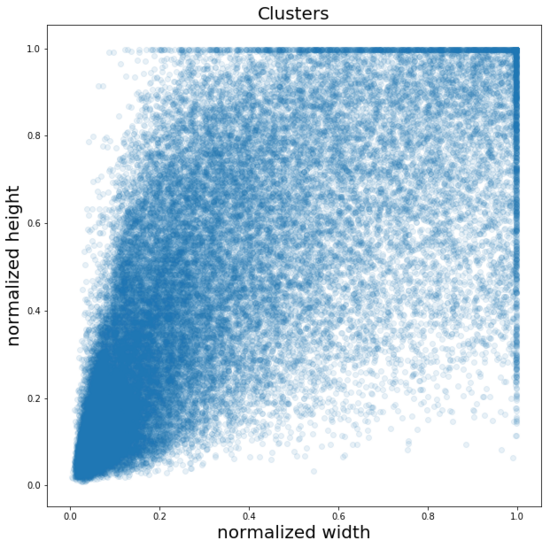
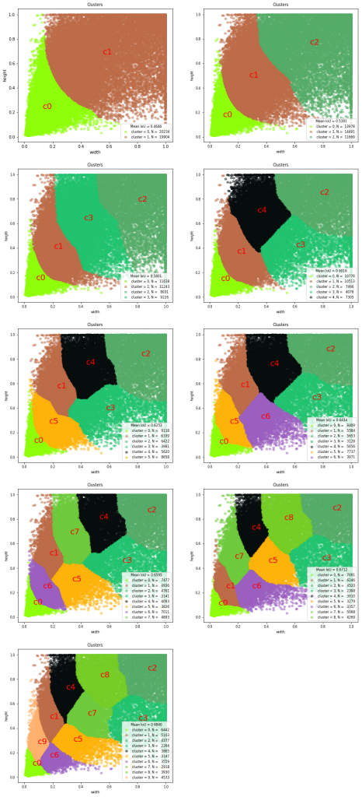
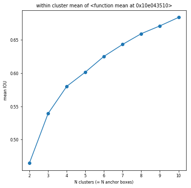

# Dimension Clusters

Instead of choosing anchor boxes by hand, we run k-means clustering on the training set ground truth boxes, aiming to find good anchors automatically.

If we use standard k-means with Euclidean distance, larger boxes generate more error than smaller boxes. However, what we really want are priors that lead to good IOU scores regardless of the size of the box. Thus for our distance metric, we use:


We run k-means for various values of k and plot the average IOU with the closest centroid. We choose `k = 5` as a good tradeoff between model complexity and recall. The cluster centroids are significantly different from the hand-picked anchors. There are fewer short, wide boxes and more tall, thin boxes.


**Figure 2:** Clustering box dimensions on VOC and COCO. The left image shows the average IOU we get with various choices for k. We find that `k = 5` gives a good tradeoff for recall vs. complexity of the model. The right image shows the relative centroids for VOC and COCO.

## Implementation

**Reference:** 

- https://www.gushiciku.cn/pl/poJa/zh-tw
- https://fairyonice.github.io/Part_1_Object_Detection_with_Yolo_for_VOC_2014_data_anchor_box_clustering.html

One of the biggest challenges of object detection is to detect objects that are close to each other but with different shapes (aspect ratios). As shown in the example below, there is a person standing on a boat. While the centers of the person and the bost are very close, they have very different shapes. Anchor boxes are introduced to facilitate this kind of detection task.



In order to the optimal shapes as well as the number of the anchor boxes, YOLOv2 runs k-means clustering on the training set ground truth boxes.

### Example: PASCAL VOC2012

Labels:

```python
LABELS = ['aeroplane',  'bicycle', 'bird',  'boat',      'bottle', 
          'bus',        'car',      'cat',  'chair',     'cow',
          'diningtable','dog',    'horse',  'motorbike', 'person',
          'pottedplant','sheep',  'sofa',   'train',   'tvmonitor']
```



Sample data:

```python
train_image[:2] = [{'filename': '../ObjectDetectionRCNN/VOCdevkit/VOC2012/JPEGImages/2007_000027.jpg',
  'height': 500,
  'object': [{'name': 'person',
    'xmax': 349,
    'xmin': 174,
    'ymax': 351,
    'ymin': 101}],
  'width': 486},
 {'filename': '../ObjectDetectionRCNN/VOCdevkit/VOC2012/JPEGImages/2007_000032.jpg',
  'height': 281,
  'object': [{'name': 'aeroplane',
    'xmax': 375,
    'xmin': 104,
    'ymax': 183,
    'ymin': 78},
   {'name': 'aeroplane', 'xmax': 197, 'xmin': 133, 'ymax': 123, 'ymin': 88},
   {'name': 'person', 'xmax': 213, 'xmin': 195, 'ymax': 229, 'ymin': 180},
   {'name': 'person', 'xmax': 44, 'xmin': 26, 'ymax': 238, 'ymin': 189}],
  'width': 500}]
```

Normalize width and height:

```python
for anno in train_image:
    aw = float(anno['width'])  # width of the original image
    ah = float(anno['height']) # height of the original image
    for obj in anno["object"]:
        w = (obj["xmax"] - obj["xmin"])/aw # make the width range between [0,GRID_W)
        h = (obj["ymax"] - obj["ymin"])/ah # make the width range between [0,GRID_H)
        temp = [w,h]
        wh.append(temp)
wh = np.array(wh)
```



Intersection Over Union calculation:

```python
def iou(box, clusters):
    '''
    :param box:      np.array of shape (2,) containing w and h
    :param clusters: np.array of shape (N cluster, 2) 
    '''
    x = np.minimum(clusters[:, 0], box[0]) 
    y = np.minimum(clusters[:, 1], box[1])

    intersection = x * y
    box_area = box[0] * box[1]
    cluster_area = clusters[:, 0] * clusters[:, 1]

    iou_ = intersection / (box_area + cluster_area - intersection)

    return iou_
```

K-means Clustering:

```python
def kmeans(boxes, k, dist=np.median, seed=1):
    """
    Calculates k-means clustering with the Intersection over Union (IoU) metric.
    :param boxes: numpy array of shape (r, 2), where r is the number of rows
    :param k: number of clusters
    :param dist: distance function
    :return: numpy array of shape (k, 2)
    """
    rows = boxes.shape[0]
    distances = np.empty((rows, k))
    last_clusters = np.zeros((rows,))
    np.random.seed(seed)

    # initialize the cluster centers to be k items
    clusters = boxes[np.random.choice(rows, k, replace=False)]

    while True:
        # Step 1: allocate each item to the closest cluster centers
        for icluster in range(k): 
            distances[:, icluster] = 1 - iou(clusters[icluster], boxes)
        nearest_clusters = np.argmin(distances, axis=1)
        
        # when there is no change in nearest_clusters 
        if (last_clusters == nearest_clusters).all():
            break

        # Step 2: calculate the cluster centers 
        # as mean (or median) of all the cases in the clusters.
        for cluster in range(k):
            clusters[cluster] = dist(boxes[nearest_clusters == cluster], axis=0)
        last_clusters = nearest_clusters

    return clusters, nearest_clusters, distances
```

Try `k=2, ..., 11`:

```python
kmax = 11
dist = np.mean
results = {}
for k in range(2, kmax):
    clusters, nearest_clusters, distances = kmeans(wh,k,seed=2,dist=dist)
    WithinClusterMeanDist = np.mean(
        distances[np.arange(distances.shape[0]), nearest_clusters]
    )
    result = {"clusters":             clusters,
              "nearest_clusters":     nearest_clusters,
              "distances":            distances,
              "WithinClusterMeanDist": WithinClusterMeanDist}
    print("{:2.0f} clusters: mean IoU = {:5.4f}".format(
        k,1-result["WithinClusterMeanDist"]))
    results[k] = result
```

The larger the `k`, the larger the `IoU`.

```
2 clusters: mean IoU = 0.4646
3 clusters: mean IoU = 0.5391
4 clusters: mean IoU = 0.5801
5 clusters: mean IoU = 0.6016
6 clusters: mean IoU = 0.6253
7 clusters: mean IoU = 0.6434
8 clusters: mean IoU = 0.6595
9 clusters: mean IoU = 0.6712
10 clusters: mean IoU = 0.6840
```

Visualize the clusters:





When `k = 4`:

```python
array([[0.08285376, 0.13705531],
       [0.20850361, 0.39420716],
       [0.80552421, 0.77665105],
       [0.42194719, 0.62385487]])
```