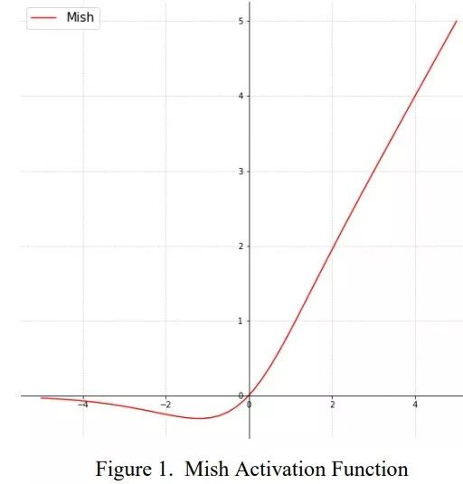
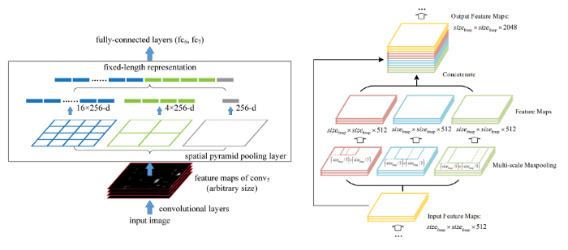
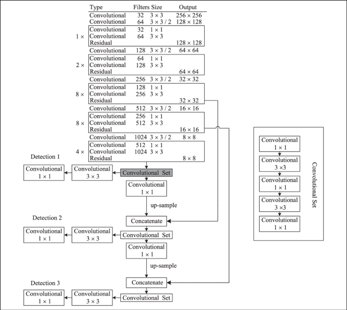
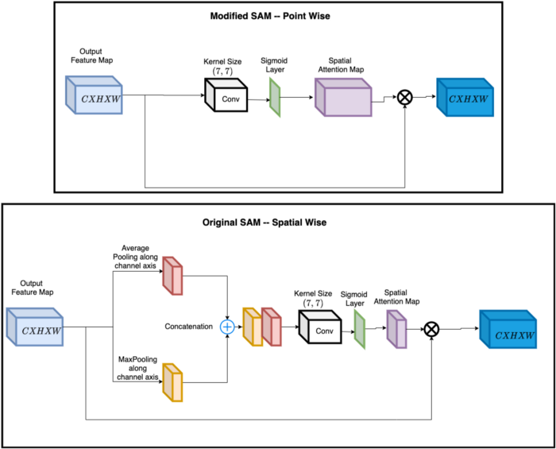

# Common Modules

## Table of contents

- [Standard Convolution](#standard_convolution)
- [Standard Bottleneck](#standard_bottleneck)
- [SPP: spatial pyramid pooling layer](#spp)
- [Detect: detection layer](#detect)
- [Spatial Attention Module (SAM)](#sam)

## Standard Convolution <a name="standard_convolution"></a>

### YOLOv3

`nn.Conv2d` -> `nn.BatchNorm2d` -> `nn.LeakyReLU`

```python
class Conv(nn.Module):
    # Standard convolution
    def __init__(self, c1, c2, k=1, s=1, p=None, g=1, act=True):  
        # ch_in, ch_out, kernel, stride, padding, groups
        super(Conv, self).__init__()
        
        self.conv = nn.Conv2d(
            c1, c2, k, s, autopad(k, p), groups=g, bias=False
        )
        self.bn = nn.BatchNorm2d(c2)
        
        if act:
            self.act = nn.LeakyReLU(0.1)
        elif isinstance(act, nn.Module):
            self.act = act
        else:
            self.act = nn.Identity()
```

### YOLOv4

`nn.Conv2d` -> `nn.BatchNorm2d` -> `Mish`

```python
class BasicConv(nn.Module):
    def __init__(self, in_channels, out_channels, kernel_size, stride=1):
        super(BasicConv, self).__init__()

        self.conv = nn.Conv2d(
            in_channels, out_channels, kernel_size, stride, kernel_size//2, bias=False
        )
        self.bn = nn.BatchNorm2d(out_channels)
        self.activation = Mish()
```

### [Mish](https://paperswithcode.com/method/mish): an activation function

[*Mish: A Self Regularized Non-Monotonic Activation Function*]

**Reference:** https://github.com/digantamisra98/Mish/blob/master/Mish/Torch/functional.py



```python
def mish(input):
    """
    Applies the mish function element-wise:
    mish(x) = x * tanh(softplus(x)) = x * tanh(ln(1 + exp(x)))
    See additional documentation for mish class.
    """
    return input * torch.tanh(F.softplus(input))
```

## Standard Bottleneck <a name="standard_bottleneck"></a>

### YOLOv3

Our new feature extraction network, called Darknet-53, is a hybrid approach combing the network used in YOLOv2, Darknet-19, and the newfangled **residual network stuff**.

```python
class Bottleneck(nn.Module):
    # Standard bottleneck
    def __init__(self, c1, c2, shortcut=True, g=1, e=0.5):  
        # ch_in, ch_out, shortcut, groups, expansion
        super(Bottleneck, self).__init__()
        
        c_ = int(c2 * e)  # hidden channels
        self.cv1 = Conv(c1, c_, 1, 1)
        self.cv2 = Conv(c_, c2, 3, 1, g=g)
        self.add = shortcut and c1 == c2

    def forward(self, x):
        if self.add:
            return x + self.cv2(self.cv1(x))
        else:
            return self.cv2(self.cv1(x))
```

### YOLOv4

```python
class Resblock(nn.Module):
    def __init__(self, channels, hidden_channels=None, residual_activation=nn.Identity()):
        super(Resblock, self).__init__()

        if hidden_channels is None:
            hidden_channels = channels

        self.block = nn.Sequential(
            BasicConv(channels, hidden_channels, 1),
            BasicConv(hidden_channels, channels, 3)
        )

    def forward(self, x):
        return x + self.block(x)
```

## `SPP`: spatial pyramid pooling layer <a name="spp"></a>

**SPP** [*Spatial pyramid pooling in deep convolutional networks for visual recognition, 2015*].



- It was originated from **Spatial Pyramid Matching (SPM)** [*Beyond bags of features: Spatial pyramid matching for recognizing natural scene categories, 2006*]. The original method splits the feature map into several `d × d` equal blocks, where d can be `{1, 2, 3, …}`, thus forming a spatial pyramid, and then extracts bag-of-word features. SPP integrates SPM into CNN and uses max-pooling operation instead of bag-of-words operation.
- Since the SPP module outputs a one-dimensional feature vector, it is infeasible for Fully Convolutional Network (FCN). YOLOv3 modifies the SPP module as the concatenation of the max-pooling outputs with multiple kernel sizes (`k = {1, 5, 9, 13}`, `stride = 1`). With this design, a relatively large `k × k` max-pooling effectively increases the receptive field of the backbone feature.

```python
class SPP(nn.Module):
    # Spatial pyramid pooling layer used in YOLOv3-SPP
    def __init__(self, c1, c2, k=(5, 9, 13)):
        super(SPP, self).__init__()
        c_ = c1 // 2  # hidden channels
        self.cv1 = Conv(c1, c_, 1, 1)
        self.cv2 = Conv(c_ * (len(k) + 1), c2, 1, 1)
        self.m = nn.ModuleList([
            nn.MaxPool2d(kernel_size=x, stride=1, padding=x // 2) 
            for x in k
        ])

    def forward(self, x):
        x = self.cv1(x)
        return self.cv2(torch.cat([x] + [m(x) for m in self.m], 1))
```

## `Detect`: detection layer (Predictions Across Scales) <a name="detect"></a>

YOLOv3 predicts boxes at 3 different scales. It extracts features from those scales using a similar idea as feature pyramid networks.

We add several convolutional layers to the base feature extractor. For each scale, the network predicts a 3-d tensor encoding bounding box, objectness, and class predictions. In the COCO experiment, at each scale we predict 3 boxes, so the tensor is `N × N × [3 × (4 + 1 + 80)]` for the 4 bounding box offsets, 1 objectness prediction, and 80 class predictions.



```python
class Detect(nn.Module):
    stride = None  
    # strides computed during build
    onnx_dynamic = False  
    # ONNX export parameter

    def __init__(self, nc=80, anchors=(), ch=(), inplace=True):  
        # detection layer
        super(Detect, self).__init__()
        self.nc = nc  
        # number of classes: 80
        self.no = nc + 5  
        # number of outputs per anchor: 85
        self.nl = len(anchors)  
        # number of detection layers: 3
        self.na = len(anchors[0]) // 2  
        # number of anchors: 3
        self.grid = [torch.zeros(1)] * self.nl  
        # init grid
        a = torch.tensor(anchors).float().view(self.nl, -1, 2)
        # a.shape: torch.Size([3, 3, 2])
        self.register_buffer('anchors', a)  
        # shape(nl,na,2)
        self.register_buffer('anchor_grid', a.clone().view(self.nl, 1, -1, 1, 1, 2))  
        # shape(nl,1,na,1,1,2)
        self.m = nn.ModuleList(nn.Conv2d(x, self.no * self.na, 1) for x in ch)  
        # output conv, self.m:
        # ModuleList(
        #   (0): Conv2d(256, 255, kernel_size=(1, 1), stride=(1, 1))
        #   (1): Conv2d(512, 255, kernel_size=(1, 1), stride=(1, 1))
        #   (2): Conv2d(1024, 255, kernel_size=(1, 1), stride=(1, 1))
        # )
        self.inplace = inplace  
        # use in-place ops (e.g. slice assignment)

    def forward(self, x):
        # x = x.copy()  # for profiling
        z = []  
        # inference output
        # x.shape: [[1, 256, 32, 32], [1, 512, 16, 16], [1, 1024, 8, 8]]
        for i in range(self.nl):
            # x[i].shape: [1, 256, 32, 32]
            x[i] = self.m[i](x[i])  # conv
            # x[i].shape: [1, 255, 32, 32]
            bs, _, ny, nx = x[i].shape  
            x[i] = x[i].view(
                bs, self.na, self.no, ny, nx
            ).permute(0, 1, 3, 4, 2).contiguous()
            # x[i].shape: [1, 3, 32, 32, 85]

            if not self.training:  
                # inference
                if self.grid[i].shape[2:4] != x[i].shape[2:4] or self.onnx_dynamic:
                    self.grid[i] = self._make_grid(nx, ny).to(x[i].device)

                y = x[i].sigmoid()
                if self.inplace:
                    y[..., 0:2] = (
                        y[..., 0:2] * 2. - 0.5 + self.grid[i]) * self.stride[i]  
                    # xy
                    y[..., 2:4] = (y[..., 2:4] * 2) ** 2 * self.anchor_grid[i]  
                    # wh
                else:  
                    # for YOLOv5 on AWS Inferentia:
                    # https://github.com/ultralytics/yolov5/pull/2953
                    xy = (y[..., 0:2] * 2. - 0.5 + self.grid[i]) * self.stride[i]  
                    # xy
                    wh = (y[..., 2:4] * 2) ** 2 * self.anchor_grid[i].view(
                        1, self.na, 1, 1, 2)  
                    # wh
                    y = torch.cat((xy, wh, y[..., 4:]), -1)
                z.append(y.view(bs, -1, self.no))

        # x.shape: [[1, 3, 32, 32, 85], [1, 3, 16, 16, 85], [1, 3, 8, 8, 85]]
        return x if self.training else (torch.cat(z, 1), x)

    @staticmethod
    def _make_grid(nx=20, ny=20):
        yv, xv = torch.meshgrid([torch.arange(ny), torch.arange(nx)])
        return torch.stack((xv, yv), 2).view((1, 1, ny, nx, 2)).float()
```

## Spatial Attention Module (SAM) <a name="sam"></a>

**Spatial Attention Module (SAM)** [*CBAM: Convolutional block attention module, 2018*] (point-wise attention). It only requires 0.1% extra computation to improve ResNet50-SE’s top-1 accuracy by 0.5% on ImageNet classification task. Also, it does not affect the inference speed on the GPU.

We modify **SAM** from spatial-wise attention to point-wise attention.



```python
class ScaleSpatial(nn.Module):  
    # weighted sum of 2 or more layers https://arxiv.org/abs/1911.09070
    def __init__(self, layers):
        super(ScaleSpatial, self).__init__()
        self.layers = layers  
        # layer indices

    def forward(self, x, outputs):
        a = outputs[self.layers[0]]
        return x * a
```
