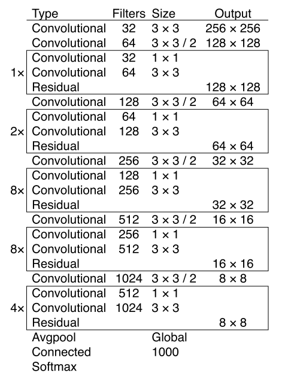

# YOLOv3

## Table of contents

- [Anchors](#anchors)
- [Backbone](#backbone)
- [Detection Head](#detection_head)

## Anchors <a name="anchors"></a>

### yolov3, yolov3-spp

We still use k-means clustering to determine bounding box priors. We choose **9 clusters and 3 scales** arbitrarily and divide the clusters evenly across scales. On the COCO dataset the 9 clusters were: `(10×13)`, `(16×30)`, `(33×23)`, `(30×61)`, `(62×45)`, `(59× 119)`, `(116 × 90)`, `(156 × 198)`, `(373 × 326)`.

```yaml
anchors:
  - [10,13, 16,30, 33,23]  # P3/8
  - [30,61, 62,45, 59,119]  # P4/16
  - [116,90, 156,198, 373,326]  # P5/32
```

### yolov3-tiny

```yaml
anchors:
  - [10,14, 23,27, 37,58]  # P4/16
  - [81,82, 135,169, 344,319]  # P5/32
```

## Backbone <a name="backbone"></a>



### yolov3, yolov3-spp

```yaml
backbone:
  # [from, number, module, args]
  [
    # layer: 0 
    # input: [1, 3, 256, 256] 
    # output: [1, 32, 256, 256]
    [-1, 1, Conv, [32, 3, 1]],  # 0

    # layer: 1 
    # input: [1, 32, 256, 256] 
    # output: [1, 64, 128, 128]
    [-1, 1, Conv, [64, 3, 2]],  # 1-P1/2

    # layer: 2 
    # input: [1, 64, 128, 128] 
    # output: [1, 64, 128, 128]
    [-1, 1, Bottleneck, [64]],

    # layer: 3 
    # input: [1, 64, 128, 128] 
    # output: [1, 128, 64, 64]
    [-1, 1, Conv, [128, 3, 2]],  # 3-P2/4

    # layer: 4 
    # input: [1, 128, 64, 64] 
    # output: [1, 128, 64, 64]
    [-1, 2, Bottleneck, [128]],

    # layer: 5 
    # input: [1, 128, 64, 64] 
    # output: [1, 256, 32, 32]
    [-1, 1, Conv, [256, 3, 2]],  # 5-P3/8

    # layer: 6 
    # input: [1, 256, 32, 32] 
    # output: [1, 256, 32, 32]
    [-1, 8, Bottleneck, [256]],

    # layer: 7 
    # input: [1, 256, 32, 32] 
    # output: [1, 512, 16, 16]
    [-1, 1, Conv, [512, 3, 2]],  # 7-P4/16

    # layer: 8 
    # input: [1, 512, 16, 16] 
    # output: [1, 512, 16, 16]
    [-1, 8, Bottleneck, [512]],

    # layer: 9 
    # input: [1, 512, 16, 16] 
    # output: [1, 1024, 8, 8]
    [-1, 1, Conv, [1024, 3, 2]],  # 9-P5/32

    # layer: 10 
    # input: [1, 1024, 8, 8] 
    # output: [1, 1024, 8, 8]
    [-1, 4, Bottleneck, [1024]],  # 10
  ]
```

### yolov3-tiny

```yaml
backbone:
  # [from, number, module, args]
  [
    [-1, 1, Conv, [16, 3, 1]],  # 0
    [-1, 1, nn.MaxPool2d, [2, 2, 0]],  # 1-P1/2
    # yolov3
    # [-1, 1, Conv, [32, 3, 1]],  # 0
    # [-1, 1, Conv, [64, 3, 2]],  # 1-P1/2
    
    [-1, 1, Conv, [32, 3, 1]],
    [-1, 1, nn.MaxPool2d, [2, 2, 0]],  # 3-P2/4
    # yolov3
    # [-1, 1, Bottleneck, [64]],
    # [-1, 1, Conv, [128, 3, 2]],  # 3-P2/4
    
    [-1, 1, Conv, [64, 3, 1]],
    [-1, 1, nn.MaxPool2d, [2, 2, 0]],  # 5-P3/8
    # yolov3
    # [-1, 2, Bottleneck, [128]],
    # [-1, 1, Conv, [256, 3, 2]],  # 5-P3/8
    
    [-1, 1, Conv, [128, 3, 1]],
    [-1, 1, nn.MaxPool2d, [2, 2, 0]],  # 7-P4/16
    # yolov3
    # [-1, 8, Bottleneck, [256]],
    # [-1, 1, Conv, [512, 3, 2]],  # 7-P4/16
    
    [-1, 1, Conv, [256, 3, 1]],
    [-1, 1, nn.MaxPool2d, [2, 2, 0]],  # 9-P5/32
    # yolov3
    # [-1, 8, Bottleneck, [512]],
    # [-1, 1, Conv, [1024, 3, 2]],  # 9-P5/32
    
    [-1, 1, Conv, [512, 3, 1]],
    [-1, 1, nn.ZeroPad2d, [[0, 1, 0, 1]]],  # 11
    [-1, 1, nn.MaxPool2d, [2, 1, 0]],  # 12
    # yolov3
    # null
  ]
```

## Detection Head <a name="detection_head"></a>

### yolov3

YOLOv3 predicts boxes at 3 different scales. It extracts features from those scales using a similar idea as feature pyramid networks. 

- layer 15: P5/32-large
- layer 22: P4/16-medium
- layer 27: P3/8-small


```yaml
head:
  [
    # layer: 11 
    # input: [1, 1024, 8, 8] 
    # output: [1, 1024, 8, 8]
    [-1, 1, Bottleneck, [1024, False]],

    # layer: 12 
    # input: [1, 1024, 8, 8] 
    # output: [1, 512, 8, 8]
    [-1, 1, Conv, [512, [1, 1]]],

    # layer: 13 
    # input: [1, 512, 8, 8] 
    # output: [1, 1024, 8, 8]
    [-1, 1, Conv, [1024, 3, 1]],

    # layer: 14 
    # input: [1, 1024, 8, 8] 
    # output: [1, 512, 8, 8]
    [-1, 1, Conv, [512, 1, 1]],

    # layer: 15 
    # input: [1, 512, 8, 8] 
    # output: [1, 1024, 8, 8]
    [-1, 1, Conv, [1024, 3, 1]],  # 15 (P5/32-large)

    # layer: 16 
    # input: [1, 512, 8, 8] 
    # output: [1, 256, 8, 8]
    [-2, 1, Conv, [256, 1, 1]],

    # layer: 17 
    # input: [1, 256, 8, 8] 
    # output: [1, 256, 16, 16]
    [-1, 1, nn.Upsample, [None, 2, 'nearest']],

    # layer: 18 
    # input: [[1, 256, 16, 16], [1, 512, 16, 16]] 
    # output: [1, 768, 16, 16]
    [[-1, 8], 1, Concat, [1]],  # cat backbone P4

    # layer: 19 
    # input: [1, 768, 16, 16] 
    # output: [1, 512, 16, 16]
    [-1, 1, Bottleneck, [512, False]],

    # layer: 20 
    # input: [1, 512, 16, 16] 
    # output: [1, 512, 16, 16]
    [-1, 1, Bottleneck, [512, False]],

    # layer: 21 
    # input: [1, 512, 16, 16] 
    # output: [1, 256, 16, 16]
    [-1, 1, Conv, [256, 1, 1]],

    # layer: 22 
    # input: [1, 256, 16, 16] 
    # output: [1, 512, 16, 16]
    [-1, 1, Conv, [512, 3, 1]],  # 22 (P4/16-medium)

    # layer: 23 
    # input: [1, 256, 16, 16] 
    # output: [1, 128, 16, 16]
    [-2, 1, Conv, [128, 1, 1]],

    # layer: 24 
    # input: [1, 128, 16, 16] 
    # output: [1, 128, 32, 32]
    [-1, 1, nn.Upsample, [None, 2, 'nearest']],

    # layer: 25 
    # input: [[1, 128, 32, 32], [1, 256, 32, 32]] 
    # output: [1, 384, 32, 32]
    [[-1, 6], 1, Concat, [1]],  # cat backbone P3

    # layer: 26 
    # input: [1, 384, 32, 32] 
    # output: [1, 256, 32, 32]
    [-1, 1, Bottleneck, [256, False]],

    # layer: 27 
    # input: [1, 256, 32, 32] 
    # output: [1, 256, 32, 32]
    [-1, 2, Bottleneck, [256, False]],  # 27 (P3/8-small)

    # layer: 28 
    # input: [[1, 256, 32, 32], [1, 512, 16, 16], [1, 1024, 8, 8]] 
    # output: [[1, 3, 32, 32, 85], [1, 3, 16, 16, 85], [1, 3, 8, 8, 85]]
    [[27, 22, 15], 1, Detect, [nc, anchors]],   # Detect(P3, P4, P5)
  ]
```

To detect for extra scale (from detection 1 to detection 2), we take the feature map from 2 layers previous (-2) and upsample it by 2×. 

```yaml
# layer: 14 
# input: [1, 1024, 8, 8] 
# output: [1, 512, 8, 8]
[-1, 1, Conv, [512, 1, 1]],

# layer: 15 
# input: [1, 512, 8, 8] 
# output: [1, 1024, 8, 8]
[-1, 1, Conv, [1024, 3, 1]],  # 15 (P5/32-large)
    
# layer: 16 
# input: [1, 512, 8, 8] 
# output: [1, 256, 8, 8]
[-2, 1, Conv, [256, 1, 1]],

# layer: 17 
# input: [1, 256, 8, 8] 
# output: [1, 256, 16, 16]
[-1, 1, nn.Upsample, [None, 2, 'nearest']],
```

We also take a feature map from the earlier network layers and merge it with our upsampled feature map using concatenation. It allows us to get more meaningful semantic information from the upsampled feature map and fine-grained information from the earlier feature map. 

```yaml
# layer: 8 
# input: [1, 512, 16, 16] 
# output: [1, 512, 16, 16]
[-1, 8, Bottleneck, [512]],

# layer: 17 
# input: [1, 256, 8, 8] 
# output: [1, 256, 16, 16]
[-1, 1, nn.Upsample, [None, 2, 'nearest']],

# layer: 18 
# input: [[1, 256, 16, 16], [1, 512, 16, 16]] 
# output: [1, 768, 16, 16]
[[-1, 8], 1, Concat, [1]],  # cat backbone P4
```

We then add a few more convolutional layers to process this combined feature map and eventually predict a similar tensor.

```python
# layer: 15 
# input: [1, 512, 8, 8] 
# output: [1, 1024, 8, 8]
[-1, 1, Conv, [1024, 3, 1]],  # 15 (P5/32-large)

# layer: 22 
# input: [1, 256, 16, 16] 
# output: [1, 512, 16, 16]
[-1, 1, Conv, [512, 3, 1]],  # 22 (P4/16-medium)

# layer: 27 
# input: [1, 256, 32, 32] 
# output: [1, 256, 32, 32]
[-1, 2, Bottleneck, [256, False]],  # 27 (P3/8-small)

# layer: 28 
# input: [[1, 256, 32, 32], [1, 512, 16, 16], [1, 1024, 8, 8]] 
# output: [[1, 3, 32, 32, 85], [1, 3, 16, 16, 85], [1, 3, 8, 8, 85]]
[[27, 22, 15], 1, Detect, [nc, anchors]],   # Detect(P3, P4, P5)
```

We go through the same procedure one more time to predict boxes for the final scale (from detection 2 to detection 3). Thus the predictions for the 3rd scale benefit from all the prior computation as well as fine-grained features from the earlier network layers.

### yolov3-spp

```yaml
head:
  [
    [-1, 1, Bottleneck, [1024, False]],
    [-1, 1, SPP, [512, [5, 9, 13]]], # only difference with yolov3
    [-1, 1, Conv, [1024, 3, 1]],
    [-1, 1, Conv, [512, 1, 1]],
    [-1, 1, Conv, [1024, 3, 1]],  # 15 (P5/32-large)
    # yolov3
    # [-1, 1, Bottleneck, [1024, False]],
    # [-1, 1, Conv, [512, [1, 1]]],
    # [-1, 1, Conv, [1024, 3, 1]],
    # [-1, 1, Conv, [512, 1, 1]],
    # [-1, 1, Conv, [1024, 3, 1]],  # 15 (P5/32-large)

    [-2, 1, Conv, [256, 1, 1]],
    [-1, 1, nn.Upsample, [None, 2, 'nearest']],
    [[-1, 8], 1, Concat, [1]],  # cat backbone P4
    [-1, 1, Bottleneck, [512, False]],
    [-1, 1, Bottleneck, [512, False]],
    [-1, 1, Conv, [256, 1, 1]],
    [-1, 1, Conv, [512, 3, 1]],  # 22 (P4/16-medium)

    [-2, 1, Conv, [128, 1, 1]],
    [-1, 1, nn.Upsample, [None, 2, 'nearest']],
    [[-1, 6], 1, Concat, [1]],  # cat backbone P3
    [-1, 1, Bottleneck, [256, False]],
    [-1, 2, Bottleneck, [256, False]],  # 27 (P3/8-small)

    [[27, 22, 15], 1, Detect, [nc, anchors]],   # Detect(P3, P4, P5)
  ]
```
