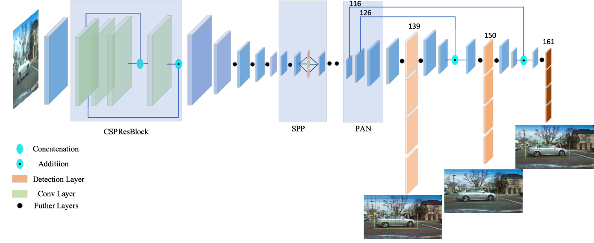
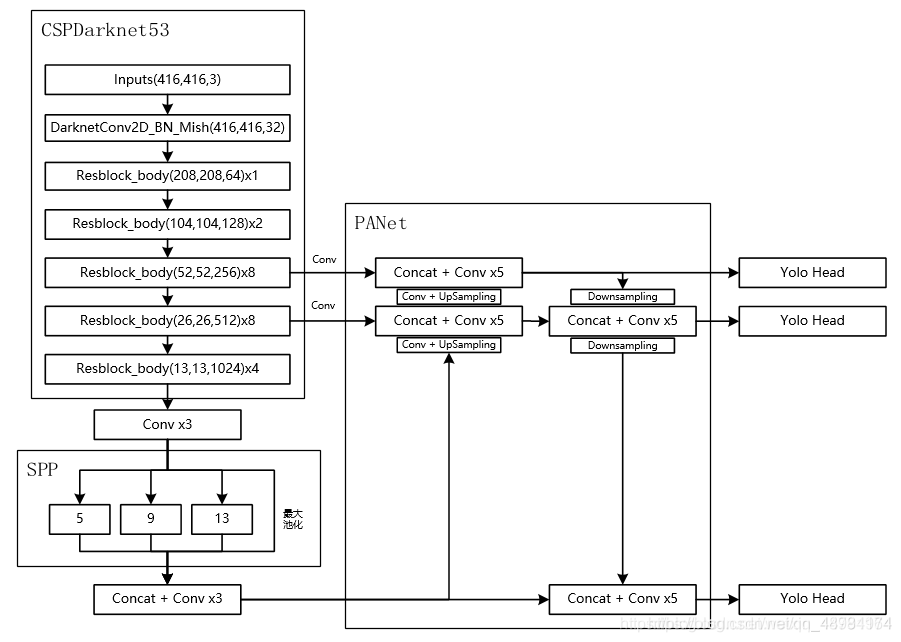
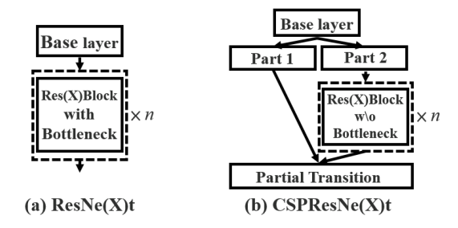
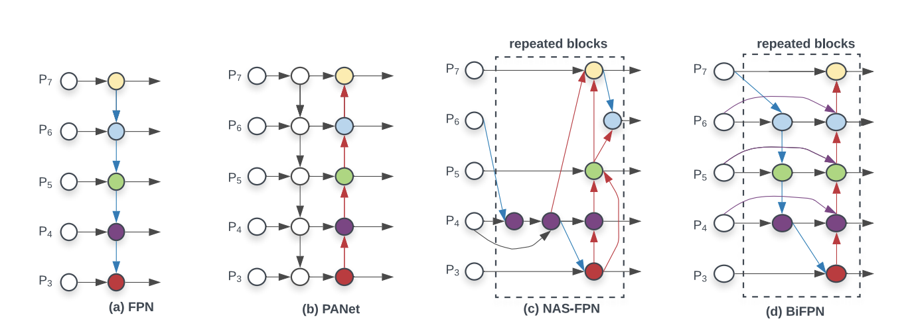
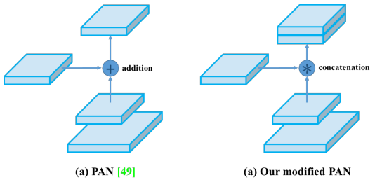

# YOLOv4

## Table of contents

- [Backbone: CSPDarknet53](#cspdarknet53)
- [Neck: SPP, PAN](#neck)
- [Head: YOLOv3](#head)
- [Overview](#overview)



**Image source:** [*YOLOv4-5D: An Effective and Efficient Object Detector for Autonomous Driving*]



## Backbone: CSPDarknet53 <a name="cspdarknet53"></a>

```python
class CSPDarkNet(nn.Module):
    # model = CSPDarkNet([1, 2, 8, 8, 4])
    def __init__(self, layers):
        # layers = [1, 2, 8, 8, 4]
        super(CSPDarkNet, self).__init__()
        
        self.inplanes = 32
        self.conv1 = BasicConv(3, self.inplanes, kernel_size=3, stride=1)
    	# yolov3, 0: [-1, 1, Conv, [32, 3, 1]]
        self.feature_channels = [64, 128, 256, 512, 1024]
        # yolov3: 
        # 1-P1/2: 64
        # 3-P2/4: 128
        # 5-P3/8: 256
        # 7-P4/16: 512
        # 9-P5/32: 1024

        self.stages = nn.ModuleList([
            # in: 32, out: 64, num: 1
            Resblock_body(
                self.inplanes, self.feature_channels[0], 
                layers[0], first=True
            ),
            # yolov3, 1-P1/2: [-1, 1, Conv, [64, 3, 2]]
            # yolov3, 2: [-1, 1, Bottleneck, [64]]
            
            # in: 64, out: 128, num: 2
            Resblock_body(
                self.feature_channels[0], self.feature_channels[1], 
                layers[1], first=False
            ),
            # yolov3, 3-P2/4: [-1, 1, Conv, [64, 3, 2]]
            # yolov3, 4: [-1, 2, Bottleneck, [128]]
            
            # in: 128, out: 256, num: 8
            Resblock_body(
                self.feature_channels[1], self.feature_channels[2], 
                layers[2], first=False
            ),
            # yolov3, 5-P3/8: [-1, 1, Conv, [256, 3, 2]]
            # yolov3, 6: [-1, 8, Bottleneck, [256]]
            
            # in: 256, out: 512, num: 8
            Resblock_body(
                self.feature_channels[2], self.feature_channels[3], 
                layers[3], first=False
            ),
            # yolov3, 7-P4/16: [-1, 1, Conv, [512, 3, 2]]
            # yolov3, 8: [-1, 8, Bottleneck, [512]]
            
            # in: 512, out: 1024, num: 4
            Resblock_body(
                self.feature_channels[3], self.feature_channels[4], 
                layers[4], first=False
            )
            # yolov3, 9-P5/32: [-1, 1, Conv, [1024, 3, 2]]
            # yolov3, 10: [-1, 4, Bottleneck, [1024]]
        ])
        
    def forward(self, x):
        x = self.conv1(x)

        x = self.stages[0](x)
        x = self.stages[1](x)
        out3 = self.stages[2](x)
        out4 = self.stages[3](out3)
        out5 = self.stages[4](out4)

        return out3, out4, out5
```

### CSP: Cross-stage partial connections

[*CSPNet: A New Backbone that can Enhance Learning Capability of CNN, 2019*]



```python
class Resblock_body(nn.Module):
    # example: in: 128, out: 256, num: 8
    def __init__(self, in_channels, out_channels, num_blocks, first):
        super(Resblock_body, self).__init__()
		
        # yolov3, 5-P3/8: [-1, 1, Conv, [256, 3, 2]]
        self.downsample_conv = BasicConv(in_channels, out_channels, 3, stride=2)

        if first:
            self.split_conv0 = BasicConv(out_channels, out_channels, 1)
            self.split_conv1 = BasicConv(out_channels, out_channels, 1)  
            self.blocks_conv = nn.Sequential(
                Resblock(channels=out_channels, hidden_channels=out_channels//2),
                BasicConv(out_channels, out_channels, 1)
            )
            self.concat_conv = BasicConv(out_channels*2, out_channels, 1)
        else:
            # yolov3, 6: [-1, 8, Bottleneck, [256]]
            self.split_conv0 = BasicConv(out_channels, out_channels//2, 1)
            self.split_conv1 = BasicConv(out_channels, out_channels//2, 1)

            self.blocks_conv = nn.Sequential(
                *[Resblock(out_channels//2) for _ in range(num_blocks)],
                BasicConv(out_channels//2, out_channels//2, 1)
            )
            self.concat_conv = BasicConv(out_channels, out_channels, 1)

    def forward(self, x):
        # yolov3, 5-P3/8: [-1, 1, Conv, [256, 3, 2]]
        x = self.downsample_conv(x)

        x0 = self.split_conv0(x)
        
        # yolov3, 6: [-1, 8, Bottleneck, [256]]
        x1 = self.split_conv1(x)
        x1 = self.blocks_conv(x1)

        x = torch.cat([x1, x0], dim=1)
        x = self.concat_conv(x)

        return x
```

## Neck: SPP, PAN <a name="neck"></a>

- SPP-block

- PAN path-aggregation block




## Head: YOLOv3 <a name="head"></a>

- YOLOv3

## Overview <a name="overview"></a>

**Reference:** https://github.com/bubbliiiing/yolov4-pytorch

### Backbone

```python
class YoloBody(nn.Module):
    def __init__(self, anchors_mask, num_classes):
        super(YoloBody, self).__init__()
        self.backbone = darknet53(None)
```

forward:

```python
        x2, x1, x0 = self.backbone(x)
        # x2: 52,52,256
        # x1: 26,26,512
        # x0: 13,13,1024
```

### Neck - SPP

```python
        # in: 1024, out: 512
        # [-1, 1, conv-bn-leaky, [512, 1, 1]]
        # [-1, 1, conv-bn-leaky, [1024, 3, 1]]
        # [-1, 1, conv-bn-leaky, [512, 1, 1]]
        self.conv1 = make_three_conv([512, 1024], 1024)
        
        # in: 512, out: 2048
        self.SPP = SpatialPyramidPooling()
```

forward:

```python
        # 13,13,1024 -> 13,13,512 -> 13,13,1024 -> 13,13,512 -> 13,13,2048 
        P5 = self.conv1(x0)
        P5 = self.SPP(P5)
```

### Neck - PAN

#### upsample1: P5

`13,13,2048` -> `26,26,256`

```python
        # in: 2048, out: 512
        # [-1, 1, conv-bn-leaky, [512, 1, 1]]
        # [-1, 1, conv-bn-leaky, [1024, 3, 1]]
        # [-1, 1, conv-bn-leaky, [512, 1, 1]]
        self.conv2 = make_three_conv([512, 1024], 2048)
        
        # up: 2, in: 512, out: 256
        self.upsample1 = Upsample(512, 256)
```

forward:

```python
        # 13,13,2048 -> 13,13,512 -> 13,13,1024 -> 13,13,512
        P5 = self.conv2(P5)

        # 13,13,512 -> 13,13,256 -> 26,26,256
        P5_upsample = self.upsample1(P5)
```

#### upsample2: P4

`26,26,512` -> `52,52,128`

```python
        # in: 512, out: 256
        self.conv_for_P4 = conv2d(512, 256, 1)
        # in: 512, out: 256
        # [-1, 1, conv-bn-leaky, [256, 1, 1]]
        # [-1, 1, conv-bn-leaky, [512, 3, 1]]
        # [-1, 1, conv-bn-leaky, [256, 1, 1]]
        # [-1, 1, conv-bn-leaky, [512, 3, 1]]
        # [-1, 1, conv-bn-leaky, [256, 1, 1]]
        self.make_five_conv1 = make_five_conv([256, 512], 512)
		
        # up: 2, in: 256, out: 128
        self.upsample2 = Upsample(256, 128)
```

forward:

```python
        # 26,26,512 -> 26,26,256
        P4 = self.conv_for_P4(x1)
        # 26,26,256 + 26,26,256 -> 26,26,512
        P4 = torch.cat([P4, P5_upsample], axis=1)
        # 26,26,512 -> 26,26,256 -> 26,26,512 -> 26,26,256 -> 26,26,512 -> 26,26,256
        P4 = self.make_five_conv1(P4)

        # 26,26,256 -> 26,26,128 -> 52,52,128
        P4_upsample = self.upsample2(P4)
```

#### upsample end: P3

`52,52,128`

```python
        # in: 256, out: 128
        self.conv_for_P3 = conv2d(256, 128, 1)
        # in: 256, out: 128
        # [-1, 1, conv-bn-leaky, [128, 1, 1]]
        # [-1, 1, conv-bn-leaky, [256, 3, 1]]
        # [-1, 1, conv-bn-leaky, [128, 1, 1]]
        # [-1, 1, conv-bn-leaky, [256, 3, 1]]
        # [-1, 1, conv-bn-leaky, [128, 1, 1]]
        self.make_five_conv2 = make_five_conv([128, 256], 256)
```

forward:

```python
        # 52,52,256 -> 52,52,128
        P3 = self.conv_for_P3(x2)
        # 52,52,128 + 52,52,128 -> 52,52,256
        P3 = torch.cat([P3, P4_upsample],axis=1)
        # 52,52,256 -> 52,52,128 -> 52,52,256 -> 52,52,128 -> 52,52,256 -> 52,52,128
        P3 = self.make_five_conv2(P3)
```

#### down_sample1: P4

`52,52,128` -> `26,26,256`

```python
    	# down: 2, in: 128, out: 256
        self.down_sample1 = conv2d(128, 256, 3, stride=2)
        # in: 512, out: 256
        # [-1, 1, conv-bn-leaky, [256, 1, 1]]
        # [-1, 1, conv-bn-leaky, [512, 3, 1]]
        # [-1, 1, conv-bn-leaky, [256, 1, 1]]
        # [-1, 1, conv-bn-leaky, [512, 3, 1]]
        # [-1, 1, conv-bn-leaky, [256, 1, 1]]
        self.make_five_conv3 = make_five_conv([256, 512], 512)
```

forward:

```python
        # 52,52,128 -> 26,26,256
        P3_downsample = self.down_sample1(P3)
        # 26,26,256 + 26,26,256 -> 26,26,512
        P4 = torch.cat([P3_downsample, P4], axis=1)
        # 26,26,512 -> 26,26,256 -> 26,26,512 -> 26,26,256 -> 26,26,512 -> 26,26,256
        P4 = self.make_five_conv3(P4)
```

#### down_sample2: P5

`26,26,256` -> `13,13,512`

```python
        # down: 2, in: 256, out: 512
        self.down_sample2 = conv2d(256, 512, 3, stride=2)
        # in: 1024, out: 512
        # [-1, 1, conv-bn-leaky, [512, 1, 1]]
        # [-1, 1, conv-bn-leaky, [1024, 3, 1]]
        # [-1, 1, conv-bn-leaky, [512, 1, 1]]
        # [-1, 1, conv-bn-leaky, [1024, 3, 1]]
        # [-1, 1, conv-bn-leaky, [512, 1, 1]]
        self.make_five_conv4 = make_five_conv([512, 1024], 1024)
```

forward:

```python
        # 26,26,256 -> 13,13,512
        P4_downsample = self.down_sample2(P4)
        # 13,13,512 + 13,13,512 -> 13,13,1024
        P5 = torch.cat([P4_downsample, P5], axis=1)
        # 13,13,1024 -> 13,13,512 -> 13,13,1024 -> 13,13,512 -> 13,13,1024 -> 13,13,512
        P5 = self.make_five_conv4(P5)
```

### Head: YOLOv3

```python
        # 3*(5+num_classes) = 3*(5+20) = 3*(4+1+20)=75
    	# in: 128, out: 75
        # [-1, 1, conv-bn-leaky, [256, 3, 1]]
        # [-1, 1, conv, [75, 1, 1]]
        self.yolo_head3 = yolo_head(
            [256, len(anchors_mask[0]) * (5 + num_classes)], 128
        )
     
        # 3*(5+num_classes) = 3*(5+20) = 3*(4+1+20)=75
    	# in: 256, out: 75
        # [-1, 1, conv-bn-leaky, [512, 3, 1]]
        # [-1, 1, conv, [75, 1, 1]]
        self.yolo_head2 = yolo_head(
            [512, len(anchors_mask[1]) * (5 + num_classes)], 256
        )

        # 3*(5+num_classes)=3*(5+20)=3*(4+1+20)=75
    	# in: 512, out: 75
        # [-1, 1, conv-bn-leaky, [1024, 3, 1]]
        # [-1, 1, conv, [75, 1, 1]]
        self.yolo_head1 = yolo_head(
            [1024, len(anchors_mask[2]) * (5 + num_classes)], 512
        )
```

forward:

```python
        # P3: 52,52,128
        # out2: (batch_size, 75, 52, 52)
        out2 = self.yolo_head3(P3)
        
        # P4: 26,26,256
        # out1: (batch_size, 75, 26, 26)
        out1 = self.yolo_head2(P4)
        
        # P5: 13,13,512
        # out0: (batch_size, 75, 13, 13)
        out0 = self.yolo_head1(P5)

        return out0, out1, out2
```
