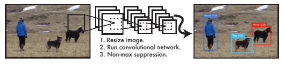
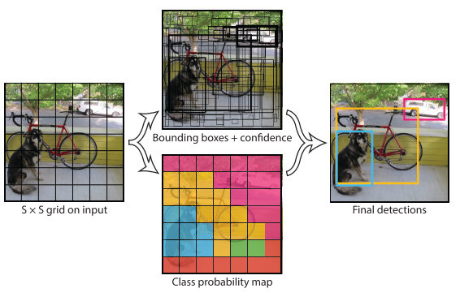
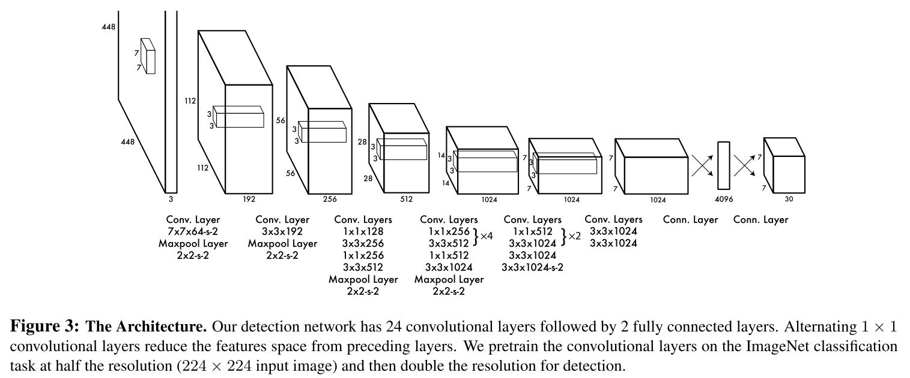
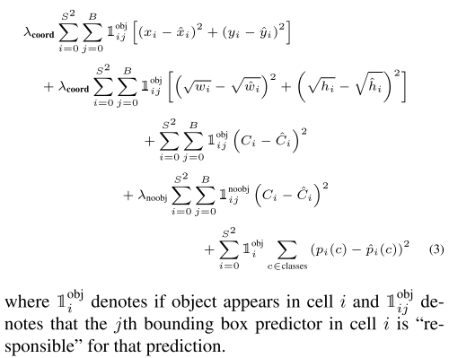
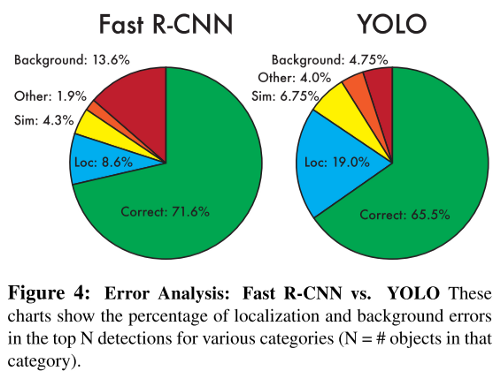

# YOLO: You Only Look Once (2015)

**Original paper:** [You Only Look Once: Unified, Real-Time Object Detection](https://arxiv.org/abs/1506.02640)

## Improvement against other detectors

- It reframes object detection as a single regression problem, straight from image pixels to bounding box coordinates and class probabilities (without region proposals). Without a complex pipeline, it is extremely fast.
- It reasons globally about the image when making predictions, unlike sliding window and region proposal-based techniques.
- It learns generalizable representations of objects and is less likely to break down when applied to new domains or unexpected inputs.

**Figure 1:** The YOLO Detection System. Processing images with YOLO is simple and straightforward. Our system (1) resizes the input image to 448 × 448, (2) runs a single convolutional network on the image, and (3) thresholds the resulting detections by the model’s confidence

## YOLO: System overview

The system divides the image into an `S × S` grid. If the center of an object falls into a grid cell, that grid cell is responsible for detecting that object. For each grid cell, it predicts:

**B bounding boxes**, each bounding box consists of 5 predictions:

1. **4 box coordinates:** The `(x, y)` coordinates represent the center of the box relative to the bounds of the grid cell. The width and height are predicted relative to the whole image.
2. **1 confidence score** = `Pr(Object) ∗ IOU(truth_pred)`. If no object exists in that cell, it should be zero. Otherwise, it should be equal the IOU between the predicted box and the ground truth. It reflects how confident the box contains an object and also how accurate the box is.

**C conditional class probabilities**: `Pr(Class_i|Object)`. These probabilities are conditioned on the grid cell containing an object. <u>Only one set of class probabilities is predicted per grid cell</u>, regardless of the number of boxes `B`.

These predictions are encoded as an `S × S × (B ∗ 5 + C)` tensor. For PASCAL VOC, `S = 7`, `B = 2`, `C = 20`, thus the final prediction is a `7 × 7 × 30` tensor. The network uses features from the entire image to make predictions, reasoning globally about the full image and all the objects in the image.

At test time, the class-specific confidence scores for each box are calculated as below. This score encodes both the probability of a class appearing in the box and how well the predicted box fits the object.

## CNN network and supervised pre-training

The detection network has 24 convolutional layers followed by 2 fully connected layers. The first 20 convolutional layers (followed by an average-pooling layer and a fully connected layer) are pre-trained on the ImageNet classification task at half of the target resolution (`224 × 224`).

## Detection training

To perform detection, four convolutional layers and two fully connected layers with randomly initialized weights are added. In addition, the input resolution is doubled (from `224 × 224` to `448 × 448`) because detection often requires fine-grained visual information. The final layer predicts both class probabilities and bounding box coordinates.

- The bounding box width and height are normalized by the image width and height so that they fall between 0 and 1.
- The bounding box x and y coordinates are parametrized to be offsets of a particular grid cell location so they are also bounded between 0 and 1.

The final layer uses a linear activation function, while all other layers use a Leaky ReLU: `f(x)=1(x<0)(αx)+1(x≥0)(x) where α=0.1`.

Although YOLO predicts multiple bounding boxes per grid cell, at training time only one bounding box predictor is responsible for each object. A predictor is assigned to be “responsible” for predicting an object if it has the highest current IOU with the ground truth. This leads to specialization between the bounding box predictors. Each predictor gets better at predicting certain sizes, aspect ratios, or classes of objects, improving overall recall. During training, a multi-part loss is optimized.

- Sum-square error is used here because it is easy to optimize.

- Since small deviations in large boxes should matter less than in small boxes, the square roots of the bounding box width and height are predicted.

- Two parameters `λ_coord` and `λ_noobj` are used to control the weights of different parts. The author set `λ_coord = 5` and `λ_noobj = 0.5` to increase the loss from localization and decrease the loss from classification for boxes that don’t contain objects. 

  Since in every image, many grid cells don’t contain any object and their “confidence” scores would be pushed towards zero, often overpowering the gradient from these cells.

- The loss function only penalizes classification error if an object is present in that grid cell.

- It also only penalizes bounding box coordinate error if that predictor is “responsible” for the ground truth box (i.e. has the highest IOU of any predictor in that grid cell).

## Drawbacks

- Since each grid cell only predicts `B` boxes and can only have one class, it imposes strong spatial constraints on bounding box prediction and limits the number of nearby objects that the model can predict.
- It struggles with small objects that appear in groups, such as flocks of birds.
- Since it learns to predict bounding boxes from data, it struggles to generalize to objects in new or unusual aspect ratios or configurations.
- It uses relatively coarse features for predicting bounding boxes since the architecture has multiple downsampling layers from the input image.　
- The loss function treats errors the same in small bounding boxes versus large bounding boxes.