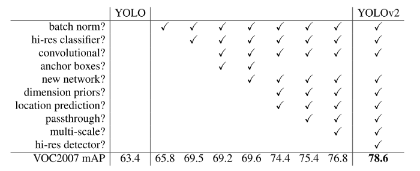
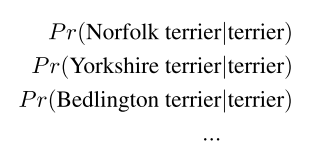

# YOLO9000: Better, Faster, Stronger (2016)

**Original Paper:** [YOLO9000: Better, Faster, Stronger](https://arxiv.org/abs/1612.08242)

# Overview

- General-purpose object detection should be able to recognize a wide variety of objects. However, most detection methods are still constrained to a small set of objects.

- Current object detection datasets are limited compared to datasets for other tasks like classification because labeling images for detection is far more expensive.

- Aiming to scale up detection to the level of object classification, we propose a new method to harness a large amount of classification data and use it to expand the scope of current detection systems. 

  To enable this, we introduce a joint training algorithm that allows us to train object detectors on both detection and classification data. This method leverages labeled detection images to learn object localization while uses classification images to improve its vocabulary and robustness.

- Using this method we train YOLO9000, a real-time object detector that can detect over 9000 different object categories.

# Better

Compared to Fast R-CNN, YOLO makes a significant number of localization errors. Also, YOLO has relatively low recall compared to region proposal-based methods. Thus we mainly focus on improving these two issues while maintaining classification accuracy.

**Table 2:** The path from YOLO to YOLOv2.

## Batch Normalization

By adding batch normalization to all of the convolutional layers in YOLO, we get more than 2% improvement in mAP. Batch normalization also helps regularize the model.

## High-Resolution Classifier

YOLOv1 trains the classifier network at `224 × 224` and increases the resolution to `448` for detection. Thus the network needs to adjust new input resolution and learn object detection simultaneously.

For YOLOv2, we first fine-tune the classification network at the full `448 × 448` resolution for 10 epochs on ImageNet and then fine-tune the resulting network on detection. This gives us an increase of almost 4% mAP.

## Convolutional With Anchor Boxes

YOLOv1 predicts the coordinates of bounding boxes directly. While Faster R-CNN predicts offsets for hand-picked anchor boxes. Predicting offsets instead of coordinates simplifies the problem and thus makes it easier for the network to learn. We remove the fully connected layers from YOLOv1 and use anchor boxes to predict bounding boxes.

YOLOv2 operates on input images with a resolution of `416`. Its convolutional layers downsample the image by a factor of `32` so we get an output feature map of `13 × 13`. We predict class and objectness for every anchor box. Following YOLOv1, the objectness prediction still predicts the IOU of the ground truth and the proposed box, and the class predictions predict the conditional probability of that class given that there is an object.

Using anchor boxes we get a small decrease in accuracy (mAP from 69.5 to 69.2) but an improvement in recall (from 81% to 88%). Even though the mAP decreases, the increase in recall means that our model has more room to improve.

## Dimension Clusters

Instead of choosing anchor boxes by hand, we run k-means clustering on the training set ground truth boxes, aiming to find good anchors automatically.

If we use standard k-means with Euclidean distance, larger boxes generate more error than smaller boxes. However, what we really want are priors that lead to good IOU scores regardless of the size of the box. Thus for our distance metric, we use:

We run k-means for various values of k and plot the average IOU with the closest centroid. We choose `k = 5` as a good tradeoff between model complexity and recall. The cluster centroids are significantly different from the hand-picked anchors. There are fewer short, wide boxes and more tall, thin boxes.

**Figure 2:** Clustering box dimensions on VOC and COCO. The left image shows the average IOU we get with various choices for k. We find that `k = 5` gives a good tradeoff for recall vs. complexity of the model. The right image shows the relative centroids for VOC and COCO.

We compare the average IOU to the closest anchor between our clustering strategy and the hand-picked anchor boxes. At only 5 anchors the centroids perform similarly to 9 anchor boxes with an average IOU of 61.0 compared to 60.9. If we use 9 centroids we see a much higher average IOU (67.2).

**Table 1:** Average IOU of boxes to closest priors on VOC 2007. The average IOU of objects on VOC 2007 to their closest, unmodified prior using different generation methods. Clustering gives much better results than using hand-picked priors.

## Direct location prediction

We encounter model instability issues when using anchor boxes with YOLO, especially during early iterations. Most of the instability comes from predicting the `(x, y)` locations for the box. To stabilize the learning process, we predict location coordinates relative to the location of the grid cell. This bounds the ground truth to fall between 0 and 1. We use a logistic activation to constrain the network’s predictions to fall in this range.

The network predicts **5 bounding boxes at each cell** in the output feature map. Each bounding box has 5 coordinates, `t_x`, `t_y`, `t_w`, `t_h`, and `t_o`. If the cell is offset from the top left corner of the image by `(c_x, c_y)` and the bounding box prior has width and height `p_w`, `p_h`, then the predictions correspond to:

We predict the width and height of the box as offsets from cluster centroids. We predict the center coordinates of the box relative to the location of the grid cell using a sigmoid function.

**Figure 3:** Bounding boxes with dimension priors and location prediction.

Using dimension clusters along with directly predicting the bounding box center location improves YOLO by almost 5% over the version without anchor boxes.

## Fine-Grained Features

The modified YOLO predicts detections on a `13 × 13` feature map. While this is sufficient for large objects, it may benefit from finer-grained features for smaller objects. Faster R-CNN and SSD both run their proposal networks at various feature maps in the network to get a range of resolutions. While we simply add a passthrough layer that brings features from an earlier layer at `26 × 26` resolution.

The network architecture of YOLOv2. The passthrough layer is within the red rectangle. (image source: https://www.hindawi.com/journals/mpe/2018/3518959/fig2/)

The passthrough layer concatenates the higher resolution features with the low-resolution features by stacking adjacent features into different channels instead of spatial locations, similar to the identity mappings in ResNet. This turns the `26 × 26 × 512` feature map into a `13 × 13 × 2048` feature map, which can be concatenated with the original features. Our detector runs on top of this expanded feature map so that it has access to fine-grained features. This gives a modest 1% performance increase.

## Multi-Scale Training

Since our model only uses convolutional and pooling layers, it can be resized on the fly. To make YOLOv2 robust to images of different sizes, instead of fixing the input image size, we let the model randomly choose a new image dimension size and continue training every 10 batches. The image dimension is pulled from several multiples of `32: {320, 352, …, 608}`, as our model is downsampled by a factor of `32`. This regime forces the network to learn to predict across various input dimensions so that it can predict detections at various resolutions.

**Table 3:** Detection frameworks on PASCAL VOC 2007. YOLOv2 is faster and more accurate than prior detection methods. It can also run at different resolutions for an easy tradeoff between speed and accuracy. Each YOLOv2 entry is actually the same trained model with the same weights, just evaluated at a different size.

# Faster

## Darknet-19

**Table 6:** Darknet-19.

We propose a new classification model called Darknet-19 based on the Googlenet architecture and use it as the backbone of YOLOv2. Darknet-19 has 19 convolutional layers and 5 max-pooling layers. It is slightly worse than VGG-16 in terms of accuracy but is much faster.

- Similar to the VGG models we use mostly `3 × 3` filters and double the number of channels after every pooling step.
- Following the work on Network in Network (NIN) we use global average pooling to make predictions as well as `1 × 1` filters to compress the feature representation between `3 × 3` convolutions.
- We use batch normalization to stabilize training, speed up convergence, and regularize the model.

## Training for classification

We pre-train Darknet-19 on ImageNet for 160 epochs with an input resolution of `224 × 224`. Then we fine-tune it with a larger input resolution of `448 × 448` for only 10 epochs.

## Training for detection

The network architecture of YOLOv2. The modified part is within the red rectangle. (image source: https://www.hindawi.com/journals/mpe/2018/3518959/fig2/)

We modify the network for detection by:

- Remove the last convolutional layer.
- Add three `3 × 3` convolutional layers with 1024 filters, followed by a final `1 × 1` convolutional layer with the number of outputs we need for detection.

For VOC we predict 5 boxes with 5 coordinates each and 20 classes per box so 125 filters. We also add a passthrough layer from the final 3 × 3 × 512 layer to the second to last convolutional layer so that our model can use fine-grain features. We train the network for 160 epochs.

# Stronger

We propose a mechanism for jointly training on classification and detection data. This method uses images labeled for detection to learn detection-specific information, including bounding box localization,objectness prediction, and common object classification. It uses images with only class labels to expand the number of categories it can detect. However, there are a few challenges:

- Detection datasets have only common objects and general labels, like “dog” or “boat”. While classification datasets have a much wider and deeper range of labels. For example, ImageNet has more than a hundred breeds of dog, including “Norfolk terrier”, “Yorkshire terrier”, and “Bedlington terrier”. If we want to train on both datasets we need a coherent way to merge these labels.
- Most classification models use a softmax layer across all the possible categories to compute the final probability distribution, assuming the classes are mutually exclusive. However, it is not the case for the combined dataset. For example, the class “Norfolk terrier” from ImageNet and the class “dog” from COCO are not mutually exclusive. Thus we use a multi-label model instead.

## Hierarchical classification

ImageNet labels are pulled from WordNet, a language database that structures concepts and how they relate. In WordNet, “Norfolk terrier” and “Yorkshire terrier” are both hyponyms of “terrier”, which is a type of “hunting dog”, which is a type of “dog”, which is a “canine”, etc.

WordNet is structured as a directed graph instead of a tree because language is complex. For example, a “dog” is both a type of “canine” and a type of “domestic animal” which are both synsets in WordNet.

Most classification approaches assume a flat structure to the labels. However, for the combined datasets, the hierarchical structure is exactly what we need. Instead of using the full graph structure, we simplify the problem by building a hierarchical tree from the concepts in ImageNet.

To build this tree we examine the visual nouns in ImageNet and look at their paths through the WordNet graph to the root node, in this case, “physical object”.

- Many synsets only have one path through the graph. We first add all of these paths to our tree.
- Then we iteratively examine the rest concepts and add the paths that grow the tree as little as possible. So if a concept has multiple paths to the root, we choose the shortest one.

The final result is WordTree, a hierarchical model of visual concepts. To perform classification with WordTree we predict conditional probabilities at each node. For example, at the “terrier” node we predict:

If we want to compute the absolute probability for a particular node we simply follow the path through the tree to the root node and multiply by conditional probabilities. For classification purposes, we assume that the image contains an object: `Pr(physical object) = 1`.

To validate this approach, we train the Darknet-19 model on WordTree built from the 1000-class ImageNet and named it **WordTree1k**. To build **WordTree1k**, we add all the intermediate nodes and expands the label space from `1000` to `1369`.

During training, we propagate ground truth labels up the tree. Therefore, if an image is labeled as a “Norfolk terrier”, it also gets labeled as a “dog” and a “mammal”, etc. To compute the conditional probabilities, our model predicts a vector of `1369` values and we compute the softmax over all synsets that are hyponyms of the same concept.

**Figure 5:** Prediction on ImageNet vs WordTree. Most ImageNet models use one large softmax to predict a probability distribution. Using WordTree we perform multiple softmax operations over co-hyponyms.

Using the same training parameters as before, our hierarchical Darknet-19 achieves `71.9%` top-1 accuracy and `90.4%` top-5 accuracy, comparing with the original performance of `72.9%` top-1 accuracy and `91.2%` top-5 accuracy. Despite adding `369` additional concepts and having our network predict a tree structure, our accuracy only drops marginally.

Besides, performing classification in this manner enables performance to degrade gracefully on new or unknown object categories. For example, if the network sees a picture of a dog but is uncertain about the detailed dog breed, it will still predict “dog” with high confidence but have lower confidences spread out among the hyponyms.

This formulation also works for detection. Now, instead of assuming every image has an object, we use YOLOv2’s objectness predictor to give us the value of `Pr(physical object)`. The detector predicts a bounding box and the tree of probabilities. We traverse the tree down, taking the highest confidence path at every split until we reach some threshold and we predict that object class.

## Dataset combination with WordTree

We can use WordTree to combine multiple datasets in a sensible fashion by simply mapping the categories in the datasets to synsets in the tree. WordNet is extremely diverse so we can use this technique with most datasets.

**Figure 6:** Combining datasets using WordTree hierarchy. Using the WordNet concept graph we build a hierarchical tree of visual concepts. Then we can merge datasets together by mapping the classes in the dataset to synsets in the tree.

## Joint classification and detection

We want to train an extremely large-scale detector so we create our combined dataset using the COCO detection dataset and the top 9000 classes from the full ImageNet release. We also need to evaluate our method so we add in any classes from the ImageNet detection challenge that were not already included. The corresponding WordTree for this dataset has `9418` classes. ImageNet is a much larger dataset so we balance the dataset by oversampling COCO so that ImageNet is only larger by a factor of `4:1`.

Using this dataset we train YOLO9000. We use the base YOLOv2 architecture but only 3 priors instead of 5 to limit the output size.

- When our network sees a detection image, we backpropagate loss as normal. For classification loss, we only backpropagate loss at or above the corresponding level of the label. For example, if the label is “dog” we do not assign any error to predictions further down in the tree, “German Shepherd” versus “Golden Retriever”, because we do not have that information.
- When it sees a classification image we only backpropagate classification loss. We simply find the bounding box with the highest probability of the target class and only compute the loss on its predicted tree. We also assume that the IoU between the predicted box and the potential ground truth box is at least `0.3` and backpropagate the objectness loss.

Using the joint training strategy, YOLO9000 learns object detection from the COCO dataset and fine-grained object classification from the ImageNet dataset.

We evaluate YOLO9000 on the ImageNet detection task. The detection task for ImageNet shares `44` object categories with COCO which means that YOLO9000 has only seen classification data for the majority of the test images, not detection data. YOLO9000 gets an overall mAP of 19.7 and 16.0 on the disjoint `156` object classes that it has never seen any labeled detection data.

When we analyze YOLO9000’s performance on ImageNet, we find it learns new species of animals well but struggles with learning categories like clothing and equipment. New animals are easier to learn because the objectness predictions generalize well from the animals in COCO. Conversely, COCO does not have the bounding box label for any type of clothing, only for “person”, so YOLO9000 struggles to model categories like “sunglasses” or “swimming trunks”.