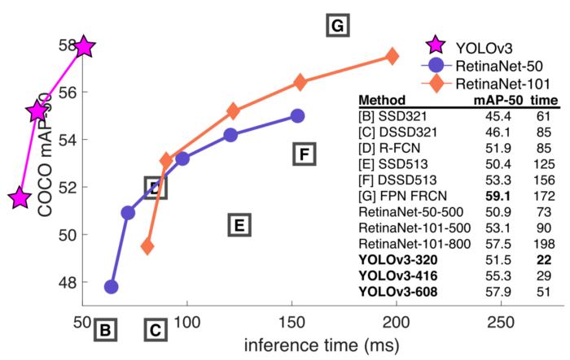
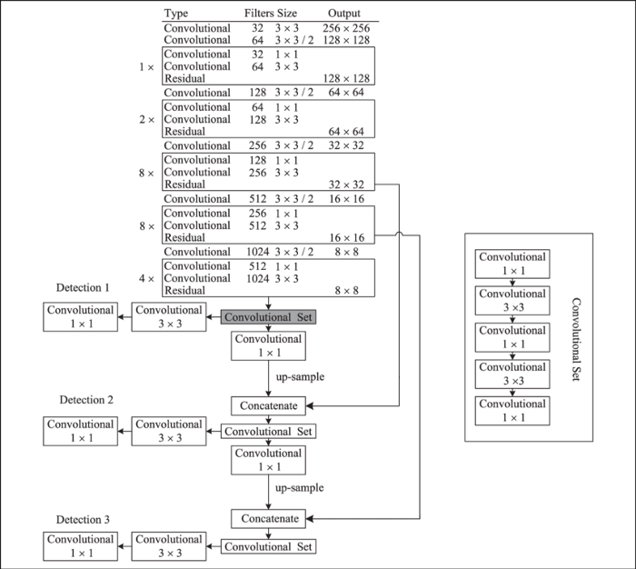
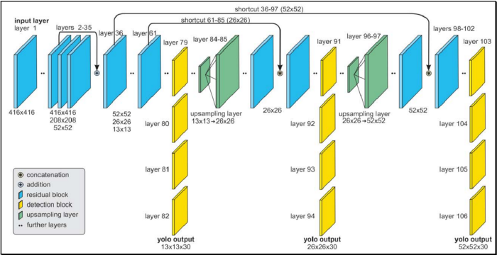
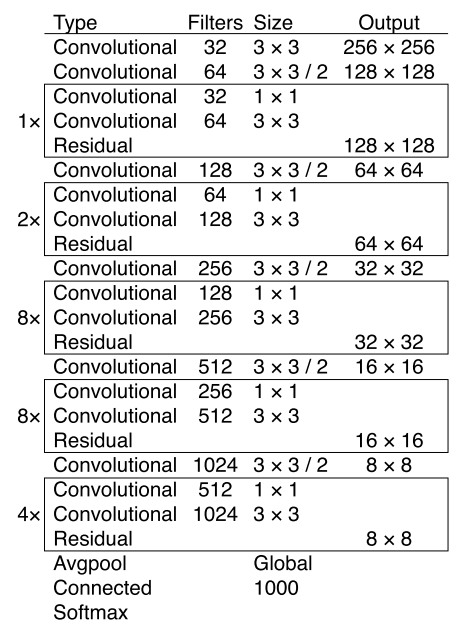
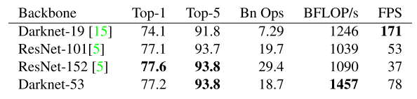
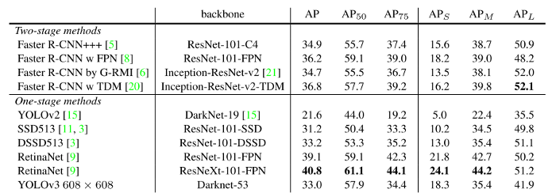

# YOLOv3: An Incremental Improvement (2018)

**Original Paper:** [YOLOv3: An Incremental Improvement](https://arxiv.org/abs/1804.02767)

*PS: This paper is really funny, strongly recommend you to read it.*

**Fig.** Speed/Accuracy tradeoff on the mAP at .5 IOU metric

Authors’ claim: We mostly took good ideas from other people and make YOLO better with just a bunch of small changes.

# The “small” changes

## Bounding Box Prediction

YOLOv3 predicts an objectness score for each bounding box using logistic regression.

- If a bounding box prior (anchor box) overlaps a ground truth object the most, its objectness target should be 1.
- If it is not the best one (in terms of overlapping a ground truth object) but overlaps by more than some threshold (e.g. 0.5), its prediction would be ignored (following Faster R-CNN).
- Unlike Faster R-CNN, YOLOv3 only assigns one bounding box prior (anchor box) to each ground truth object. If a bounding box prior is not assigned to any ground truth object, it incurs no loss for  coordinate or class predictions, only for objectness.

## Class Prediction

YOLOv3 adopts a multilabel setting instead of multiclass to predict the class of each box, simply using independent logistic classifiers and binary cross-entropy loss during training. This formulation makes it more flexible towards more complex domains like the Open Images Dataset, where there are many overlapping labels.

## Predictions Across Scales

YOLOv3 predicts boxes at **3 different scales**. It extracts features from those scales using a similar idea as feature pyramid networks.

We add several convolutional layers to the base feature extractor. For each scale, the network predicts a 3-d tensor encoding bounding box, objectness, and class predictions. In the COCO experiment, at each scale we predict 3 boxes, so the tensor is `N × N × [3 × (4 + 1 + 80)]` for the 4 bounding box offsets, 1 objectness prediction, and 80 class predictions.

**The structure of YOLOv3.** YOLOv3 predicts objects at three different scales and finally combines the results to get the final detection. (image source: Improve YOLOv3 using dilated spatial pyramid module for multi-scale object detection)

**Image source:** The Real-Time Detection of Traffic Participants Using YOLO Algorithm

To detect for extra scale (from detection 1 to detection 2), we take the feature map from 2 layers previous (-2) and upsample it by 2×. We also take a feature map from the earlier network layers and merge it with our upsampled feature map using concatenation. It allows us to get more meaningful semantic information from the upsampled feature map and fine-grained information from the earlier feature map. We then add a few more convolutional layers to process this combined feature map and eventually predict a similar tensor.

We go through the same procedure one more time to predict boxes for the final scale (from detection 2 to detection 3). Thus the predictions for the 3rd scale benefit from all the prior computation as well as fine-grained features from the earlier network layers.

We still use k-means clustering to determine bounding box priors. We choose **9 clusters and 3 scales** arbitrarily and divide the clusters evenly across scales. On the COCO dataset the 9 clusters were: `(10×13)`, `(16×30)`, `(33×23)`, `(30×61)`, `(62×45)`, `(59× 119)`, `(116 × 90)`, `(156 × 198)`, `(373 × 326)`.

## Feature Extractor: Darknet-53

Our new feature extraction network, called Darknet-53, is a hybrid approach combing the network used in YOLOv2, Darknet-19, and the newfangled residual network stuff.

**Table 1.** Darknet-53

This new network is much more powerful than Darknet-19 but still more efficient than ResNet-101 or ResNet-152. Here are some ImageNet results:

**Table 2.** Comparison of backbones. Accuracy, billions of operations, billion floating-point operations per second, and FPS for various networks.

# How’s YOLOv3

**Table 3.** Ok, YOLOv3 is doing alright. Keep in mind that RetinaNet has like 3.8× longer to process an image. YOLOv3 is much better than SSD variants and comparable to state-of-the-art models on the AP50 metric.

Ok, YOLOv3 generally looks nice. However, performance drops significantly as the IOU threshold increases, indicating that YOLOv3 struggles to get the boxes perfectly aligned with the object.

YOLO struggled with small objects in the past, but now we see a reversal trend. With the new multi-scale predictions we see YOLOv3 has relatively high AP performance on small objects. However, it has comparatively worse performance on medium and larger-size objects. More investigation is needed to get to the bottom of this.

## Things We Tried That Didn’t Work

*Please refer to the original paper if you are interested.*