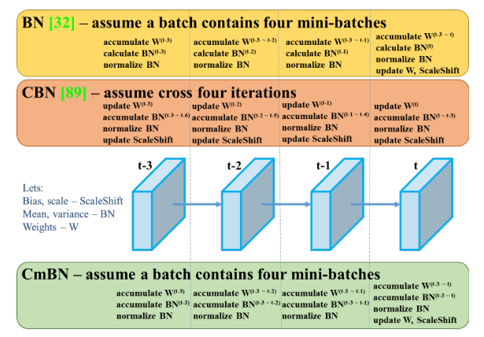

# YOLOv4: Optimal Speed and Accuracy of Object Detection (2020)

**Original Paper:** [YOLOv4: Optimal Speed and Accuracy of Object Detection](https://arxiv.org/abs/2004.10934)

# Overview

To improve object detection speed and make it easier to train:

- We develop an efficient and powerful object detection model that operates in real-time on a conventional GPU and can be trained using only one conventional GPU (e.g. 1080 Ti or 2080 Ti).
- We modify some state-of-the-art methods towards more efficient and suitable for single GPU training.

To improve object detection accuracy:

- We review a huge number of features that are proposed to improve CNN performance.
- We conduct practical testing of the combinations of various improvement ideas on large datasets and provide theoretical justifications of the results.

# Object detection models

*This could be the best literature review I’ve ever read (maybe it’s just because I’ve read too little). At least, I really like how the authors organize the review in a super intuitive way.*

**Figure 2:** Object detector.

A typical object detector is composed of several parts:

## Input

- Image, Patches, Image Pyramid

## Backbone

- On GPU: VGG, ResNet, ResNeXt, DenseNet, SpineNet, EfficientNet-B0/B7, CSPResNeXt50, CSPDarknet53
- On CPU: SqueezeNet, MobileNet, ShuffleNet

## Neck

Recent object detectors tend to insert extra layers between the backbone and the detection head. These layers are usually used to collect feature maps from different stages. We call it the neck of an object detector. Usually, a neck is composed of several bottom-up paths and several top-down paths.

Additional blocks:

- **SPP** [*Spatial pyramid pooling in deep convolutional networks for visual recognition, 2015*]
- **ASPP** [*DeepLab: Semantic image segmentation with deep convolutional nets, atrous convolution, and fully connected CRFs, 2017*]
- **RFB** [*Receptive field block net for accurate and fast object detection, 2018*]
- **SAM** [*CBAM: Convolutional block attention module, 2018*]

Path-aggregation blocks:

- **FPN** [*Feature pyramid networks for object detection, 2017*]
- **PAN** [*Path aggregation network for instance segmentation, 2018*]
- **NAS-FPN** [*NAS-FPN: Learning scalable feature pyramid architecture for object detection, 2019*]
- **BiFPN** [*Efficient-Det: Scalable and efficient object detection, 2020*]
- **ASFF** [*Learning spatial fusion for single-shot object detection, 2019*]
- **SFAM** [*M2det: A single-shot object detector based on multi-level feature pyramid network, 2019*]

## Heads

One-stage, anchor-based:

- **RPN** [*Faster R-CNN: Towards real-time object detection with region proposal networks, 2015*]
- **SSD** [*SSD: Single shot multibox detector, 2016*]
- **YOLOv1** [*You only look once: Unified, real-time object detection, 2016*]
- **YOLOv2** [*YOLO9000: better, faster, stronger, 2017*]
- **YOLOv3** [*YOLOv3: An incremental improvement, 2018*]
- **RetinaNet** [*Focal loss for dense object detection, 2017*]

One-stage, anchor-free:

- **CornerNet** [*CornerNet: Detecting objects as paired keypoints, 2018*]
- **CornerNet-Lite** [*CornerNet-Lite: Efficient keypoint based object detection, 2019*]
- **CenterNet** [*CenterNet: Keypoint triplets for object detection, 2019*]
- **MatrixNet** [*Matrix Nets: A new deep architecture for object detection, 2019*]
- **FCOS** [*FCOS: Fully convolutional one-stage object detection, 2019*]

Two-stage, anchor-based:

- **Faster R-CNN** [*Faster R-CNN: Towards real-time object detection with region proposal networks, 2015*]
- **R-FCN** [*R-FCN: Object detection via region-based fully convolutional networks, 2016*]
- **Mask R-CNN** [*Mask R-CNN, 2017*]

Two-stage, anchor-free:

- **RepPoints** [*RepPoints: Point set representation for object detection, 2019*]

## Ground up

A new backbone:

- **DetNet** [*DetNet: Design backbone for object detection, 2018*]
- **DetNAS** [*DetNAS: Backbone search for object detection, 2019*]

A whole new model:

- **SpineNet** [*SpineNet: Learning scale-permuted backbone for recognition and localization, 2019*]
- **HitDetector** [*Hit-Detector: Hierarchical trinity architecture search for object detection, 2020*]

# Bag of freebies

**Definition:** improve detection accuracy without increasing inference cost.

## Data augmentation

The goal is to improve detectors’ robustness towards various environments by increasing the variability of training inputs.

Two commonly used pixel-wise data augmentation methods are:

- **Photometric distortions:** adjust the brightness, contrast, hue, saturation, and noise of an image.
- **Geometric distortions:** add random scaling, cropping, flipping, and rotating.

In addition, some researchers focus on simulating object occlusion issues:

- **Random erasing** [*Random erasing data augmentation, 2017*] and **CutOut** [*Improved regularization of convolutional neural networks with CutOut, 2017*]: randomly select the rectangle region in an image and fill in a random or complementary value of zero.
- **Hide-and-Seek** [*Hide-and-Seek: A data augmentation technique for weakly-supervised localization and beyond, 2018*] and **GridMask** [*GridMask data augmentation, 2020*]: randomly or evenly select multiple rectangle regions in an image and replace them with all zeros.
- If similar concepts are applied to feature maps, there are **DropOut** [*DropOut: A simple way to prevent neural networks from overfitting, 2014*], **DropConnect** [*Regularization of neural networks using DropConnect, 2013*], and **DropBlock** [*DropBlock: A regularization method for convolutional networks, 2018*].

We can also use multiple images to perform data augmentation.

- **MixUp** [*MixUp: Beyond empirical risk minimization, 2017*]: uses two images to multiply and superimpose with different coefficient ratios, and then adjusts the label with these superimposed ratios.
- **CutMix** [*CutMix: Regularization strategy to train strong classifiers with localizable features, 2019*]: covers the cropped image to the rectangle region of other images and adjusts the label according to the size of the mixing area.

What’s more, **style transfer GAN** [*ImageNet-trained cnns are biased towards texture; increasing shape bias improves accuracy and robustness, 2019*] is also used for data augmentation, and such usage can effectively reduce the texture bias learned by CNN.

## Dealing with semantic distribution bias

Data imbalance between different classes is a well-known issue.

- In two-stage object detectors, it is often solved by hard negative example mining or online hard example mining. However, these methods are not applicable to one-stage detectors.
- Therefore, Lin et al. [*Focal loss for dense object detection, 2017*] proposed focal loss to deal with the data imbalance problem.

## Label representation

It’s difficult to encode the relationship between different categories with the simple one-hot hard representation.

- **Label smoothing** [*Rethinking the inception architecture for computer vision, 2016*]: converts a hard label into a soft label for training, making the model more robust.
- **Label refinement** [*Label refinement network for coarse-to-fine semantic segmentation, 2017*]: obtains a better soft label through knowledge distillation.

## The objective function of Bounding Box regression

Mean Square Error (MSE) is usually used to perform bounding box regression on:

- `{x_center, y_center, w, h}`: center point coordinates, width, height
- `{x_tl, y_tl, x_br, y_br}`: upper left point, lower right point
- `{x_co, y_co, w_o, h_o}, {x_tlo, y_tlo, x_bro, y_bro}`: the corresponding offsets for anchor-based methods

However, these methods treat all points as independent variables, without considering the integrity of the object itself. New objective functions are proposed to solve this issue.

- **IoU loss** [*UnitBox: An advanced object detection network, 2016*]: considers the IoU between the predicted and the ground truth bounding box. Its computing process naturally connects all points that belong to the same object together. Also, comparing with the traditional objectives (l1 or l2 loss), IoU is scale-invariant.
- **GIoU loss** [*Generalized intersection over union: A metric and a loss for bounding box regression, 2019*]: includes the shape and orientation of an object in addition to the IoU. It finds the smallest bounding box that can simultaneously cover both the predicted and the ground truth bounding box, and then use this bounding box as the denominator in IoU calculation.
- **DIoU loss** [*Distance-IoU Loss: Faster and better learning for bounding box regression, 2020*]: additionally considers the distance of the center of an object.
- **CIoU loss** [*Enhancing Geometric Factors in Model Learning and Inference for Object Detection and Instance Segmentation, 2021*]: simultaneously considers the IoU, the distance between center points, and the aspect ratio.

# Bag of specials

**Definition:** plugin modules and post-processing methods that only increase the inference cost by a small amount but can significantly improve the detection accuracy.

## Enhance receptive fields

**SPP** [*Spatial pyramid pooling in deep convolutional networks for visual recognition, 2015*].

**Left:** The original SPP module; **Right:** The modified SPP module.

- It was originated from **Spatial Pyramid Matching (SPM)** [*Beyond bags of features: Spatial pyramid matching for recognizing natural scene categories, 2006*]. The original method splits the feature map into several `d × d` equal blocks, where d can be `{1, 2, 3, …}`, thus forming a spatial pyramid, and then extracts bag-of-word features. SPP integrates SPM into CNN and uses max-pooling operation instead of bag-of-words operation.
- Since the SPP module outputs a one-dimensional feature vector, it is infeasible for Fully Convolutional Network (FCN). YOLOv3 modifies the SPP module as the concatenation of the max-pooling outputs with multiple kernel sizes (`k = {1, 5, 9, 13}`, `stride = 1`). With this design, a relatively large `k × k` max-pooling effectively increases the receptive field of the backbone feature.

**ASPP** [*DeepLab: Semantic image segmentation with deep convolutional nets, atrous convolution, and fully connected CRFs, 2017*]. The difference between the ASPP module and the modified SPP module:

- The modified SPP: max-pooling, `k × k` kernel size, `stride = 1`.
- ASPP: Several `3 × 3` kernel size, dilated ratio equals to k, and `stride = 1` in dilated convolution operation.

**RFB** [*Receptive field block net for accurate and fast object detection, 2018*] uses several dilated convolutions of `k × k` kernel, dilated ratio equals to k, and `stride = 1` to obtain a more comprehensive spatial coverage than ASPP.

## Attention module

**Squeeze-and-Excitation (SE)** [*Squeeze-and-excitation networks, 2018*] (channel-wise attention). Although it can improve the top-1 accuracy of ResNet50 on the ImageNet classification task by 1% at the cost of only a 2% increase of computational effort, it will usually increase the inference time by around 10% on GPU. Thus, it is more appropriate for mobile devices.

**Spatial Attention Module (SAM)** [*CBAM: Convolutional block attention module, 2018*] (point-wise attention). It only requires 0.1% extra computation to improve ResNet50-SE’s top-1 accuracy by 0.5% on ImageNet classification task. Also, it does not affect the inference speed on the GPU.

## Feature integration

The early practices to integrate low-level physical features to high-level semantic features:

- **Skip connection** [*Fully convolutional networks for semantic segmentation, 2015*].
- **Hyper-column** [*Hypercolumns for object segmentation and fine-grained localization, 2015*].

Since multi-scale prediction methods such as FPN have become popular, many lightweight modules that integrate different feature pyramids are proposed.

- **SFAM** [*M2det: A single-shot object detector based on multi-level feature pyramid network, 2019*]. It uses the SE module to execute channel-wise level re-weighting on multi-scale concatenated feature maps.
- **ASFF** [*Learning spatial fusion for single-shot object detection, 2019*]. It uses softmax as point-wise level re-weighting and then adds feature maps of different scales.
- **BiFPN** [*Efficient-Det: Scalable and efficient object detection, 2020*]. The multi-input weighted residual connections are proposed to execute scale-wise level re-weighting, and then add feature maps of different scales.

## Activation function

A good activation function helps the gradient propagate more efficiently at a low cost of extra computation.

- **ReLU** [*Rectified linear units improve restricted boltzmann machines, 2010*]. It substantially solves the gradient vanishing problem that is frequently encountered in traditional tanh and sigmoid activation functions.
- **LReLU** [*Rectifier nonlinearities improve neural network acoustic models, 2013*]; **PReLU** [*Delving deep into rectifiers: Surpassing human-level performance on ImageNet classification, 2015*]. Both methods solve the problem that the gradient of ReLU is zero when the output is less than zero.
- **ReLU6** [*MobileNets: Efficient convolutional neural networks for mobile vision applications, 2017*]; **Hard-Swish** [*Searching for MobileNetV3, 2019*]. They are specially designed for quantization networks.
- **Scaled Exponential Linear Unit (SELU)** [*Self-normalizing neural networks, 2017*]. It is proposed to self-normalize a neural network.
- **Swish** [*Searching for activation functions, 2017*]; **Mish** [*Mish: A self regularized non-monotonic neural activation function, 2019*]. Both are continuously differentiable activation functions.

## Post-processing

The most commonly used post-processing method is NMS. It is used to filter out bounding boxes that are worse than other candidates when predicting the same object. However, the original NMS does not consider the context information.

- Girshick et al. [*Rich feature hierarchies for accurate object detection and semantic segmentation, 2014*] added classification confidence score in R-CNN as a reference, then **greedy NMS** was performed from high to low scores.
- **Soft NMS** [*Soft-NMS–improving object detection with one line of code, 2017*]: considers the issue that the occlusion of an object may cause the degradation of confidence score in greedy NMS with IoU score.
- **DIoU NMS** [*Distance-IoU Loss: Faster and better learning for bounding box regression, 2020*]: adds the information of the center point distance to the BBox screening process on the basis of soft NMS.

# Methodology

We present two options of neural networks that can run in real-time:

- For GPU: we use a small number of groups (1-8) in convolutional layers: CSPResNeXt50 / CSPDarknet53.
- For CPU: we use grouped-convolution, but we refrain from using Squeeze-and-excitement (SE) blocks: EfficientNet-lite / MixNet / GhostNet / MobileNetV3.

## Selection of architecture

- Find the optimal balance among the input network resolution, the number of convolutional layers, the number of parameters (filter_size² × filters × channel / groups), and the number of layer outputs (filters).
- Select additional blocks to increase the receptive field.
- Choose the best method for parameter aggregation from different backbone levels.

It’s worth mentioning that, a model that is optimal for classification is not necessarily optimal for an object detector. Specially, an object detector requires:

- Higher input network size (resolution) — for detecting multiple small-sized objects.
- More layers — for a higher receptive field to cover the increased size of the input network.
- More parameters — for greater capacity to detect multiple objects of different sizes in a single image.

**Table 1:** Parameters of neural networks for image classification.

Hypothetically speaking, we assume the backbone network should have a relatively larger receptive field size and a larger number of parameters. This theoretical justification, together with our numerous experiments, shows that **CSPDarknet53 is the optimal backbone** model for a detector.

We add the **SPP block over the CSPDarknet53**, because it increases the receptive field significantly, separates out the most significant context features, and causes almost no reduction of speed. The influence of the receptive field with different sizes is summarized as follows:

- Up to the object size — allows viewing the entire object
- Up to network size — allows viewing the context around the object
- Exceeding the network size — increases the number of connections between the image point and the final activation

We use **PANet** **as the method of parameter aggregation** from different backbone levels for different detector levels, instead of the FPN used in YOLOv3.

We do not use Cross-GPU Batch Normalization (CGBN or SyncBN) or expensive specialized devices so anyone can reproduce the outcomes on a conventional graphic processor (e.g. GTX 1080Ti or RTX 2080Ti).

## Selection of Bag of freebies and Bag of specials

To improve object detection training, a CNN usually uses the following strategies:

- **Activations**: ReLU, leaky-ReLU, parametric-ReLU, ReLU6, SELU, Swish, Mish. Since PReLU and SELU are more difficult to train, and ReLU6 is specifically designed for quantization network, we remove them from the candidate list.
- **Bounding box regression loss**: MSE, IoU, GIoU, CIoU, DIoU.
- **Data augmentation**: CutOut, MixUp, CutMix.
- **Regularization**: DropOut, DropPath, Spatial DropOut, DropBlock. We choose DropBlock because it’s proven to be the best one.
- **Normalization**: Batch Normalization (BN), Cross-GPU Batch Normalization (CGBN or SyncBN), Filter Response Normalization (FRN), Cross-Iteration Batch Normalization (CBN). Cross-GPU Batch Normalization is not considered because we aim for single GPU training.
- **Skip-connections**: Residual connections, Weighted residual connections, Multi-input weighted residual connections, or Cross stage partial connections (CSP).

## Additional improvements

We introduce new methods of data augmentation Mosaic and Self-Adversarial Training (SAT).

- **Mosaic** is a data augmentation method that mixes 4 training images and thus 4 different contexts, while CutMix only mixes 2 input images. It allows detecting objects outside their normal context. In addition, batch normalization calculates activation statistics from 4 different images on each layer. This significantly reduces the need for a large mini-batch size.

**Figure 3:** Mosaic represents a new method of data augmentation.

- **Self-Adversarial Training (SAT)** also represents a new data augmentation technique. It uses back-propagation with two iterations of forward-backward passes. On the first backward pass, to minimize the cost function, we alter the original image instead of the network weights. Contrary to the usual method, this actually degrades the network performance, or simply put, the model performs an “adversarial attack” on itself. Now, this modified image is used to train the network on the second iteration. This way we are able to reduce overfitting and make the model more universal. (*This paragraph is directly quoted from this* [*clarification*](https://www.reddit.com/r/MachineLearning/comments/kywh2c/d_how_does_selfadversarial_training_as_described/)) *by the author.*)

We select optimal hyper-parameters using genetic algorithms.

We modify some existing methods to make our design more efficient: modified SAM, modified PAN, and Cross mini-Batch Normalization (CmBN).

- **Cross mini-Batch Normalization (CmBN)** is a modified version of CBN. It collects statistics only between mini-batches within a single batch.

**Figure 4:** Cross mini-Batch Normalization (CmBN).

- We modify **SAM** from spatial-wise attention to point-wise attention.

**Figure 5:** Modified SAM.

- We replace the shortcut connection of PAN into concatenation.

**Figure 6:** Modified PAN.

# YOLOv4

### Backbone

- CSPDarknet53

### Neck

- SPP-block
- PAN path-aggregation block

### Head

- YOLOv3

### Bag of Freebies (BoF) for backbone

- CutMix, Mosaic data augmentation
- DropBlock regularization
- Class label smoothing

### Bag of Specials (BoS) for backbone

- Mish Activation
- Cross-stage partial connections (CSP)
- Multi-input weighted residual connections (MiWRC)

### Bag of Freebies (BoF) for detector

- CIoU-loss
- CmBN
- DropBlock regularization
- Mosaic data augmentation
- Self-Adversarial Training
- Eliminate grid sensitivity
- Using multiple anchors for single ground truth
- Cosine annealing scheduler
- Optimal hyper-parameters
- Random training shapes

### Bag of Specials (BoS) for detector

- Mish activation
- SAM-block
- DIoU-NMS

## hmmm, well, I had to say, this is how I think about YOLOv4:

For the details of experiments for deciding the final design, please refer to the original paper.