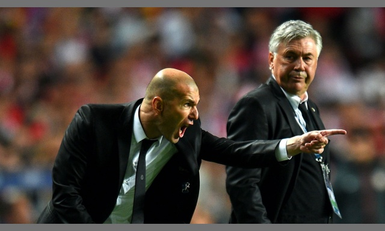
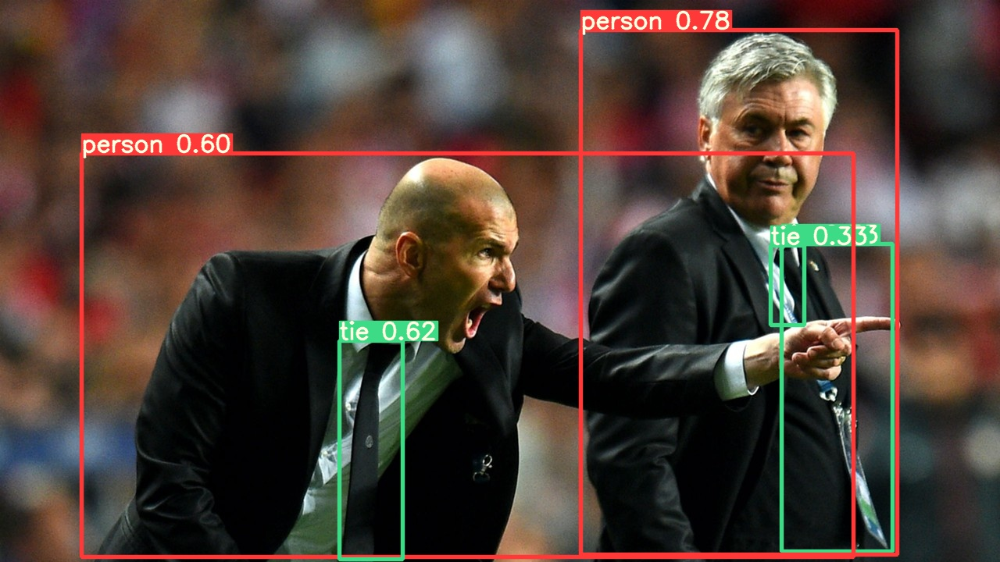

# Inference

| origin                                                   | processed                                                    | result                                               |
| -------------------------------------------------------- | ------------------------------------------------------------ | ---------------------------------------------------- |
| image shape: (720, 1280, 3) | image shape: (384, 640, 3) | image shape: (720, 1280, 3) |

## Image Preprocessing

```python
stride=32
# Resize and pad image while meeting stride-multiple constraints

shape = img.shape[:2]
# shape: (720, 1280)
if isinstance(new_shape, int):
    new_shape = (new_shape, new_shape)
    # new_shape: (640, 640)

# Scale ratio (new / old)
r = min(new_shape[0] / shape[0], new_shape[1] / shape[1])
if not scaleup:  
    # only scale down, do not scale up (for better test mAP)
    r = min(r, 1.0)

# Compute padding
ratio = r, r
new_unpad = int(round(shape[1] * r)), int(round(shape[0] * r))
# new_unpad: (640, 360)
dw, dh = new_shape[1] - new_unpad[0], new_shape[0] - new_unpad[1]
# dw, dh: (0, 280)
if auto:  
    # minimum rectangle
    dw, dh = np.mod(dw, stride), np.mod(dh, stride)
    # dw, dh: (0, 24)
elif scaleFill:
    dw, dh = 0.0, 0.0
    new_unpad = (new_shape[1], new_shape[0])
    ratio = new_shape[1] / shape[1], new_shape[0] / shape[0]

# divide padding into 2 sides
dw /= 2  
dh /= 2

if shape[::-1] != new_unpad:
    img = cv2.resize(img, new_unpad, interpolation=cv2.INTER_LINEAR)
    # img.shape: (640, 480, 3)
    
top, bottom = int(round(dh - 0.1)), int(round(dh + 0.1))
left, right = int(round(dw - 0.1)), int(round(dw + 0.1))
img = cv2.copyMakeBorder(
    img, top, bottom, left, right, 
    cv2.BORDER_CONSTANT, value=color
)
# img.shape: (384, 640, 3)
```
