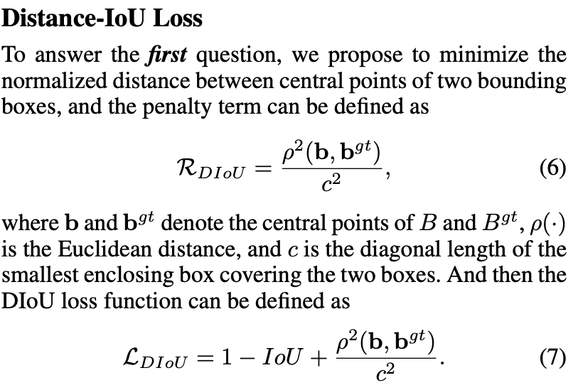

# Non-maximum Suppression (NMS)

## Table of contents

- [Normal NMS](#nms)
- [DIoU-NMS](#diou_nms)

## Normal NMS <a name="nms"></a>

```python
# Runs Non-Maximum Suppression (NMS) on inference results
# prediction.shape: torch.Size([18900, 85])
nc = prediction.shape[2] - 5  # number of classes
xc = prediction[..., 4] > conf_thres  # candidates

output = [torch.zeros((0, 6), device=prediction.device)] * prediction.shape[0]
for xi, x in enumerate(prediction):  # image index, image inference
    # Apply constraints
    # x[((x[..., 2:4] < min_wh) | (x[..., 2:4] > max_wh)).any(1), 4] = 0  # width-height
    x = x[xc[xi]]  # confidence
    # x.shape: torch.Size([21, 85])
    
    # Compute conf
    x[:, 5:] *= x[:, 4:5]  
    # conf = obj_conf * cls_conf

    # Box (center x, center y, width, height) to (x1, y1, x2, y2)
    box = xywh2xyxy(x[:, :4])

    # Detections matrix nx6 (xyxy, conf, cls)
    conf, j = x[:, 5:].max(1, keepdim=True)
    x = torch.cat((box, conf, j.float()), 1)[conf.view(-1) > conf_thres]
    # x.shape: torch.Size([19, 6])

    # Check shape
    n = x.shape[0]  # number of boxes
    if not n:  # no boxes
        continue
    elif n > max_nms:  # excess boxes
        x = x[x[:, 4].argsort(descending=True)[:max_nms]]  # sort by confidence

    # Batched NMS
    c = x[:, 5:6] * (0 if agnostic else max_wh)  # classes
    boxes, scores = x[:, :4] + c, x[:, 4]  # boxes (offset by class), scores
    i = torchvision.ops.nms(boxes, scores, iou_thres)  # NMS
```

## DIoU-NMS <a name="diou_nms"></a>

**Reference:** https://paperswithcode.com/method/diou-nms

**DIoU-NMS** is a type of non-maximum suppression where we use Distance IoU rather than regular DIoU, in which the overlap area and the distance between two central points of bounding boxes are simultaneously considered when suppressing redundant boxes.

In original NMS, the IoU metric is used to suppress the redundant detection boxes, where the overlap area is the unique factor, often yielding false suppression for the cases with occlusion. With DIoU-NMS, we not only consider the overlap area but also central point distance between two boxes.



