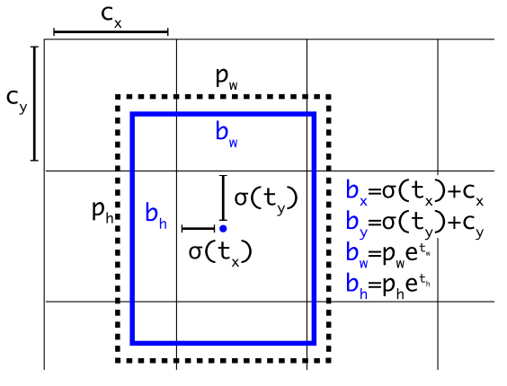
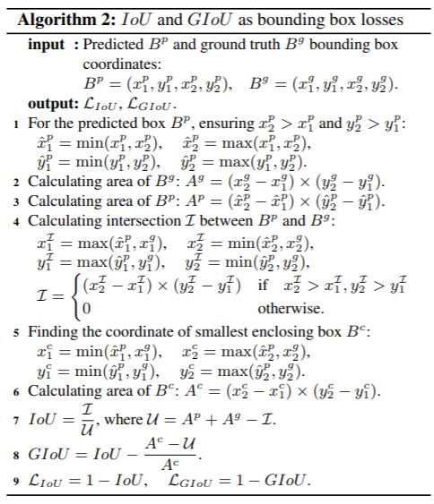
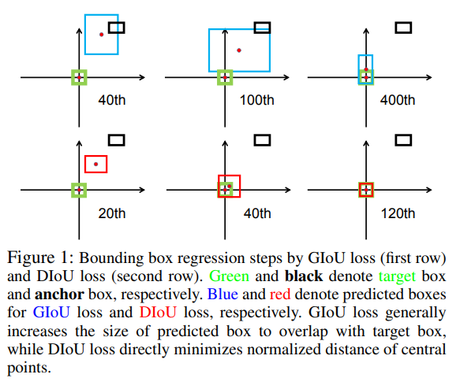

# Loss

## Table of contents

- [Class Prediction](#class_pred)
- [Build Targets](#build_targets)
- [Compute Loss](#compute_loss)

```python
# imgs.shape: torch.Size([16, 3, 640, 640])
pred = model(imgs)
# preds.shape: [[16, 3, 80, 80, 85], [16, 3, 40, 40, 85], [16, 3, 20, 20, 85]]
# targets.shape: [181, 6]
loss, loss_items = compute_loss(pred, targets.to(device))
```

## Class Prediction <a name="class_pred"></a>

YOLOv3 adopts a **multilabel** setting instead of multiclass to predict the class of each box, simply using independent logistic classifiers and binary cross-entropy loss during training. This formulation makes it more flexible towards more complex domains like the Open Images Dataset, where there are many overlapping labels.

```python
BCEcls = nn.BCEWithLogitsLoss(
    pos_weight=torch.tensor([h['cls_pw']], device=device))
BCEobj = nn.BCEWithLogitsLoss(
    pos_weight=torch.tensor([h['obj_pw']], device=device))
```

**Label smoothing** [*Rethinking the inception architecture for computer vision, 2016*]: converts a hard label into a soft label for training, making the model more robust.

```python
# Class label smoothing https://arxiv.org/pdf/1902.04103.pdf eqn 3
self.cp, self.cn = smooth_BCE(eps=h.get('label_smoothing', 0.0))  
# positive, negative BCE targets

def smooth_BCE(eps=0.1):  
    # https://github.com/ultralytics/yolov3/issues/238#issuecomment-598028441
    # return positive, negative label smoothing BCE targets
    return 1.0 - 0.5 * eps, 0.5 * eps
```

## Build Targets <a name="build_targets"></a>

Build targets for `compute_loss()`, input targets is: `(image, class, x, y, w, h)`.

```python
# number of anchors: na: 3
# ai.shape: torch.Size([3, 181])
# targets.shape: torch.Size([181, 6])
targets = torch.cat(
    (targets.repeat(na, 1, 1), ai[:, :, None]), 2
)
# targets.repeat(na, 1, 1): torch.Size([3, 181, 6])
# ai[:, :, None]).shape: torch.Size([3, 181, 1])
# targets.shape: torch.Size([3, 181, 7])

# off: tensor([[0., 0.]], device='cuda:0')
# self.nl: 3
# self.anchors:
# tensor([
#     [
#         [ 1.25000,  1.62500],
#         [ 2.00000,  3.75000],
#         [ 4.12500,  2.87500]
#     ],
#     [
#         [ 1.87500,  3.81250],
#         [ 3.87500,  2.81250],
#         [ 3.68750,  7.43750]
#     ],
#     [
#         [ 3.62500,  2.81250],
#         [ 4.87500,  6.18750],
#         [11.65625, 10.18750]
#     ]
# ], device='cuda:0')
for i in range(self.nl):
    anchors = self.anchors[i]
    # anchors: [[1.25, 1.625], [2.0, 3.75], [4.125, 2.875]]
    
    # p[0].shape: torch.Size([16, 3, 80, 80, 85])
    # gain: tensor([1., 1., 1., 1., 1., 1., 1.], device='cuda:0')
    gain[2:6] = torch.tensor(p[i].shape)[[3, 2, 3, 2]]  # xyxy gain
    # gain: [1.0, 1.0, 80.0, 80.0, 80.0, 80.0, 1.0]

    # Match targets to anchors
    # targets: torch.Size([3, 181, 7])
    t = targets * gain
    # (x, y, w, h) * 80 
    
    # nt: 181
    if nt:
        # r.shape: torch.Size([3, 181, 2])
        # anchors[:, None].shape: torch.Size([3, 1, 2])
        r = t[:, :, 4:6] / anchors[:, None]  # wh ratio
        
        # self.hyp['anchor_t']: 4.0
        j = torch.max(r, 1. / r).max(2)[0] < self.hyp['anchor_t']  # compare

        # t.shape: torch.Size([3, 181, 7])
        t = t[j]  # filter
        # t.shape: torch.Size([185, 7])

        # Offsets
        gxy = t[:, 2:4]  # grid xy
        gxi = gain[[2, 3]] - gxy  # inverse
        j, k = ((gxy % 1. < g) & (gxy > 1.)).T
        l, m = ((gxi % 1. < g) & (gxi > 1.)).T
        j = torch.stack((torch.ones_like(j),))
        t = t.repeat((off.shape[0], 1, 1))[j]
        offsets = (torch.zeros_like(gxy)[None] + off[:, None])[j]
    else:
        t = targets[0]
        offsets = 0

    # Define
    b, c = t[:, :2].long().T  # image, class
    gxy = t[:, 2:4]  # grid xy
    gwh = t[:, 4:6]  # grid wh
    gij = (gxy - offsets).long()
    gi, gj = gij.T  # grid xy indices

    # Append
    a = t[:, 6].long()  # anchor indices
    indices.append(
        (b, a, gj.clamp_(0, gain[3] - 1), gi.clamp_(0, gain[2] - 1))
    )  # image, anchor, grid indices
    tbox.append(torch.cat((gxy - gij, gwh), 1))  
    # box, offsets: gxy - gij
    anch.append(anchors[a])  # anchors
    tcls.append(c)  # class
```

### Using multiple anchors for single ground truth

```python
# nt: 181
if nt:
    # r.shape: torch.Size([3, 181, 2])
    # anchors[:, None].shape: torch.Size([3, 1, 2])
    r = t[:, :, 4:6] / anchors[:, None]  # wh ratio

    # self.hyp['anchor_t']: 4.0
    j = torch.max(r, 1. / r).max(2)[0] < self.hyp['anchor_t']  # compare

    # t.shape: torch.Size([3, 181, 7])
    t = t[j]  # filter
    # t.shape: torch.Size([185, 7])
```

There are 185 anchors chosen while there are only 181 ground truth boxes. An anchor box will be chosen as long as it passes the aspect ratio threshold.

## Compute Loss <a name="compute_loss"></a>



```python
tcls, tbox, indices, anchors = self.build_targets(p, targets)  

# Losses
# p.shape: [[16, 3, 80, 80, 85], [16, 3, 40, 40, 85], [16, 3, 20, 20, 85]]
for i, pi in enumerate(p):  
    # layer index, layer predictions
    b, a, gj, gi = indices[i]  # image, anchor, gridy, gridx
    tobj = torch.zeros_like(pi[..., 0], device=device)  # target obj
    n = b.shape[0]  # number of targets
    
    if n:
        ps = pi[b, a, gj, gi]  
        # prediction subset corresponding to targets

        # Regression
        pxy = ps[:, :2].sigmoid() * 2. - 0.5
        pwh = (ps[:, 2:4].sigmoid() * 2) ** 2 * anchors[i]
        pbox = torch.cat((pxy, pwh), 1)  # predicted box
        iou = bbox_iou(pbox.T, tbox[i], x1y1x2y2=False, CIoU=True)  
        lbox += (1.0 - iou).mean()  # iou loss

        # Objectness
        tobj[b, a, gj, gi] = (
            1.0 - self.gr) + self.gr * iou.detach().clamp(0).type(tobj.dtype)  
        # iou ratio

        # Classification
        if self.nc > 1:  # cls loss (only if multiple classes)
            t = torch.full_like(ps[:, 5:], self.cn, device=device)  
            # targets
            t[range(n), tcls[i]] = self.cp
            lcls += self.BCEcls(ps[:, 5:], t)  

    obji = self.BCEobj(pi[..., 4], tobj)
    lobj += obji * self.balance[i]  # obj loss
    if self.autobalance:
        self.balance[i] = self.balance[i] * 0.9999 + 0.0001 / obji.detach().item()

if self.autobalance:
    self.balance = [x / self.balance[self.ssi] for x in self.balance]
    
lbox *= self.hyp['box']
lobj *= self.hyp['obj']
lcls *= self.hyp['cls']
bs = tobj.shape[0]  # batch size

loss = lbox + lobj + lcls
return loss * bs, torch.cat((lbox, lobj, lcls, loss)).detach()
```

### Eliminate grid sensitivity

The original formula of bx is `bx = sigmoid(tx) + cx`. When `bx = cx` or `bx = cx + 1`, we need a extremely big or small `tx` to minimize the loss, thus make it hard to detect objects whose centers are on the grid boundaries. We can simply modify the formula to make the process easier.

```python
pxy = ps[:, :2].sigmoid() * 2. - 0.5
pwh = (ps[:, 2:4].sigmoid() * 2) ** 2 * anchors[i]
```

### The objective function of Bounding Box regression

**Reference:** [Variants of IoU {GIoU, DIoU, CIoU}](https://medium.com/nerd-for-tech/day-90-dl-variants-of-iou-giou-diou-6c0a933dd2c7)

Mean Square Error (MSE) is usually used to perform bounding box regression on:

- `{x_center, y_center, w, h}`: center point coordinates, width, height
- `{x_tl, y_tl, x_br, y_br}`: upper left point, lower right point
- `{x_co, y_co, w_o, h_o}`, `{x_tlo, y_tlo, x_bro, y_bro}`: the corresponding offsets for anchor-based methods

However, these methods treat all points as independent variables, without considering the integrity of the object itself. New objective functions are proposed to solve this issue.

- **IoU loss** [*UnitBox: An advanced object detection network, 2016*]: considers the IoU between the predicted and the ground truth bounding box. Its computing process naturally connects all points that belong to the same object together. Also, comparing with the traditional objectives (l1 or l2 loss), IoU is scale-invariant.

  However, the major weakness of IoU is, it takes the value of zero when there is no overlap but fails to indicate how far these boxes are separated from one another. Due to IoU=0, the resultant will be a vanishing gradient problem and thus no learning. To overcome the shortcoming a new way of accessing (GIoU) has been introduced.

- **GIoU loss** [*Generalized intersection over union: A metric and a loss for bounding box regression, 2019*]: includes the shape and orientation of an object in addition to the IoU. It finds the smallest bounding box that can simultaneously cover both the predicted and the ground truth bounding box, and then use this bounding box as the denominator in IoU calculation.

  

- **DIoU loss** [*Distance-IoU Loss: Faster and better learning for bounding box regression, 2020*]: additionally considers the distance of the center of an object.

  

- **CIoU loss** [*Enhancing Geometric Factors in Model Learning and Inference for Object Detection and Instance Segmentation, 2021*]: simultaneously considers the IoU, the distance between center points, and the aspect ratio.

```python
def bbox_iou(box1, box2, x1y1x2y2=True, GIoU=False, DIoU=False, CIoU=False, eps=1e-7):
    # Returns the IoU of box1 to box2. box1 is 4, box2 is nx4
    box2 = box2.T

    # Get the coordinates of bounding boxes
    if x1y1x2y2:  
        # x1, y1, x2, y2 = box1
        b1_x1, b1_y1, b1_x2, b1_y2 = box1[0], box1[1], box1[2], box1[3]
        b2_x1, b2_y1, b2_x2, b2_y2 = box2[0], box2[1], box2[2], box2[3]
    else:  
        # transform from xywh to xyxy
        b1_x1, b1_x2 = box1[0] - box1[2] / 2, box1[0] + box1[2] / 2
        b1_y1, b1_y2 = box1[1] - box1[3] / 2, box1[1] + box1[3] / 2
        b2_x1, b2_x2 = box2[0] - box2[2] / 2, box2[0] + box2[2] / 2
        b2_y1, b2_y2 = box2[1] - box2[3] / 2, box2[1] + box2[3] / 2

    # Intersection area
    inter = (torch.min(b1_x2, b2_x2) - torch.max(b1_x1, b2_x1)).clamp(0) * \
            (torch.min(b1_y2, b2_y2) - torch.max(b1_y1, b2_y1)).clamp(0)

    # Union Area
    w1, h1 = b1_x2 - b1_x1, b1_y2 - b1_y1 + eps
    w2, h2 = b2_x2 - b2_x1, b2_y2 - b2_y1 + eps
    union = w1 * h1 + w2 * h2 - inter + eps

    iou = inter / union
    if GIoU or DIoU or CIoU:
        # smallest enclosing box: width and height
        cw = torch.max(b1_x2, b2_x2) - torch.min(b1_x1, b2_x1)  
        ch = torch.max(b1_y2, b2_y2) - torch.min(b1_y1, b2_y1)  
        
        if CIoU or DIoU:  
            # convex diagonal squared
            c2 = cw ** 2 + ch ** 2 + eps  
          	# center distance squared
            rho2 = ((b2_x1 + b2_x2 - b1_x1 - b1_x2) ** 2 +
                    (b2_y1 + b2_y2 - b1_y1 - b1_y2) ** 2) / 4  
            
            if DIoU:
                return iou - rho2 / c2  
            elif CIoU:
                # aspect ratio
                v = (4 / math.pi ** 2) * torch.pow(
                    torch.atan(w2 / h2) - torch.atan(w1 / h1), 2)
                with torch.no_grad():
                    alpha = v / (v - iou + (1 + eps))
                return iou - (rho2 / c2 + v * alpha)  
        else:  
            # GIoU
            c_area = cw * ch + eps  # convex area
            return iou - (c_area - union) / c_area
    else:
        return iou
```

