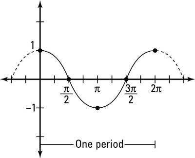
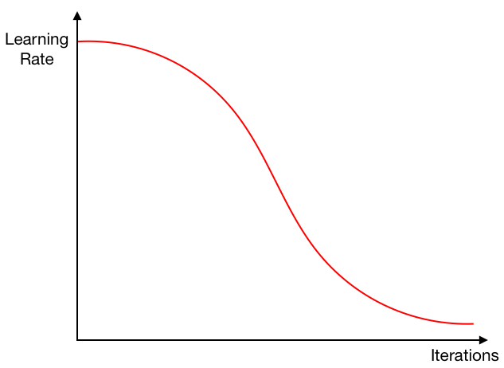
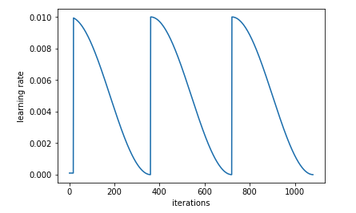

# LR Scheduler

## Cosine annealing scheduler

### cosine function



### cosine annealing



```python
lf = one_cycle(1, hyp['lrf'], epochs)
# cosine 1->hyp['lrf']
# lrf: 0.2  # final OneCycleLR learning rate (lr0 * lrf)
scheduler = lr_scheduler.LambdaLR(optimizer, lr_lambda=lf)

def one_cycle(y1=0.0, y2=1.0, steps=100):
    # lambda function for sinusoidal ramp from y1 to y2
    return lambda x: ((1 - math.cos(x * math.pi / steps)) / 2) * (y2 - y1) + y1
	# x = 0: lr = y1
    # x = steps / 2: lr = 0.5 * (y2 - y1) + y1 = 0.5 * (y1 + y2)
    # x = steps: lr = y2
```

### cosine annealing with restart



