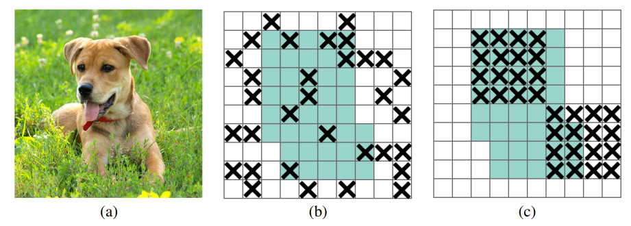
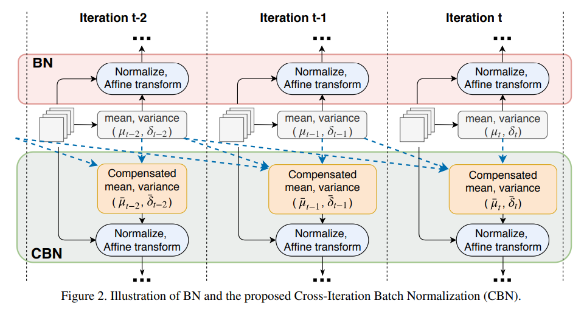
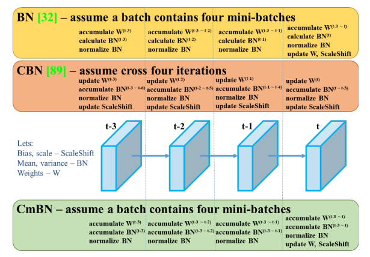

# Regularization

## Table of contents

- [DropBlock](#drop_block)
- [Cross mini-Batch Normalization (CmBN)](#cmbn)

## DropBlock <a name="drop_block"></a>

**Reference:** https://paperswithcode.com/method/dropblock

**DropBlock** is a structured form of [dropout](https://paperswithcode.com/method/dropout) directed at regularizing convolutional networks. In DropBlock, units in a contiguous region of a feature map are dropped together. As DropBlock discards features in a correlated area, the networks must look elsewhere for evidence to fit the data.



**Figure 1:** (a) input image to a convolutional neural network. The green regions in (b) and (c) include the activation units which contain semantic information in the input image. Dropping out activations at random is not effective in removing semantic information because nearby activations contain closely related information. Instead, dropping continuous regions can remove certain semantic information (e.g., head or feet) and consequently enforcing remaining units to learn features for classifying input image.

```python
class DropBlock2D(nn.Module):
    r"""Randomly zeroes 2D spatial blocks of the input tensor.
    Args:
        drop_prob (float): probability of an element to be dropped.
        block_size (int): size of the block to drop
    Shape:
        - Input: `(N, C, H, W)`
        - Output: `(N, C, H, W)`
    """

    def __init__(self, drop_prob, block_size):
        super(DropBlock2D, self).__init__()

        self.drop_prob = drop_prob
        self.block_size = block_size

    def forward(self, x):
        # shape: (bsize, channels, height, width)

        if not self.training or self.drop_prob == 0.:
            return x
        else:
            # get gamma value
            gamma = self._compute_gamma(x)

            # sample mask
            # gamma is larger, mask has more ones
            mask = (torch.rand(x.shape[0], *x.shape[2:]) < gamma).float()

            # place mask on input device
            mask = mask.to(x.device)

            # compute block mask
            # mask has more ones, block_mask has less ones
            block_mask = self._compute_block_mask(mask)

            # apply block mask
            out = x * block_mask[:, None, :, :]

            # scale output
            # gamma is larger (drop_prob larger, block_size smaller), out is sparser
            out = out * block_mask.numel() / block_mask.sum()

            return out

    def _compute_block_mask(self, mask):
        # mask has more ones, block_mask has more ones
        block_mask = F.max_pool2d(
            input=mask[:, None, :, :],
            kernel_size=(self.block_size, self.block_size),
            stride=(1, 1),
            padding=self.block_size // 2
        )

        if self.block_size % 2 == 0:
            block_mask = block_mask[:, :, :-1, :-1]
		
        # mask has more ones, block_mask has less ones
        block_mask = 1 - block_mask.squeeze(1)

        return block_mask

    def _compute_gamma(self, x):
        # gamma is larger when drop_prob is larger or block_size is smaller
        return self.drop_prob / (self.block_size ** 2)
```

## Cross mini-Batch Normalization (CmBN) <a name="cmbn"></a>

**CmBN** is a modified version of **CBN** [*Cross-Iteration Batch Normalization, 2021*]. It collects statistics only between mini-batches within a single batch.



A well-known issue of Batch Normalization is its significantly reduced effectiveness in the case of small mini-batch sizes. When a mini-batch contains few examples, the statistics upon which the normalization is defined cannot be reliably estimated from it during a training iteration. 

To address this problem, we present **Cross-Iteration Batch Normalization (CBN)**, in which examples from multiple recent iterations are jointly utilized to enhance estimation quality. 

A challenge of computing statistics over multiple iterations is that the network activations from different iterations are not comparable to each other due to changes in network weights. We thus compensate for the network weight changes via a proposed technique based on Taylor polynomials, so that the statistics can be accurately estimated and batch normalization can be effectively applied. 

On object detection and image classification with small mini-batch sizes, CBN is found to outperform the original batch normalization and a direct calculation of statistics over previous iterations without the proposed compensation technique.



```python
# nominal batch size
nbs = 64  
# accumulate loss before optimizing
accumulate = max(round(nbs / total_batch_size), 1)
# total_batch_size = 16
# accumulate = 4

if ni % accumulate == 0:
    # optimizer.step
    scaler.step(optimizer)  
    scaler.update()
    optimizer.zero_grad()
```
