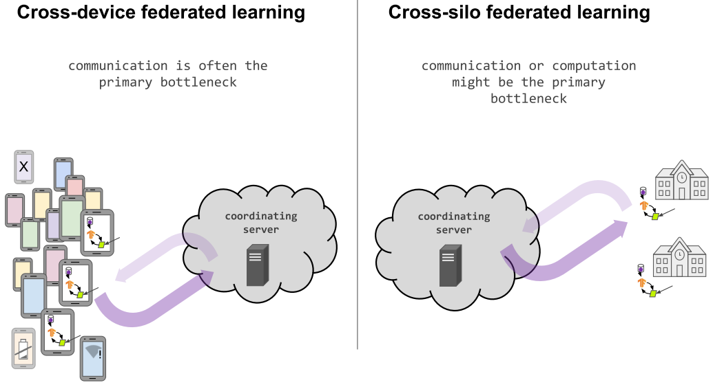
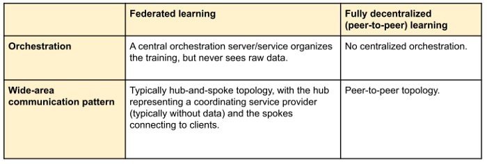

# Part 1: What is Federated Learning?

**Original Slides:** [Federated Learning Tutorial](https://sites.google.com/view/fl-tutorial/)

# What is Federated Learning?

The definition proposed in [Advances and Open Problems in Federated Learning](https://arxiv.org/abs/1912.04977):

> Federated learning is a machine learning setting where multiple entities (clients) collaborate in solving a machine learning problem, under the coordination of a central server or service provider. Each client's raw data is stored locally and not exchanged or transferred; instead, focused updates intended for immediate aggregation are used to achieve the learning objective.

## FL terminology

- **Clients**: Compute nodes also holding local data, usually belonging to one entity: IoT devices, Mobile devices, Data silos, Data centers in different geographic regions, etc.
- **Server**: Additional compute nodes that coordinate the FL process but don't access raw data. Usually not a single physical machine.

# Cross-device federated learning

What makes a good application of cross-device federating learning?

- On-device data is more relevant than server-side proxy data
- On-device data is privacy sensitive or large
- Labels can be inferred naturally from user interaction

Example applications:

- Language modeling for mobile keyboards and voice recognition
- Image classification for predicting which photos people will share

## Cross-device federated learning at Apple

Federated learning is a privacy-preserving machine-learning method that was first introduced by Google in 2017. It allows Apple to train different copies of a speaker recognition model across all its users' devices, using only the audio data available locally. It then sends just the updated models back to a central server to be combined into a master model. In this way, raw audio of users' Siri requests never leaves their iPhones and iPads, but the assistant continuously gets better at identifying the right speaker.

# Cross-silo federated learning

## Cross-silo federated learning from Intel

The University of Pennsylvania and chipmaker Intel are forming a partnership to enable 29 heatlhcare and medical research institutions around the world to train artificial intelligence models to detect brain tumors early.

The program will rely on a technique known as federated learning, which enables institutions to collaborate on deep learning projects without sharing patient data. The partnership will bring in institutions in the U.S., Canada, U.K., Germany, Switzerland and India. The centers — which include Washington University of St. Louis; Queen's University in Kingston, Ontario; University of Munich; Tata Memorial Hospital in Mumbai and others — will use Intel's federated learning hardware and software.

## Cross-silo federated learning from NVIDIA

Federated learning addresses this challenge, enabling different institutions to collaborate on AI model development without sharing sensitive clinical data with each other. The goal is to end up with more generalizable models that perform well on any dataset, instead of an AI biased by the patient demographics or imaging equipment of one specific radiology department.

# Comparision

## Cross-device vs. Cross-silo federated learning

## Datacenter distributed learning vs. federated learning

Distributed datacenter machine learning

Adapted from Table 1 in Advances and Open Problems in Federated Learning (arxiv/1912.04977)

Adapted from Table 1 in Advances and Open Problems in Federated Learning (arxiv/1912.04977)

## Federated learning vs. Fully decentralized (peer-to-peer) learning

Fully decentralized (peer-to-peer) learning

Adapted from Table 3 in Advances and Open Problems in Federated Learning (arxiv/1912.04977)

# Cross-Device Federated Learning: Model development workflow

Traditional model development workflow

Federated training

Only a fraction of clients are available at any one time.

**Focused collection:** Devices report only what is needed for this computation. **Ephemeral reports:** Server never persists per-device reports

**Only-in-aggregate:** Engineer may only access combined device reports. **Typical orders-of-magnitude:** 100-1000s of clients per round; 1000s of rounds to convergence; 1-10 minutes per round

Federated Averaging (FedAvg) algorithm

# Beyond Learning: Federated Analytics

The definition proposed in https://ai.googleblog.com/2020/05/federated-analytics-collaborative-data.html:

> Federated analytics is the practice of applying data science methods to the analysis of raw data that is stored locally on users' devices. Like federated learning, it works by running local computations over each device's data, and only making the aggregated results — and never any data from a particular device — available to product engineers. Unlike federated learning, however, federated analytics aims to support basic data science needs.

- Federated histograms over closed sets
- Federated quantiles and distinct element counts
- Federated heavy hitters discovery over open sets
- Federated density of vector spaces
- Federated selection of random data subsets
- Federated SQL
- Federated computations
- etc.

