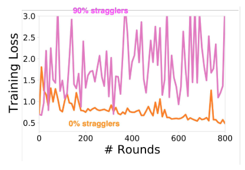
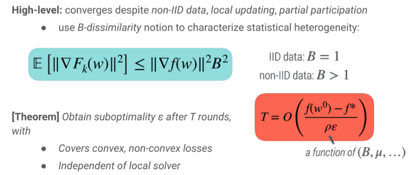
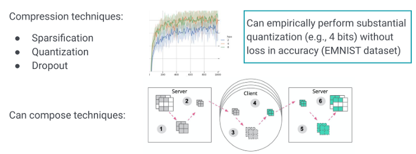

# Part 2: Federated Optimization

**Original Slides:** [Federated Learning Tutorial](https://sites.google.com/view/fl-tutorial/)

# Federated optimization: workflow & challenges

## Federated optimization: workflow

Here we consider the problem of cross-device federated learning and assume a centralized server.

**Left:** ERM objective, **Right:** Federated ERM objective

Terminology

## Federated optimization: challenges

[Federated Learning: Challenges, Methods, and Future Directions](https://arxiv.org/abs/1908.07873)

**Expensive communication:** massive, slow networks. Can reduce communication in federated optimization by:

- Limiting the number of devices involved in communication
- Reducing the number of communication rounds
- Reducing the size of messages sent over the network

**Privacy concerns:** user privacy constraints. Keeping raw data local to each device is the first step.

**Statistical and System heterogeneity:** unbalanced, non-IID data; variable hardware, connectivity, etc. Heterogeneous (i.e., non-identically distributed) data and systems can bias optimization procedures.

# Federated Averaging (FedAvg)

Federated Averaging (FedAvg): will this converge?

## How does FedAvg differ from distributed SGD?

**Local-updating is not new.**

- Extreme setting: one-shot averaging (e.g., *[Zhang, Duchi, Wainwright, Communication-Efficient Algorithms for Statistical Optimization, JMLR 2013]*)
- Consensus-based optimization: 
  - ADMM *[Boyd et al, Distributed Optimization and Statistical Learning via ADMM, FnT in ML, 2010]*
  - CoCoA *[Jaggi & Smith et al, Communication-Efficient Distributed Dual Coordinate Ascent, NeurIPS 2014]*
- Local-SGD: (e.g., *[MacDonald et al, Efficient large-scale distributed training of conditional maxent models, NeurIPS 2009]*)
- Decentralized optimization.

Federated setting is distinct in considering local-updating with heterogeneous data and partial device participation, often for non-convex objectives.

## Challenge: heterogeneity

*[Li et al, Federated optimization in heterogeneous networks, MLSys 2020]*

Effect of heterogeneity on FedAvg convergence, assuming all other hyperparameters fixed.

systems heterogeneity (e.g., dropping devices*) can exacerbate convergence issues

## Simple modification: FedProx

*[Li et al, Federated optimization in heterogeneous networks, MLSys 2020]*

Convergence guarantees

## Takeaways

Federated optimization methods that perform local-updating can significantly reduce communication rounds needed for convergence.

- However, heterogeneity can potentially lead to: slower convergence, reduced stability, divergence.
- Critical to analyze and evaluate federated methods with: non-IID data, partial/variable participation.

# Communication-efficient FL

Reducing the size of messages sent over the network. Common approaches:

- Dimensionality reduction (low-rank, sparsity): Directly learn model updates that have reduced dimension/size.
- Compression: Take regular (full dimension) updates and then compress them. Important to understand how compression may bias or increase variance in the optimization procedures.

Can be applied to both uplink (model updates) and downlink (global model) messages.

# Hands-On Federated Optimization: TensorFlow Federated (TFF)

[TensorFlow Federated](https://www.tensorflow.org/federated)

## TFF Simulation Runtime

## tff.federated_computation

## Client Computation: client_update_fn

## Server Computation: server_update

# Empirical Evaluation of Federated Optimization

## Our Focus

- Federated learning offers the possibility to dramatically improve privacy versus utility trade-offs across a wide range of ML problems.
- Federated learning can make the world a better place.
- Fully realizing this potential will require new research and new algorithms.
- Empirical evaluation of FL algorithms should help identify algorithms that can have the maximum impact in the real world.
- Empirical studies can of course answer other questions as well, but the above goal is our focus in this section.

## Challenges of evaluating FL algorithms

Most researchers (even at Google!) can't easily test new algorithms on a fleet of millions of mobile devices (cross-device) or a network of data centers around the world (cross-silo). Evaluating federated learning algorithms requires a simulation. Ramifications:

- Need to distinguish between: The real-world scenarios that motivate the work. The details of the simulation performed.
- The results of the simulation need to plausibly predict performance on the real-world problem.

## Best practices for evaluating FL algorithms

- Be precise about the characteristics of applicable FL settings. Primarily: Cross-silo vs cross-device (stateful vs stateless algorithms)
- Be precise about what computations happen where, and what is communicated. Important for efficiency and privacy.
- Hyperparameter tuning matters. Tuning takes longer in the federated setting, so algorithms that "self-tune" are much preferred.
- Ensure reproducibility of simulations.
- Prefer real-world non-IID datasets. Pathological cases where labels are partitioned across clients aren't realistic. Is a single global model really what you want?

**Select metrics carefully.** Here the focus is accuracy and efficiency. But other objectives matter as well: Privacy, robustness, fairness, ability to personalize, etc.

- "x-axis": rounds of communication; bytes communicated; simulated time accounting for expected real-world compute & comm costs (not the actual simulation wall-clock time)
- "y-axis": accuracy or other domain-specific metrics on held-out test data (not training set loss)

## Representative cross-device tasks

A diverse set of 6 learning tasks across 4 datasets.

Datasets available in TensorFlow Federated for use in any Python ML framework. Caldas, et. al. LEAF: A Benchmark for Federated Settings. 2018.

# Adaptive Federated Optimization

Reddi, Charles, et. al. **Adaptive Federated Optimization**. 2020.

- Extends FedAvg to a new family of optimization algorithms
- Theory for server-side adaptive update rules (AdaGrad, Adam, Yogi)
- Extensible implementation using TensorFlow Federated
- Extensive empirical evaluation

## Generalizing FedAvg

- Recovers many popular methods (FedAvg, FedAvg + server momentum, etc.).
- Serves as a useful perspective for viewing federated optimization algorithms.
- Important concept: Client optimization is fundamentally different from server optimization. 
  - (1) Clients may participate at most once. 
  - (2) Clients perform a small number of steps. 
  - (3) The server can maintain state throughout the algorithm.

## Extensive empirical evaluation

Adaptive server updates provide a significant performance boost

Rigorous hyperparameter search over client & server learning rates

Validation accuracy (averaged over the last 100 rounds) of FedAdam, FedYogi, and FedAvgM (FedAvg + Momentum) various client/server learning rates combinations on a next word prediction task using real data from Stack Overflow.